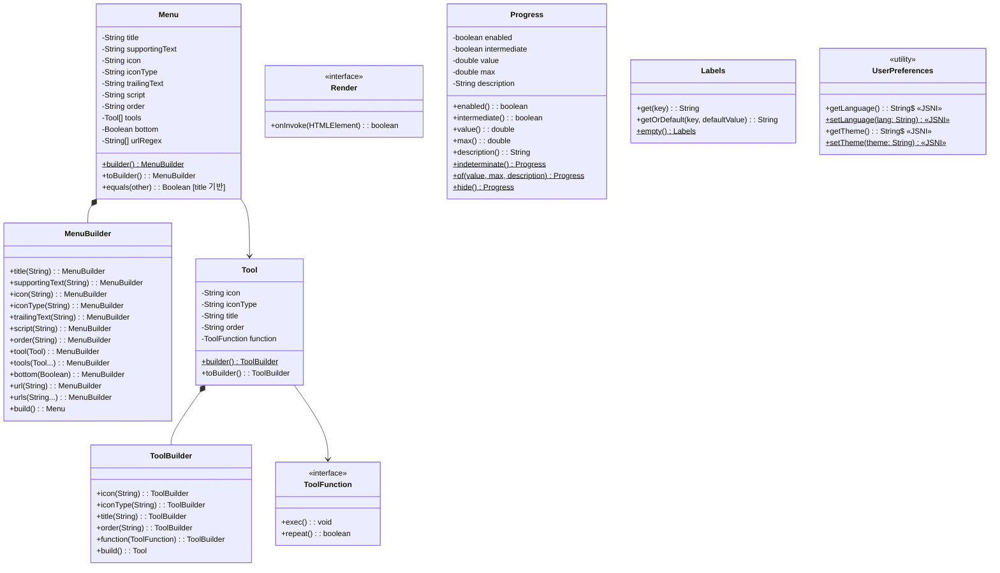

# Activity 클래스 다이어그램

```mermaid
classDiagram
    class Menu {
        -String title
        -String supportingText
        -String icon
        -String iconType
        -String trailingText
        -String script
        -String order
        -Tool[] tools
        -Boolean bottom
        -String[] urlRegex
        +builder()$ MenuBuilder
        +toBuilder(): MenuBuilder
        +equals(other): Boolean [title 기반]
    }

    class MenuBuilder {
        +title(String): MenuBuilder
        +supportingText(String): MenuBuilder
        +icon(String): MenuBuilder
        +iconType(String): MenuBuilder
        +trailingText(String): MenuBuilder
        +script(String): MenuBuilder
        +order(String): MenuBuilder
        +tool(Tool): MenuBuilder
        +tools(Tool...): MenuBuilder
        +bottom(Boolean): MenuBuilder
        +url(String): MenuBuilder
        +urls(String...): MenuBuilder
        +build(): Menu
    }
    Menu *-- MenuBuilder

    class Tool {
        -String icon
        -String iconType
        -String title
        -String order
        -ToolFunction function
        +builder()$ ToolBuilder
        +toBuilder(): ToolBuilder
    }

    class ToolBuilder {
        +icon(String): ToolBuilder
        +iconType(String): ToolBuilder
        +title(String): ToolBuilder
        +order(String): ToolBuilder
        +function(ToolFunction): ToolBuilder
        +build(): Tool
    }
    Tool *-- ToolBuilder
    Menu --> Tool

    class ToolFunction {
        <<interface>>
        <<@JsFunction>>
        +exec(): void
        +repeat(): boolean
    }
    Tool --> ToolFunction

    class Render {
        <<interface>>
        <<@JsFunction>>
        +onInvoke(HTMLElement): boolean
    }

    class Progress {
        -boolean enabled
        -boolean intermediate
        -double value
        -double max
        -String description
        +enabled(): boolean
        +intermediate(): boolean
        +value(): double
        +max(): double
        +description(): String
        +indeterminate()$ Progress
        +of(value, max, description)$ Progress
        +hide()$ Progress
    }

    class Labels {
        +get(key): String
        +getOrDefault(key, defaultValue): String
        +empty()$ Labels
    }

    class UserPreferences {
        <<utility>>
        +getLanguage(): String$ «JSNI»
        +setLanguage(lang: String)$ «JSNI»
        +getTheme(): String$ «JSNI»
        +setTheme(theme: String)$ «JSNI»
    }
```
