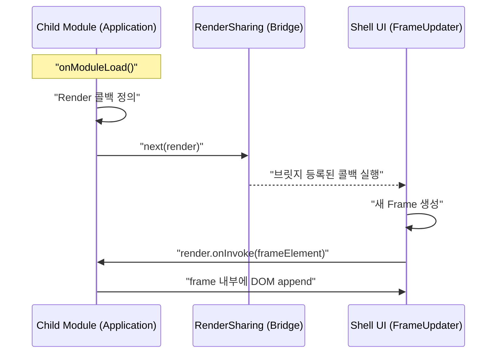
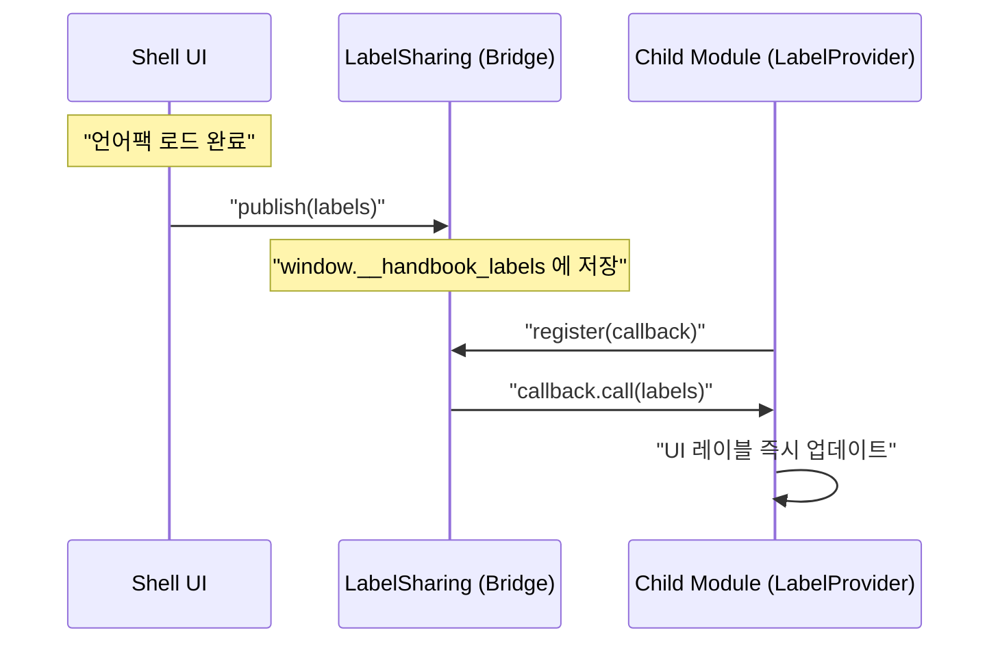

# Activity 유스케이스

## UC-A1: 모듈 간 렌더링 위임

자식 모듈이 부모 쉘의 특정 영역(Frame)에 자신을 렌더링하도록 요청한다.

## UC-A2: 다국어 레이블 공유

쉘이 로드한 다국어 팩을 자식 모듈들이 실시간으로 공유받아 화면에 표시한다.

## UC-A3: 반응형 뷰포트 감지

브라우저 창 크기 변화를 실시간으로 감지하여 모바일/데스크톱 최적화 레이아웃을 전환한다.

| 단계 | 동작 | 비고 |
|------|------|------|
| 1 | `ViewportObserver`가 창 크기 변화(`resize`) 이벤트 구독 | — |
| 2 | 창 너비가 768px 미만이면 `isMobile=true` 발행 | MD3 브레이크포인트 |
| 3 | `Shell` 및 각 모듈이 상태를 구독하여 CSS 속성 토글 | `[mobile]` 속성 등 |

## UC-A5: 다국어 팩 비동기 로딩

서버로부터 JSON 형식의 언어팩을 비동기로 로드하고, 실패 시 기본 언어(en)로 폴백한다.

| 단계 | 동작 | 비고 |
|------|------|------|
| 1 | `FetchLanguagePackRepository.load(lang)` 호출 | — |
| 2 | `FetchApi`를 통해 `js/language.{lang}.json` 요청 | — |
| 3 | 성공 시 `Labels` 객체로 변환하여 발행 | — |
| 4 | 실패 시 `load("en")` 재시도 (Recursive Fallback) | — |

## 트레이서빌리티 매트릭스

| 유스케이스 | 목적 | 관련 클래스 | 테스트 케이스 |
|------------|------|-------------|--------------|
| UC-A1 | 프레임워크 없는 모듈 연동 | `RenderSharing`, `Render` | `ActivityTest`: Render 함수 발행 로그 확인 |
| UC-A2 | 다국어 일관성 보장 | `LabelSharing`, `Labels` | `ActivityTest`: Labels 발행 로그 확인 |
| UC-A3 | 멀티 디바이스 지원 | `ViewportObserver` | `ActivityTest`: 화면 크기 변경 시 로그 확인 |
| UC-A4 | 메뉴 가시성 제어 | `Menu`, `SessionStateKind` | `ActivityTest`: 세션 상태별 노출 로그 확인 |
| UC-A5 | 동적 언어 전환 지원 | `FetchLanguagePackRepository` | `ActivityTest`: Fetch 성공 로그 확인 |
