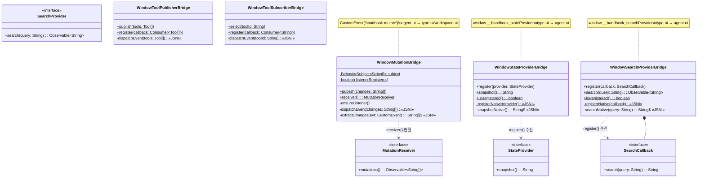

# Agent-Bridge 클래스 다이어그램

```mermaid
classDiagram
    class MutationReceiver {
        <<interface>>
        +mutations(): Observable~String[]~
    }

    class StateProvider {
        <<interface>>
        +snapshot(): String
    }

    class SearchProvider {
        <<interface>>
        +search(query: String): Observable~String~
    }

    class WindowMutationBridge {
        -BehaviorSubject~String[]~ subject$
        -boolean listenerRegistered$
        +publish(changes: String[])$
        +receiver(): MutationReceiver$
        -ensureListener()$
        -dispatchEvent(changes: String[])$ «JSNI»
        -extractChanges(evt: CustomEvent): String[]$ «JSNI»
    }

    class WindowStateProviderBridge {
        +register(provider: StateProvider)$
        +snapshot(): String$
        +isRegistered(): boolean$
        -registerNative(provider)$ «JSNI»
        -snapshotNative(): String$ «JSNI»
    }

    class WindowSearchProviderBridge {
        +register(callback: SearchCallback)$
        +search(query: String): Observable~String~$
        +isRegistered(): boolean$
        -registerNative(callback)$ «JSNI»
        -searchNative(query: String): String$ «JSNI»
    }

    class WindowToolPublisherBridge {
        +publish(tools: Tool[])$
        +register(callback: Consumer~Tool[]~)$
        -dispatchEvent(tools: Tool[])$ «JSNI»
    }

    class WindowToolSubscriberBridge {
        +select(toolId: String)$
        +register(callback: Consumer~String~)$
        -dispatchEvent(toolId: String)$ «JSNI»
    }

    class SearchCallback {
        <<interface>>
        +search(query: String): String
    }

    WindowMutationBridge ..> MutationReceiver : receiver() 반환
    WindowStateProviderBridge ..> StateProvider : register() 수신
    WindowSearchProviderBridge ..> SearchCallback : register() 수신
    WindowSearchProviderBridge *-- SearchCallback

    note for WindowMutationBridge "CustomEvent('handbook-mutate')\nagent-ui → type-ui/workspace-ui"
    note for WindowStateProviderBridge "window.__handbook_stateProvider\ntype-ui → agent-ui"
    note for WindowSearchProviderBridge "window.__handbook_searchProvider\ntype-ui → agent-ui"
```
