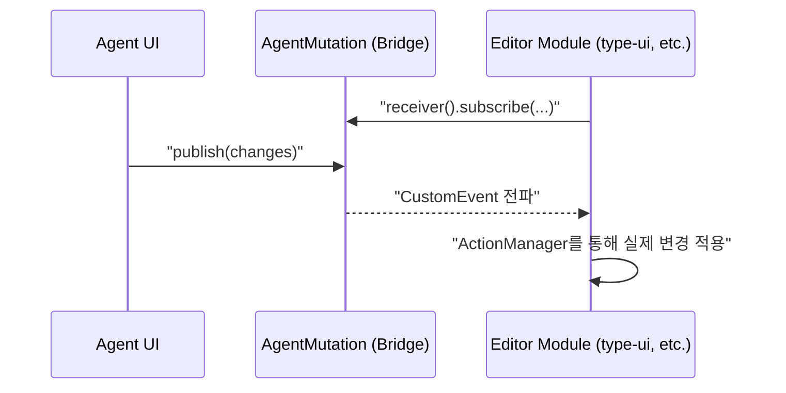
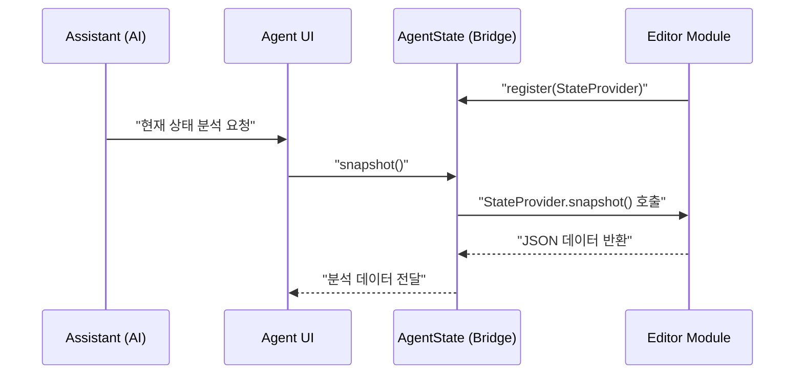
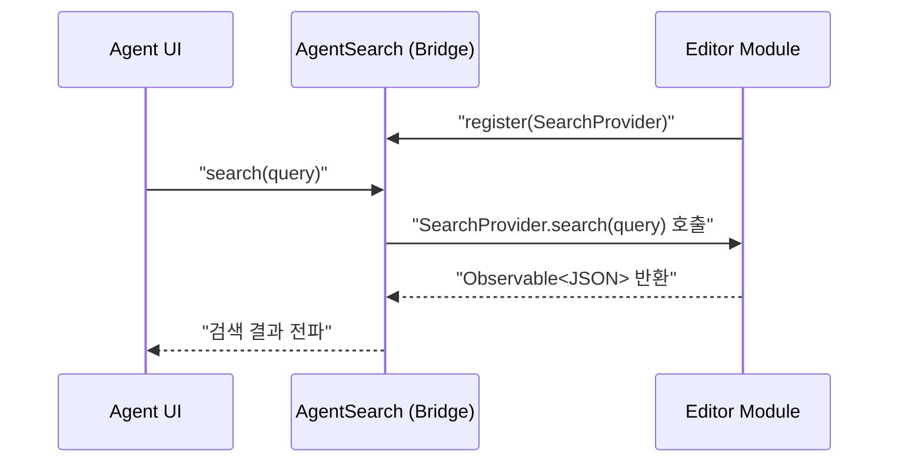

# Agent Bridge 유스케이스

## UC-B1: 에이전트 명령 전달 (Mutation)

`agent-ui`가 수신한 에이전트의 변경 명령을 각 편집 모듈로 즉시 전파한다.

## UC-B2: 에이전트 상태 조회 (State Snapshot)

에이전트가 현재 사용자가 보고 있는 UI의 데이터를 분석하기 위해 상태 스냅샷을 요청한다.

## UC-B4: 에이전트 모듈 내 검색

에이전트가 편집 중인 모듈의 데이터를 검색하여 관련 정보를 획득한다.

## 트레이서빌리티 매트릭스

| 유스케이스 | 목적 | 관련 클래스 | 테스트 케이스 |
|------------|------|-------------|--------------|
| UC-B1 | AI 기반 자동 편집 | `AgentMutation`, `MutateCommand` | `AgentBridgeTest`: Mutation 수신 로그 확인 |
| UC-B2 | AI 상황 인지(Context) | `AgentState`, `StateProvider` | `AgentBridgeTest`: 상태 스냅샷 로그 확인 |
| UC-B3 | 실시간 데이터 동기화 | `WorkspaceEvent` | `AgentBridgeTest`: 워크스페이스 ID 공유 로그 확인 |
| UC-B4 | AI 모듈 데이터 탐색 | `AgentSearch`, `SearchProvider` | `AgentBridgeTest`: 검색 결과 로그 확인 |
