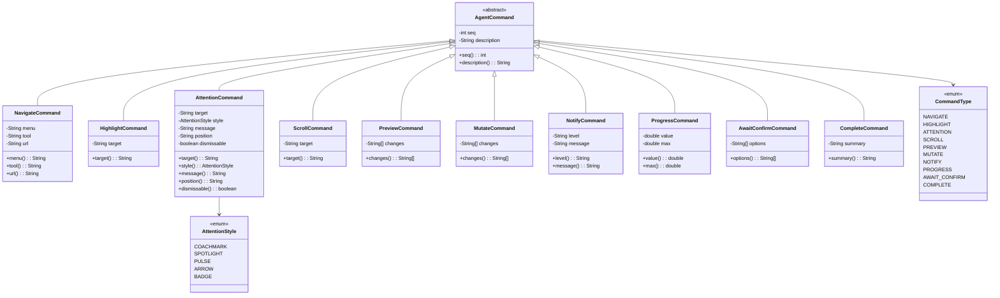

# Agent-Protocol 클래스 다이어그램

```mermaid
classDiagram
    class AgentCommand {
        <<abstract>>
        <<@JsonTypeInfo>>
        -int seq
        -String description
        +seq(): int
        +description(): String
    }

    class NavigateCommand {
        -String menu
        -String tool
        -String url
        +menu(): String
        +tool(): String
        +url(): String
    }

    class HighlightCommand {
        -String target
        +target(): String
    }

    class AttentionCommand {
        -String target
        -AttentionStyle style
        -String message
        -String position
        -boolean dismissable
        +target(): String
        +style(): AttentionStyle
        +message(): String
        +position(): String
        +dismissable(): boolean
    }

    class ScrollCommand {
        -String target
        +target(): String
    }

    class PreviewCommand {
        -String[] changes
        +changes(): String[]
    }

    class MutateCommand {
        -String[] changes
        +changes(): String[]
    }

    class NotifyCommand {
        -String level
        -String message
        +level(): String
        +message(): String
    }

    class ProgressCommand {
        -double value
        -double max
        +value(): double
        +max(): double
    }

    class AwaitConfirmCommand {
        -String[] options
        +options(): String[]
    }

    class CompleteCommand {
        -String summary
        +summary(): String
    }

    class CommandType {
        <<enum>>
        NAVIGATE
        HIGHLIGHT
        ATTENTION
        SCROLL
        PREVIEW
        MUTATE
        NOTIFY
        PROGRESS
        AWAIT_CONFIRM
        COMPLETE
    }

    class AttentionStyle {
        <<enum>>
        COACHMARK
        SPOTLIGHT
        PULSE
        ARROW
        BADGE
    }

    AgentCommand <|-- NavigateCommand
    AgentCommand <|-- HighlightCommand
    AgentCommand <|-- AttentionCommand
    AgentCommand <|-- ScrollCommand
    AgentCommand <|-- PreviewCommand
    AgentCommand <|-- MutateCommand
    AgentCommand <|-- NotifyCommand
    AgentCommand <|-- ProgressCommand
    AgentCommand <|-- AwaitConfirmCommand
    AgentCommand <|-- CompleteCommand
    AgentCommand --> CommandType
    AttentionCommand --> AttentionStyle
```
