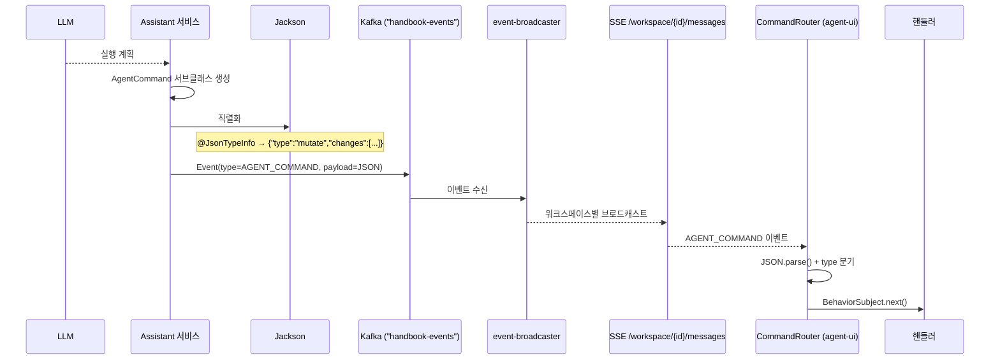
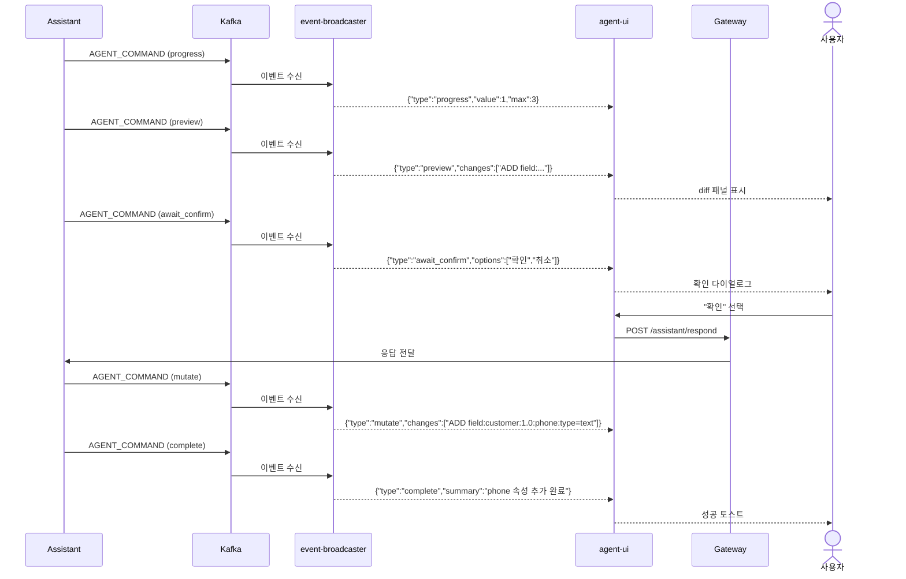

# Agent-Protocol 유스케이스

## 커맨드 직렬화 → 전달 시퀀스

## 데이터 변경 전체 흐름 시퀀스

## UC-AP1: 에이전트 → 프론트엔드 커맨드 전달

| 항목 | 내용 |
|------|------|
| **액터** | 백엔드 Assistant 서비스 |
| **정상 흐름** | 1. Assistant가 LLM 응답을 `AgentCommand` 서브클래스로 구성한다. 2. Jackson이 `@JsonTypeInfo`로 JSON 직렬화한다 (`{"type":"mutate","changes":[...]}`). 3. Kafka AGENT_COMMAND 이벤트로 발행되어 event-broadcaster를 통해 워크스페이스 SSE(`/workspace/{id}/messages`)로 브로드캐스트된다. 4. agent-ui의 `CommandRouter`가 AGENT_COMMAND 이벤트에서 JSON을 파싱하여 해당 핸들러에 라우팅한다. |

## UC-AP2: 에이전트 화면 네비게이션

| 항목 | 내용 |
|------|------|
| **커맨드** | `NavigateCommand` |
| **정상 흐름** | 1. 에이전트가 `{"type":"navigate","menu":"types","tool":"editor"}` 전송. 2. agent-ui의 `NavigateHandler`가 Shell의 URI Observer에 URL을 발행. 3. Shell의 `UrlBasedMenuResolver`가 해당 메뉴를 자동 선택하고 모듈을 로딩. |

## UC-AP3: 에이전트 주의 환기

| 항목 | 내용 |
|------|------|
| **커맨드** | `HighlightCommand`, `AttentionCommand`, `ScrollCommand` |
| **정상 흐름** | 1. `HighlightCommand` → CSS 셀렉터 대상 요소에 펄스 애니메이션. 2. `AttentionCommand` → 대상 요소에 오버레이 (COACHMARK/SPOTLIGHT/PULSE/ARROW/BADGE 스타일). 3. `ScrollCommand` → 대상 요소로 뷰 스크롤. |

## UC-AP4: 에이전트 데이터 변경

| 항목 | 내용 |
|------|------|
| **커맨드** | `PreviewCommand` → `AwaitConfirmCommand` → `MutateCommand` |
| **정상 흐름** | 1. 에이전트가 `PreviewCommand`로 변경 미리보기를 표시한다. 2. `AwaitConfirmCommand`로 사용자 확인을 요청한다. 에이전트가 사용자 응답을 대기한다. 3. 사용자가 확인하면(`POST /assistant/respond`) `MutateCommand`로 실제 변경을 적용한다. 4. `CompleteCommand`로 작업 완료를 알린다. 모든 커맨드는 Kafka AGENT_COMMAND 이벤트로 발행된다. |

## UC-AP5: 에이전트 진행률 표시

| 항목 | 내용 |
|------|------|
| **커맨드** | `ProgressCommand` |
| **정상 흐름** | 1. 에이전트가 `{"type":"progress","value":3,"max":10}` 전송. 2. agent-ui가 진행률 바를 업데이트한다. 3. value == max이면 2초 후 자동 숨김. |

---

## 트레이서빌리티 매트릭스

| UC | 시퀀스 다이어그램 | 클래스 다이어그램 | 주요 클래스 | 테스트 |
|----|---|---|---|---|
| UC-AP1 (전달) | 커맨드 직렬화 → 전달 | 전체 (커맨드 계층) | AgentCommand, @JsonTypeInfo, CommandType, Jackson | AgentCommandTest |
| UC-AP2 (네비) | — (단순) | NavigateCommand | NavigateCommand(menu, tool, url) | AgentCommandTest |
| UC-AP3 (주의환기) | — (단순) | HighlightCommand, AttentionCommand, ScrollCommand | AttentionStyle(5종) | AgentCommandTest |
| UC-AP4 (변경) | 데이터 변경 전체 흐름 | PreviewCommand, MutateCommand, AwaitConfirmCommand, CompleteCommand | changes[], options[] | AgentCommandTest |
| UC-AP5 (진행률) | 데이터 변경 전체 흐름 (포함) | ProgressCommand | value, max | AgentCommandTest |

---

## 참고: AgentCommand 클래스 이중 정의

이 모듈의 `AgentCommand` (`agent-protocol/src/main/java/.../domain/AgentCommand.java`)는 Jackson `@JsonTypeInfo`/`@JsonSubTypes`를 사용하는 **폴리모픽 커맨드 계층 구조**로, 프론트엔드(agent-ui)에서 소비하기 위한 직렬화/역직렬화를 담당한다. 각 커맨드 타입(navigate, highlight, mutate 등)이 별도의 서브클래스로 정의되어 타입 안전한 JSON 매핑을 제공한다.

별도로 `assistant` 모듈에도 동일한 이름의 `AgentCommand` (`assistant/src/main/kotlin/.../domain/AgentCommand.kt`)가 존재하며, 이는 오케스트레이션 레이어에서 사용하는 **단순화된 Kotlin data class** 표현이다. `type`, `target`, `payload` 필드만 가지며, LLM 응답을 파싱하고 실행 계획을 스트리밍하는 과정에서 사용된다.

두 클래스는 서로 다른 단계를 담당한다: assistant가 단순화된 `AgentCommand`를 생성하고, 이를 프로토콜 수준의 폴리모픽 `AgentCommand` 서브클래스로 변환하여 프론트엔드에 전달한다.
