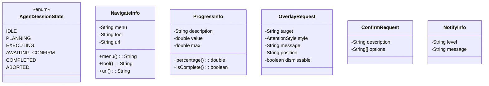
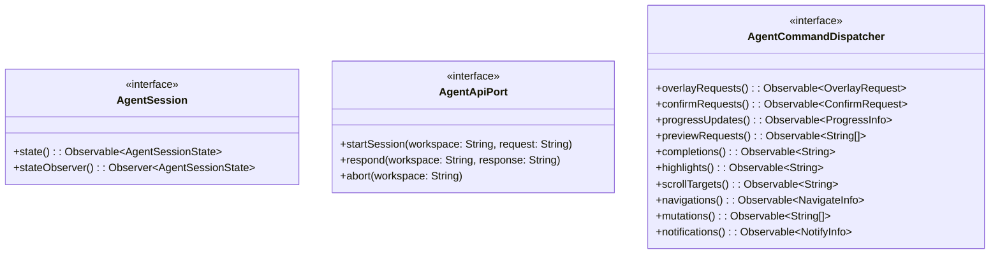
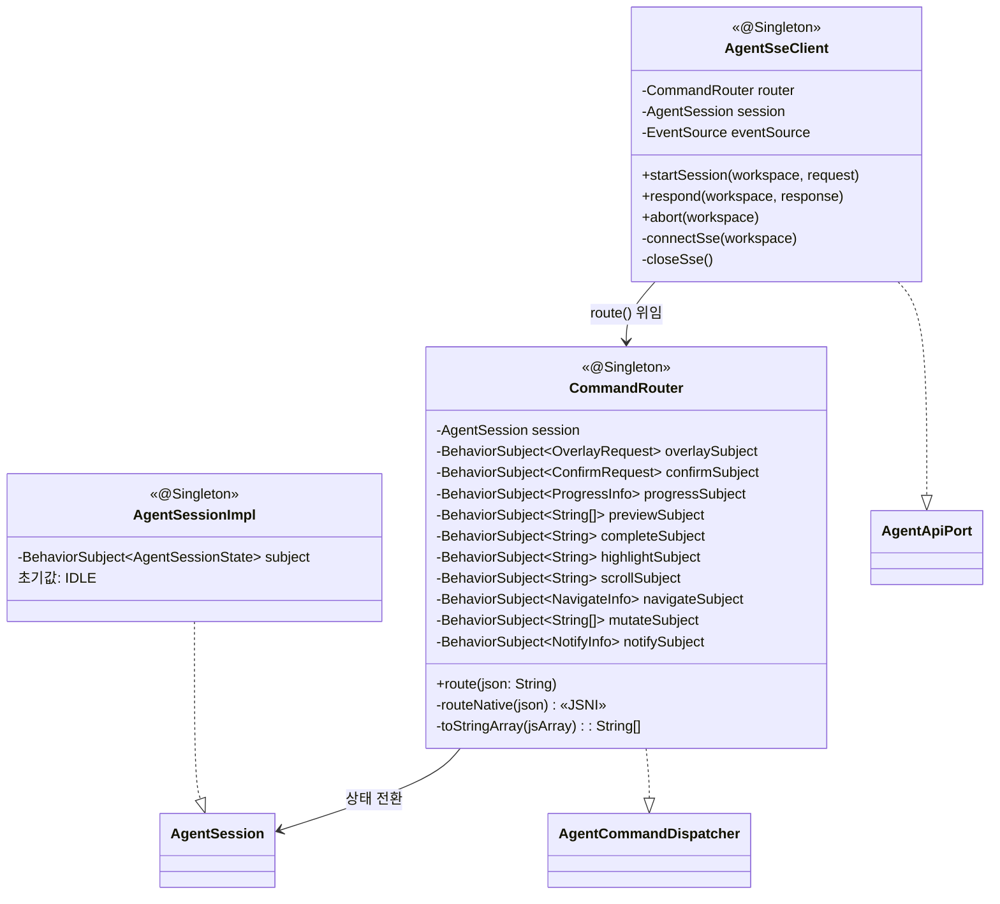
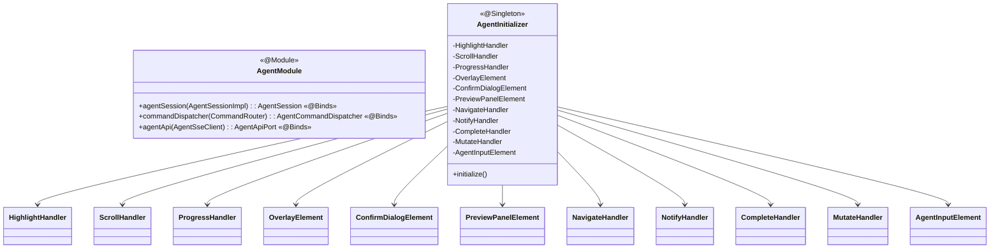
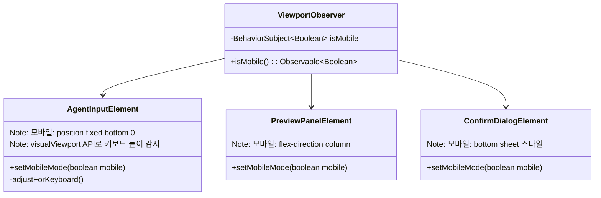

# Agent-UI 클래스 다이어그램

## 도메인

## 유스케이스 (포트 인터페이스)

## 인터페이스 구현

## 핸들러 + UI 컴포넌트

```mermaid
classDiagram
    class AgentInputElement {
        <<@Singleton, IsElement>>
        -OutlinedTextFieldElementBuilder textField
        -HTMLElement sendBtn, abortBtn
        -AgentApiPort api
        -Labels labels
        -AgentSessionState currentState
        -String workspace
        +setWorkspace(workspace)
        -send()
        -abort()
        -onStateChange(state)
        -applyLabels()
    }
    class HighlightHandler {
        <<@Singleton>>
        -HighlightEffect effect
        구독: highlights()
    }
    class ScrollHandler {
        <<@Singleton>>
        -ScrollEffect effect
        구독: scrollTargets()
    }
    class OverlayElement {
        <<@Singleton, IsElement>>
        -OverlayContainer overlay
        구독: overlayRequests()
    }
    class ConfirmDialogElement {
        <<@Singleton, IsElement>>
        -ConfirmDialog dialog
        -ResponseCallback callback
        +onResponse(callback)
        구독: confirmRequests()
    }
    class PreviewPanelElement {
        <<@Singleton, IsElement>>
        -DiffPanel panel
        구독: previewRequests()
    }
    class NavigateHandler {
        <<@Singleton, IsElement>>
        구독: navigations()
        Observer~String~ uri에 발행
    }
    class NotifyHandler {
        <<@Singleton, IsElement>>
        -ToastContainer toast
        구독: notifications()
    }
    class ProgressHandler {
        <<@Singleton>>
        구독: progressUpdates()
        Observer~Progress~ progress에 발행
    }
    class CompleteHandler {
        <<@Singleton, IsElement>>
        -ToastContainer toast
        구독: completions()
        진행률 숨김 + 토스트 5초
    }
    class MutateHandler {
        <<@Singleton, IsElement>>
        구독: mutations()
        WindowMutationBridge.publish() 호출
        변경 로그 표시 + 3초 페이드아웃
    }

    AgentInputElement --> AgentApiPort : start/abort
    AgentInputElement --> AgentSession : 상태 구독
    AgentInputElement --> ConfirmDialogElement : 응답 콜백

    HighlightHandler --> AgentCommandDispatcher
    ScrollHandler --> AgentCommandDispatcher
    OverlayElement --> AgentCommandDispatcher
    ConfirmDialogElement --> AgentCommandDispatcher
    PreviewPanelElement --> AgentCommandDispatcher
    NavigateHandler --> AgentCommandDispatcher
    NotifyHandler --> AgentCommandDispatcher
    ProgressHandler --> AgentCommandDispatcher
    CompleteHandler --> AgentCommandDispatcher
    MutateHandler --> AgentCommandDispatcher
```

## 조합 (DI)

## 디자인 패턴

| 패턴 | 적용 클래스 | 설명 |
|------|------------|------|
| **Router/Dispatcher** | `CommandRouter` (AgentCommandDispatcher 구현) | SSE로 수신된 JSON을 파싱하여 `type` 필드에 따라 10개 BehaviorSubject 중 하나에 라우팅. 각 핸들러가 해당 Subject를 구독하여 반응. |
| **Observer** | `AgentSessionImpl`, `CommandRouter`의 10개 BehaviorSubject | 세션 상태와 커맨드 스트림을 Observable로 발행. UI 컴포넌트가 구독하여 반응형으로 동작. |
| **State** | `AgentInputElement` + `AgentSessionState` | 6개 세션 상태(IDLE→PLANNING→EXECUTING→AWAITING_CONFIRM→COMPLETED/ABORTED)에 따라 입력 필드 활성화, 버튼 전환, 라벨 변경이 자동 전환. |
| **Port/Adapter** | `AgentApiPort`(포트) ↔ `AgentSseClient`(어댑터), `AgentCommandDispatcher`(포트) ↔ `CommandRouter`(어댑터) | 헥사고날 아키텍처. 유스케이스 레이어가 포트에만 의존하고, SSE/REST 구현 세부사항은 어댑터에 캡슐화. |
| **Callback** | `ConfirmDialogElement.ResponseCallback` | 확인 다이얼로그의 사용자 응답을 콜백으로 전달. `AgentInputElement`가 콜백을 등록하여 `api.respond()` 호출. |

## 모바일 지원

| 클래스 | 모바일 동작 |
|--------|-----------|
| `ViewportObserver` | matchMedia 감지 → 각 컴포넌트에 모바일 모드 전달 |
| `AgentInputElement` | 하단 고정 + visualViewport.resize로 키보드 높이 보정 |
| `PreviewPanelElement` | before/after 세로 스택 (flex-direction: column) |
| `ConfirmDialogElement` | bottom sheet (하단에서 슬라이드 업) |
| `OverlayElement` | 터치 탭으로 닫기 (click 이벤트와 동일) |
