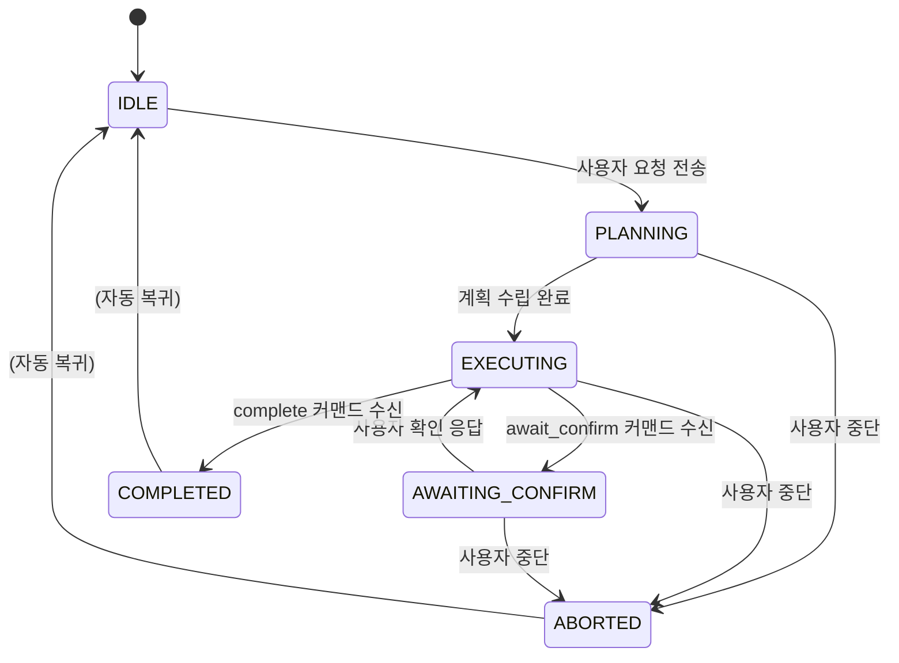

# Agent-UI 모듈

에이전트(AI 비서) 프론트엔드 UI (GWT). 워크스페이스 SSE(`/workspace/{id}/messages`)에서 AGENT_COMMAND 이벤트를 필터링하여 커맨드를 수신하고, 커맨드 타입별 핸들러가
화면에 시각적 피드백을 제공한다. Shell이 `app` 모듈에서 함께 컴파일하여 실행한다.

## 아키텍처

```
client/
├── domain/                              # 도메인 (프레임워크 무관)
│   ├── AgentSessionState               # 세션 상태 enum (IDLE/PLANNING/EXECUTING/AWAITING_CONFIRM/COMPLETED/ABORTED)
│   ├── OverlayRequest                  # 오버레이 요청 VO (target, style, message, position, dismissable)
│   ├── ConfirmRequest                  # 확인 요청 VO (description, options[])
│   ├── ProgressInfo                    # 진행률 VO (description, value, max)
│   ├── NavigateInfo                    # 네비게이션 VO (menu, tool, url)
│   └── NotifyInfo                      # 알림 VO (level, message)
│
├── usecase/                             # 유스케이스 (포트 인터페이스)
│   ├── AgentSession                    # 세션 상태 Observable + Observer
│   ├── AgentCommandDispatcher          # 10종 커맨드 Observable 스트림 제공
│   └── AgentApiPort                    # Gateway API 호출 포트 (start/respond/abort)
│
├── interfaces/                          # 인터페이스 (구현)
│   ├── AgentSseClient                  # AgentApiPort 구현. 워크스페이스 SSE AGENT_COMMAND 필터링 + REST 호출
│   ├── CommandRouter                   # AgentCommandDispatcher 구현. JSON 파싱 → 10개 BehaviorSubject
│   ├── AgentSessionImpl                # AgentSession 구현. BehaviorSubject<AgentSessionState>
│   ├── AgentInputElement               # 입력 UI (텍스트 필드 + 전송/중단 버튼)
│   ├── HighlightHandler                # highlight → HighlightEffect 위임
│   ├── ScrollHandler                   # scroll → ScrollEffect 위임
│   ├── OverlayElement                  # attention → OverlayContainer 위임
│   ├── ConfirmDialogElement            # await_confirm → 확인 다이얼로그 표시
│   ├── PreviewPanelElement             # preview → DiffPanel 위임
│   ├── NavigateHandler                 # navigate → URI Observer에 발행
│   ├── NotifyHandler                   # notify → ToastContainer 위임
│   ├── ProgressHandler                 # progress → Progress Observer 위임
│   ├── MutateHandler                   # mutate → 변경 로그 표시
│   └── CompleteHandler                 # complete → 성공 토스트 (5초)
│
├── AgentModule                          # Dagger 바인딩 (Session, Dispatcher, ApiPort)
└── AgentInitializer                     # 핸들러 + UI 요소를 DOM에 등록
```

> 상세 유스케이스는 [USECASE.md](USECASE.md) 참조.

## 세션 상태 흐름



## API 엔드포인트

| Method | Path | 설명 |
|--------|------|------|
| POST | `/assistant/request` | 자연어 메시지 → 실행 계획 파싱 |
| POST | `/assistant/execute` | 실행 계획 실행 (커맨드는 Kafka로 발행) |
| POST | `/assistant/respond` | 사용자 응답 전달 (await_confirm 후) |
| POST | `/assistant/abort` | 세션 중단 |
| GET (SSE) | `/workspace/{id}/messages` | 워크스페이스 이벤트 수신 (AGENT_COMMAND 포함, event-broadcaster 제공) |

## 모바일 지원

- **입력창**: 하단 고정(position: fixed) 배치. 모바일 가상 키보드가 올라와도 입력창이 가려지지 않도록 `visualViewport` API로 위치 조정.
- **코치마크/오버레이**: 터치 탭으로 닫기 지원.
- **확인 다이얼로그**: 모바일에서 전체 너비 bottom sheet로 전환.
- **미리보기 패널**: 좁은 화면에서 세로 스택(before/after 위아래 배치)으로 전환.
- **토스트 알림**: 모바일에서 전체 너비로 표시.

## 의존성

- **agent-protocol** — AgentCommand 도메인, AttentionStyle
- **activity** — FetchApi, LabelProvider, Progress, MutationReceiver
- **ui-components** — MD3 UI 요소 (Button, TextField, Dialog)
- **sayaya-rx** — BehaviorSubject, Observable
- **Elemento** — DOM 빌더
- **Dagger** — DI
