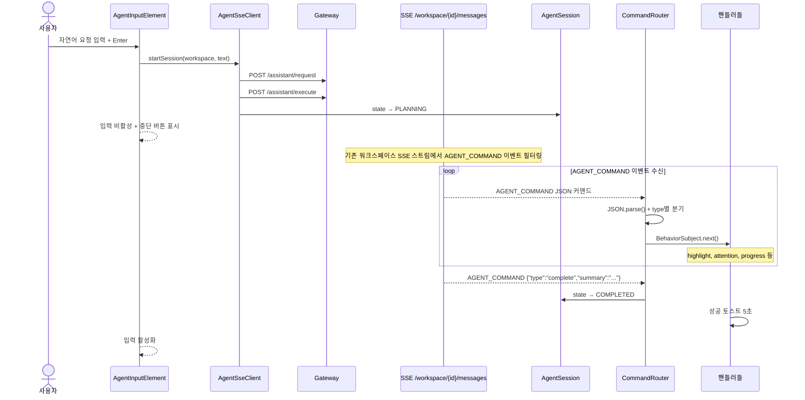
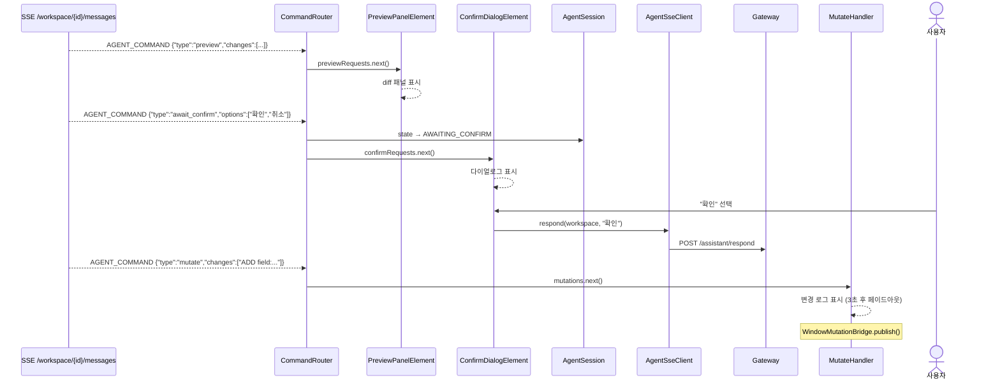
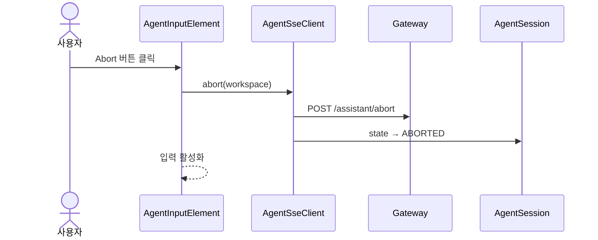
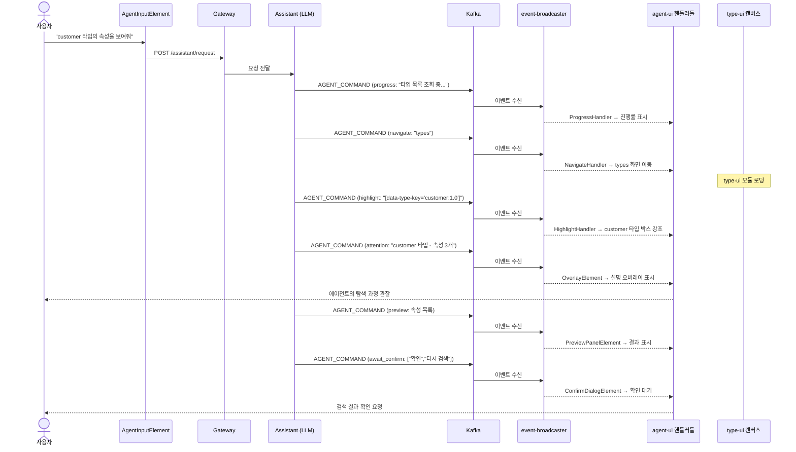
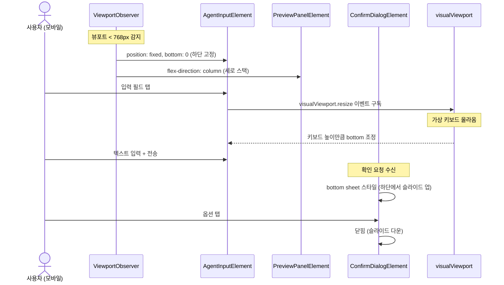

# Agent-UI 유스케이스

## 에이전트 요청 → 실행 → 완료 시퀀스

## 변경 미리보기 → 확인 → Mutation 시퀀스

## 에이전트 중단 시퀀스

## 에이전트 UX 원칙 — 시각적 실행

에이전트 커맨드는 단순히 데이터로 처리되는 것이 아니라, **프론트엔드에서 시각적 애니메이션으로 실행**되어 "동료가 내 화면을 대신 조작해주는 느낌"을 제공한다:

| 커맨드 | 시각적 실행 |
|--------|------------|
| `navigate` | 화면 전환 애니메이션 (페이드아웃 인디케이터 + 모듈 로딩) |
| `mutate` | 셀이 하나씩 채워지는 효과 (순차 변경 로그, 3초 후 페이드아웃) |
| `highlight` | 시선 유도 (대상 요소 펄스 애니메이션 + 자동 스크롤) |
| `attention` | 코치마크/스포트라이트로 설명 동반 안내 |
| `scroll` | 대상 요소로 부드러운 스크롤 이동 |
| `preview` | diff 패널로 변경 전후 비교 표시 |

## 실시간 협업 — 다른 사용자 이벤트 수신

에이전트 커맨드뿐 아니라, 같은 워크스페이스의 다른 사용자가 발생시킨 데이터 변경 이벤트(DOCUMENT_CREATED, TYPE_CREATED 등)도 동일한 SSE 스트림(`/workspace/{id}/messages`)을 통해 수신된다. 모든 참여자(사용자 + 에이전트)가 동일한 이벤트 채널을 공유하므로, 다른 사용자의 변경사항이 즉시 UI에 반영된다.

---

## UC-A1: 에이전트에게 자연어 요청

| 항목 | 내용 |
|------|------|
| **액터** | 사용자 |
| **선행조건** | 워크스페이스 선택 완료, 세션 상태 IDLE |
| **정상 흐름** | 1. 하단 입력 필드에 자연어 요청을 입력한다. 2. Enter 또는 Send 버튼 클릭. 3. `AgentSseClient.startSession(workspace, text)`이 호출된다. 4. Gateway에 `POST /assistant/request`로 요청이 전달된 후 `POST /assistant/execute`로 실행을 시작한다. 5. 기존 워크스페이스 SSE(`/workspace/{id}/messages`)에서 AGENT_COMMAND 이벤트를 필터링하여 수신하고, 세션 상태가 PLANNING → EXECUTING으로 전환된다. 6. 입력 필드가 비활성화되고, 중단 버튼이 표시된다. |
| **결과** | 에이전트 세션이 시작되고, 워크스페이스 이벤트 스트림을 통해 커맨드 수신이 시작된다. |

## UC-A2: 에이전트 커맨드 수신 및 라우팅

| 항목 | 내용 |
|------|------|
| **액터** | 에이전트 (워크스페이스 SSE) |
| **선행조건** | 워크스페이스 SSE(`/workspace/{id}/messages`) 스트림 연결 상태 |
| **정상 흐름** | 1. event-broadcaster가 Kafka에서 AGENT_COMMAND 이벤트를 수신하여 워크스페이스 SSE로 브로드캐스트한다. 2. `AgentSseClient`가 AGENT_COMMAND 이벤트를 필터링하여 `CommandRouter.route(json)`을 호출한다. 3. `CommandRouter`가 native `JSON.parse()`로 파싱하고 `type` 필드에 따라 해당 BehaviorSubject에 발행한다. 4. 구독 중인 핸들러가 반응하여 UI를 업데이트한다. |
| **커맨드별 핸들러** | navigate→NavigateHandler, highlight→HighlightHandler, attention→OverlayElement, scroll→ScrollHandler, preview→PreviewPanelElement, mutate→MutateHandler, notify→NotifyHandler, progress→ProgressHandler, await_confirm→ConfirmDialogElement, complete→CompleteHandler |

## UC-A3: 화면 네비게이션

| 항목 | 내용 |
|------|------|
| **커맨드** | `navigate` |
| **정상 흐름** | 1. `NavigateHandler`가 NavigateInfo를 수신한다. 2. Shell의 `Observer<String> uri`에 URL을 발행한다. 3. Shell의 `UrlBasedMenuResolver`가 메뉴를 자동 선택하고, `ModuleScriptManager`가 모듈을 로딩한다. 4. 페이드아웃 인디케이터가 표시된다. |

## UC-A4: 요소 하이라이트 / 주의 환기

| 항목 | 내용 |
|------|------|
| **커맨드** | `highlight`, `attention`, `scroll` |
| **정상 흐름** | 1. `HighlightHandler` → 대상 요소에 펄스 애니메이션 적용. 2. `OverlayElement` → 대상 요소에 오버레이 표시 (5종 스타일). dismissable이면 클릭 시 닫힘. 3. `ScrollHandler` → 대상 요소로 뷰포트 스크롤. |

## UC-A5: 변경 미리보기 및 확인

| 항목 | 내용 |
|------|------|
| **커맨드** | `preview` → `await_confirm` |
| **정상 흐름** | 1. `PreviewPanelElement`가 changes 배열을 diff 패널로 표시한다. 2. `ConfirmDialogElement`가 확인 다이얼로그를 표시한다. description과 options 배열로 버튼을 구성한다. 3. 세션 상태가 AWAITING_CONFIRM으로 전환된다. 4. 사용자가 옵션을 선택하면 `AgentApiPort.respond(workspace, response)`로 Gateway에 응답을 전달한다 (`POST /assistant/respond`). 5. 에이전트가 다음 커맨드를 Kafka로 발행하고, 워크스페이스 SSE를 통해 수신된다. |

## UC-A6: 데이터 변경 (Mutation)

| 항목 | 내용 |
|------|------|
| **커맨드** | `mutate` |
| **정상 흐름** | 1. `MutateHandler`가 changes 배열을 화면에 로그로 표시한다. 2. 3초 후 페이드아웃으로 자동 숨김. |
| **브릿지** | `MutateHandler`가 화면 표시 후 `WindowMutationBridge.publish()`로 편집 모듈에 전달. |

## UC-A7: 알림 및 진행률

| 항목 | 내용 |
|------|------|
| **커맨드** | `notify`, `progress` |
| **정상 흐름** | 1. `NotifyHandler` → 토스트 알림 표시 (info/success/warning/error 레벨). 2. `ProgressHandler` → 진행률 바 업데이트. 완료 시 2초 후 자동 숨김. |

## UC-A8: 작업 완료

| 항목 | 내용 |
|------|------|
| **커맨드** | `complete` |
| **정상 흐름** | 1. `CompleteHandler`가 진행률을 숨기고 성공 토스트를 5초간 표시한다. 2. 세션 상태가 COMPLETED로 전환된다. 3. 입력 필드가 다시 활성화되고, 전송 버튼이 표시된다. |

## UC-A9: 에이전트 작업 중단

| 항목 | 내용 |
|------|------|
| **액터** | 사용자 |
| **선행조건** | 세션 상태가 PLANNING, EXECUTING, 또는 AWAITING_CONFIRM |
| **정상 흐름** | 1. 중단(Abort) 버튼을 클릭한다. 2. `AgentApiPort.abort(workspace)`가 호출된다. 3. Gateway에 `POST /assistant/abort`로 중단 요청이 전달된다. 4. 세션 상태가 ABORTED로 전환된다. 5. 입력 필드가 다시 활성화된다. |

## UC-A10: 에이전트에 의한 타입/워크스페이스 조작 (미구현)

| 항목 | 내용 |
|------|------|
| **액터** | AI 에이전트 |
| **정상 흐름 (목표)** | 1. `MutateCommand`의 changes가 `MutationReceiver`를 통해 편집 모듈(type-ui/workspace-ui)에 전달된다. 2. 각 모듈의 `AgentMutationHandler`/`AgentWorkspaceHandler`가 Action으로 변환하여 실행한다. 3. 사용자가 Undo로 되돌릴 수 있다. |
| **브릿지** | `agent-bridge` 모듈의 `WindowMutationBridge`가 `CustomEvent('handbook-mutate')`로 연결. `WindowStateProviderBridge`/`WindowSearchProviderBridge`로 상태 조회 및 검색도 가능. |

## UC-A11: 에이전트 검색 시각화 (미구현 요구사항)

| 항목 | 내용 |
|------|------|
| **액터** | AI 에이전트 |
| **목표** | 에이전트가 데이터를 검색할 때, 검색 과정을 사용자에게 실시간으로 보여주면서 검색한다. |
| **요구사항** | 1. **검색 시각화**: 에이전트가 타입/워크스페이스를 검색할 때 검색 쿼리와 결과를 UI에 실시간 표시. 2. **단계별 탐색**: 에이전트가 여러 타입을 순회하며 조사할 때 현재 어떤 항목을 보고 있는지 하이라이트. 3. **검색 결과 요약**: 검색 완료 후 결과와 판단 근거를 preview로 표시. 4. **사용자 피드백**: 검색 결과가 의도와 다르면 사용자가 수정 가능 (await_confirm). |
| **예상 커맨드 시퀀스** | `progress` → `navigate` → `highlight` (순차 강조) → `attention` (결과 설명) → `preview` (변경 계획) → `await_confirm` (사용자 확인) |
| **필요 구현** | Assistant가 검색 시 커맨드 시퀀스 자동 생성 / 검색 결과를 UI에 표시하는 공통 컴포넌트 |

---

## 모바일 입력 적응 시퀀스

## UC-A12: 모바일 반응형 레이아웃

| 항목 | 내용 |
|------|------|
| **액터** | 사용자 (모바일/태블릿 디바이스) |
| **선행조건** | 뷰포트 너비 < 768px |
| **정상 흐름** | 1. `ViewportObserver`가 모바일 뷰포트를 감지한다. 2. 입력창이 하단 고정(`position: fixed, bottom: 0`)으로 배치된다. 3. `visualViewport` API로 가상 키보드 높이를 감지하여 입력창 위치를 조정한다. 4. 미리보기 패널이 세로 스택(before/after 위아래)으로 전환된다. 5. 확인 다이얼로그가 bottom sheet로 전환된다. 6. 코치마크/오버레이가 터치 탭으로 닫힌다. |

---

## 트레이서빌리티 매트릭스

| UC | 시퀀스 다이어그램 | 클래스 다이어그램 섹션 | 주요 클래스 | 테스트 |
|----|---|---|---|---|
| UC-A1 (요청) | 에이전트 요청 → 실행 → 완료 | 핸들러+UI, 인터페이스 구현 | AgentInputElement, AgentSseClient, AgentSession, CommandRouter | AgentTest: 입력 컨테이너/필드, 전송 버튼 |
| UC-A2 (라우팅) | 에이전트 요청 → 실행 → 완료 (loop) | 인터페이스 구현 | CommandRouter(10개 BehaviorSubject), AgentSseClient | AgentTest: 각 커맨드 버튼으로 핸들러 동작 검증 |
| UC-A3 (네비) | shell-ui: 에이전트 화면 이동 | 핸들러+UI | NavigateHandler, Observer\<URI\> | AgentTest: Navigate 버튼 → 인디케이터 표시 |
| UC-A4 (하이라이트) | — (단순) | 핸들러+UI | HighlightHandler, ScrollHandler, OverlayElement | AgentTest: highlight 클래스 토글, attention 오버레이 표시/닫기 |
| UC-A5 (미리보기) | 변경 미리보기 → 확인 → Mutation | 핸들러+UI, 인터페이스 구현 | PreviewPanelElement, ConfirmDialogElement, AgentSseClient | AgentTest: preview 패널 토글, diff 표시, confirm 다이얼로그 |
| UC-A6 (Mutation) | 변경 미리보기 (후반) | 핸들러+UI | MutateHandler, WindowMutationBridge | AgentTest: Mutate 버튼 → 변경 로그 표시, 항목 2개 검증 |
| UC-A7 (알림) | — (단순) | 핸들러+UI | NotifyHandler, ProgressHandler | AgentTest: Notify 버튼 → 토스트 표시, Scroll 버튼 → 스크롤 이동 |
| UC-A8 (완료) | 에이전트 요청 → 실행 → 완료 (후반) | 핸들러+UI | CompleteHandler, AgentSession(COMPLETED) | AgentTest: complete 커맨드 시 send 버튼 복원 |
| UC-A9 (중단) | 에이전트 중단 | 핸들러+UI, 인터페이스 구현 | AgentInputElement, AgentSseClient, AgentSession(ABORTED) | AgentTest: confirm 커맨드 시 abort 버튼 표시 |
| UC-A10 (조작) | type-ui: 에이전트 타입 조작 | 핸들러+UI | MutateHandler, WindowMutationBridge → AgentMutationHandler | ❌ 미구현 |
| UC-A11 (검색시각화) | UC-A11 내 시퀀스 | 핸들러+UI, 도메인 | ProgressHandler, NavigateHandler, HighlightHandler, OverlayElement, PreviewPanelElement, ConfirmDialogElement | ❌ 미구현 (요구사항만 정의) |
| UC-A12 (모바일) | 모바일 입력 적응 | 핸들러+UI | ViewportObserver, AgentInputElement(bottom fixed, visualViewport), ConfirmDialogElement(bottom sheet), PreviewPanelElement(vertical stack) | ❌ 미구현 |
