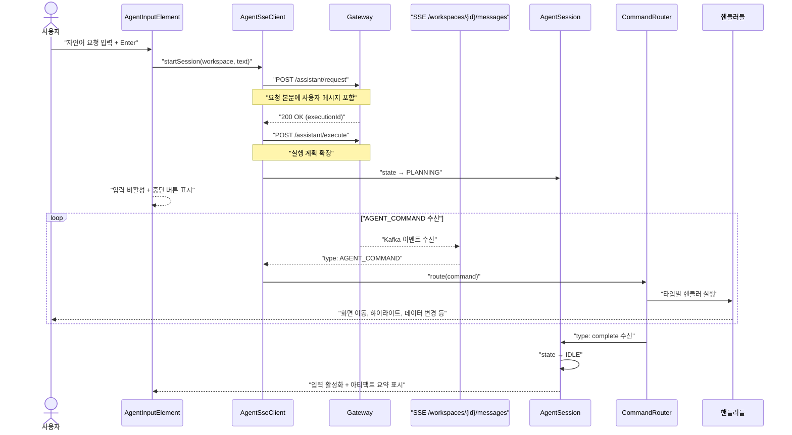
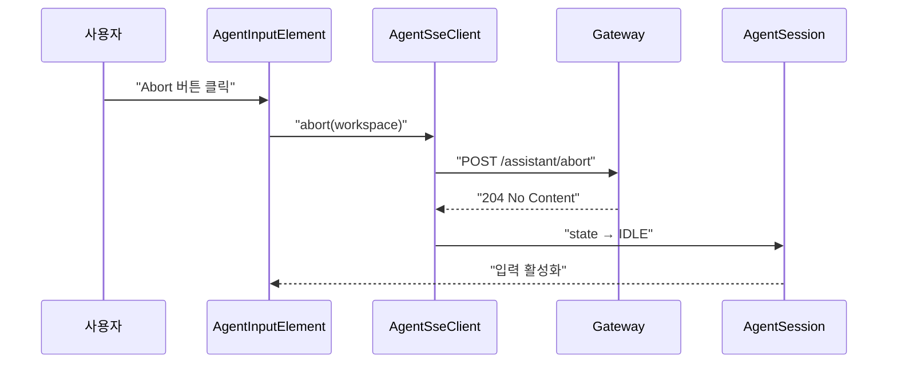

# Agent-UI 유스케이스

## 에이전트 요청 → 실행 → 완료 시퀀스

에이전트는 사용자의 자연어 요청을 해석하여 워크스페이스 SSE 스트림을 통해 일련의 커맨드를 발행하고, 프론트엔드는 이를 시각적으로 실행한다.



## AGENT_COMMAND 프로토콜 스펙

에이전트는 `agent-protocol` 모듈에 정의된 표준 커맨드를 사용하여 UI를 조작한다.

### 1. PROGRESS (진행 상황)
현재 실행 중인 그룹과 전체 단계 수를 사용자에게 알린다.
```json
{
  "type": "progress",
  "executionId": "uuid",
  "currentGroup": 1,
  "totalGroups": 3,
  "parallel": true,
  "stepCount": 2,
  "description": "타입 구조 분석 중..."
}
```

### 2. PREVIEW (변경 미리보기)
실제 데이터 변경 전, 에이전트가 제안하는 상태를 오버레이로 보여준다.
```json
{
  "type": "preview",
  "target": "type-ui",
  "payload": {
    "types": [...],
    "layouts": [...]
  }
}
```

### 3. AWAIT_CONFIRM (사용자 승인 대기)
사용자의 명시적 승인이 필요한 시점에 실행을 일시 중단한다.
```json
{
  "type": "await_confirm",
  "description": "제안된 타입 구조로 생성을 진행할까요?",
  "options": ["confirm", "cancel"]
}
```

### 4. MUTATE (데이터 변경 실행)
실제 도메인 액션을 실행하여 상태를 변경한다.
```json
{
  "type": "mutate",
  "target": "document-ui",
  "changes": ["DOC_ADD", "DOC_EDIT CUST-001 name 홍길동"]
}
```

### 5. COMPLETE (실행 완료)
모든 단계가 완료되었음을 알리고 실행 결과를 요약(Artifact)으로 전달한다.
```json
{
  "type": "complete",
  "description": "병원 관리 워크스페이스 설계가 완료되었습니다.",
  "artifact": {
    "summary": "3개 타입 및 10개 문서 생성 완료",
    "changes": [
      {"type": "type", "target": "patient", "description": "환자 타입 생성"}
    ]
  }
}
```

## 에이전트 중단 시퀀스

사용자가 중단 버튼을 누르거나 오류 발생 시 세션을 즉시 종료한다.



## 트레이서빌리티 매트릭스

| UC | 시퀀스 다이어그램 | 주요 클래스 | 테스트 |
|----|---|---|---|
| UC-A13 (커맨드 라우팅) | 에이전트 요청 → 실행 | CommandRouter, AgentSseClient, AgentSession | AgentTest: 각 타입별 커맨드 수신 시 해당 핸들러 호출 여부 검증 |
| UC-A14 (시각적 실행) | — | HighlightHandler, MutateHandler, NavigateHandler | AgentTest: navigate 커맨드 시 URL 변경, highlight 시 CSS 클래스 부착 검증 |
| UC-A15 (아티팩트 렌더링) | — | ArtifactSummaryPanel, CompleteHandler | AgentCollaborationTest: complete 커맨드 수신 시 아티팩트 요약 패널 표시 검증 |
| UC-A16 (진행률 표시) | — | ProgressHandler, ProgressElement | AgentProgressTest: progress 커맨드 수신 시 프로그레스 바 갱신 검증 |
| UC-A17 (사용자 확인) | — | ConfirmDialogElement, AgentSseClient | AgentTest: await_confirm 수신 시 다이얼로그 노출 및 응답 전송 검증 |

---

## 에이전트 연동

Agent-UI 모듈은 에이전트 커맨드를 시각화하는 핵심 모듈이다.

| # | 항목 | 값 | 비고 |
|---|------|---|------|
| 1 | 내부 assistant 연동 | `AGENT_COMMAND` SSE 수신 및 라우팅 | assistant가 발행한 모든 커맨드를 라우팅함 |
| 2 | Agent Command 타겟 | selector: `.agent-input`, `.agent-mutate-log`, `.agent-artifact-panel` | 에이전트가 자기 자신의 UI를 가리킬 때 사용 |
| 3 | 감사 경로 | `POST /assistant/respond` | 사용자 확인 응답에 대한 감사 추적 제공 |
