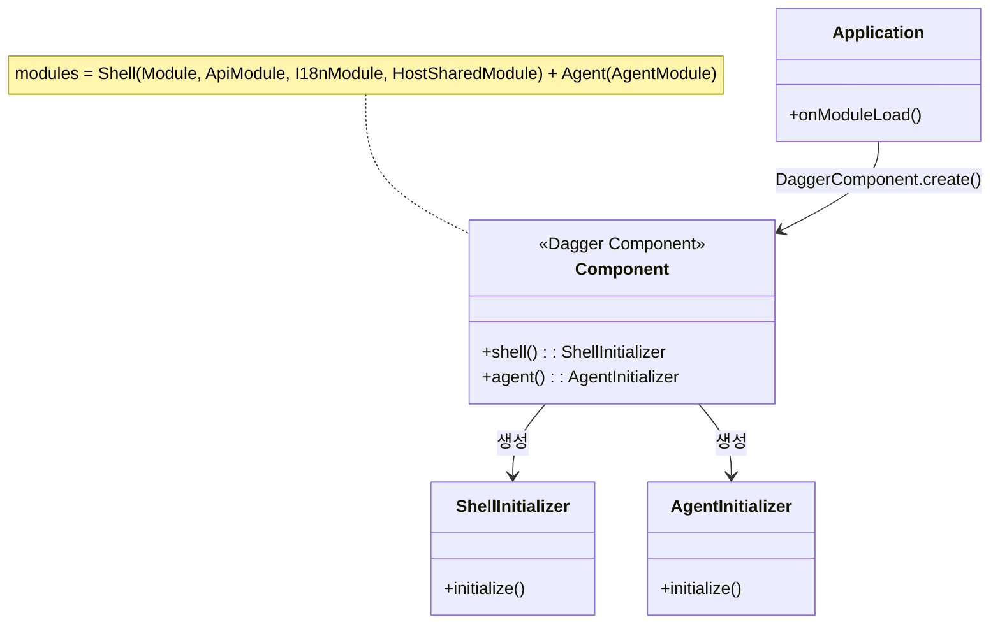

# App 클래스 다이어그램

```mermaid
classDiagram
    class Application {
        +onModuleLoad()
    }
    class Component {
        <<Dagger Component>>
        +shell(): ShellInitializer
        +agent(): AgentInitializer
    }
    class ShellInitializer {
        +initialize()
    }
    class AgentInitializer {
        +initialize()
    }

    Application --> Component : DaggerComponent.create()
    Component --> ShellInitializer : 생성
    Component --> AgentInitializer : 생성

    note for Component "modules = Shell(Module, ApiModule, I18nModule, HostSharedModule) + Agent(AgentModule)"
```
