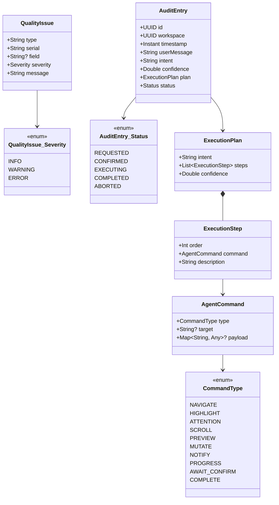
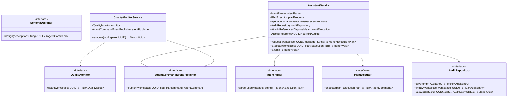

# Assistant 클래스 다이어그램

## Domain 계층

## Usecase 계층

## Interfaces 계층

```mermaid
classDiagram
    class AssistantController {
        -AssistantService assistantService
        +request(body: Map): Mono~ExecutionPlan~
        +execute(workspace: UUID, plan: ExecutionPlan): Mono~Void~
        +respond(workspace: UUID, body: Map): Mono~Void~
        +abort(): Mono~Void~
    }
    class OpenAiIntentParser {
        -WebClient webClient
        -ObjectMapper objectMapper
        -String apiKey
        -String model
        -SYSTEM_PROMPT: String$
        +parse(userMessage: String): Mono~ExecutionPlan~
        -extractContent(response: Map): String
        -parseExecutionPlan(json: String): ExecutionPlan
    }
    class SequentialPlanExecutor {
        +execute(plan: ExecutionPlan): Flux~AgentCommand~
    }
    class KafkaAgentCommandEventPublisher {
        -KafkaTemplate kafkaTemplate
        -ObjectMapper objectMapper
        -TOPIC: String$
        +publish(workspace: UUID, seq: Int, command: AgentCommand)
    }
    class LlmConfig {
        <<@ConfigurationProperties>>
        +apiKey: String
        +model: String
        +baseUrl: String
    }
    class AssistantConfig {
        <<@Configuration>>
        +objectMapper(): ObjectMapper
        +openAiWebClient(llmConfig): WebClient
        +intentParser(webClient, objectMapper, llmConfig): IntentParser
        +planExecutor(): PlanExecutor
        +agentCommandEventPublisher(kafkaTemplate, objectMapper): AgentCommandEventPublisher
        +assistantService(intentParser, planExecutor, eventPublisher): AssistantService
    }

    AssistantController --> AssistantService
    OpenAiIntentParser ..|> IntentParser
    SequentialPlanExecutor ..|> PlanExecutor
    KafkaAgentCommandEventPublisher ..|> AgentCommandEventPublisher
    AssistantConfig ..> OpenAiIntentParser : creates
    AssistantConfig ..> SequentialPlanExecutor : creates
    AssistantConfig ..> KafkaAgentCommandEventPublisher : creates
    AssistantConfig ..> AssistantService : creates
    AssistantConfig --> LlmConfig

    class QualityController {
        -QualityMonitorService service
        +scan(workspace: UUID): Mono~Void~ «@PostMapping /assistant/quality/scan»
    }
    class AuditController {
        -AuditRepository repo
        +list(workspace: UUID): Flux~AuditEntry~ «@GetMapping /assistant/audit»
    }
    class DefaultQualityMonitor {
        -WebClient searchDocumentClient
        +scan(workspace: UUID): Flux~QualityIssue~
        -fetchDocuments(workspace: UUID): Flux~DocumentSnapshot~
        -checkMissingRequiredFields(docs): List~QualityIssue~
        -checkDuplicateSerials(docs): List~QualityIssue~
        -checkNumericAnomalies(docs): List~QualityIssue~
    }
    class InMemoryAuditRepository {
        -ConcurrentHashMap~UUID, AuditEntry~ store
        +save(entry: AuditEntry): Mono~AuditEntry~
        +findByWorkspace(workspace: UUID): Flux~AuditEntry~
        +updateStatus(id: UUID, status: AuditEntry.Status): Mono~Void~
    }

    QualityController --> QualityMonitorService
    AuditController --> AuditRepository
    DefaultQualityMonitor ..|> QualityMonitor
    InMemoryAuditRepository ..|> AuditRepository
    AssistantConfig ..> DefaultQualityMonitor : creates
    AssistantConfig ..> InMemoryAuditRepository : creates
    AssistantConfig ..> QualityMonitorService : creates
```

## 설계 패턴

| 패턴 | 적용 위치 | 설명 |
|------|----------|------|
| **Port & Adapter (Hexagonal)** | IntentParser, PlanExecutor, AgentCommandEventPublisher | usecase의 포트 인터페이스를 interfaces에서 구현 |
| **Transaction Script** | AssistantService | 비즈니스 로직을 순수 클래스로 구현, Spring 어노테이션 없음 |
| **Domain Event** | KafkaAgentCommandEventPublisher | Kafka AGENT_COMMAND 이벤트 발행으로 워크스페이스 브로드캐스트 |
| **Strategy** | OpenAiIntentParser, SequentialPlanExecutor | LLM 클라이언트와 실행 전략을 인터페이스로 분리하여 교체 가능 |
| **Port & Adapter** | QualityMonitor / DefaultQualityMonitor, AuditRepository / InMemoryAuditRepository | 품질 감시와 감사 저장소를 인터페이스로 분리하여 구현 교체 가능 |
