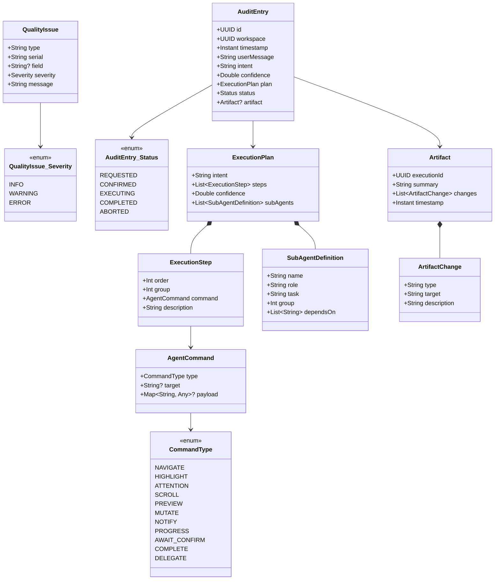

# Assistant 클래스 다이어그램

## Domain 계층

## Usecase 계층

```mermaid
classDiagram
    class IntentParser {
        <<interface>>
        +parse(userMessage: String, context: String?): Mono~ExecutionPlan~
    }
    class SubAgentPlanExecutor {
        <<interface>>
        +execute(workspace: UUID, parentExecutionId: UUID, definition: SubAgentDefinition, upstreamArtifacts: Map): Mono~Artifact~
    }
    class ArtifactAggregator {
        <<interface>>
        +aggregate(executionId: UUID, intent: String, subArtifacts: Map): Artifact
    }
    class PlanExecutor {
        <<interface>>
        +execute(plan: ExecutionPlan): Flux~AgentCommand~
    }
    class SchemaDesigner {
        <<interface>>
        +design(description: String): Flux~AgentCommand~
    }
    class AgentCommandEventPublisher {
        <<interface>>
        +publish(workspace: UUID, seq: Int, command: AgentCommand)
    }
    class QualityMonitor {
        <<interface>>
        +scan(workspace: UUID): Flux~QualityIssue~
    }
    class AuditRepository {
        <<interface>>
        +save(entry: AuditEntry): Mono~AuditEntry~
        +findByWorkspace(workspace: UUID): Flux~AuditEntry~
        +updateStatus(id: UUID, status: AuditEntry.Status): Mono~Void~
    }
    class QualityMonitorService {
        -QualityMonitor monitor
        -AgentCommandEventPublisher eventPublisher
        +execute(workspace: UUID): Mono~Void~
    }
    class ExecutionContext {
        +UUID executionId
        +UUID workspace
        +ExecutionPlan plan
        +AuditEntry auditEntry
        +Sinks.One~String~ responseSink
        +Disposable subscription
        +Int currentGroup
        +Int totalGroups
        +Status status
    }
    class AssistantService {
        -IntentParser intentParser
        -PlanExecutor planExecutor
        -AgentCommandEventPublisher eventPublisher
        -AuditRepository auditRepository
        -ExecutionContextManager contextManager
        -SubAgentOrchestrator? subAgentOrchestrator
        +request(workspace: UUID, message: String): Mono~ExecutionRequest~
        +execute(workspace: UUID, executionId: UUID, plan: ExecutionPlan): Mono~Void~
        +respond(executionId: UUID, response: String): Mono~Void~
        +abort(executionId: UUID): Mono~Void~
        +getExecutions(workspace: UUID): Flux~ExecutionStatus~
        +getArtifacts(workspace: UUID): Flux~Artifact~
    }
    class ExecutionRequest {
        +UUID executionId
        +ExecutionPlan plan
    }

    class SubAgentOrchestrator {
        -SubAgentPlanExecutor subAgentExecutor
        -ArtifactAggregator artifactAggregator
        -AgentCommandEventPublisher eventPublisher
        +execute(workspace: UUID, executionId: UUID, plan: ExecutionPlan): Mono~Artifact~
    }

    AssistantService --> IntentParser
    AssistantService --> PlanExecutor
    AssistantService --> AgentCommandEventPublisher
    AssistantService --> AuditRepository
    AssistantService --> SubAgentOrchestrator
    SubAgentOrchestrator --> SubAgentPlanExecutor
    SubAgentOrchestrator --> ArtifactAggregator
    SubAgentOrchestrator --> AgentCommandEventPublisher
    QualityMonitorService --> QualityMonitor
    QualityMonitorService --> AgentCommandEventPublisher
```

## Interfaces 계층

```mermaid
classDiagram
    class AssistantController {
        -AssistantService assistantService
        +request(body: Map): Mono~ExecutionRequest~
        +execute(workspace: UUID, executionId: UUID, plan: ExecutionPlan): Mono~Void~
        +respond(workspace: UUID, executionId: UUID, body: Map): Mono~Void~
        +abort(executionId: UUID): Mono~Void~
        +getExecutions(workspace: UUID): Flux~ExecutionStatus~
        +getArtifacts(workspace: UUID): Flux~Artifact~
    }
    class OpenAiIntentParser {
        -WebClient webClient
        -ObjectMapper objectMapper
        -String apiKey
        -String model
        -SYSTEM_PROMPT: String$
        +parse(userMessage: String, context: String?): Mono~ExecutionPlan~
        -extractContent(response: Map): String
        -parseExecutionPlan(json: String): ExecutionPlan
    }
    class DefaultSubAgentPlanExecutor {
        -IntentParser intentParser
        -PlanExecutor planExecutor
        -AgentCommandEventPublisher eventPublisher
        +execute(workspace: UUID, parentExecutionId: UUID, definition: SubAgentDefinition, upstreamArtifacts: Map): Mono~Artifact~
        -buildContext(definition: SubAgentDefinition, upstreamArtifacts: Map): String
        -executePlan(workspace: UUID, parentExecutionId: UUID, subAgentName: String, plan: ExecutionPlan): Mono~Artifact~
    }
    class DefaultArtifactAggregator {
        +aggregate(executionId: UUID, intent: String, subArtifacts: Map): Artifact
    }
    class GroupedPlanExecutor {
        +execute(plan: ExecutionPlan): Flux~AgentCommand~
    }
    class KafkaAgentCommandEventPublisher {
        -KafkaTemplate kafkaTemplate
        -ObjectMapper objectMapper
        -TOPIC: String$
        +publish(workspace: UUID, seq: Int, command: AgentCommand)
    }
    class LlmConfig {
        <<@ConfigurationProperties>>
        +apiKey: String
        +model: String
        +baseUrl: String
    }
    class AssistantConfig {
        <<@Configuration>>
        +objectMapper(): ObjectMapper
        +openAiWebClient(llmConfig): WebClient
        +intentParser(webClient, objectMapper, llmConfig): IntentParser
        +planExecutor(): PlanExecutor
        +agentCommandEventPublisher(kafkaTemplate, objectMapper): AgentCommandEventPublisher
        +assistantService(intentParser, planExecutor, eventPublisher): AssistantService
    }

    AssistantController --> AssistantService
    OpenAiIntentParser ..|> IntentParser
    GroupedPlanExecutor ..|> PlanExecutor
    KafkaAgentCommandEventPublisher ..|> AgentCommandEventPublisher
    DefaultSubAgentPlanExecutor ..|> SubAgentPlanExecutor
    DefaultArtifactAggregator ..|> ArtifactAggregator
    AssistantConfig ..> OpenAiIntentParser : creates
    AssistantConfig ..> GroupedPlanExecutor : creates
    AssistantConfig ..> KafkaAgentCommandEventPublisher : creates
    AssistantConfig ..> DefaultSubAgentPlanExecutor : creates
    AssistantConfig ..> DefaultArtifactAggregator : creates
    AssistantConfig ..> AssistantService : creates
    AssistantConfig --> LlmConfig

    class QualityController {
        -QualityMonitorService service
        +scan(workspace: UUID): Mono~Void~ «@PostMapping /assistant/quality/scan»
    }
    class AuditController {
        -AuditRepository repo
        +list(workspace: UUID): Flux~AuditEntry~ «@GetMapping /assistant/audit»
    }
    class DefaultQualityMonitor {
        -WebClient searchDocumentClient
        +scan(workspace: UUID): Flux~QualityIssue~
        -fetchDocuments(workspace: UUID): Flux~DocumentSnapshot~
        -checkMissingRequiredFields(docs): List~QualityIssue~
        -checkDuplicateSerials(docs): List~QualityIssue~
        -checkNumericAnomalies(docs): List~QualityIssue~
    }
    class InMemoryAuditRepository {
        -ConcurrentHashMap~UUID, AuditEntry~ store
        +save(entry: AuditEntry): Mono~AuditEntry~
        +findByWorkspace(workspace: UUID): Flux~AuditEntry~
        +updateStatus(id: UUID, status: AuditEntry.Status): Mono~Void~
    }

    QualityController --> QualityMonitorService
    AuditController --> AuditRepository
    DefaultQualityMonitor ..|> QualityMonitor
    InMemoryAuditRepository ..|> AuditRepository
    AssistantConfig ..> DefaultQualityMonitor : creates
    AssistantConfig ..> InMemoryAuditRepository : creates
    AssistantConfig ..> QualityMonitorService : creates

    class ScheduledQualityMonitor {
        -QualityMonitorService qualityMonitorService
        -WorkspaceProvider workspaceProvider
        +scanAll() «@Scheduled cron»
    }

    class WorkspaceProvider {
        <<interface>>
        +getActiveWorkspaces(): List~UUID~
    }

    class WebClientWorkspaceProvider {
        -WebClient webClient
        +getActiveWorkspaces(): List~UUID~
    }

    class SchedulingConfig {
        <<@Configuration>>
        +scheduledQualityMonitor(): ScheduledQualityMonitor
        +workspaceProvider(): WorkspaceProvider
    }

    ScheduledQualityMonitor --> QualityMonitorService
    ScheduledQualityMonitor --> WorkspaceProvider
    WebClientWorkspaceProvider ..|> WorkspaceProvider
    SchedulingConfig ..> ScheduledQualityMonitor : creates
    SchedulingConfig ..> WebClientWorkspaceProvider : creates
```

## 설계 패턴

| 패턴 | 적용 위치 | 설명 |
|------|----------|------|
| **Port & Adapter (Hexagonal)** | IntentParser, PlanExecutor, AgentCommandEventPublisher | usecase의 포트 인터페이스를 interfaces에서 구현 |
| **Transaction Script** | AssistantService | 비즈니스 로직을 순수 클래스로 구현, Spring 어노테이션 없음 |
| **Domain Event** | KafkaAgentCommandEventPublisher | Kafka AGENT_COMMAND 이벤트 발행으로 워크스페이스 브로드캐스트 |
| **Strategy** | OpenAiIntentParser, GroupedPlanExecutor | LLM 클라이언트와 실행 전략을 인터페이스로 분리하여 교체 가능 |
| **Port & Adapter** | QualityMonitor / DefaultQualityMonitor, AuditRepository / InMemoryAuditRepository | 품질 감시와 감사 저장소를 인터페이스로 분리하여 구현 교체 가능 |
| **Port & Adapter** | SubAgentPlanExecutor / DefaultSubAgentPlanExecutor, ArtifactAggregator / DefaultArtifactAggregator | 서브 에이전트 실행과 결과 병합을 인터페이스로 분리 |
| **Orchestrator** | SubAgentOrchestrator | 서브 에이전트 group별 순차/병렬 실행 + Artifact 수집/병합을 전담 (AssistantService에서 추출) |
| **Composite** | SubAgentDefinition, SubAgentOrchestrator | 실행 계획을 서브 에이전트 단위로 분해하여 재귀적으로 실행 (최대 깊이 1) |
