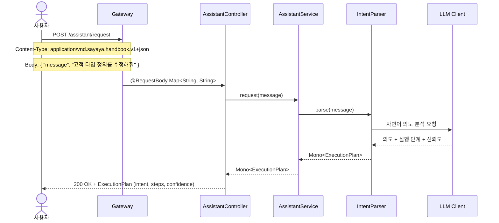
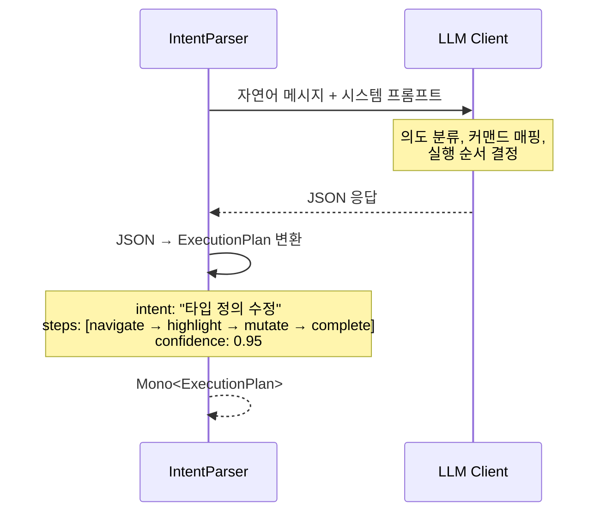
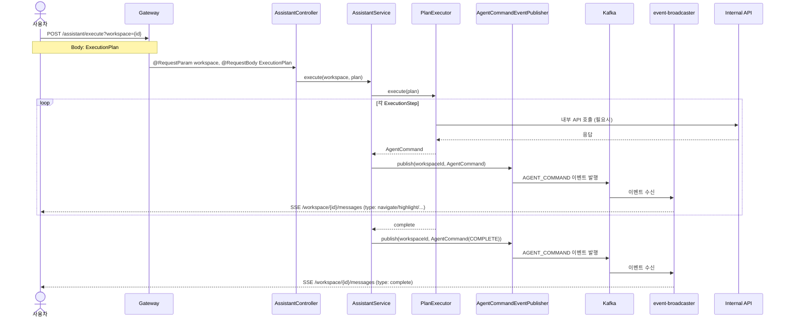
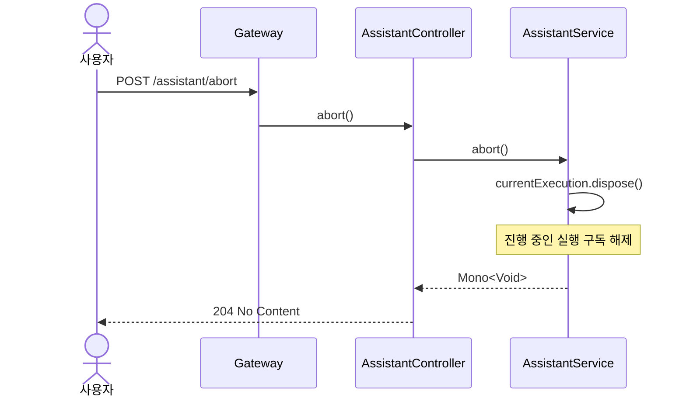
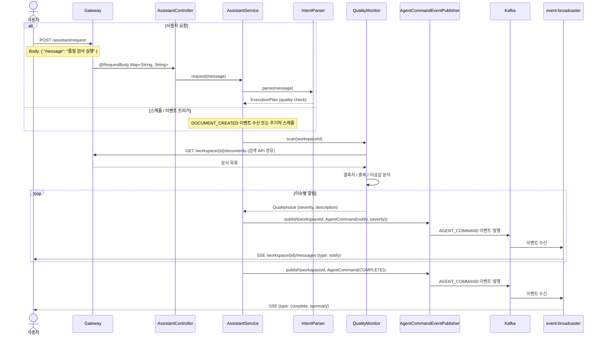
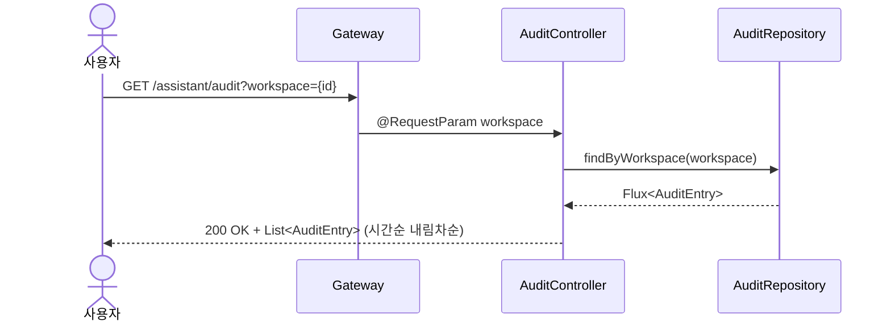
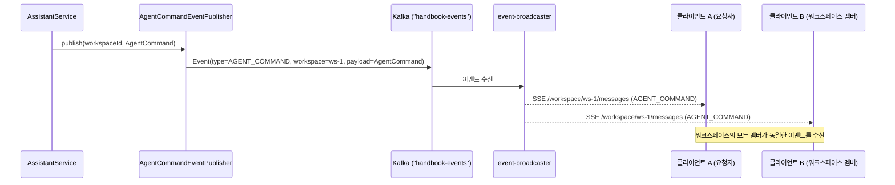

# Assistant 유스케이스

## UC-A1: 자연어 명령 처리

| 항목 | 내용 |
|------|------|
| **액터** | 사용자 |
| **선행조건** | 인증된 세션 |
| **정상 흐름** | 1. 사용자가 `POST /assistant/request`로 자연어 메시지를 전송한다. 2. `IntentParser`가 LLM을 통해 의도를 분석한다. 3. 의도, 실행 단계, 신뢰도를 포함한 `ExecutionPlan`이 반환된다. |
| **대안 흐름** | LLM 응답 실패 시 500 Internal Server Error 반환. |

---

## UC-A2: 실행 계획 생성

| 항목 | 내용 |
|------|------|
| **액터** | 시스템 (IntentParser 내부) |
| **선행조건** | 사용자 메시지 수신 |
| **정상 흐름** | 1. LLM에 자연어 메시지와 시스템 프롬프트를 전송한다. 2. LLM이 의도를 분류하고, CommandType에 매핑된 실행 단계를 생성한다. 3. JSON 응답을 `ExecutionPlan`으로 변환하여 반환한다. |
| **대안 흐름** | 신뢰도가 낮은 경우(< 0.5), `AWAIT_CONFIRM` 커맨드를 포함하여 사용자 확인을 요청한다. |

---

## UC-A3: 명령 실행 (Kafka 이벤트 브로드캐스트)

| 항목 | 내용 |
|------|------|
| **액터** | 사용자 |
| **선행조건** | 유효한 ExecutionPlan 보유 |
| **정상 흐름** | 1. 사용자가 `POST /assistant/execute?workspace={id}`로 실행 계획을 전송한다. 2. `PlanExecutor`가 각 단계를 순서대로 실행한다. 3. 각 단계의 `AgentCommand`가 Kafka AGENT_COMMAND 이벤트로 발행되어 event-broadcaster를 통해 워크스페이스 SSE로 브로드캐스트된다. 각 커맨드의 `description` 필드에 해당 단계의 실행 사유가 기록되어 감사 추적에 활용된다. 4. 모든 단계 완료 시 `COMPLETE` 커맨드가 전송된다. 5. 발행된 모든 AGENT_COMMAND 이벤트는 Kafka 불변 로그로 보존되며, ExecutionPlan(의도 근거 포함)과 함께 시간순 감사 조회가 가능하다. |
| **대안 흐름** | `AWAIT_CONFIRM` 커맨드 수신 시, 프론트엔드가 확인 다이얼로그를 표시하고 사용자 응답을 `POST /assistant/respond?workspace={id}`로 전달한다. |

---

## UC-A4: 실행 취소

| 항목 | 내용 |
|------|------|
| **액터** | 사용자 |
| **선행조건** | 실행 중인 계획이 존재 |
| **정상 흐름** | 1. 사용자가 `POST /assistant/abort`를 호출한다. 2. `AssistantService`가 현재 진행 중인 실행을 dispose한다. 3. 204 No Content가 반환된다. |
| **대안 흐름** | 실행 중인 계획이 없는 경우에도 204 No Content가 반환된다. |

---

## UC-A5: 데이터 품질 감시

| 항목 | 내용 |
|------|------|
| **액터** | 사용자 또는 시스템 (스케줄/이벤트 트리거) |
| **선행조건** | 워크스페이스에 문서가 1건 이상 존재 |
| **정상 흐름** | 1. 사용자가 자연어로 "품질 검사 실행"을 요청하거나, 스케줄/이벤트 트리거로 감시가 시작된다. 2. `QualityMonitor`가 워크스페이스 내 문서를 스캔하여 결측치, 중복, 이상값을 분석한다. 3. 발견된 이슈를 심각도(info/warning/error)에 따라 `AgentCommand(notify)`로 Kafka에 발행한다. 4. event-broadcaster를 통해 워크스페이스 SSE로 브로드캐스트되어 대시보드 및 클라이언트가 실시간 갱신된다. |
| **대안 흐름** | 이슈가 없는 경우 notify(info: "품질 이상 없음")을 발행하고 COMPLETE로 종료한다. |

---

## UC-A6: 감사 추적 조회

| 항목 | 내용 |
|------|------|
| **액터** | 사용자 |
| **선행조건** | 인증된 세션 |
| **정상 흐름** | 1. 사용자가 `GET /assistant/audit?workspace={id}`로 감사 이력을 조회한다. 2. `AuditRepository`에서 해당 워크스페이스의 `AuditEntry` 목록을 시간순 내림차순으로 반환한다. 3. 각 항목에는 사용자 원본 메시지, 의도, 신뢰도, 실행 계획, 상태(REQUESTED/CONFIRMED/EXECUTING/COMPLETED/ABORTED)가 포함된다. |
| **결과** | 에이전트의 모든 판단 과정과 실행 이력이 시간순으로 조회된다. |

---

## 트레이서빌리티 매트릭스

| UC | 시퀀스 다이어그램 | 주요 클래스 | 테스트 |
|----|---|---|---|
| UC-A1 (자연어 명령 처리) | 자연어 명령 처리 | AssistantController, AssistantService, IntentParser | AssistantServiceTest, AssistantControllerTest |
| UC-A2 (실행 계획 생성) | 실행 계획 생성 | IntentParser, ExecutionPlan, ExecutionStep, AgentCommand | AssistantServiceTest |
| UC-A3 (명령 실행) | 명령 실행 (Kafka 이벤트) | AssistantController, AssistantService, PlanExecutor, AgentCommandEventPublisher | AssistantServiceTest, AssistantControllerTest |
| UC-A4 (실행 취소) | 실행 취소 | AssistantController, AssistantService | AssistantServiceTest, AssistantControllerTest |
| UC-A5 (데이터 품질 감시) | 데이터 품질 감시 | QualityMonitorService, QualityMonitor, DefaultQualityMonitor, QualityController, AgentCommandEventPublisher | QualityMonitorServiceTest, QualityControllerTest |
| UC-A6 (감사 추적 조회) | 감사 추적 조회 | AuditController, AuditRepository, InMemoryAuditRepository, AuditEntry | AuditControllerTest, InMemoryAuditRepositoryTest |

---

## 이벤트 흐름: 에이전트 → 워크스페이스 멤버

에이전트 커맨드가 Kafka를 통해 워크스페이스의 모든 멤버에게 전달되는 흐름이다. 에이전트는 다른 도메인 이벤트(DOCUMENT_CREATED, TYPE_CREATED 등)와 동일한 이벤트 채널을 사용하며, "세 번째 협업자"로서 워크스페이스에 참여한다.

**프론트엔드 시각적 실행:** 커맨드는 단순히 데이터로 전달되는 것이 아니라, 프론트엔드에서 시각적 애니메이션으로 실행된다. `navigate`는 화면 전환 애니메이션, `mutate`는 셀이 하나씩 채워지는 효과, `highlight`는 시선 유도 등을 통해 "동료가 내 화면을 대신 조작해주는 느낌"을 제공한다.

**실시간 협업:** 같은 워크스페이스의 모든 참여자(사용자 + 에이전트)가 동일한 SSE 스트림을 구독하므로, 에이전트가 발행한 커맨드가 요청자뿐 아니라 워크스페이스의 모든 멤버에게 동시에 전달된다.

---

## 감사 추적 (Audit Trail)

에이전트의 모든 행동은 사후 추적이 가능하도록 설계된다.

| 항목 | 내용 |
|------|------|
| **의도 근거** | 사용자 원본 메시지(`POST /assistant/request`의 message)와 LLM 해석 결과(ExecutionPlan: intent, steps, confidence)를 함께 보존한다. |
| **커맨드별 사유** | 각 AgentCommand의 `description` 필드에 해당 단계를 실행하는 이유를 기록한다. 예: "고객 타입에 '이메일' 속성 추가를 위해 타입 편집기로 이동". |
| **불변 이벤트 로그** | Kafka에 발행된 AGENT_COMMAND 이벤트는 불변 로그로서, 에이전트가 언제 어떤 커맨드를 발행했는지의 근거가 된다. |
| **실행 계획 보존** | ExecutionPlan 전체를 이벤트와 연계하여 보존함으로써, 에이전트의 판단 과정을 사후에 재현할 수 있다. |
| **시간순 감사 조회** | Dashboard-UI에서 AGENT_COMMAND 이벤트를 시간순으로 조회하여 에이전트 활동 이력을 감사할 수 있다. |

---

## 참고: AgentCommand 클래스 이중 정의

이 모듈의 `AgentCommand` (`assistant/src/main/kotlin/.../domain/AgentCommand.kt`)는 오케스트레이션 레이어에서 사용하는 **단순화된 Kotlin data class**로, `type`, `target`, `payload` 필드만 가진다. LLM 응답 파싱 및 실행 계획 스트리밍 과정에서 사용된다.

별도로 `agent-protocol` 모듈에도 동일한 이름의 `AgentCommand` (`agent-protocol/src/main/java/.../domain/AgentCommand.java`)가 존재하며, 이는 Jackson `@JsonTypeInfo`/`@JsonSubTypes`를 사용하는 **폴리모픽 커맨드 계층 구조**로, 프론트엔드(agent-ui)에서 소비하기 위한 타입 안전한 JSON 직렬화를 담당한다.

두 클래스는 서로 다른 단계를 담당한다: assistant가 단순화된 `AgentCommand`를 생성하고, 이를 프로토콜 수준의 폴리모픽 `AgentCommand` 서브클래스로 변환하여 프론트엔드에 전달한다.
