# Assistant 유스케이스

## UC-A1: 자연어 명령 처리

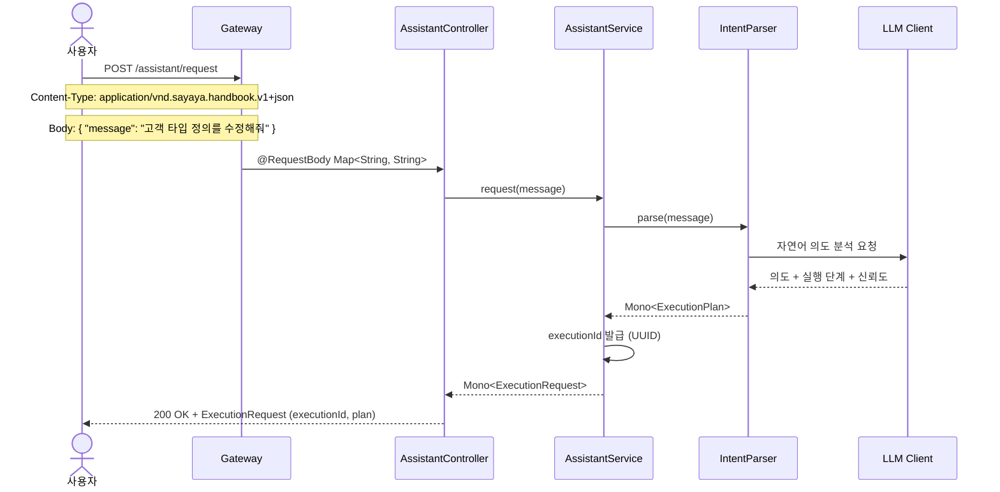

| 항목 | 내용 |
|------|------|
| **액터** | 사용자 |
| **선행조건** | 인증된 세션 |
| **정상 흐름** | 1. 사용자가 `POST /assistant/request`로 자연어 메시지를 전송한다. 2. `IntentParser`가 LLM을 통해 의도를 분석한다. 3. 고유한 `executionId`(UUID)가 발급되고, 의도, 실행 단계(group 포함), 신뢰도를 포함한 `ExecutionRequest(executionId, plan)`이 반환된다. |
| **대안 흐름** | LLM 응답 실패 시 500 Internal Server Error 반환. |

---

## UC-A2: 실행 계획 생성

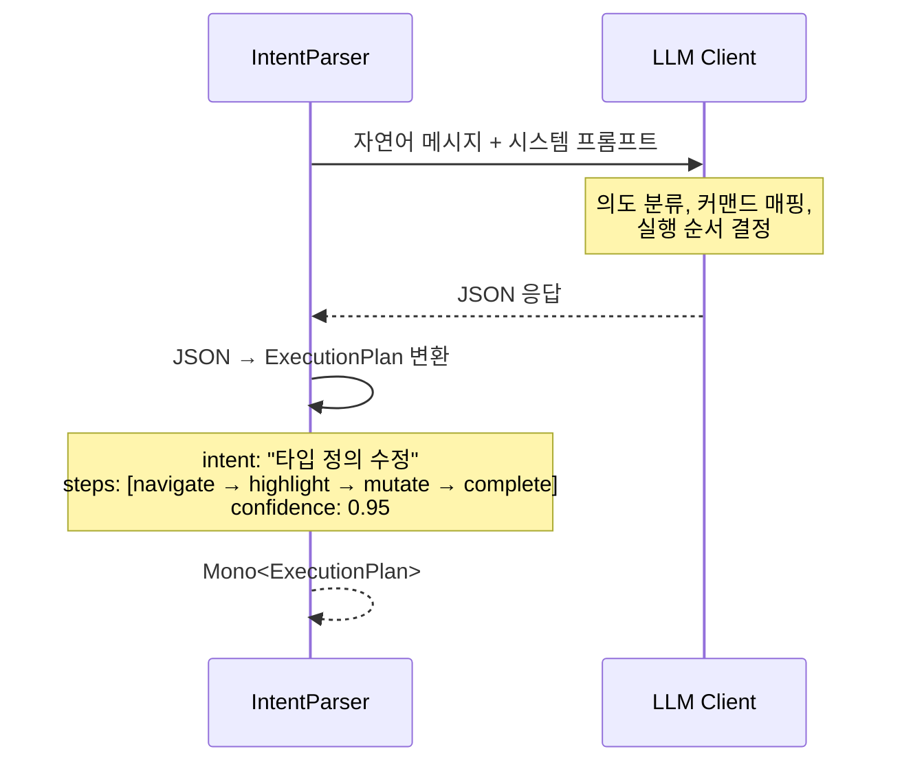

| 항목 | 내용 |
|------|------|
| **액터** | 시스템 (IntentParser 내부) |
| **선행조건** | 사용자 메시지 수신 |
| **정상 흐름** | 1. LLM에 자연어 메시지와 시스템 프롬프트를 전송한다. 2. LLM이 의도를 분류하고, CommandType에 매핑된 실행 단계를 생성한다. 3. JSON 응답을 `ExecutionPlan`으로 변환하여 반환한다. |
| **대안 흐름** | 신뢰도가 낮은 경우(< 0.5), `AWAIT_CONFIRM` 커맨드를 포함하여 사용자 확인을 요청한다. |

---

## UC-A3: 명령 실행 (병렬 그룹 기반 Kafka 이벤트 브로드캐스트)

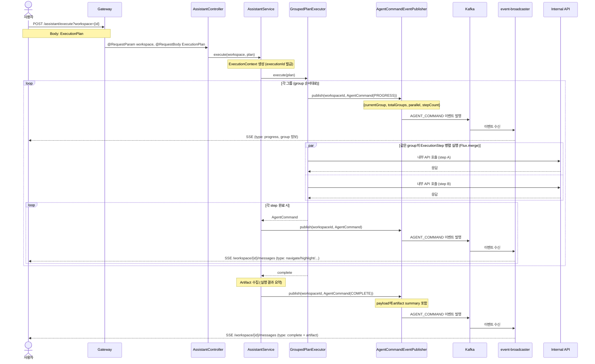

| 항목 | 내용 |
|------|------|
| **액터** | 사용자 |
| **선행조건** | 유효한 ExecutionPlan 보유 |
| **정상 흐름** | 1. 사용자가 `POST /assistant/execute?workspace={id}`로 실행 계획을 전송한다. 2. `AssistantService`가 `ExecutionContext`를 생성하고 고유한 `executionId`를 발급한다. 응답으로 `ExecutionRequest(executionId, plan)`이 반환된다. 3. `GroupedPlanExecutor`가 `ExecutionStep.group` 필드를 기준으로 단계를 그룹화한다. 같은 group 값을 가진 단계들은 `Flux.merge`로 병렬 실행되고, 그룹 간에는 순차 실행된다. 4. 각 그룹 실행 전 `PROGRESS` 커맨드를 발행하여 진행 상황(`currentGroup`, `totalGroups`, `parallel`, `stepCount`)을 알린다. 5. 각 단계의 `AgentCommand`가 Kafka AGENT_COMMAND 이벤트로 발행되어 event-broadcaster를 통해 워크스페이스 SSE로 브로드캐스트된다. 각 커맨드의 `description` 필드에 해당 단계의 실행 사유가 기록되어 감사 추적에 활용된다. 6. 모든 그룹 완료 시 실행 결과를 `Artifact`로 수집하고, `COMPLETE` 커맨드에 artifact summary를 포함하여 전송한다. 7. 발행된 모든 AGENT_COMMAND 이벤트는 Kafka 불변 로그로 보존되며, ExecutionPlan(의도 근거 포함)과 함께 시간순 감사 조회가 가능하다. |
| **대안 흐름** | `AWAIT_CONFIRM` 커맨드 발행 시, `AssistantService`가 `Sinks.One<String>`을 생성하여 커맨드 스트림을 일시정지한다. 프론트엔드가 확인 다이얼로그를 표시하고, 사용자 응답을 `POST /assistant/respond?workspace={id}&executionId={eid}`로 전달하면 `respond()` 메서드가 sink에 값을 emit하여 스트림이 재개된다. "cancel" 응답 시 실행이 중단된다. |

---

## UC-A4: 실행 취소

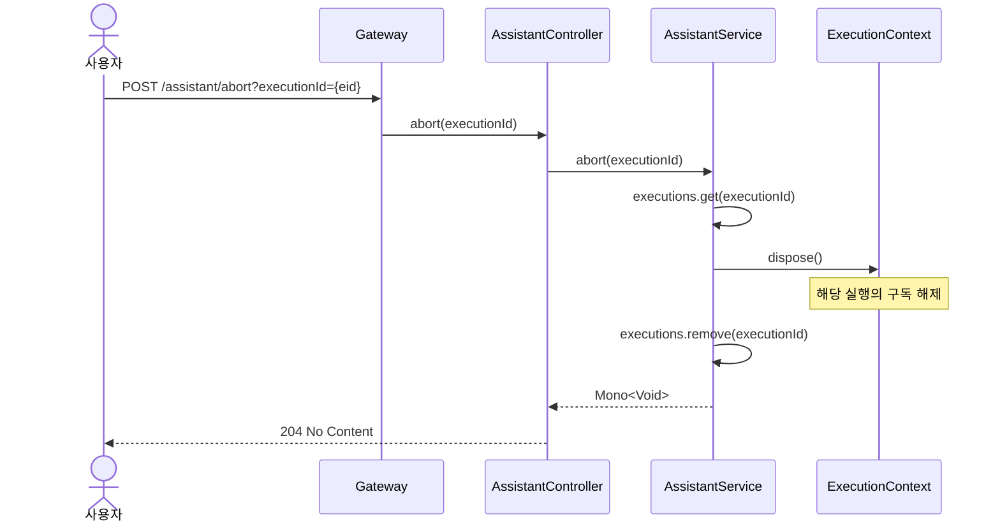

| 항목 | 내용 |
|------|------|
| **액터** | 사용자 |
| **선행조건** | `executionId`에 해당하는 실행이 진행 중 |
| **정상 흐름** | 1. 사용자가 `POST /assistant/abort?executionId={eid}`를 호출한다. 2. `AssistantService`가 `ConcurrentHashMap<UUID, ExecutionContext>`에서 해당 실행을 조회한다. 3. `ExecutionContext`의 구독을 dispose하고, 맵에서 제거한다. 4. 204 No Content가 반환된다. |
| **대안 흐름** | `executionId`에 해당하는 실행이 없는 경우에도 204 No Content가 반환된다 (멱등). `executionId`를 생략하면 해당 워크스페이스의 모든 실행을 중단한다. |

---

## UC-A5: 데이터 품질 감시

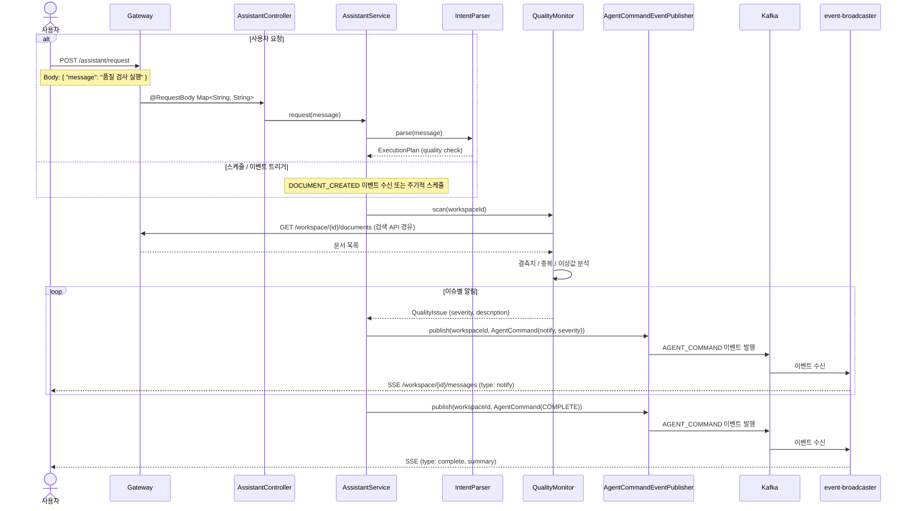

| 항목 | 내용 |
|------|------|
| **액터** | 사용자 또는 시스템 (스케줄/이벤트 트리거) |
| **선행조건** | 워크스페이스에 문서가 1건 이상 존재 |
| **정상 흐름** | 1. 사용자가 자연어로 "품질 검사 실행"을 요청하거나, 스케줄/이벤트 트리거로 감시가 시작된다. 2. `QualityMonitor`가 워크스페이스 내 문서를 스캔하여 결측치, 중복, 이상값을 분석한다. 3. 발견된 이슈를 심각도(info/warning/error)에 따라 `AgentCommand(notify)`로 Kafka에 발행한다. 4. event-broadcaster를 통해 워크스페이스 SSE로 브로드캐스트되어 대시보드 및 클라이언트가 실시간 갱신된다. |
| **대안 흐름** | 이슈가 없는 경우 notify(info: "품질 이상 없음")을 발행하고 COMPLETE로 종료한다. |

---

## UC-A6: 감사 추적 조회

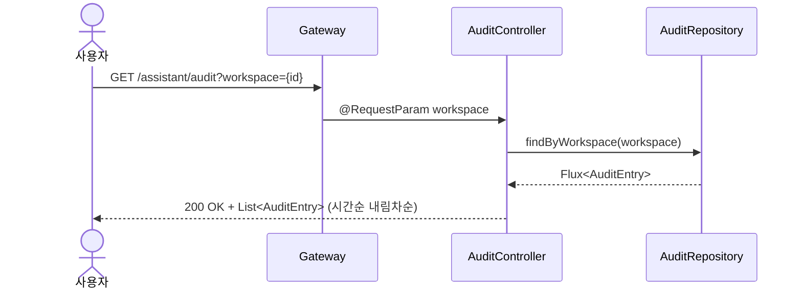

| 항목 | 내용 |
|------|------|
| **액터** | 사용자 |
| **선행조건** | 인증된 세션 |
| **정상 흐름** | 1. 사용자가 `GET /assistant/audit?workspace={id}`로 감사 이력을 조회한다. 2. `AuditRepository`에서 해당 워크스페이스의 `AuditEntry` 목록을 시간순 내림차순으로 반환한다. 3. 각 항목에는 사용자 원본 메시지, 의도, 신뢰도, 실행 계획, 상태(REQUESTED/CONFIRMED/EXECUTING/COMPLETED/ABORTED)가 포함된다. |
| **결과** | 에이전트의 모든 판단 과정과 실행 이력이 시간순으로 조회된다. |

---

## UC-A12: AssistantService 분리 (리팩토링)

| 항목 | 내용 |
|------|------|
| **액터** | 개발자 |
| **선행조건** | AssistantService에서 서브 에이전트 오케스트레이션 로직이 복잡해짐 |
| **정상 흐름** | 1. `SubAgentOrchestrator`를 `AssistantService`에서 추출하여 usecase 계층에 독립 클래스로 분리:   - 서브 에이전트를 group별 순차/병렬 실행   - `SubAgentPlanExecutor`, `ArtifactAggregator`, `AgentCommandEventPublisher` 의존성 주입   - ConcurrentHashMap으로 병렬 그룹 내 Artifact 수집 (스레드 안전) 2. `ExecutionLifecycleManager`, `AuditingService` 분리는 향후 예정. 3. `AssistantService.executeWithSubAgents()`가 `SubAgentOrchestrator.execute()`에 위임한다. |
| **요구사항** | 7.6 코드 품질 — AssistantService 분리 |
| **상태** | ✅ 부분 구현 — SubAgentOrchestrator 추출 완료 |
| **구현 클래스** | `SubAgentOrchestrator` (usecase 계층) |

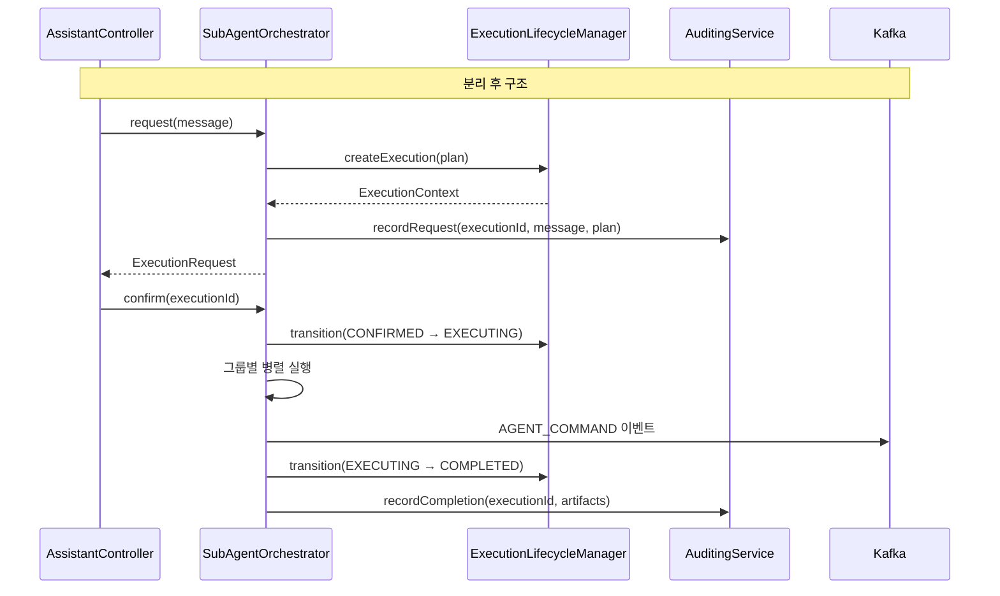

---

## 트레이서빌리티 매트릭스

| UC | 시퀀스 다이어그램 | 주요 클래스 | 테스트 |
|----|---|---|---|
| UC-A1 (자연어 명령 처리) | 자연어 명령 처리 | AssistantController, AssistantService, IntentParser | AssistantServiceTest, AssistantControllerTest |
| UC-A2 (실행 계획 생성) | 실행 계획 생성 | IntentParser, ExecutionPlan, ExecutionStep, AgentCommand | AssistantServiceTest |
| UC-A3 (병렬 그룹 기반 명령 실행) | 병렬 그룹 기반 명령 실행 (Kafka 이벤트) | AssistantController, AssistantService, GroupedPlanExecutor, ExecutionContext, AgentCommandEventPublisher, Artifact | AssistantServiceTest, AssistantControllerTest |
| UC-A4 (실행 취소) | 실행 취소 | AssistantController, AssistantService, ExecutionContext | AssistantServiceTest, AssistantControllerTest |
| UC-A5 (데이터 품질 감시) | 데이터 품질 감시 | QualityMonitorService, QualityMonitor, DefaultQualityMonitor, QualityController, AgentCommandEventPublisher | QualityMonitorServiceTest, QualityControllerTest |
| UC-A6 (감사 추적 조회) | 감사 추적 조회 | AuditController, AuditRepository, InMemoryAuditRepository, AuditEntry | AuditControllerTest, InMemoryAuditRepositoryTest |
| UC-A7 (스케줄 감시) | 스케줄 기반 품질 감시 | ScheduledQualityMonitor, WorkspaceProvider, WebClientWorkspaceProvider, QualityMonitorService, SchedulingConfig | ScheduledQualityMonitorTest |
| UC-A8 (VALIDATION_REQUESTED 검증) | VALIDATION_REQUESTED 이벤트 트리거 검증 | ValidationEventListener, QualityMonitorService, QualityMonitor, AgentCommandEventPublisher | ValidationEventListenerTest |
| UC-A9 (실행 상태 조회) | 실행 상태/진행률 조회 | AssistantController, AssistantService, ExecutionContext | AssistantServiceTest, AssistantControllerTest |
| UC-A10 (아티팩트 조회) | 아티팩트 조회 | AssistantController, AssistantService, AuditRepository, AuditEntry, Artifact | AssistantServiceTest, AssistantControllerTest |
| UC-A11 (서브 에이전트 오케스트레이션) | 서브 에이전트 오케스트레이션 | AssistantService, SubAgentPlanExecutor, DefaultSubAgentPlanExecutor, ArtifactAggregator, DefaultArtifactAggregator, SubAgentDefinition, ExecutionContextManager | DefaultSubAgentPlanExecutorTest, DefaultArtifactAggregatorTest, AssistantServiceTest |
| UC-A12 (AssistantService 분리) | AssistantService 분리 | SubAgentOrchestrator (추출 완료), ExecutionLifecycleManager (예정), AuditingService (예정) | - (부분 구현) |

## UC-A9: 실행 상태 조회

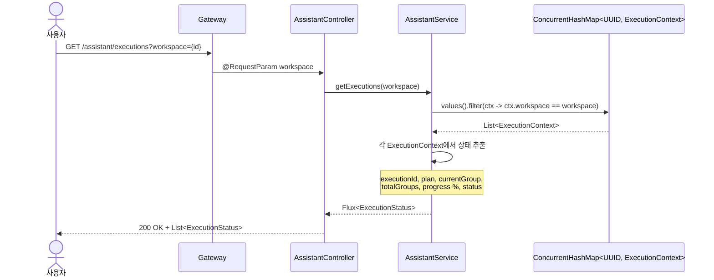

| 항목 | 내용 |
|------|------|
| **액터** | 사용자 |
| **선행조건** | 인증된 세션 |
| **정상 흐름** | 1. 사용자가 `GET /assistant/executions?workspace={id}`로 현재 실행 목록을 조회한다. 2. `AssistantService`가 `ConcurrentHashMap<UUID, ExecutionContext>`에서 해당 워크스페이스의 실행 컨텍스트를 필터링한다. 3. 각 `ExecutionContext`에서 `executionId`, `plan`(실행 계획), `currentGroup`(현재 실행 중인 그룹), `totalGroups`(전체 그룹 수), 진행률(%), `status`(EXECUTING/AWAITING_CONFIRM/COMPLETED/ABORTED)를 추출하여 반환한다. |
| **결과** | 워크스페이스 내 모든 동시 실행의 진행 상태가 조회된다. 완료된 실행은 맵에서 제거되므로 진행 중인 실행만 반환된다. |

---

## UC-A10: 아티팩트 조회

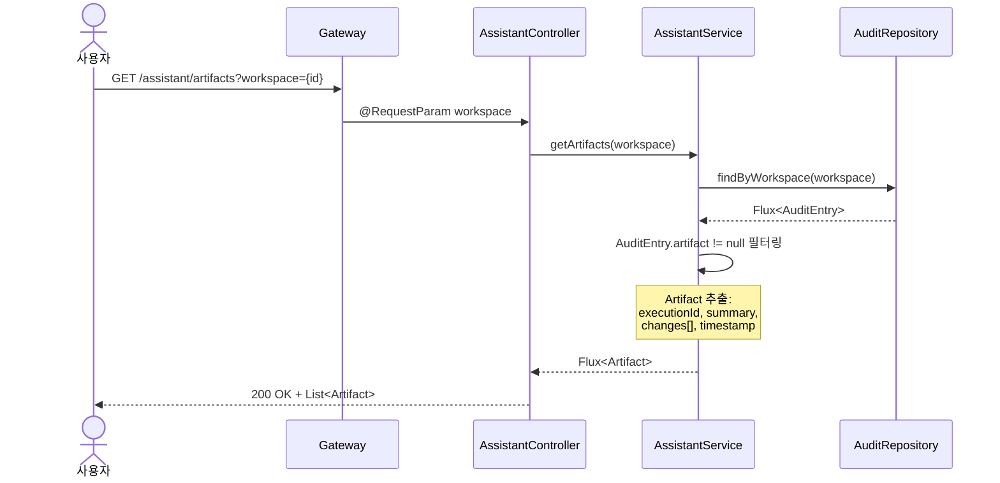

| 항목 | 내용 |
|------|------|
| **액터** | 사용자 |
| **선행조건** | 인증된 세션, 1건 이상의 완료된 실행이 존재 |
| **정상 흐름** | 1. 사용자가 `GET /assistant/artifacts?workspace={id}`로 아티팩트 목록을 조회한다. 2. `AuditRepository`에서 해당 워크스페이스의 `AuditEntry`를 조회하고, `artifact` 필드가 존재하는 항목만 필터링한다. 3. 각 `Artifact`에는 `executionId`, `summary`(실행 결과 요약), `changes`(변경 목록: `{type, target, description}`), `timestamp`가 포함된다. 4. 시간순 내림차순으로 정렬하여 반환한다. |
| **대안 흐름** | 완료된 실행이 없는 경우 빈 목록이 반환된다. |
| **데이터 구조** | `Artifact { executionId: UUID, summary: String, changes: List<ArtifactChange>, timestamp: Instant }` — `ArtifactChange { type: String, target: String, description: String }` |

---

## UC-A7: 스케줄 기반 품질 감시 (계획)

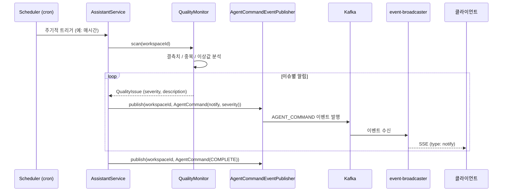

| 항목 | 내용 |
|------|------|
| **액터** | 시스템 (스케줄러) |
| **선행조건** | 워크스페이스에 문서가 1건 이상 존재, 스케줄 설정이 활성화됨 |
| **정상 흐름** | 1. 스케줄러가 설정된 주기(예: 매시간, 매일)에 따라 `QualityMonitor.scan()`을 자동 실행한다. 2. 워크스페이스 내 모든 문서를 스캔하여 결측치, 중복, 이상값을 분석한다. 3. 발견된 이슈를 심각도에 따라 `AgentCommand(notify)`로 Kafka에 발행한다. 4. event-broadcaster를 통해 워크스페이스 SSE로 브로드캐스트되어 온라인 사용자에게 실시간 알림된다. 5. 이슈가 없으면 notify(info: "품질 이상 없음")을 발행하고 COMPLETE로 종료한다. |
| **대안 흐름** | 스케줄 실행 중 오류 발생 시 notify(error)를 발행하고 다음 주기에 재시도한다. |
| **요구사항** | 3.16 데이터 품질 감시 — 에이전트는 주기적(스케줄)으로 감시를 실행 |

---

## UC-A8: VALIDATION_REQUESTED 이벤트 트리거 검증

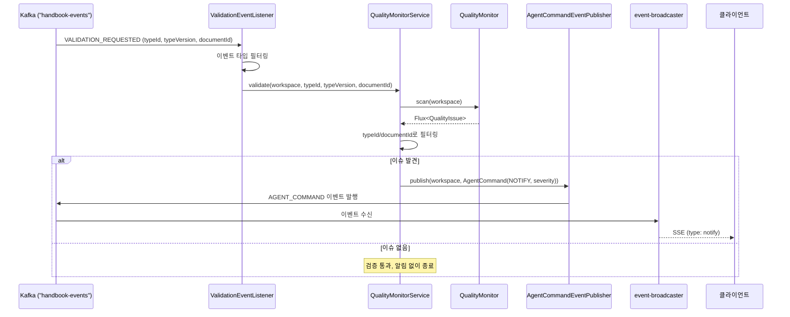

| 항목 | 내용 |
|------|------|
| **액터** | 시스템 (ValidationEventListener) |
| **선행조건** | Kafka 이벤트 스트림 구독 상태, VALIDATION_REQUESTED 이벤트 발행됨 |
| **정상 흐름** | 1. `VALIDATION_REQUESTED` 이벤트가 Kafka를 통해 수신된다. 2. `ValidationEventListener`가 이벤트 타입을 확인하고 `QualityMonitorService.validate()`를 호출한다. 3. 전체 스캔 후 typeId/documentId로 필터링하여 해당 이슈만 추출한다. 4. 이슈가 발견되면 심각도에 따라 `AgentCommand(NOTIFY)`로 Kafka에 발행한다. 5. event-broadcaster를 통해 해당 워크스페이스 멤버에게 실시간 알림된다. |
| **대안 흐름** | 이슈가 없으면 별도 알림 없이 종료한다. 이벤트 처리 실패 시 로그에 기록된다. |
| **요구사항** | 3.16 데이터 품질 감시 — VALIDATION_REQUESTED 이벤트 트리거로 대상 검증 실행 |

---

## UC-A11: 서브 에이전트 오케스트레이션

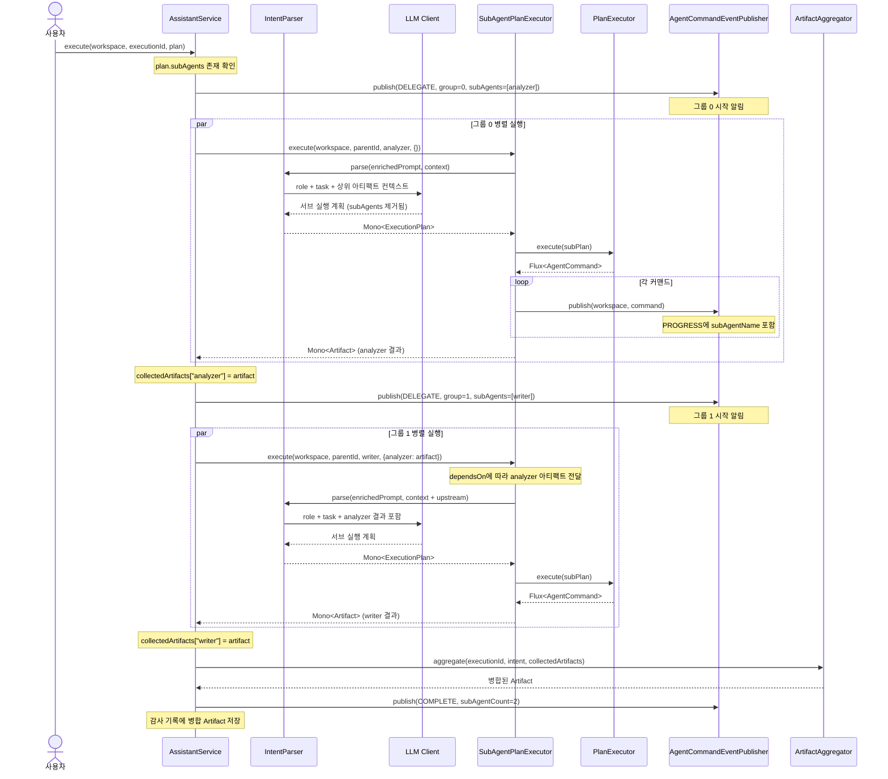

| 항목 | 내용 |
|------|------|
| **액터** | 사용자 |
| **선행조건** | LLM이 생성한 ExecutionPlan에 subAgents가 1개 이상 포함됨 |
| **정상 흐름** | 1. `AssistantService.execute()`가 `plan.subAgents`가 비어 있지 않음을 확인하고 `executeWithSubAgents()`로 분기한다. 2. 서브 에이전트를 `group` 필드 기준으로 그룹화한다. 같은 그룹의 서브 에이전트는 `Flux.merge`로 병렬 실행되고, 그룹 간에는 순차 실행된다. 3. 각 그룹 시작 시 `DELEGATE` 커맨드를 발행하여 진행 상황을 알린다. 4. `SubAgentPlanExecutor`가 각 서브 에이전트를 실행한다: role과 task를 context로 구성하여 `IntentParser.parse()`를 호출하고, 생성된 계획을 `PlanExecutor`로 실행한다. 5. 서브 에이전트가 생성한 ExecutionPlan의 `subAgents` 필드는 무시되어 최대 중첩 깊이 1이 보장된다. 6. `dependsOn`에 명시된 서브 에이전트의 완료된 Artifact가 후속 서브 에이전트에 상위 컨텍스트로 전달된다. 7. 모든 서브 에이전트 완료 후 `ArtifactAggregator`가 결과를 하나의 Artifact로 병합하고, `COMPLETE` 커맨드를 발행한다. 8. 병합된 Artifact가 감사 기록에 저장된다. |
| **대안 흐름** | `subAgentExecutor` 또는 `artifactAggregator`가 null이면 기존 flat 실행 경로로 폴백된다. 서브 에이전트 실행 중 에러 발생 시 전체 실행이 ERROR 상태로 전환된다. |
| **제약 사항** | 서브 에이전트 중첩 깊이는 최대 1이다. 서브 에이전트가 다시 서브 에이전트를 정의하더라도 무시된다. |

---

## 이벤트 흐름: 에이전트 → 워크스페이스 멤버

에이전트 커맨드가 Kafka를 통해 워크스페이스의 모든 멤버에게 전달되는 흐름이다. 에이전트는 다른 도메인 이벤트(DOCUMENT_CREATED, TYPE_CREATED 등)와 동일한 이벤트 채널을 사용하며, "세 번째 협업자"로서 워크스페이스에 참여한다.

**프론트엔드 시각적 실행:** 커맨드는 단순히 데이터로 전달되는 것이 아니라, 프론트엔드에서 시각적 애니메이션으로 실행된다. `navigate`는 화면 전환 애니메이션, `mutate`는 셀이 하나씩 채워지는 효과, `highlight`는 시선 유도 등을 통해 "동료가 내 화면을 대신 조작해주는 느낌"을 제공한다.

**실시간 협업:** 같은 워크스페이스의 모든 참여자(사용자 + 에이전트)가 동일한 SSE 스트림을 구독하므로, 에이전트가 발행한 커맨드가 요청자뿐 아니라 워크스페이스의 모든 멤버에게 동시에 전달된다.

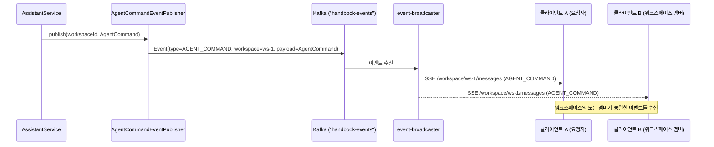

---

## 감사 추적 (Audit Trail)

에이전트의 모든 행동은 사후 추적이 가능하도록 설계된다.

| 항목 | 내용 |
|------|------|
| **의도 근거** | 사용자 원본 메시지(`POST /assistant/request`의 message)와 LLM 해석 결과(ExecutionPlan: intent, steps, confidence)를 함께 보존한다. |
| **커맨드별 사유** | 각 AgentCommand의 `description` 필드에 해당 단계를 실행하는 이유를 기록한다. 예: "고객 타입에 '이메일' 속성 추가를 위해 타입 편집기로 이동". |
| **불변 이벤트 로그** | Kafka에 발행된 AGENT_COMMAND 이벤트는 불변 로그로서, 에이전트가 언제 어떤 커맨드를 발행했는지의 근거가 된다. |
| **실행 계획 보존** | ExecutionPlan 전체를 이벤트와 연계하여 보존함으로써, 에이전트의 판단 과정을 사후에 재현할 수 있다. |
| **아티팩트 보존** | 실행 완료 시 생성되는 `Artifact`(executionId, summary, changes, timestamp)가 `AuditEntry.artifact` 필드에 저장되어, 각 실행의 구체적인 결과를 사후에 조회할 수 있다. |
| **시간순 감사 조회** | Dashboard-UI에서 AGENT_COMMAND 이벤트를 시간순으로 조회하여 에이전트 활동 이력을 감사할 수 있다. |

---

## 참고: AgentCommand 클래스 이중 정의

이 모듈의 `AgentCommand` (`assistant/src/main/kotlin/.../domain/AgentCommand.kt`)는 오케스트레이션 레이어에서 사용하는 **단순화된 Kotlin data class**로, `type`, `target`, `payload` 필드만 가진다. LLM 응답 파싱 및 실행 계획 스트리밍 과정에서 사용된다.

별도로 `agent-protocol` 모듈에도 동일한 이름의 `AgentCommand` (`agent-protocol/src/main/java/.../domain/AgentCommand.java`)가 존재하며, 이는 Jackson `@JsonTypeInfo`/`@JsonSubTypes`를 사용하는 **폴리모픽 커맨드 계층 구조**로, 프론트엔드(agent-ui)에서 소비하기 위한 타입 안전한 JSON 직렬화를 담당한다.

두 클래스는 서로 다른 단계를 담당한다: assistant가 단순화된 `AgentCommand`를 생성하고, 이를 프로토콜 수준의 폴리모픽 `AgentCommand` 서브클래스로 변환하여 프론트엔드에 전달한다.
