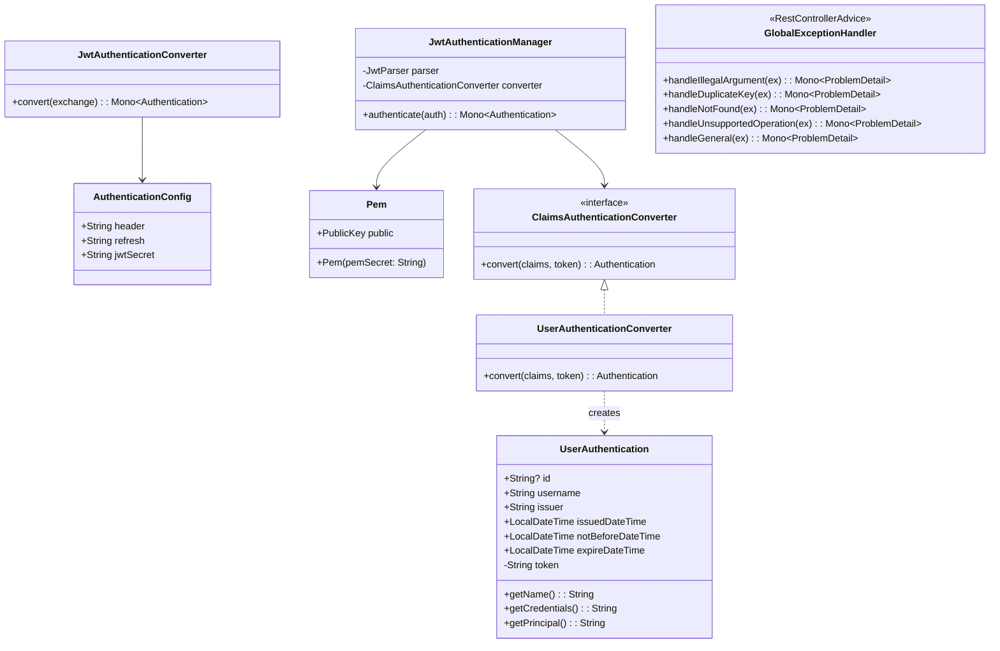

# Authentication 클래스 다이어그램

```mermaid
classDiagram
    class Pem {
        +PublicKey public
        +Pem(pemSecret: String)
    }

    class AuthenticationConfig {
        +String header
        +String refresh
        +String jwtSecret
    }

    class UserAuthentication {
        +String? id
        +String username
        +String issuer
        +LocalDateTime issuedDateTime
        +LocalDateTime notBeforeDateTime
        +LocalDateTime expireDateTime
        -String token
        +getName(): String
        +getCredentials(): String
        +getPrincipal(): String
    }

    class JwtAuthenticationConverter {
        +convert(exchange): Mono~Authentication~
    }

    class JwtAuthenticationManager {
        -JwtParser parser
        -ClaimsAuthenticationConverter converter
        +authenticate(auth): Mono~Authentication~
    }

    class ClaimsAuthenticationConverter {
        <<interface>>
        +convert(claims, token): Authentication
    }

    class UserAuthenticationConverter {
        +convert(claims, token): Authentication
    }

    ClaimsAuthenticationConverter <|.. UserAuthenticationConverter
    class GlobalExceptionHandler {
        <<RestControllerAdvice>>
        +handleIllegalArgument(ex): Mono~ProblemDetail~
        +handleDuplicateKey(ex): Mono~ProblemDetail~
        +handleNotFound(ex): Mono~ProblemDetail~
        +handleUnsupportedOperation(ex): Mono~ProblemDetail~
        +handleGeneral(ex): Mono~ProblemDetail~
    }

    JwtAuthenticationManager --> Pem
    JwtAuthenticationManager --> ClaimsAuthenticationConverter
    UserAuthenticationConverter ..> UserAuthentication : creates
    JwtAuthenticationConverter --> AuthenticationConfig
```
