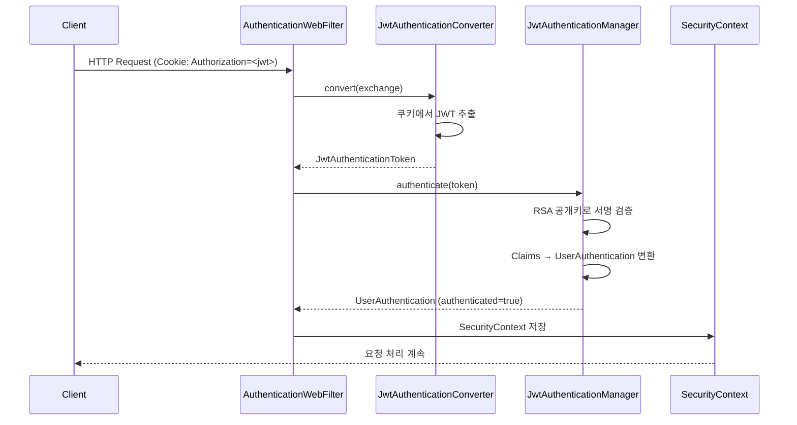

# Authentication 모듈

**에이전트 연동: 없음 (내부 전용).**

JWT 기반 인증·인가 라이브러리. 쿠키에서 JWT를 추출하고, RSA 공개키로 서명을 검증하여
Spring Security Authentication 객체로 변환한다.

다른 서비스 모듈에서 의존성으로 추가하면 Spring Boot Auto-Configuration으로 자동 설정된다.

## 아키텍처

```
domain/                          # 순수 도메인 (프레임워크 의존성 없음)
└── Pem.kt                      # PEM 키 파싱 (문자열 → RSA PublicKey)

interfaces/authentication/       # 인프라 어댑터 (Spring Security 의존)
├── AuthenticationAutoConfig.kt  # Spring Boot 자동 설정 + SecurityFilterChain
├── AuthenticationConfig.kt      # 인증 설정 (header, refresh, jwtSecret)
├── UserAuthentication.kt        # Spring Security Authentication 구현체
├── JwtAuthenticationConverter.kt    # 쿠키 → JWT 토큰 추출
├── JwtAuthenticationManager.kt      # JWT 파싱 + 서명 검증 → UserAuthentication
├── UserAuthenticationConverter.kt   # JWT Claims → UserAuthentication 변환
├── ClaimsAuthenticationConverter.kt # Claims 변환 전략 인터페이스
├── NoWwwAuthenticateEntryPoint.kt   # 401 응답 (WWW-Authenticate 헤더 없음)
├── ExpiredTokenExceptionHandler.kt  # 만료 토큰 → 쿠키 삭제 + 401
├── AuthorizationExceptionHandler.kt # 인증 실패 → 401
├── GlobalExceptionHandler.kt        # 전역 예외 처리 (RFC 7807 Problem Detail)
└── SecurityContextUuidAuditorConfig.kt  # R2DBC 감사 (현재 사용자 UUID 추출)
```

## 인증 흐름



## 설정

```yaml
spring:
  security:
    authentication:
      header: Authorization        # JWT 쿠키 이름
      refresh: Refresh             # 리프레시 토큰 쿠키 이름
      jwt-secret: |                # PEM 형식 RSA 공개키
        -----BEGIN PUBLIC KEY-----
        MIIBIjANBgkqhki...
        -----END PUBLIC KEY-----
```

## 주요 설계 결정

- **쿠키 기반 인증**: Authorization 헤더 대신 HTTP 쿠키를 사용하여 브라우저에서 자동 전송
- **Stateless**: CSRF, 세션, 폼 로그인 모두 비활성화
- **만료 토큰 처리**: 토큰 만료 시 쿠키를 자동 삭제하여 클라이언트 상태 정리
- **R2DBC 감사 통합**: SecurityContext에서 UUID를 추출하여 @CreatedBy/@LastModifiedBy 자동 기록

## 전역 예외 처리 (GlobalExceptionHandler)

`@RestControllerAdvice`로 모든 컨트롤러의 공통 예외를 RFC 7807 Problem Detail 형식으로 일관 처리한다.

| 예외 | HTTP 상태 |
|------|----------|
| `IllegalArgumentException` | 400 Bad Request |
| `DuplicateKeyException` | 409 Conflict |
| `NoSuchElementException` | 404 Not Found |
| `UnsupportedOperationException` | 405 Method Not Allowed |
| `Exception` (기타) | 500 Internal Server Error |

## 보안 기본값

- `/actuator/health/**`, `/actuator/info`: 인증 없이 접근 허용
- `/actuator/**` (그 외): 인증 필수
- 그 외 모든 경로: 인증 필수
- X-Frame-Options: SAMEORIGIN
- Content-Security-Policy: `default-src 'self'; script-src 'self' 'unsafe-eval'; style-src 'self' 'unsafe-inline'`
- Content-Type-Options: nosniff
- HSTS: 활성화
- `@EnableReactiveMethodSecurity`로 `@PreAuthorize` 사용 가능

## 테스트

```bash
./gradlew :authentication:test
./gradlew :authentication:koverVerify  # 커버리지 80% 이상 필수
```
