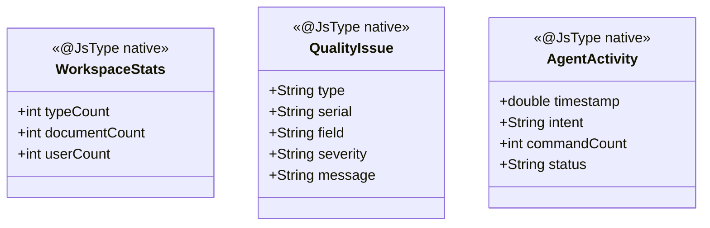
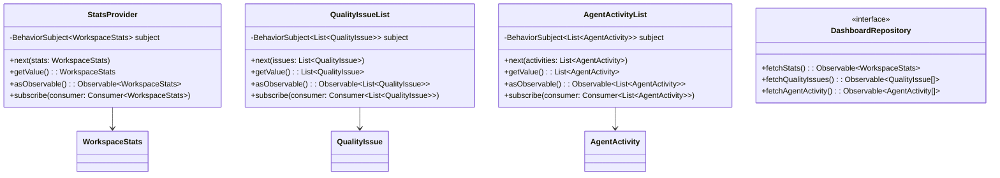
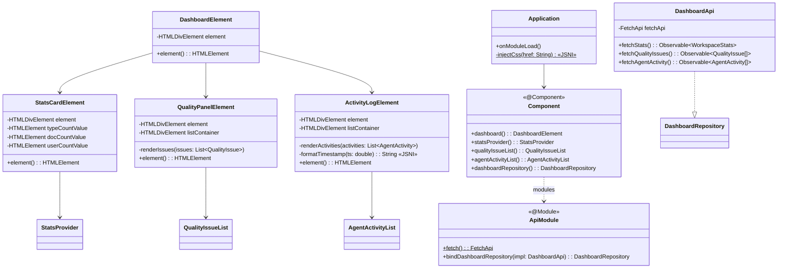

# Dashboard-UI 클래스 다이어그램

## Domain 계층

## Usecase 계층

## Interfaces 계층

## 설계 패턴

| 패턴 | 적용 위치 | 설명 |
|------|----------|------|
| **Port & Adapter** | DashboardRepository / DashboardApi | usecase의 포트 인터페이스를 interfaces에서 FetchApi로 구현 |
| **BehaviorSubject 상태 관리** | StatsProvider, QualityIssueList, AgentActivityList | 최신 값 보존 + 새 구독자에게 즉시 전달 |
| **Composite** | DashboardElement | StatsCardElement, QualityPanelElement, ActivityLogElement를 조합 |
