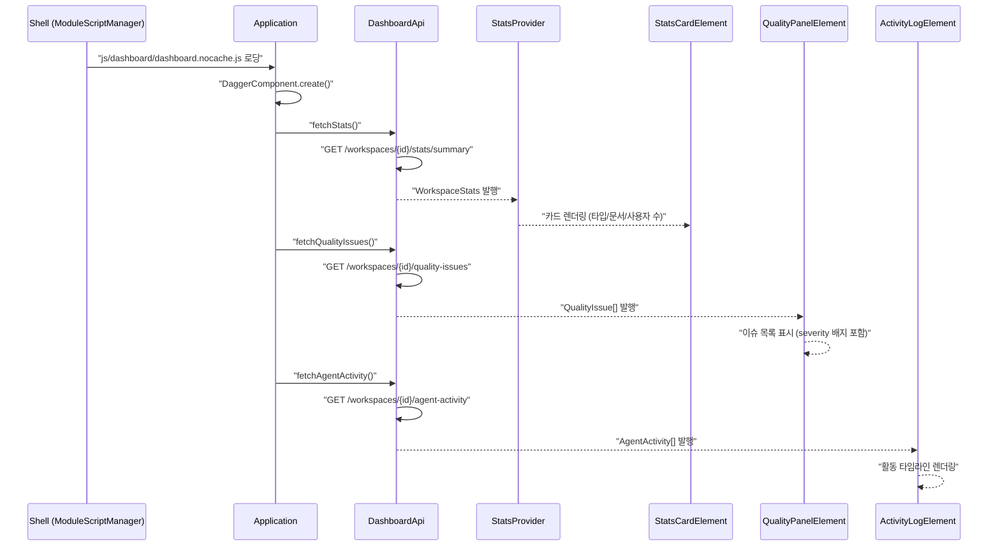
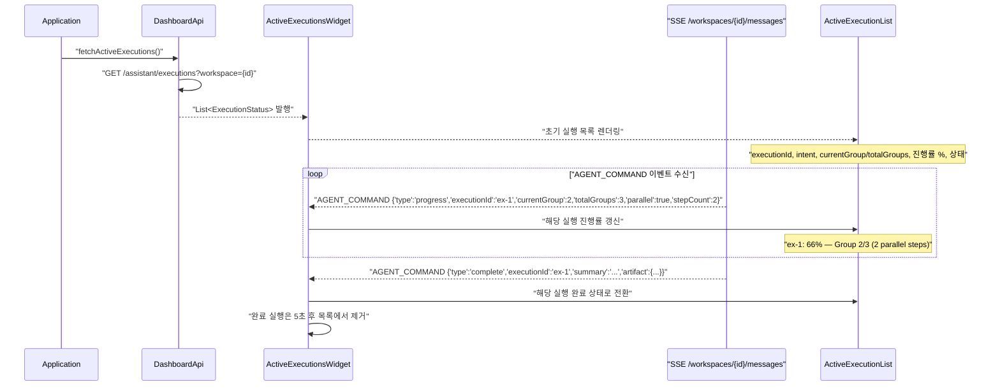
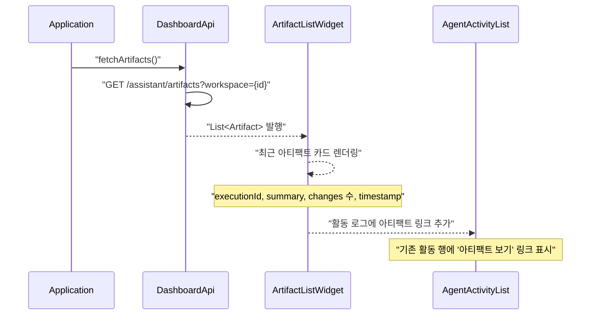

# Dashboard-UI 유스케이스

## 초기 로딩 시퀀스

## 실시간 에이전트 실행 상태 위젯 시퀀스

## 아티팩트 목록 위젯 시퀀스

---

## UC-DB1: 통계 조회

| 항목 | 내용 |
|------|------|
| **액터** | 사용자 |
| **선행조건** | 워크스페이스 선택 완료, Shell이 dashboard-ui 모듈을 로딩 |
| **정상 흐름** | 1. Shell이 `js/dashboard/dashboard.nocache.js`를 동적 로딩한다. 2. `DashboardApi.fetchStats()`로 워크스페이스 통계를 조회한다. 3. `StatsProvider`에 통계가 발행되고 `StatsCardElement`가 타입 수, 문서 수, 사용자 수를 MD3 Card로 표시한다. |

## UC-DB2: 품질 현황 조회

| 항목 | 내용 |
|------|------|
| **액터** | 사용자 |
| **정상 흐름** | 1. `DashboardApi.fetchQualityIssues()`로 워크스페이스 내 데이터 품질 이슈를 조회한다. 2. `QualityPanelElement`가 이슈 목록을 중요도(Error/Warning)별 배지와 함께 표시한다. |

## UC-DB3: 에이전트 활동 타임라인

| 항목 | 내용 |
|------|------|
| **액터** | 사용자 |
| **정상 흐름** | 1. `DashboardApi.fetchAgentActivity()`로 에이전트 활동 이력을 조회한다. 2. `ActivityLogElement`가 시간순 타임라인으로 활동 내역을 표시한다. |

## UC-DB4: 실시간 에이전트 실행 상태 조회

| 항목 | 내용 |
|------|------|
| **액터** | 사용자 |
| **선행조건** | 대시보드 로딩 완료, 워크스페이스 SSE 연결 상태 |
| **정상 흐름** | 1. `DashboardApi.fetchActiveExecutions()`로 현재 진행 중인 에이전트 실행 목록을 조회한다 (GET /assistant/executions?workspace={id}). 2. `ActiveExecutionsWidget`이 각 실행의 executionId, 의도(intent), 현재 그룹/전체 그룹, 병렬 여부, 진행률(%)을 MD3 Card로 표시한다. 3. 워크스페이스 SSE에서 AGENT_COMMAND `type:"progress"` 이벤트를 수신하여 해당 실행의 진행률을 실시간 갱신한다. 4. `type:"complete"` 수신 시 해당 실행을 완료 상태로 전환하고, 5초 후 목록에서 제거한다. |
| **대안 흐름** | 진행 중인 실행이 없는 경우 "활성 에이전트 실행 없음" 메시지를 표시한다. |
| **특이사항** | 초기 데이터는 REST API로 조회하고, 이후 SSE 이벤트로 실시간 갱신하는 하이브리드 방식이다. |

## UC-DB5: 에이전트 아티팩트 목록 조회

| 항목 | 내용 |
|------|------|
| **액터** | 사용자 |
| **선행조건** | 대시보드 로딩 완료, 1건 이상의 완료된 에이전트 실행이 존재 |
| **정상 흐름** | 1. `DashboardApi.fetchArtifacts()`로 아티팩트 목록을 조회한다 (GET /assistant/artifacts?workspace={id}). 2. `ArtifactListWidget`이 최근 아티팩트를 카드 형태로 표시한다. 각 카드에 executionId, summary(실행 결과 요약), changes 수, timestamp가 포함된다. 3. 기존 `AgentActivityList`의 활동 행에 아티팩트가 있는 경우 "아티팩트 보기" 링크를 추가한다. 4. 링크 클릭 시 해당 아티팩트의 상세 변경 목록(type/target/description)을 펼쳐 표시한다. |
| **대안 흐름** | 아티팩트가 없는 경우 "에이전트 아티팩트 없음" 메시지를 표시한다. |

## UC-DB6: 감사 로그 타임라인

| 항목 | 내용 |
|------|------|
| **액터** | 사용자 |
| **선행조건** | 대시보드 로딩 완료, 워크스페이스 접근 권한 보유 |
| **정상 흐름** | 1. 대시보드에서 감사 로그 패널을 표시한다. 2. 사용자 변경 이력과 에이전트 활동 이력을 통합 타임라인으로 표시한다 (누가, 언제, 무엇을 변경했는지). 3. 기간, 사용자, 이벤트 타입으로 필터링할 수 있다. |
| **요구사항** | 6.9 감사 로그 UI |
| **상태** | 구현 완료 (AuditLogWidget) |

---

## 트레이서빌리티 매트릭스

| UC | 시퀀스 다이어그램 | 주요 클래스 | 테스트 |
|----|---|---|---|
| UC-DB1 (통계 조회) | 초기 로딩 | Application, DashboardApi, StatsProvider, StatsCardElement | DashboardStatsTest: 통계 카드 3개 렌더링, 값(12/1245/8) 검증, 라벨 존재 및 비어있지 않음 검증 |
| UC-DB2 (품질 현황) | 초기 로딩 | DashboardApi, QualityIssueList, QualityPanelElement | DashboardQualityTest: 품질 패널/헤더/리스트 존재, 이슈 2건, severity 배지(error/warning), 메시지에 타입/시리얼 포함, CSS 클래스 검증 |
| UC-DB3 (에이전트 활동) | 초기 로딩 | DashboardApi, AgentActivityList, ActivityLogElement | DashboardActivityTest: 활동 패널/헤더/리스트 존재, 활동 2건, 타임스탬프 HH:MM 형식, 상태 COMPLETE, 의도에 커맨드 수 포함, CSS 클래스 검증 |
| UC-DB4 (실행 상태) | 실시간 실행 상태 위젯 | DashboardApi, ActiveExecutionsWidget, ActiveExecutionList, SSE AGENT_COMMAND | DashboardAgentWidgetsTest: 활성 실행 위젯/헤더/리스트 존재, 실행 2건, 의도 텍스트, 진행률 바/fill/텍스트(슬래시 형식), 상태 RUNNING 검증 |
| UC-DB5 (아티팩트) | 아티팩트 목록 위젯 | DashboardApi, ArtifactListWidget, AgentActivityList | DashboardAgentWidgetsTest: 아티팩트 위젯/헤더/아이템 존재, 2건, 요약 텍스트, 변경 수(2), 시간, 상세 초기 숨김, 클릭 → 펼침/접기 토글, 변경 라인 존재 검증 |
| UC-DB6 (감사 로그) | — | AuditLogWidget, AgentActivityList, DashboardApi, LabelProvider | ❌ 테스트 미작성 (AuditLogWidget 구현 완료) |
| UC-DB7 (빈 상태 UI) | — | EmptyStateElement, StatsCardElement, QualityPanelElement | ❌ 미구현 (계획) |
| UC-DB8 (성공 피드백) | — | ToastContainer | ❌ 미구현 (계획) |
