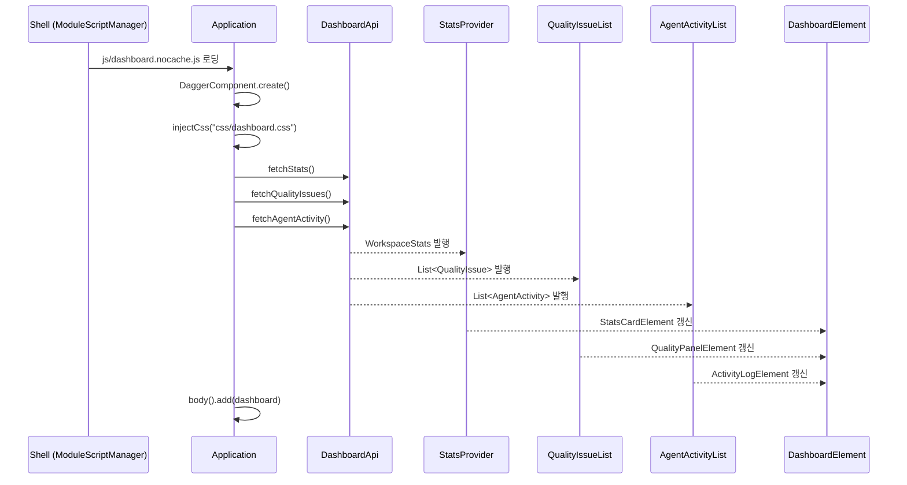

# Dashboard-UI 유스케이스

## 초기 로딩 시퀀스

---

## UC-DB1: 워크스페이스 통계 조회

| 항목 | 내용 |
|------|------|
| **액터** | 사용자 |
| **선행조건** | 워크스페이스 선택 완료, Shell이 dashboard-ui 모듈을 로딩 |
| **정상 흐름** | 1. Shell이 `js/dashboard.nocache.js`를 동적 로딩한다. 2. `DashboardApi.fetchStats()`로 워크스페이스 통계를 조회한다. 3. `StatsProvider`에 통계가 발행되고 `StatsCardElement`가 타입 수, 문서 수, 사용자 수를 MD3 Card로 표시한다. |
| **결과** | 3개의 통계 카드(타입 수, 문서 수, 사용자 수)가 대시보드 상단에 표시된다. |

## UC-DB2: 품질 현황 조회

| 항목 | 내용 |
|------|------|
| **액터** | 사용자 |
| **선행조건** | 대시보드 로딩 완료 |
| **정상 흐름** | 1. `DashboardApi.fetchQualityIssues()`로 품질 이슈 목록을 조회한다. 2. `QualityIssueList`에 이슈가 발행되고 `QualityPanelElement`가 이슈를 심각도 배지와 함께 목록으로 표시한다. 3. 각 행은 `[타입 시리얼] 필드: 메시지` 형식으로 표시된다. |
| **대안 흐름** | 이슈가 없는 경우 "품질 이슈 없음" 메시지를 표시한다. |

## UC-DB3: 에이전트 활동 로그 조회

| 항목 | 내용 |
|------|------|
| **액터** | 사용자 |
| **선행조건** | 대시보드 로딩 완료 |
| **정상 흐름** | 1. `DashboardApi.fetchAgentActivity()`로 에이전트 활동 목록을 조회한다. 2. `AgentActivityList`에 활동이 발행되고 `ActivityLogElement`가 시간순 타임라인으로 표시한다. 3. 각 행은 `시간 [상태] 의도 (N건)` 형식으로 표시된다. |
| **대안 흐름** | 활동이 없는 경우 "에이전트 활동 없음" 메시지를 표시한다. |

---

## 트레이서빌리티 매트릭스

| UC | 시퀀스 다이어그램 | 주요 클래스 | 테스트 |
|----|---|---|---|
| UC-DB1 (통계 조회) | 초기 로딩 | Application, DashboardApi, StatsProvider, StatsCardElement | DashboardTest: 통계 카드 3개 렌더링, 값 표시 |
| UC-DB2 (품질 현황) | 초기 로딩 | DashboardApi, QualityIssueList, QualityPanelElement | DashboardTest: 품질 패널, severity 배지, 이슈 행 |
| UC-DB3 (에이전트 활동) | 초기 로딩 | DashboardApi, AgentActivityList, ActivityLogElement | DashboardTest: 활동 패널, 시간/상태 표시 |
