# Handbook - 모듈 설계 문서

## 전체 아키텍처

```mermaid
graph TB
    subgraph "Frontend (GWT)"
        App["app<br/>조합 루트 (Entry Point)"]
        ShellUI["shell-ui<br/>애플리케이션 프레임"]
        AgentUI["agent-ui<br/>에이전트 커맨드 UI"]
        TypeUI["type-ui<br/>캔버스 타입 편집기"]
        DocumentUI["document-ui<br/>스프레드시트 문서 편집기"]
        WorkspaceUI["workspace-ui<br/>워크스페이스 관리 (대시보드)"]
        OnboardingUI["onboarding-ui<br/>워크스페이스 생성/참여 (온보딩)"]
        UiComponents["ui-components<br/>범용 UI 컴포넌트"]
        AgentBridge["agent-bridge<br/>모듈 간 브릿지"]
        LoginUI["login-ui<br/>로그인/로그아웃"]
        Activity["activity<br/>공유 도메인 + i18n"]
        DashboardUI["dashboard-ui<br/>워크스페이스 대시보드"]
    end

    subgraph "API Gateway"
        Gateway["gateway<br/>라우팅 · 부하분산"]
    end

    subgraph "Backend Services"
        Login["login<br/>OAuth2 + JWT 발행"]
        PersistWS["workspace-command<br/>워크스페이스 CUD"]
        PersistType["type-command<br/>타입 CUD"]
        PersistDoc["document-command<br/>문서 CUD"]
        SearchType["type-query<br/>타입 조회 (CQRS)"]
        SearchDoc["document-query<br/>문서 조회 (CQRS)"]
        Assistant["assistant<br/>AI 어시스턴트"]
        EventBroadcaster["event-broadcaster<br/>실시간 이벤트"]
    end

    subgraph "Domain (공용 Java 라이브러리)"
        Workspace["workspace<br/>워크스페이스·조직·권한"]
        Schema["schema<br/>타입 시스템"]
        Document["document<br/>문서 생명주기"]
        Event["event<br/>도메인 이벤트"]
    end

    subgraph "Shared Libraries"
        Auth["authentication<br/>JWT 검증"]
        AgentProtocol["agent-protocol<br/>커맨드 프로토콜"]
    end

    subgraph "Infrastructure"
        Kafka["Kafka"]
        PostgreSQL["PostgreSQL"]
        Elasticsearch["Elasticsearch 9.3.3"]
        LLM["LLM API"]
        K8s["Kubernetes"]
    end

    %% 프론트엔드 모듈 의존성
    App --> ShellUI
    App --> AgentUI
    ShellUI --> Activity
    ShellUI --> Workspace
    AgentUI --> Activity
    AgentUI --> AgentProtocol
    AgentUI --> UiComponents
    TypeUI --> Activity
    TypeUI --> Schema
    TypeUI --> AgentBridge
    TypeUI --> UiComponents
    DocumentUI --> Activity
    DocumentUI --> Document
    DocumentUI --> Schema
    DocumentUI --> AgentBridge
    DocumentUI --> UiComponents
    WorkspaceUI --> Activity
    WorkspaceUI --> Workspace
    WorkspaceUI --> AgentBridge
    WorkspaceUI --> UiComponents
    OnboardingUI --> Activity
    OnboardingUI --> Workspace
    OnboardingUI --> AgentBridge
    OnboardingUI --> UiComponents
    LoginUI --> Activity
    LoginUI --> Workspace
    DashboardUI --> Activity
    DashboardUI --> UiComponents

    %% 런타임 브릿지 (Java 레벨 의존성 없음, Window 객체 공유)
    ShellUI -.->|Event| AgentBridge
    AgentUI -.->|Event| AgentBridge
    TypeUI -.->|Event| AgentBridge
    DocumentUI -.->|Event| AgentBridge
    WorkspaceUI -.->|Event| AgentBridge
    OnboardingUI -.->|Event| AgentBridge

    %% 런타임 HTTP 호출 (프론트엔드 → Gateway)
    App -.->|HTTP| Gateway
    LoginUI -.->|HTTP| Gateway

    %% Gateway → 백엔드 라우팅
    Gateway --> Login
    Gateway --> PersistWS
    Gateway --> PersistDoc
    Gateway --> PersistType
    Gateway --> SearchType
    Gateway --> SearchDoc
    Gateway --> Assistant
    Gateway --> EventBroadcaster

    %% 백엔드 라이브러리 의존성
    Gateway --> Activity
    Login --> Auth
    Login --> Workspace
    Login --> PostgreSQL
    PersistWS --> Auth
    PersistWS --> Workspace
    PersistWS --> PostgreSQL
    PersistWS --> Kafka
    Assistant --> Auth
    Assistant --> AgentProtocol
    Assistant --> Event
    Assistant --> LLM
    Assistant --> Kafka
    EventBroadcaster --> Auth
    EventBroadcaster --> Event
    EventBroadcaster --> Kafka
    PersistDoc --> Auth
    PersistDoc --> Document
    PersistDoc --> Event
    PersistDoc --> PostgreSQL
    PersistDoc --> Kafka
    SearchDoc --> Auth
    SearchDoc --> Document
    SearchDoc --> Activity
    SearchDoc --> Elasticsearch
    SearchDoc --> Kafka
    Event --> Document
    Event --> Schema
```

## 모듈별 설계

### 1. 도메인 모듈

**역할:** 관심사별로 분리된 도메인 모듈. 백엔드(JVM)와 프론트엔드(GWT)가 동일한 **Java 소스**를 공유하여 정합성을 보장한다.

| 모듈 | 주요 클래스 | 역할 |
|------|------------|------|
| **workspace** | Workspace, User, Group, Permission, Role, AuditLog | 워크스페이스·조직·권한 관리 |
| **schema** | Type, Attribute, AttributeType, Validator, Compliance | 타입 시스템 및 검증 규칙 정의 |
| **document** | DocumentValue, TypeInfo, AttributeInfo | 문서 데이터 모델 및 상태 관리 |
| **event** | Event, DocumentEvent, TypeEvent, ValidationEvent | 시스템 전반의 도메인 이벤트 |

**핵심 아키텍처 원칙 (Shared Domain):**
1.  **캡슐화된 네이티브 모델**: 모든 공용 모델은 `isNative = true` 설정을 가지며, 필드는 `private`으로 보호하고 Lombok 게터를 통해 접근한다.
2.  **제로 카피(Zero-copy)**: 서버 응답 JSON을 프론트엔드에서 변환 없이 즉시 도메인 객체로 캐스팅하여 사용한다.
3.  **DIP 준수**: UI 모듈은 도메인의 인터페이스(Port)에 의존하고, 실제 구현체는 런타임에 주입받는다.

---

## 5. 신규 엔지니어링 표준 (2026-04-28 반영)

### 5.1 공용 도메인 모델 (Shared Domain) 전략
- **SSOT(Single Source of Truth)**: 백엔드(JVM)와 프론트엔드(GWT)는 하나의 Java 소스를 공유한다.
- **캡슐화된 네이티브 모델**: 
    - `@JsType(isNative = true)` 사용.
    - 필드는 `private`으로 캡슐화하고 `@JsProperty`로 노출.
    - 자바 측 접근은 `@Getter(onMethod_ = {@JsOverlay, @JsIgnore})`를 사용하여 플루언트 API(`id()`)를 제공.
- **제로 카피(Zero-copy)**: 데이터 변환 없이 JSON을 직접 도메인 객체로 캐스팅하여 사용한다.

### 5.2 Dagger DI 및 상태 관리 표준
- **Store 기반 상태 관리**: `BehaviorSubject`를 전용 `Store` 클래스로 캡슐화한다.
- **인터페이스 기반 주입**: 컴포넌트에는 구체 Store가 아닌 `Observable`(읽기) 및 `Observer`(쓰기) 인터페이스를 주입한다.
- **Composition Root**: 모든 컨테이너 생성은 EntryPoint에서만 수행한다.
