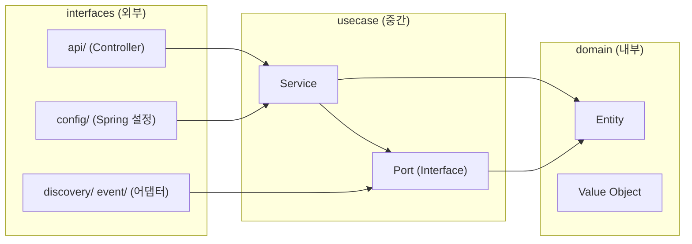
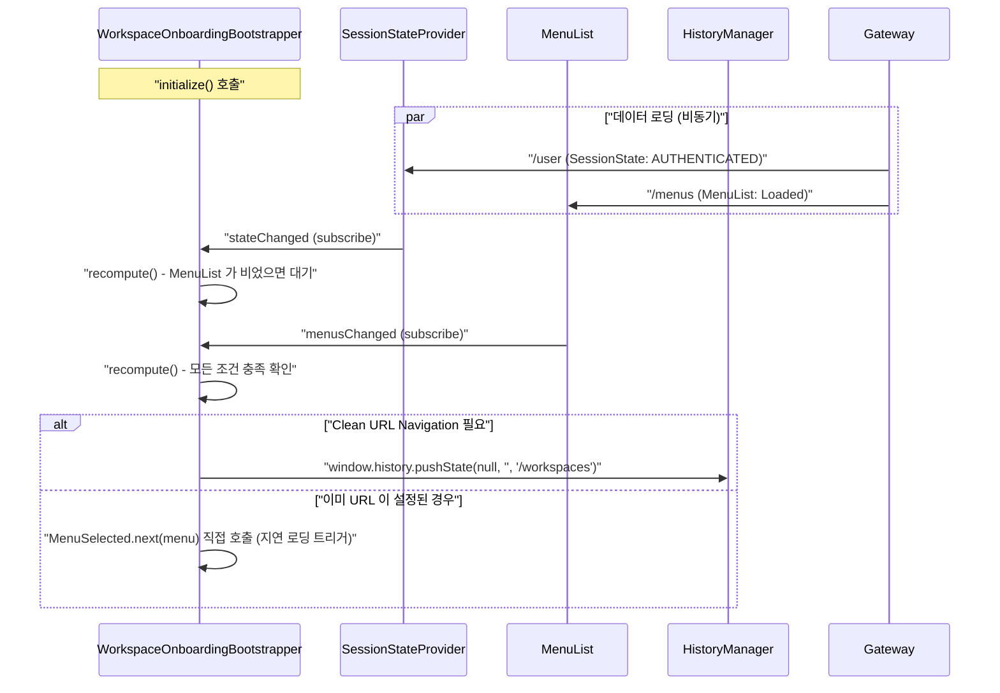

# Handbook - 모듈 설계 문서

## 전체 아키텍처

```mermaid
graph TB
    subgraph "Frontend (GWT)"
        App["app<br/>조합 루트 (Entry Point)"]
        ShellUI["shell-ui<br/>애플리케이션 프레임"]
        AgentUI["agent-ui<br/>에이전트 커맨드 UI"]
        TypeUI["type-ui<br/>캔버스 타입 편집기"]
        DocumentUI["document-ui<br/>스프레드시트 문서 편집기"]
        WorkspaceUI["workspace-ui<br/>워크스페이스 관리 (대시보드)"]
        OnboardingUI["onboarding-ui<br/>워크스페이스 생성/참여 (온보딩)"]
        UiComponents["ui-components<br/>범용 UI 컴포넌트"]
        AgentBridge["agent-bridge<br/>모듈 간 브릿지"]
        LoginUI["login-ui<br/>로그인/로그아웃"]
        Activity["activity<br/>공유 도메인 + i18n"]
        DashboardUI["dashboard-ui<br/>워크스페이스 대시보드"]
        WorkspaceDomain["workspace-domain<br/>GWT 워크스페이스 도메인"]
        SchemaDomain["schema-domain<br/>GWT 타입 도메인"]
        DocumentDomain["document-domain<br/>GWT 문서 도메인"]
    end

    subgraph "API Gateway"
        Gateway["gateway<br/>라우팅 · 부하분산"]
    end

    subgraph "Backend Services"
        Login["login<br/>OAuth2 + JWT 발행"]
        PersistWS["workspace-command<br/>워크스페이스 CUD"]
        PersistType["type-command<br/>타입 CUD"]
        PersistDoc["document-command<br/>문서 CUD"]
        SearchType["type-query<br/>타입 조회 (CQRS)"]
        SearchDoc["document-query<br/>문서 조회 (CQRS)"]
        Assistant["assistant<br/>AI 어시스턴트"]
        EventBroadcaster["event-broadcaster<br/>실시간 이벤트"]
    end

    subgraph "Domain (관심사별 분리)"
        Workspace["workspace<br/>워크스페이스·조직·권한"]
        Schema["schema<br/>타입 시스템"]
        Document["document<br/>문서 생명주기"]
        Event["event<br/>도메인 이벤트"]
    end

    subgraph "Shared Libraries"
        Auth["authentication<br/>JWT 검증"]
        AgentProtocol["agent-protocol<br/>커맨드 프로토콜"]
    end

    subgraph "Infrastructure"
        Kafka["Kafka"]
        PostgreSQL["PostgreSQL"]
        Elasticsearch["Elasticsearch 9.3.3"]
        LLM["LLM API"]
        K8s["Kubernetes"]
    end

    %% 프론트엔드 모듈 의존성
    App --> ShellUI
    App --> AgentUI
    ShellUI --> Activity
    ShellUI --> WorkspaceDomain
    AgentUI --> Activity
    AgentUI --> AgentProtocol
    AgentUI --> UiComponents
    TypeUI --> Activity
    TypeUI --> SchemaDomain
    TypeUI --> AgentBridge
    TypeUI --> UiComponents
    DocumentUI --> Activity
    DocumentUI --> DocumentDomain
    DocumentUI --> SchemaDomain
    DocumentUI --> AgentBridge
    DocumentUI --> UiComponents
    WorkspaceUI --> Activity
    WorkspaceUI --> WorkspaceDomain
    WorkspaceUI --> AgentBridge
    WorkspaceUI --> UiComponents
    OnboardingUI --> Activity
    OnboardingUI --> WorkspaceDomain
    OnboardingUI --> AgentBridge
    OnboardingUI --> UiComponents
    LoginUI --> Activity
    LoginUI --> WorkspaceDomain
    DashboardUI --> Activity
    DashboardUI --> UiComponents

    %% 런타임 브릿지 (Java 레벨 의존성 없음, Window 객체 공유)
    ShellUI -.->|Event| AgentBridge
    AgentUI -.->|Event| AgentBridge
    TypeUI -.->|Event| AgentBridge
    DocumentUI -.->|Event| AgentBridge
    WorkspaceUI -.->|Event| AgentBridge
    OnboardingUI -.->|Event| AgentBridge

    %% 런타임 HTTP 호출 (프론트엔드 → Gateway)
    App -.->|HTTP| Gateway
    LoginUI -.->|HTTP| Gateway

    %% Gateway → 백엔드 라우팅
    Gateway --> Login
    Gateway --> PersistWS
    Gateway --> PersistDoc
    Gateway --> PersistType
    Gateway --> SearchType
    Gateway --> SearchDoc
    Gateway --> Assistant
    Gateway --> EventBroadcaster

    %% 백엔드 라이브러리 의존성
    Gateway --> Activity
    Login --> Auth
    Login --> Workspace
    Login --> PostgreSQL
    PersistWS --> Auth
    PersistWS --> Workspace
    PersistWS --> PostgreSQL
    PersistWS --> Kafka
    Assistant --> Auth
    Assistant --> AgentProtocol
    Assistant --> Event
    Assistant --> LLM
    Assistant --> Kafka
    EventBroadcaster --> Auth
    EventBroadcaster --> Event
    EventBroadcaster --> Kafka
    PersistDoc --> Auth
    PersistDoc --> Document
    PersistDoc --> Event
    PersistDoc --> PostgreSQL
    PersistDoc --> Kafka
    SearchDoc --> Auth
    SearchDoc --> Document
    SearchDoc --> Activity
    SearchDoc --> Elasticsearch
    SearchDoc --> Kafka
    Event --> Document
    Event --> Schema
```



> **모든 프론트엔드 요청은 Gateway를 경유한다.** 실선(→)은 컴파일 의존, 점선(-..->)은 런타임 HTTP 호출을 나타낸다. Gateway가 서비스 라우팅과 부하분산을 일원화하여 백엔드 서비스는 비즈니스 로직에만 집중한다. 인증 검증은 각 백엔드 서비스가 authentication 모듈을 통해 자체 수행한다. 각 백엔드 서비스는 독립 배포·스케일링이 가능하며, Assistant처럼 LLM 호출로 지연이 큰 서비스도 별도 인스턴스로 수평 확장할 수 있다.

## 모바일 지원 전략

- **반응형 레이아웃**: 모든 UI 모듈은 최소 360px 뷰포트를 지원한다. MD3 CSS 변수와 flex/grid 레이아웃 사용.
- **Shell**: Navigation Drawer가 모바일에서 오버레이 모드로 동작 (슬라이드 메뉴).
- **Document-UI**: 스프레드시트에서 수평 스크롤 + 고정 컬럼(serial). 좁은 화면에서 카드 뷰 전환 고려.
- **Type-UI**: 캔버스에 핀치 줌, 터치 드래그 지원.
- **Agent-UI**: 입력창 하단 고정 배치, 모바일 키보드 호환.
- **PWA**: 홈 화면 추가, 오프라인 캐싱(Service Worker) 지원.

## 클린 아키텍처 계층 구조

각 모듈은 다음 계층 구조를 따른다. 의존 방향은 안쪽으로만 허용된다.



**규칙:**
- `domain`: 프레임워크 의존성 없음. 순수 비즈니스 규칙과 유효성 검증만 포함
- `usecase`: 프레임워크 의존성 없음 (`@Service`, `@Component` 금지). 비즈니스 로직 조합
- `interfaces`: Spring, Jackson 등 프레임워크 의존 허용. Bean 등록, 어댑터 구현

### Shell-UI 초기화 및 온보딩 시퀀스

워크스페이스가 없는 사용자의 자동 진입 흐름은 여러 비동기 데이터의 결합으로 이루어진다.



## SPA 라우팅 및 클린 URL 지원

`shell-ui`는 해시(#)를 사용하지 않는 **클린 URL(Clean URL)** 내비게이션을 수행한다. 이를 위해 서버(Gateway/Ingress) 측의 지원이 필요하다.

### 1. 클라이언트 사이드 라우팅
- `HistoryManager`: HTML5 History API(`pushState`, `popstate`)를 사용하여 URL을 관리한다.
- `UrlBasedMenuResolver`: 브라우저의 `pathname`을 정규화(origin, port, protocol 제거)하여 메뉴 `urlRegex`와 매칭한다.

### 2. 서버 사이드 지원 (Gateway 스마트 라우팅)
브라우저에서 `/types` 등 UI 경로로 직접 접속 시 SPA 진입점인 `app.html`을 반환하되, 동일 경로의 REST API 호출과는 충돌하지 않도록 **스마트 라우팅(Smart Routing)**을 적용한다.

- **Accept 헤더 기반 분리**: `ui-clean-urls` 라우트는 `Accept` 헤더에 `text/html`이 포함되어 있고, `application/json`이나 벤더 타입(`application/vnd.sayaya...`)이 **포함되지 않은 경우**에만 매칭된다. (Negative Lookahead 정규식 적용)
- **우선순위 제어**: 가장 높은 우선순위(`order: 0`)로 설정하여 API 라우트보다 먼저 평가하되, 헤더 조건 불일치 시 하단의 API 라우트로 자연스럽게 fallthrough 되도록 설계한다.
- **운영 설정 유의사항**: 운영 환경에서는 Helm 차트의 `ConfigMap`이 jar 내부의 `application.yml`을 **파일 단위로 완전히 대체(Overwrite)**한다. 따라서 소스 코드의 설정 변경 시 반드시 `charts/handbook/gateway/templates/configmap.yaml`에도 동일한 내용을 동기화해야 한다.

---

## 모듈별 설계

### 1. 도메인 모듈

**역할:** 관심사별로 분리된 도메인 모듈. 백엔드(Kotlin)와 프론트엔드(GWT) 각각에 대응하는 계층을 가진다.

#### 백엔드 도메인 (Kotlin)
순수 비즈니스 로직과 영속성 모델을 담당한다.

| 모듈 | 클래스 | 역할 |
|------|--------|------|
| **workspace** | Workspace, WorkspaceSimple, User, Group, Permission, Role, AuditLog | 워크스페이스·조직·권한 |
| **schema** | Type, TypeLayout, Attribute, AttributeType, Validator, Compliance | 타입 시스템·검증 규칙 |
| **document** | Document, ValidationTask | 문서 생명주기 |
| **event** | Event, EventType, DocumentEvent, TypeEvent, ValidationEvent, ValidationPayload, AgentCommandEvent | 도메인 이벤트 |

#### 프론트엔드 도메인 (GWT)
백엔드 도메인의 JsInterop 프로젝션 및 클라이언트 측 상태 관리 인터페이스를 담당한다.

| 모듈 | 주요 클래스 | 역할 |
|------|------------|------|
| **workspace-domain** | Workspace, User, Group, WorkspaceApi | GWT 워크스페이스 도메인 및 API 포트 |
| **schema-domain** | TypeValue, AttributeValue, Position, TypeRepository | GWT 타입 스키마 도메인 및 저장소 포트 |
| **document-domain** | DocumentValue, TypeInfo, DocumentRepository | GWT 문서 데이터 도메인 및 저장소 포트 |

**의존 구조:**
```
event → document (DocumentEvent payload)
event → schema (TypeEvent payload)
workspace, schema, document → (독립, 상호 의존 없음)
```

**공통 설계 결정:**

| 결정 | 이유 |
|------|------|
| 엔티티는 ID 기반 equals/hashCode | 비즈니스 식별자로 동등성 판단 |
| 값 객체는 data class 기본 equals | 모든 속성이 동일해야 같은 값 |
| Type은 id+version 복합키 | 불변 이력 모델에서 버전별 고유 식별 |
| Document.id는 nullable | 영속화 전(new) 상태 표현 |
| Document.rev / Type.rev 전파 | DB `@Version` 값을 도메인 → API 응답 → 프론트엔드로 전달하여 패치 기반 낙관적 잠금 지원 |
| sealed interface로 다형성 표현 | 컴파일 타임 안전성 + 패턴 매칭 |
| Event에 UPDATE 타입 없음 | 불변 이력 모델: 변경 = 새 버전 생성 |
| Compliance에 compatible/violations 일관성 검증 | 호환이면 violations 비어야 하고, 비호환이면 사유 필수 |
| 관심사별 모듈 분리 | 백엔드 서비스가 필요한 도메인만 의존. 패키지명으로 도메인 계층 식별 |

---
(이후 내용 유지)
