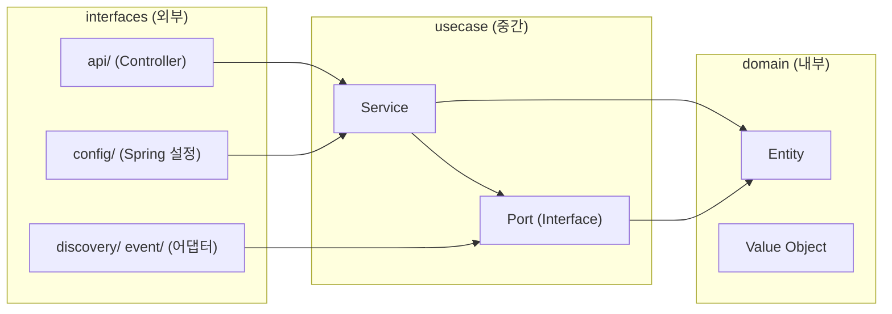
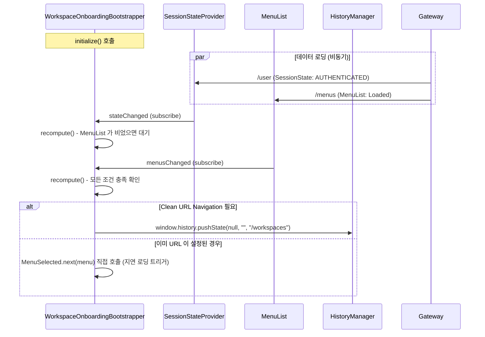
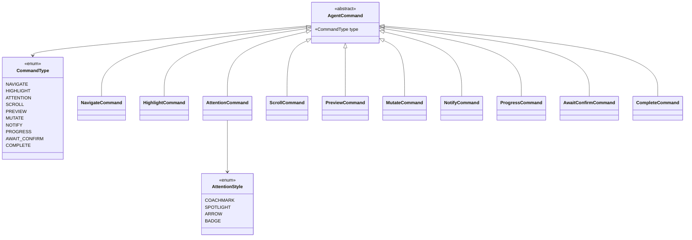
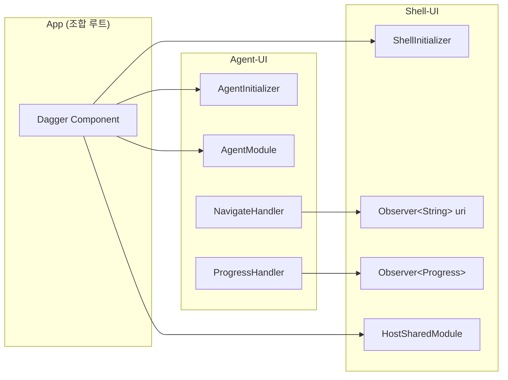
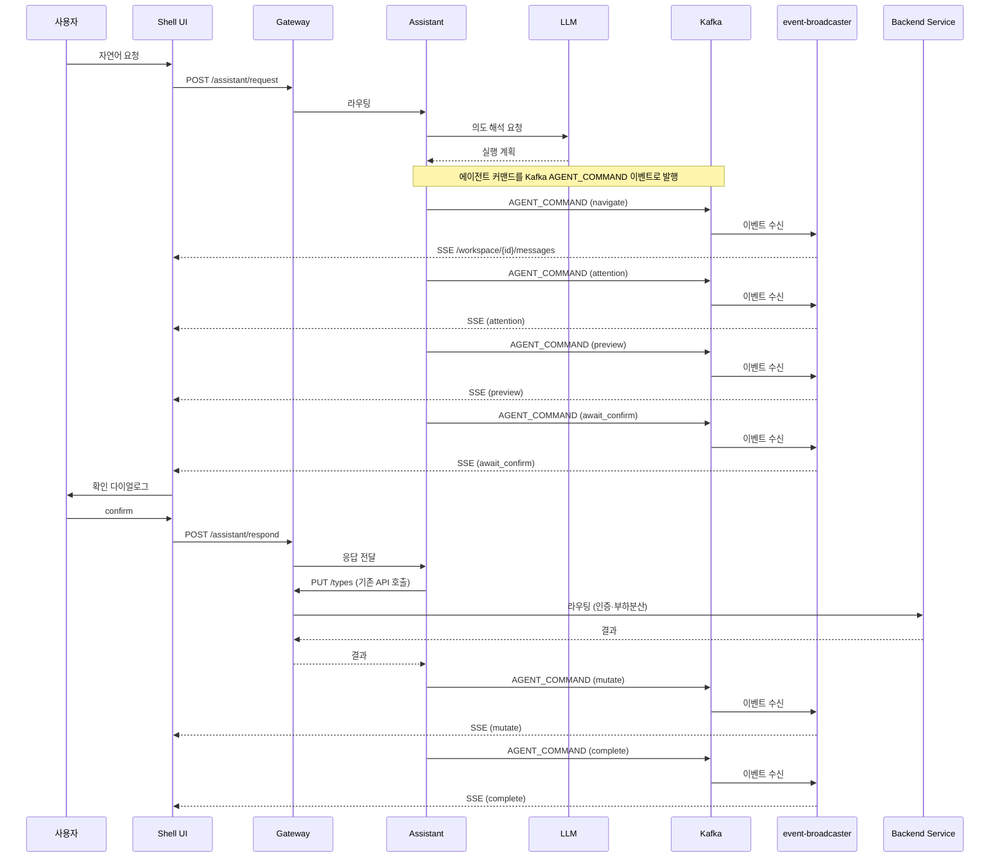
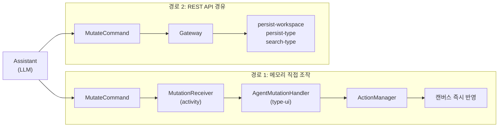
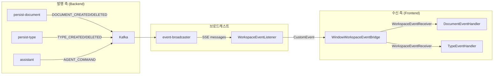
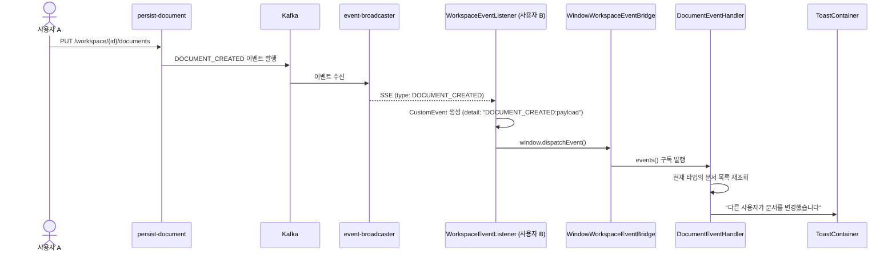

# Handbook - 모듈 설계 문서

## 전체 아키텍처

```mermaid
graph TB
    subgraph "Frontend (GWT)"
        App["app<br/>조합 루트 (Entry Point)"]
        ShellUI["shell-ui<br/>애플리케이션 프레임"]
        AgentUI["agent-ui<br/>에이전트 커맨드 UI"]
        TypeUI["type-ui<br/>캔버스 타입 편집기"]
        DocumentUI["document-ui<br/>스프레드시트 문서 편집기"]
        WorkspaceUI["workspace-ui<br/>워크스페이스 관리"]
        UiComponents["ui-components<br/>범용 UI 컴포넌트"]
        AgentBridge["agent-bridge<br/>모듈 간 브릿지"]
        LoginUI["login-ui<br/>로그인/로그아웃"]
        Activity["activity<br/>공유 도메인 + i18n"]
        DashboardUI["dashboard-ui<br/>워크스페이스 대시보드"]
    end

    subgraph "API Gateway"
        Gateway["gateway<br/>라우팅 · 부하분산"]
    end

    subgraph "Backend Services"
        Login["login<br/>OAuth2 + JWT 발행"]
        PersistWS["persist-workspace<br/>워크스페이스 CUD"]
        PersistType["persist-type<br/>타입 CUD"]
        PersistDoc["persist-document<br/>문서 CUD"]
        SearchType["search-type<br/>타입 조회 (CQRS)"]
        SearchDoc["search-document<br/>문서 조회 (CQRS)"]
        Assistant["assistant<br/>AI 어시스턴트"]
        EventBroadcaster["event-broadcaster<br/>실시간 이벤트"]
    end

    subgraph "Domain (관심사별 분리)"
        Workspace["workspace<br/>워크스페이스·조직·권한"]
        Schema["schema<br/>타입 시스템"]
        Document["document<br/>문서 생명주기"]
        Event["event<br/>도메인 이벤트"]
    end

    subgraph "Shared Libraries"
        Auth["authentication<br/>JWT 검증"]
        AgentProtocol["agent-protocol<br/>커맨드 프로토콜"]
    end

    subgraph "Infrastructure"
        Kafka["Kafka"]
        PostgreSQL["PostgreSQL"]
        Elasticsearch["Elasticsearch 9.3.3"]
        LLM["LLM API"]
        K8s["Kubernetes"]
    end

    %% 프론트엔드 모듈 의존성
    App --> ShellUI
    App --> AgentUI
    ShellUI --> Activity
    AgentUI --> Activity
    AgentUI --> AgentProtocol
    AgentUI --> UiComponents
    TypeUI --> Activity
    TypeUI --> AgentBridge
    TypeUI --> UiComponents
    DocumentUI --> Activity
    DocumentUI --> AgentBridge
    DocumentUI --> UiComponents
    WorkspaceUI --> Activity
    WorkspaceUI --> AgentBridge
    LoginUI --> Activity
    DashboardUI --> Activity
    DashboardUI --> UiComponents

    %% 런타임 HTTP 호출 (프론트엔드 → Gateway)
    App -.->|HTTP| Gateway
    LoginUI -.->|HTTP| Gateway

    %% Gateway → 백엔드 라우팅
    Gateway --> Login
    Gateway --> PersistWS
    Gateway --> PersistDoc
    Gateway --> PersistType
    Gateway --> SearchType
    Gateway --> SearchDoc
    Gateway --> Assistant
    Gateway --> EventBroadcaster

    %% 백엔드 라이브러리 의존성
    Gateway --> Activity
    Login --> Auth
    Login --> Workspace
    Login --> PostgreSQL
    PersistWS --> Auth
    PersistWS --> Workspace
    PersistWS --> PostgreSQL
    PersistWS --> Kafka
    Assistant --> Auth
    Assistant --> AgentProtocol
    Assistant --> Event
    Assistant --> LLM
    Assistant --> Kafka
    EventBroadcaster --> Auth
    EventBroadcaster --> Event
    EventBroadcaster --> Kafka
    PersistDoc --> Auth
    PersistDoc --> Document
    PersistDoc --> Event
    PersistDoc --> PostgreSQL
    PersistDoc --> Kafka
    SearchDoc --> Auth
    SearchDoc --> Document
    SearchDoc --> Activity
    SearchDoc --> Elasticsearch
    SearchDoc --> Kafka
    Event --> Document
    Event --> Schema
```



> **모든 프론트엔드 요청은 Gateway를 경유한다.** 실선(→)은 컴파일 의존, 점선(-..->)은 런타임 HTTP 호출을 나타낸다. Gateway가 서비스 라우팅과 부하분산을 일원화하여 백엔드 서비스는 비즈니스 로직에만 집중한다. 인증 검증은 각 백엔드 서비스가 authentication 모듈을 통해 자체 수행한다. 각 백엔드 서비스는 독립 배포·스케일링이 가능하며, Assistant처럼 LLM 호출로 지연이 큰 서비스도 별도 인스턴스로 수평 확장할 수 있다.

## 모바일 지원 전략

- **반응형 레이아웃**: 모든 UI 모듈은 최소 360px 뷰포트를 지원한다. MD3 CSS 변수와 flex/grid 레이아웃 사용.
- **Shell**: Navigation Drawer가 모바일에서 오버레이 모드로 동작 (슬라이드 메뉴).
- **Document-UI**: 스프레드시트에서 수평 스크롤 + 고정 컬럼(serial). 좁은 화면에서 카드 뷰 전환 고려.
- **Type-UI**: 캔버스에 핀치 줌, 터치 드래그 지원.
- **Agent-UI**: 입력창 하단 고정 배치, 모바일 키보드 호환.
- **PWA**: 홈 화면 추가, 오프라인 캐싱(Service Worker) 지원.

## 클린 아키텍처 계층 구조

각 모듈은 다음 계층 구조를 따른다. 의존 방향은 안쪽으로만 허용된다.



**규칙:**
- `domain`: 프레임워크 의존성 없음. 순수 비즈니스 규칙과 유효성 검증만 포함
- `usecase`: 프레임워크 의존성 없음 (`@Service`, `@Component` 금지). 비즈니스 로직 조합
- `interfaces`: Spring, Jackson 등 프레임워크 의존 허용. Bean 등록, 어댑터 구현

### Shell-UI 초기화 및 온보딩 시퀀스

워크스페이스가 없는 사용자의 자동 진입 흐름은 여러 비동기 데이터의 결합으로 이루어진다.



## SPA 라우팅 및 클린 URL 지원

`shell-ui`는 해시(#)를 사용하지 않는 **클린 URL(Clean URL)** 내비게이션을 수행한다. 이를 위해 서버(Gateway/Ingress) 측의 지원이 필요하다.

### 1. 클라이언트 사이드 라우팅
- `HistoryManager`: HTML5 History API(`pushState`, `popstate`)를 사용하여 URL을 관리한다.
- `UrlBasedMenuResolver`: 브라우저의 `pathname`을 정규화(origin, port, protocol 제거)하여 메뉴 `urlRegex`와 매칭한다.

### 2. 서버 사이드 지원 (Fallback)
브라우저에서 `/workspace/123/types`와 같은 UI 경로로 직접 접속하거나 새로고침할 때, 서버는 해당 경로에 대한 리소스를 찾는 대신 SPA 진입점인 `app.html`을 반환해야 한다.

- **Istio Gateway / Ingress**: API 경로(`/auth/**`, `/workspace/**` 등)가 아닌 요청 중 UI 경로에 해당하는 패턴은 정적 자산 서버의 `app.html`로 rewrite 하거나 포워딩한다.
- **Spring Cloud Gateway**: `MenuSupplier`에서 제공하는 모든 `urlRegex` 패턴에 대해 `app.html`을 결과로 주는 라우트를 동적으로 유지하거나, API 이외의 모든 HTML 요청을 SPA 로 연결하는 Fallback 필터를 적용한다.

---

## 모듈별 설계

### 1. 도메인 모듈 (workspace, schema, document, event)

**역할:** 관심사별로 분리된 4개의 도메인 모듈. 모든 클래스는 `dev.sayaya.handbook.domain` 패키지에 속한다.

| 모듈 | 클래스 | 역할 |
|------|--------|------|
| **workspace** | Workspace, WorkspaceSimple, User, Group, Permission, Role, AuditLog | 워크스페이스·조직·권한 |
| **schema** | Type, TypeLayout, Attribute, AttributeType, Validator, Compliance | 타입 시스템·검증 규칙 |
| **document** | Document, ValidationTask | 문서 생명주기 |
| **event** | Event, EventType, DocumentEvent, TypeEvent, ValidationEvent, ValidationPayload, AgentCommandEvent | 도메인 이벤트 |

**의존 구조:**
```
event → document (DocumentEvent payload)
event → schema (TypeEvent payload)
workspace, schema, document → (독립, 상호 의존 없음)
```

**공통 설계 결정:**

| 결정 | 이유 |
|------|------|
| 엔티티는 ID 기반 equals/hashCode | 비즈니스 식별자로 동등성 판단 |
| 값 객체는 data class 기본 equals | 모든 속성이 동일해야 같은 값 |
| Type은 id+version 복합키 | 불변 이력 모델에서 버전별 고유 식별 |
| Document.id는 nullable | 영속화 전(new) 상태 표현 |
| Document.rev / Type.rev 전파 | DB `@Version` 값을 도메인 → API 응답 → 프론트엔드로 전달하여 패치 기반 낙관적 잠금 지원 |
| sealed interface로 다형성 표현 | 컴파일 타임 안전성 + 패턴 매칭 |
| Event에 UPDATE 타입 없음 | 불변 이력 모델: 변경 = 새 버전 생성 |
| Compliance에 compatible/violations 일관성 검증 | 호환이면 violations 비어야 하고, 비호환이면 사유 필수 |
| 관심사별 모듈 분리 | 백엔드 서비스가 필요한 도메인만 의존. 패키지명으로 도메인 계층 식별 |

**의존성:** 없음 (순수 Kotlin + Jackson 어노테이션)

---

### 2. Authentication 모듈

**역할:** JWT 기반 인증 라이브러리. Spring Boot Auto-Configuration으로 자동 설정된다. 토큰 **검증** 전용 — 토큰 발행은 login 모듈이 담당한다.

**설계 결정:**

| 결정 | 이유 |
|------|------|
| 쿠키 기반 인증 | 브라우저에서 자동 전송, CSRF는 비활성화 |
| Pem은 domain 계층 | PEM 파싱은 순수 암호화 로직, 프레임워크 무관 |
| UserAuthentication은 interfaces 계층 | AbstractAuthenticationToken 상속 = Spring 의존 |
| 인증 설정을 AuthenticationConfig 하나로 통합 | TokenConfig 별도 분리는 불필요한 복잡성 |
| 만료 토큰 시 쿠키 자동 삭제 | 클라이언트 상태 정리로 무한 401 방지 |

**GlobalExceptionHandler:** `@RestControllerAdvice`로 전역 예외를 RFC 7807 ProblemDetail 형식으로 일관 처리한다. IllegalArgumentException(400), DuplicateKeyException(409), NoSuchElementException(404), UnsupportedOperationException(405) 및 일반 예외(500)를 처리하며, authentication 모듈에 포함되어 이를 의존하는 모든 백엔드 서비스에 자동 적용된다.

**의존성:** Spring Security, Spring WebFlux, JJWT, BouncyCastle

---

### 3. Login 모듈

**역할:** OAuth2 로그인 + JWT 토큰 발행 백엔드. 사용자 인증 후 JWT를 HTTP-only 쿠키로 발행한다.

**계층 구조:**

```
├── domain/          User, Token, SystemRole, State
├── usecase/         TokenFactory (JWT 서명), TokenPublisher (OAuth2→JWT 변환), UserRepository
└── interfaces/
    ├── api/         SecurityConfig (OAuth2+JWT 필터), MenuController, TokenRefreshController
    └── database/    R2dbcUserRepository, R2dbcUserEntity
```

**설계 결정:**

| 결정 | 이유 |
|------|------|
| OAuth2 로그인 → JWT 쿠키 발행 | 외부 IdP 위임 + 이후 요청은 자체 JWT로 인증 |
| RS256 서명 | 비대칭 키로 발행/검증 분리 — login만 private key 보유 |
| HTTP-only Secure 쿠키 | XSS로부터 토큰 보호 |
| 로그인 시 자동 User 생성 | 최초 OAuth2 인증 시 DB에 사용자 레코드 자동 생성 |
| 10분 주기 토큰 갱신 | 프론트엔드 UserApi가 주기적으로 /auth/refresh 호출 |
| 메뉴로 로그인/로그아웃 노출 | MenuController가 인증 상태에 따라 sign-in/sign-out 메뉴 반환 |

**의존성:** authentication, domain, Spring Security OAuth2 Client, R2DBC PostgreSQL

---

### 4. Login UI 모듈

**역할:** GWT 기반 로그인/로그아웃 프론트엔드. Shell UI에서 모듈 스크립트로 동적 로딩된다.

**계층 구조:**

```
├── Login.gwt.xml       → login.nocache.js (로그인 페이지)
├── Logout.gwt.xml      → logout.nocache.js (로그아웃 처리)
└── client/
    ├── usecase/         Log (콘솔 메시지)
    └── interfaces/
        ├── ContentElement           로그인 화면 (OAuth 버튼 목록)
        ├── AuthenticationProviderButton  OAuth 제공자별 버튼
        ├── log/ConsoleElement       콘솔 UI (터미널 스타일)
        └── api/OAuthApi             로그아웃 API 호출
```

**설계 결정:**

| 결정 | 이유 |
|------|------|
| login/logout을 별도 GWT 모듈로 분리 | Shell에서 lazy 로딩, 로그인 전에는 Shell 전체가 불필요 |
| OAuth 제공자 버튼 동적 생성 | @AssistedFactory로 제공자 목록에 따라 버튼 생성 |
| 콘솔 스타일 UI | 터미널 느낌의 로그인 화면 (브랜딩 차별화) |

**의존성:** activity, sayaya-ui, sayaya-rx, Elemento, Dagger

---

### 5. Gateway 모듈

**역할:** API Gateway. 경로 패턴·HTTP 메서드 기반으로 8개 백엔드 서비스에 라우팅하고, 메뉴를 병렬 수집한다. OAuth2 콜백(`/oauth2/**`, `/login/**`)도 login 서비스로 프록시한다.

**설계 결정:**

| 결정 | 이유 |
|------|------|
| MenuSupplier를 usecase의 포트로 정의 | 서비스 디스커버리 방식 교체 가능 (K8s, 직접 등록 등) |
| MenuService에 Spring 어노테이션 없음 | usecase 계층의 프레임워크 독립성 |
| 병렬 호출 + onErrorResume | 개별 서비스 실패 시 graceful degradation |
| headers를 Map<String, List<String>>으로 전달 | usecase가 HttpHeaders(Spring)에 의존하지 않도록 |
| ServiceDiscovery에 1200ms 타임아웃 | 느린 서비스가 전체 응답을 차단하지 않도록 |
| CorsWebFilter Bean 등록 | CORS 허용 도메인/메서드/헤더 명시적 설정 (7.1 보안) |
| RateLimitFilter (인메모리 IP 기반) | /auth/** 경로 Rate Limiting — 20회/분 (7.1 보안) |
| CorrelationIdFilter (HIGHEST_PRECEDENCE) | X-Correlation-Id UUID 생성/전파 + MDC 로깅 (7.4 관측성) |
| CircuitBreaker + FallbackController | assistant, event-broadcaster 장애 시 빈 응답 반환 (7.3 회복성) |

**의존성:** activity (Menu 도메인, gwt-servlet-jakarta 제외), Spring Cloud Gateway Server WebFlux, Spring Cloud CircuitBreaker

> **참고:** Gateway는 순수 프록시로서 authentication 모듈에 의존하지 않는다. 인증 검증은 각 백엔드 서비스가 자체 수행한다.

---

### 6. Event-Broadcaster 모듈

**역할:** Kafka 이벤트를 수신하여 워크스페이스별 SSE로 브로드캐스트한다. **실시간 협업의 중심 허브**로서, 같은 워크스페이스의 모든 참여자(사용자 + AI 에이전트)가 동일한 SSE 스트림(`/workspace/{id}/messages`)을 구독한다. 사용자의 데이터 변경(DOCUMENT_CREATED, TYPE_CREATED 등)과 에이전트 커맨드(AGENT_COMMAND)가 모두 같은 Kafka 토픽("handbook-events")을 통해 동일한 SSE 스트림으로 전달되므로, 다른 사용자나 에이전트의 변경사항이 즉시 반영된다.

**설계 결정:**

| 결정 | 이유 |
|------|------|
| WorkspaceSink로 구독자 추적 | 리소스 누수 방지 — 구독자 0이면 Sink 자동 정리 |
| ConcurrentHashMap.compute로 원자적 Sink 관리 | 구독자 등록/해제와 Sink 생성/제거의 경합 조건 방지 |
| Flux.defer로 구독 시점에 Sink 획득 | 구독 전 Sink 완료로 인한 빈 Flux 수신 방지 |
| 10ms replay buffer | 구독 직전 이벤트 유실 방지, 메모리 최소화 |
| 10초 ping | HTTP/1.1 연결 유지 (프록시/로드밸런서 타임아웃 방지) |
| SSE retry(5초) 힌트 | 연결 끊김 시 브라우저 자동 재연결 (7.3 회복성) |
| Kafka DLQ (enableDlq, handbook-events-dlq) | 실패 이벤트를 DLQ 토픽에 저장, 재처리 가능 (7.3 회복성) |
| WebhookSender (Micrometer 카운터) | 웹훅 실패 시 지수 백오프 재시도 + webhook_failures_total 모니터링 (7.3/7.4) |
| Broadcaster/WorkspaceSinkManager에 Spring 어노테이션 없음 | BroadcasterConfig에서 Bean으로 등록 |
| JSON 역직렬화를 Broadcaster에서 수행 | 외부 메시징 포맷과 내부 도메인 이벤트 분리 |

**의존성:** domain (Event), authentication, Spring WebFlux, Kafka, Micrometer

---

### 7. Activity 모듈

**역할:** 프론트엔드 공유 도메인 라이브러리 (GWT). Shell-UI와 Agent-UI가 공통으로 의존한다.

**도메인 클래스:** Menu, Tool, ToolFunction, Render, Progress, Labels

**설계 결정:**

| 결정 | 이유 |
|------|------|
| JAR에 소스 포함 | GWT 컴파일 시 Java 소스가 필요하므로 소스를 JAR에 함께 패키징 |
| Progress 공용 상태 모델 | indeterminate / value-max / hide 세 가지 상태. API 로딩과 에이전트 진행률을 단일 프로그레스 바로 통합 |
| Labels (i18n 번역 key-value 맵) | 폰트/타이포그래피는 CSS 변수로 분리하여 번역과 스타일을 독립적으로 관리 |

**의존성:** 없음 (순수 Java)

---

### 8. Agent-Protocol 모듈

**역할:** 에이전트 커맨드 프로토콜 공유 라이브러리 (Java). 백엔드(Assistant)와 프론트엔드(Agent-UI) 모두 의존한다.

**프로토콜 구조:**



**설계 결정:**

| 결정 | 이유 |
|------|------|
| Jackson 폴리모픽 직렬화 | AgentCommand 추상 클래스 + @JsonTypeInfo로 타입별 자동 역직렬화 |
| CommandType enum | 커맨드 타입을 열거형으로 명시하여 타입 안전성 확보 |
| AttentionStyle enum | coachmark, spotlight, arrow, badge 네 가지 UI 안내 스타일 |
| GWT 소스 포함 (JAR) | 프론트엔드에서도 동일 프로토콜 클래스를 GWT 컴파일에 사용 |

**의존성:** Jackson (폴리모픽 어노테이션)

---

### 9. UI-Components 모듈

**역할:** 범용 UI 컴포넌트 라이브러리 (GWT). 에이전트 전용이 아닌, 프로젝트 전체에서 재사용 가능한 UI 요소를 제공한다.

**도메인:**
- `ToastLevel` — 토스트 심각도 (INFO, SUCCESS, WARNING, ERROR)
- `OverlayStyle` — 오버레이 스타일 (COACHMARK, SPOTLIGHT, PULSE, ARROW, BADGE)

**컴포넌트:**

| 컴포넌트 | 역할 | 사용처 예시 |
|----------|------|------------|
| `ToastContainer` | 레벨별 토스트 메시지 표시 (자동/수동 닫힘) | 에이전트 알림, API 에러, 저장 성공 |
| `OverlayContainer` | 5가지 스타일의 안내 오버레이 렌더링 | 온보딩, 정합성 경고, 에이전트 attention |
| `HighlightEffect` | DOM 요소 pulse 강조 | 검색 결과, 에이전트 highlight |
| `ScrollEffect` | 부드러운 스크롤 + 도착 강조 | 앵커 링크, 에이전트 scroll |
| `ConfirmDialog` | MD3 Dialog 기반 확인 다이얼로그 | 삭제 확인, 벌크 승인, 에이전트 await_confirm |
| `DiffPanel` | 변경 전후 diff를 MD3 Card로 표시 | 버전 비교, 에이전트 preview |

**설계 원칙:** 모든 컴포넌트는 Dagger/에이전트 의존성 없이 `new`로 생성 가능하며, public 메서드로 직접 호출한다. Agent-UI의 핸들러는 이 컴포넌트를 위임(delegate)하는 thin adapter이다.

**의존성:** sayaya-ui (MD3 컴포넌트), elemento (DOM 추상화)

---

### 10. Agent-UI 모듈

**역할:** 에이전트 커맨드 수신 및 UI 렌더링 (GWT). App 모듈에서 Shell-UI와 조합된다.

**계층 구조:**

```
├── domain/          AgentSessionState, OverlayRequest, ConfirmRequest,
│                    ProgressInfo, NavigateInfo, NotifyInfo
├── usecase/         AgentSession (세션 상태 관리)
│                    AgentCommandDispatcher (커맨드 분배 포트)
│                    AgentApiPort (API 통신 포트)
└── interfaces/
    ├── CommandRouter          JSNI JSON.parse → JsArrayString 변환 → 타입별 BehaviorSubject 발행
    ├── AgentSseClient         워크스페이스 SSE 스트림에서 AGENT_COMMAND 이벤트 필터링 (respond / abort)
    ├── UI Components
    │   ├── OverlayElement         5가지 attention 스타일 오버레이
    │   ├── ConfirmDialogElement   MD3 Dialog 기반 확인 다이얼로그
    │   ├── PreviewPanelElement    MD3 Card + diff 미리보기
    │   └── AgentInputElement      MD3 TextField + Button 입력
    └── Handlers
        ├── HighlightHandler       DOM 요소 강조 (pulse 애니메이션)
        ├── ScrollHandler          스크롤/포커스 이동
        ├── NavigateHandler        Shell 라우팅 연결 (Observer<String> uri)
        ├── NotifyHandler          토스트 알림
        ├── CompleteHandler        세션 정리 + 요약 토스트
        ├── ProgressHandler        Shell 프로그레스 바 위임 (Observer<Progress>)
        └── MutateHandler          UI 데이터 갱신
```

**App을 통한 조합:**



- App의 Dagger Component가 Shell과 Agent의 모듈을 조합하여 DI 통합
- Shell-UI와 Agent-UI는 서로 직접 의존하지 않음
- `HostSharedModule`의 BehaviorSubject를 통해 공유 상태(Progress, URI) 연결
- 각 Initializer가 자기 DOM 요소를 `body()`에 배치

**설계 결정:**

| 결정 | 이유 |
|------|------|
| 클린 아키텍처 (domain → usecase → interfaces) | Shell-UI와 동일한 아키텍처 패턴 |
| CommandRouter에서 JSNI JSON.parse 사용 | GWT 환경에서 네이티브 JSON 파싱 후 타입별 BehaviorSubject로 분배 |
| 워크스페이스 SSE 스트림 공유 | 기존 `/workspace/{id}/messages` SSE에서 AGENT_COMMAND 이벤트를 필터링하여 수신. 별도 SSE 연결 불필요 |
| SAYAYA-UI 컴포넌트 활용 | TextField, Button, Dialog, Card, Badge, Icon, Divider, Progress 등 MD3 디자인 일관성 |

**의존성:** activity (Menu, Tool, Progress), agent-protocol (AgentCommand), sayaya-ui, sayaya-rx, Elemento, Dagger

---

### 11. Shell UI 모듈

**역할:** GWT 기반 SPA 쉘 라이브러리. Navigation Drawer, Menu/Tool Rail, Frame으로 구성된다. 자체 엔트리포인트를 갖지 않으며, App 모듈에서 조합된다.

**계층 구조:**

```
client/
├── domain/          DrawerState, MenuRailState, ToolRailState, User, Workspace
├── usecase/         상태 관리 (DrawerMode, MenuRailMode, ToolRailMode, MenuSelected, ...)
│                    포트 인터페이스 (MenuRepository, UserRepository)
│                    매니저 (HistoryManager, UrlBasedMenuResolver, ToolBasedMenuResolver, ...)
├── interfaces/
│   ├── api/         FetchApi, MenuApi, UserApi, ApiModule (포트 구현)
│   ├── drawer/      DrawerElement, MenuRailElement, ToolRailElement, MenuToggleButton, ...
│   │                NavigationRailElement (공통 인터페이스), @AssistedFactory 패턴
│   └── frame/       FrameContainer, FrameElement, FrameFactory, FrameUpdater
│   ContentElement   루트 컨테이너 (DrawerElement + FrameContainer)
│   ProgressElement  공용 프로그레스 바 (API + 에이전트 공용)
├── HostSharedModule URI·Render·Progress 상태 (BehaviorSubject + Observable) Dagger 모듈
├── ShellInitializer 쉘 초기화 퍼사드 (DOM 배치 + 매니저 초기화)
├── Module           FrameContainer 바인딩
└── Component        Dagger 컴포넌트 (Module + ApiModule + I18nModule + HostSharedModule)
```

**설계 결정:**

| 결정 | 이유 |
|------|------|
| BehaviorSubject 기반 상태 관리 | 최신 값 보존 + 새 구독자에게 즉시 전달 |
| Drawer/MenuRail/ToolRail 3단 상태 (EXPAND, COLLAPSE, HIDE) | 메뉴·도구 개수에 따른 자동 레이아웃 조정 |
| 도구 1개인 메뉴 자동 선택 | 불필요한 클릭 제거 |
| 도구 실행 100ms 재시도 타이머 | DOM 로딩 완료 전 실행 실패 대응 |
| URL 정규식 매칭으로 메뉴 자동 선택 | 딥링크 + 브라우저 뒤로가기 지원 |
| 모듈 스크립트 동적 주입 | activity 모듈 lazy 로딩으로 초기 로딩 최소화 |
| @AssistedInject 팩토리 패턴 | 메뉴/도구 아이템 동적 생성 + DI 의존성 주입 |
| NavigationRailElement 인터페이스 | MenuRail, ToolRail의 expand/collapse/hide 동작 통일 |
| FrameUpdater + FrameFactory | 프레임 전환 시 fade-in/out 애니메이션 + 이전 프레임 자동 정리 |
| FetchApi 인터페이스 래퍼 | 테스트 시 API 호출 모킹 가능 |
| UserApi 10분 주기 갱신 | 세션 유지 + 토큰 자동 갱신 |
| Playwright 기반 브라우저 테스트 | GWT → JS 컴파일 결과의 실제 DOM 동작 검증 |
| i18n: LabelProvider → LanguageDetector + LanguagePackRepository | BrowserLanguageDetector (localStorage/navigator.language)로 언어 감지, FetchLanguagePackRepository (JSON 파일 fetch + en 폴백)로 번역 로딩 |
| MenuRailItemElement/ToolRailItemElement가 LabelProvider 구독 | 반응형 번역 — 언어 변경 시 UI 자동 갱신 |
| ProgressElement 공용 프로그레스 바 | API 로딩 + 에이전트 진행률 겸용. Observer&lt;Progress&gt;로 MenuApi/UserApi도 로딩 상태 표시 |
| ShellInitializer 퍼사드 패턴 | 쉘 DOM 배치와 매니저 초기화를 캡슐화. App 모듈은 initialize() 한 줄로 쉘 전체를 초기화 |
| 라이브러리 모듈 (엔트리포인트 없음) | Agent-UI, Login-UI 등과 결합 없이 App 모듈에서 조합. JAR에 소스 포함 |

**의존성:** activity (Menu, Tool, Render, Progress, Labels), sayaya-ui, sayaya-rx, Elemento, Dagger

---

### 12. App 모듈

**역할:** 정적 자산 호스트. HTML, CSS, vendor JS, i18n 만 포함한다. GWT 컴파일은 하지 않으며 Java 코드가 없다(`plugins { war }` 만 적용). shell-ui 와 agent-ui 는 각각 독립 GWT 모듈로 컴파일·S3 배포되며, `app.html` 이 `shell/shell.nocache.js` + `agent/agent.nocache.js` 를 별도 `<script>` 로 로드한다.

**구성:**

```
src/main/webapp/
├── app.html               # 엔트리 HTML — shell·agent nocache.js 로드
├── css/                    # 전역 스타일시트
├── js/                     # vendor JS + 머지된 i18n (language.{locale}.json)
├── manifest.json           # PWA 매니페스트
└── service-worker.js       # 정적 리소스 캐싱
```

**CI/배포:** `app-deploy.yaml` 워크플로 (HTML/CSS/i18n 변경 시 트리거). `_frontend-deploy.yaml` 과 별도.

**설계 결정:**

| 결정 | 이유 |
|------|------|
| GWT 컴파일 제거, 정적 자산 전용 | shell-ui·agent-ui 가 독립 모듈로 분리되어 app 이 조합할 대상이 없음 |
| 모듈별 독립 S3 배포 | 각 GWT 모듈이 자체 CI·Kargo warehouse/stage 를 가져 독립 릴리스 가능 |
| window 브릿지 통신 | Java 레벨 인터페이스 공유 불가 → agent-bridge 모듈의 window 브릿지로 대체 |

**의존성:** 없음 (빌드 시 i18n 머지만 수행)

---

### 13. Type-UI 모듈

**역할:** 캔버스 기반 타입 스키마 편집기 (GWT). Shell이 ModuleScriptManager로 동적 로딩한다.

**계층 구조:**

```
client/
├── domain/          TypeValue, AttributeValue, AttributeTypeValue, Position, LayoutPeriod
├── usecase/         TypeList, LayoutList, LayoutProvider, PositionMap,
│                    CanvasMode (VIEW/LAYOUT/TYPE), GridSnap, PeriodRecalculationService,
│                    AgentMutationHandler, TypeStateProvider
│   ├── action/      CreateBox, DeleteBox, EditBox, MoveBox, ResizeBox, PushOutOverlap (BFS),
│                    ChangeLayout, ComplexAction, LoadAction, SaveAction
│   └── arrow/       ArrowFactory, Arrow (approachAngle), Point, Rectangle
└── interfaces/
    ├── api/         TypeApi, LayoutApi (REST), Native 변환
    ├── canvas/      CanvasElement (드래그/드롭/키보드), CanvasContextMenuElement
    ├── box/         TypeElement (인라인 편집/리사이즈), BoxContextMenuElement, BoxReferenceElement (SVG 화살표)
    ├── controller/  ControllerElement + ModeToggle + 개별 버튼 8개 + SnapCheckbox
    ├── editor/      AttributeEditorDialog + ValidatorEditorFactory + ValidatorEditor 8종
    ├── selection/   SelectedBoxElement, DragShapeElement (드래그 고스트)
    ├── value/       ValueElement (편집/삭제), ValueListElement
    └── ContextMenuHelper (공용 유틸)
```

**설계 결정:**

| 결정 | 이유 |
|------|------|
| PositionMap으로 레이아웃 분리 | 백엔드 TypeLayout과 일치. 도메인에 캔버스 좌표 혼합 방지 |
| ChangeTracker로 변경 추적 분리 | 도메인 순수성 유지 |
| ActionManager는 순수 undo/redo 스택 | 도메인 로직은 caller(버튼, 메뉴, 에이전트)에 위임. 단일 책임 |
| VIEW/LAYOUT/TYPE 3모드 | LAYOUT: 이동/리사이즈, TYPE: 인라인 편집. 모드 분리로 이벤트 충돌 방지 |
| BFS 연쇄 충돌 해소 | 최소 이동 방향 선택 + 큐 기반 연쇄 처리 |
| AgentMutationHandler | 에이전트 MutateCommand를 Action으로 변환. DB 없이 메모리 직접 조작 |
| TypeStateProvider | 현재 캔버스 상태를 JSON으로 제공. 에이전트가 편집 중 데이터를 읽을 수 있음 |
| style.setProperty() 사용 | GWT에서 Elemento의 style.set()이 비-builder DOM에서 동작 안 함 |
| Shell과 독립 모듈 | shell-ui에 의존 없음. 런타임 스크립트 로딩 |

**의존성:** activity (Menu, Progress, Labels, FetchApi, MutationReceiver, StateProvider), ui-components

---

### 14. Persist-Type 모듈

**역할:** 타입 CRUD + 레이아웃 관리 백엔드 서비스.

**계층 구조:**

```
├── usecase/         TypeService, LayoutService, TypeRepository, LayoutRepository, TypeEventPublisher
└── interfaces/
    ├── api/         TypeController, LayoutController
    ├── database/    R2dbcTypeEntity (@Version 낙관적 잠금), R2dbcAttributeEntity (별도 테이블), R2dbcLayoutEntity
    ├── event/       KafkaTypeEventPublisher
    └── config/      TypeConfig (Bean 등록, TransactionalOperator)
```

**설계 결정:**

| 결정 | 이유 |
|------|------|
| Attribute 별도 테이블 | 속성 기반 검색 지원 + JSONB로 AttributeType 저장 |
| @Version 낙관적 잠금 | 동시 편집 충돌 방지 |
| TransactionalOperator 주입 | usecase에 Spring 어노테이션 없이 트랜잭션 지원 |
| Kafka 이벤트 발행 | TYPE_CREATED/DELETED → event-broadcaster → 실시간 UI 갱신 |

**의존성:** schema (Type, Attribute, TypeLayout), event (TypeEvent), authentication, R2DBC PostgreSQL, Kafka

---

### 15. Persist-Workspace 모듈

**역할:** 워크스페이스 CRUD 백엔드 서비스. 생성 시 Admin 그룹 자동 생성 + 생성자 배정.

**계층 구조:**

```
├── usecase/         WorkspaceService, WorkspaceRepository, GroupRepository, WorkspaceEventPublisher
└── interfaces/
    ├── api/         WorkspaceController (POST/PUT/DELETE), MenuController
    ├── database/    R2dbcWorkspaceEntity (@Version), R2dbcGroupEntity, R2dbcGroupMemberEntity
    ├── event/       KafkaWorkspaceEventPublisher
    └── config/      WorkspaceConfig (Bean 등록, @EnableR2dbcAuditing)
```

**설계 결정:**

| 결정 | 이유 |
|------|------|
| 생성 시 Admin 그룹 자동 생성 | 생성자에게 즉시 관리 권한 부여 |
| @Version 낙관적 잠금 | 동시 수정 충돌 방지 |
| delayUntil 체이닝 | 워크스페이스 → 그룹 → 이벤트 순서 보장 |
| Kafka 이벤트 발행 | WORKSPACE_CREATED/DELETED 이벤트 |
| usecase에 Spring 어노테이션 없음 | Config에서 Bean 등록 |

**의존성:** workspace (도메인), activity (Menu), authentication, R2DBC PostgreSQL, Kafka

---

### 16. Search-Type 모듈

**역할:** 타입 스키마 읽기 전용 백엔드 서비스 (CQRS 읽기 측). Gateway에 "types" 메뉴를 제공한다.

**계층 구조:**

```
├── usecase/         TypeSearchService, LayoutService, TypeRepository, LayoutRepository
└── interfaces/
    ├── api/         TypeController (GET 목록/버전/diff), LayoutController (GET), MenuController
    ├── database/    (R2DBC 어댑터)
    └── config/      SearchTypeConfig (Bean 등록, ObjectMapper)
```

**설계 결정:**

| 결정 | 이유 |
|------|------|
| persist-type과 읽기/쓰기 분리 (CQRS) | 읽기 전용 서비스를 독립 스케일링 가능 |
| snake_case ObjectMapper | 프론트엔드 JSON 호환 |
| 메뉴 제공 (MenuController) | Gateway가 수집하여 Shell에 "types" 메뉴 노출 |

**의존성:** schema (Type, TypeLayout, Attribute), activity (Menu, Tool), authentication, R2DBC PostgreSQL

---

### 17. Persist-Document 모듈

**역할:** 문서 CRUD 백엔드 서비스. 문서 저장/삭제 후 Kafka 이벤트를 발행한다.

**계층 구조:**

```
├── usecase/         DocumentService, DocumentRepository, DocumentEventPublisher, FileStorageService
└── interfaces/
    ├── api/         DocumentController (PUT/PATCH/DELETE), ImportExportController (POST /import, GET /export), FileUploadController (POST /files)
    ├── database/    R2dbcDocumentEntity (@Version), R2dbcDocumentEntityRepository, R2dbcDocumentRepositoryAdapter
    ├── event/       KafkaDocumentEventPublisher
    ├── storage/     LocalFileStorageAdapter (로컬 파일시스템 저장소)
    └── config/      DocumentConfig (Bean 등록, TransactionalOperator), FileConfig (파일 업로드 설정)
```

**설계 결정:**

| 결정 | 이유 |
|------|------|
| data를 JSON 문자열로 저장 | 타입별 속성이 동적이므로 스키마리스 저장 |
| @Version 낙관적 잠금 | 동시 편집 충돌 방지 |
| TransactionalOperator 주입 | usecase에 Spring 어노테이션 없이 트랜잭션 지원 |
| Kafka 이벤트 발행 | DOCUMENT_CREATED/DELETED → event-broadcaster → 실시간 UI 갱신 |
| DuplicateKeyException → 409 | serial 중복 시 클라이언트에 명확한 에러 전달 |
| 파일 저장소 추상화 (계획) | File 속성 업로드를 위한 S3/로컬 파일시스템 어댑터. Port & Adapter 패턴으로 저장소 교체 가능 |

**의존성:** document (Document), event (DocumentEvent), authentication, R2DBC PostgreSQL, Kafka

---

### 18. Search-Document 모듈

**역할:** 문서 읽기 전용 백엔드 서비스 (CQRS 읽기 측). Elasticsearch를 기반으로 전문 검색(Full-text Search)과 필터링을 제공하며, Gateway에 "documents" 메뉴를 제공한다. Kafka를 통해 `persist-document`의 변경 이벤트를 수신하여 Elasticsearch 인덱스를 실시간 동기화한다.

**계층 구조:**

```
├── domain/          Search (페이지네이션 + 필터 VO)
├── usecase/         DocumentSearchService, DocumentRepository
└── interfaces/
    ├── api/         DocumentController (GET 검색/단건/전문검색/이력/diff), MenuController, SearchArgumentResolver
    ├── database/    ElasticsearchDocumentEntity, ElasticsearchDocumentRepository
    ├── event/       KafkaDocumentEventListener (Kafka 소비자 → Elasticsearch 동기화)
    └── config/      SearchDocumentConfig (Bean 등록, WebFluxConfigurer)
```

**설계 결정:**

| 결정 | 이유 |
|------|------|
| persist-document와 읽기/쓰기 분리 (CQRS) | 읽기 전용 서비스를 독립 스케일링 가능 |
| Elasticsearch 도입 | PostgreSQL JSONB ILIKE의 성능 한계 극복 + 형태소 분석 기반 전문 검색 지원 |
| Kafka 기반 실시간 동기화 | 쓰기 서비스(persist-document)의 부하를 분리하고 최종 일관성(Eventual Consistency) 모델로 검색 인덱스 갱신 |
| SearchArgumentResolver | 쿼리 파라미터를 Search 객체로 자동 변환 |
| Elasticsearch Criteria 쿼리 | 복합 필터와 전문 검색 쿼리를 동적으로 조합 |
| window function count(*) OVER() | (PostgreSQL 병행 사용 시) 단일 쿼리로 데이터 + 총 개수 동시 조회 |

**의존성:** document (Document), activity (Menu, Tool), authentication, Elasticsearch, Kafka

---

### 19. Document-UI 모듈

**역할:** 스프레드시트 기반 문서 편집기 (GWT). Handsontable JS 라이브러리를 JsInterop으로 래핑하여, 타입별 문서를 테이블 형태로 편집한다. Shell이 `js/data/data.nocache.js`를 동적 로딩한다.

**계층 구조:**

```
client/
├── domain/          DocumentValue, TypeInfo, AttributeInfo, ColumnDef
├── usecase/         DocumentList, TypeProvider, TypeList, *Action (4종),
│                    DocumentRepository, TypeRepository, AgentDocumentHandler, DocumentStateProvider
└── interfaces/
    ├── api/         DocumentApi, TypeApi, ApiModule
    ├── table/       Handsontable (JsInterop), SpreadsheetElement, ColumnFactory, HandsontableConfig, Column
    └── controller/  ControllerElement, TypeTabsElement, AddButton, DeleteButton, SaveButton, UndoButton, RedoButton
```

**설계 결정:**

| 결정 | 이유 |
|------|------|
| Handsontable JsInterop 래핑 | 성숙한 스프레드시트 라이브러리를 GWT에서 활용 |
| ColumnFactory로 동적 컬럼 생성 | TypeInfo 속성에 따라 컬럼 타입(text/numeric/date/checkbox/dropdown) 자동 매핑 |
| Command 패턴 (Action) | Undo/Redo 지원, 에이전트 작업도 동일 스택으로 관리 |
| BehaviorSubject 상태 관리 | DocumentList, TypeProvider 등 상태 변경 시 UI 자동 갱신 |
| agent-bridge 연동 | WindowMutationBridge로 에이전트 DOC_* 명령 수신, WindowStateProviderBridge로 상태 제공 |

**모바일 지원:**
- 스프레드시트는 좁은 뷰포트에서 수평 스크롤 + 고정 컬럼(serial) 지원
- 컨트롤러 툴바는 flex-wrap으로 좁은 화면에서 줄바꿈
- 타입 탭은 수평 스크롤 가능한 탭 바

**의존성:** activity, agent-bridge, ui-components, sayaya-web (GWT, Elemento, Dagger, RxJS)

---

### 20. Workspace-UI 모듈

**역할:** 워크스페이스 생성/참여 프론트엔드 (GWT). Shell이 ModuleScriptManager로 동적 로딩한다.

**계층 구조:**

```
client/
├── usecase/         CreateWorkspaceMode (CREATE/JOIN), CreateWorkspaceParam, WorkspaceRepository
└── interfaces/
    ├── api/         WorkspaceApi, ApiModule
    └── create/      ContentElement, DialogElement, SectionElement (@AssistedFactory), SubmitButton
```

**설계 결정:**

| 결정 | 이유 |
|------|------|
| SectionElementFactory | CREATE/JOIN 섹션을 동일 컴포넌트로 모드만 변경하여 생성 |
| BehaviorSubject 기반 상태 관리 | 라디오/입력/버튼이 모드에 반응적으로 동기화 |
| Shell과 독립 모듈 | 런타임 스크립트 로딩 |

**의존성:** activity (FetchApi, LabelProvider, Menu), ui-components

---

### 21. Assistant 모듈

**역할:** 자연어 요청을 해석하여 실행 계획을 생성하고, Kafka 이벤트를 통해 UI 커맨드를 단계별로 브로드캐스트한다.

**계층 구조:**

```
├── domain/          AgentCommand, CommandType, ExecutionPlan, ExecutionStep,
│                    QualityIssue (Severity enum), AuditEntry (Status enum)
├── usecase/         IntentParser (의도 해석 포트), PlanExecutor (단계 실행 포트),
│                    SchemaDesigner (스키마 설계 포트), AssistantService (메인 서비스),
│                    AgentCommandEventPublisher (이벤트 발행 포트),
│                    QualityMonitor (품질 감시 포트), QualityMonitorService (품질 감시 서비스),
│                    AuditRepository (감사 저장소 포트)
└── interfaces/
    ├── api/         AssistantController (요청/실행/중단),
    │                QualityController (품질 스캔 트리거),
    │                AuditController (감사 이력 조회)
    ├── event/       KafkaAgentCommandEventPublisher (Kafka 발행 어댑터),
    │                ValidationEventListener (VALIDATION_REQUESTED Kafka 소비 → QualityMonitorService 위임)
    ├── quality/     DefaultQualityMonitor (결측치/중복/이상값 검출)
    └── database/    InMemoryAuditRepository (감사 저장소 인메모리 구현)
```

**에이전트는 "세 번째 협업자"** — 에이전트의 커맨드는 다른 도메인 이벤트(DOCUMENT_CREATED, TYPE_CREATED 등)와 동일한 Kafka 채널("handbook-events")을 통해 AGENT_COMMAND 타입으로 발행된다. event-broadcaster가 이를 워크스페이스별 SSE(`/workspace/{id}/messages`)로 브로드캐스트하므로, 에이전트 전용 SSE 엔드포인트가 불필요하다. 워크스페이스의 모든 멤버가 에이전트의 작업 과정을 실시간으로 관찰할 수 있다.

Assistant는 실제 데이터 변경을 직접 수행하지 않는다. `mutate` 단계에서 **Gateway를 경유하여 기존 REST API를 호출**한다. 이로써:
- 인증/인가가 각 백엔드 서비스에서 일관되게 적용된다
- Assistant가 별도 DB 접근 없이 순수 오케스트레이션에 집중한다
- LLM 호출 지연이 큰 Assistant를 독립적으로 수평 확장할 수 있다
- Assistant를 교체하거나 여러 버전을 병렬 운영할 수 있다 (A/B 테스트)

**에이전트 → UI 커맨드 프로토콜:**



**커맨드 타입:**

| 커맨드 | 역할 |
|--------|------|
| `navigate` | 메뉴/도구 선택, URL 변경 |
| `highlight` | DOM 요소 단순 강조 (pulse) |
| `attention` | 설명을 동반한 UI 안내 (coachmark, spotlight, arrow, badge) |
| `scroll` | 스크롤/포커스 이동 |
| `preview` | 변경 전후 diff 인라인 표시 |
| `mutate` | 실제 값 변경 |
| `notify` | 토스트/배너 메시지 |
| `progress` | 일괄 작업 진행률 |
| `await_confirm` | 사용자 확인 대기 (계속/취소/수정) |
| `complete` | 작업 완료 요약 |

**설계 결정:**

| 결정 | 이유 |
|------|------|
| Gateway 경유로 기존 API 호출 | 라우팅 일원화 + 별도 데이터 경로 없이 일관성 보장. 인증/인가는 각 백엔드 서비스가 수행 |
| Assistant 자체는 DB 접근 없음 | 순수 오케스트레이션 — LLM 호출 + 커맨드 생성에 집중 |
| 독립 서비스로 배포 | LLM 지연이 큰 워크로드를 별도 스케일링, 다른 서비스에 영향 없음 |
| Kafka 이벤트로 커맨드 브로드캐스트 | 워크스페이스 이벤트 채널을 공유하여 에이전트를 "세 번째 협업자"로 통합. 별도 SSE 엔드포인트 불필요 |
| await_confirm으로 사용자 확인 | 자동 실행이 아닌 사용자 통제 하의 실행 |
| Sinks.One 기반 응답 대기 | AWAIT_CONFIRM 시 커맨드 스트림을 일시정지하고, POST /assistant/respond로 사용자 응답이 도착하면 재개 또는 취소 |
| attention 커맨드를 범용 메커니즘으로 | 에이전트 외에 온보딩, 경고, 협업 공유에도 동일 프로토콜 사용 |
| 대화형 워크스페이스 설계 | 비개발자가 자연어로 시스템 구조를 설명하면 타입 구조 제안 |
| 워크스페이스 권한 그대로 적용 | 각 백엔드 서비스가 인증 검증 — 자연어 요청이라도 권한 밖 작업 거부 |

**에이전트 UX 원칙:** 기술적으로는 Kafka 이벤트이지만, 프론트엔드에서 각 커맨드를 시각적으로 실행하여 **"동료가 내 화면을 대신 조작해주는 느낌"**을 제공한다:
- `navigate` → 화면 전환 애니메이션 (페이드아웃 인디케이터, 모듈 로딩)
- `mutate` → 셀이 하나씩 채워지는 효과 (순차 변경 로그)
- `highlight` → 시선 유도 (펄스 애니메이션, 오버레이)

**협업 모드 vs 감시 모드:**
- **협업 모드**: 사용자 요청 기반(UC-A1~A4). 에이전트 커맨드가 프론트엔드에서 시각적으로 실행되어 화면 조작 UX를 제공한다.
- **감시 모드**: 데이터 품질 감시(UC-A5). 백그라운드 서버에서 자동 실행되며, 결과를 `notify` 커맨드로만 전달한다. 화면 조작 없이 알림만 표시.

**감사 추적(Audit Trail):** 에이전트의 모든 행동은 추적 가능해야 한다:
- **의도 근거**: 사용자 원본 메시지와 LLM의 해석 결과(ExecutionPlan)를 함께 보존한다.
- **커맨드별 사유**: 각 AgentCommand의 `description` 필드에 해당 단계를 실행하는 이유를 기록한다.
- **불변 이벤트 로그**: Kafka에 발행된 AGENT_COMMAND 이벤트는 불변 로그로서 감사 추적의 근거가 된다.
- **실행 계획 보존**: ExecutionPlan 전체(intent, steps, confidence)를 이벤트 로그와 함께 보존하여, 사후에 에이전트의 판단 과정을 재현할 수 있다.
- **시간순 감사 조회**: Dashboard-UI에서 AGENT_COMMAND 이벤트를 시간순으로 조회하여 에이전트 활동을 감사할 수 있다.

**데이터 품질 감시 (구현 완료):** Assistant 모듈은 자연어 명령 처리 외에, 데이터 품질 감시 기능을 제공한다. `DefaultQualityMonitor`가 search-document API를 통해 문서를 조회하고 결측치(필수 필드 누락), 중복(동일 시리얼), 이상값(3σ 편차)을 검출한다. `QualityMonitorService`가 검출 결과를 `AgentCommand(NOTIFY)`로 Kafka에 발행하여 워크스페이스에 브로드캐스트한다. 심각도에 따라 info/warning/error를 차등 적용한다. `POST /assistant/quality/scan?workspace={id}`로 즉시 스캔을 트리거할 수 있다. `ScheduledQualityMonitor`가 cron 주기(`quality.monitor.cron`, 기본 매 시간)에 따라 `WebClientWorkspaceProvider`에서 활성 워크스페이스 목록을 조회하여 자동 스캔한다.

**감사 추적 (구현 완료):** `AssistantService`가 자연어 요청 수신 시 `AuditEntry`를 생성하여 `AuditRepository`에 저장한다. 각 항목에는 사용자 원본 메시지, LLM 해석 결과(intent, confidence), 전체 실행 계획, 상태(REQUESTED/CONFIRMED/EXECUTING/COMPLETED/ABORTED)가 기록된다. `GET /assistant/audit?workspace={id}`로 워크스페이스별 감사 이력을 시간순 조회할 수 있다. 현재는 `InMemoryAuditRepository`로 구현되어 있으며, 향후 R2DBC 기반 영속 구현으로 교체 가능하다.

**의존성:** authentication, agent-protocol, event (AGENT_COMMAND), Spring WebFlux, Kafka, LLM API (외부). DB 의존 없음 — 데이터 접근은 모두 Gateway 경유

---

### 22. Dashboard-UI 모듈

**역할:** 워크스페이스 대시보드 UI (GWT). 통계, 데이터 품질 현황, 에이전트 활동 로그를 시각화한다. Shell이 ModuleScriptManager로 동적 로딩한다.

**계층 구조:**

```
client/
├── domain/          WorkspaceStats, QualityIssue, AgentActivity
├── usecase/         StatsProvider, QualityIssueList, AgentActivityList, DashboardRepository
└── interfaces/
    ├── api/         DashboardApi (FetchApi 기반), ApiModule
    └── ui/          DashboardElement, StatsCardElement, QualityPanelElement, ActivityLogElement
├── DashboardModule  Dagger 모듈
├── Component        Dagger 컴포넌트
└── Application      GWT EntryPoint
```

**주요 화면 구성:**
- **통계 카드 (StatsCardElement)**: 타입 수, 문서 수, 사용자 수 3개 카드. `StatsProvider`를 구독하여 실시간 갱신
- **품질 패널 (QualityPanelElement)**: 품질 이슈를 심각도(severity) 배지와 함께 목록 표시. 이슈 없으면 "품질 이슈 없음" 표시
- **에이전트 활동 로그 (ActivityLogElement)**: AGENT_COMMAND 이벤트를 시간순 타임라인으로 표시. 시간, 상태, 의도, 커맨드 건수 포함

**설계 결정:**

| 결정 | 이유 |
|------|------|
| BehaviorSubject 상태 관리 | 최신 값 보존 + 새 구독자에게 즉시 전달 |
| DashboardRepository 포트 인터페이스 | FetchApi 기반 구현을 분리하여 테스트 용이 |
| DashboardElement 조합 패턴 | StatsCard, QualityPanel, ActivityLog를 하나의 컨테이너로 조합 |
| Shell과 독립 모듈 | 런타임 스크립트 로딩 (js/dashboard/dashboard.nocache.js) |
| Native JsType 도메인 | 서버 JSON 응답을 그대로 매핑 (JsInterop) |

**의존성:** activity (FetchApi, Menu), ui-components, sayaya-web (GWT, Elemento, Dagger, RxJS)

---

### 23. Landing-Content 모듈

**역할:** SEO 랜딩과 앱 내부 랜딩이 **공유하는 기능 설명 카드 컬렉션** 을 제공하는 순수 GWT 라이브러리. DOM 팩토리만 노출하고 EntryPoint·SEO·CTA·외부 앵커는 포함하지 않는다 — 외피는 각 소비자(landing-ui / shell activity) 에서 추가한다.

**계층 구조:**

```
client/
├── domain/          FeatureCardContent (제목·요약·아이콘 이름, i18n 바인딩)
└── ui/              FeatureCardElement, FeatureGridElement (Elemento 기반 DOM 팩토리)
```

**제공 API:** `FeatureGridElement.build(): HTMLElement` — 현재 Handbook 의 핵심 기능(운영 중 스키마 변경, 이력 관리, AI 에이전트, 실시간 협업 등)을 카드 그리드로 렌더.

**의존성:** sayaya-web (Elemento), ui-components (카드 컴포넌트 재사용). 어떤 네트워크 호출·상태 관리도 하지 않는다 — **순수 렌더러**.

**주의:**
- `landing-content` 가 단일 원소스이므로, 카드 구성이 바뀌면 SEO 랜딩과 앱 내부 랜딩 양쪽에 자동 반영된다. 분기된 콘텐츠가 생기지 않도록 주의.
- GWT 모듈 파일(`LandingContent.gwt.xml`) 의 inherits 는 최소한만 유지 (GWT Core, sayaya-web 기본). 외부 서비스 의존 금지.

---

### 24. Landing-UI 모듈 (SEO 프리렌더)

**역할:** 비로그인 방문자·검색엔진 크롤러 대상 **SEO 랜딩 페이지** (GWT). 앱(`/app.html`) 과 완전히 분리된 정적 산출물로 배포되며, **빌드 타임 프리렌더를 거쳐 최종 산출물은 순수 정적 HTML** 이다. 런타임에 GWT 스크립트를 포함하지 않는다.

**계층 구조:**

```
client/
├── domain/          HeroContent (제목·부제·CTA 링크 라벨, i18n 바인딩)
├── usecase/         LocaleResolver
└── interfaces/
    ├── ui/          HeroElement, FooterElement — landing-content 의 FeatureGrid 를 중앙에 조립
    ├── redirect/    AuthRedirectScript (JWT 쿠키 감지 → location.replace('/app.html'))
    └── seo/         MetaMarker (후처리에서 주입될 위치 표시 — JSON-LD·hreflang·canonical 자리)
├── LandingModule    Dagger 모듈
├── Component        Dagger 컴포넌트
└── Application      GWT EntryPoint — 초기화 완료 + FontAwesome 치환 완료 시 body.classList.add('rendered')
```

**프리렌더 파이프라인:**

```
./gradlew :landing-ui:prerender
  → (ko, en 로케일 각각)
      1. GWT 컴파일 (landing-ui + landing-content, language.{locale}.json 머지)
      2. Jetty 로컬 서빙 (build/gwt/out)
      3. Playwright 헤드리스 접속 → body.rendered 대기
      4. page.content() 로 HTML 덤프
      5. 후처리(PrerenderPostProcessor):
           - <script src=".../landing.nocache.js"> 제거
           - <html lang>, <link rel="canonical">, hreflang 전체 변형 주입
           - OG/Twitter/title/description 주입
           - JSON-LD WebApplication 블록 삽입
           - manifest.json 링크 주입
      6. build/landing/{locale}/index.html 로 저장
  → sitemap.xml, robots.txt 생성
```

**산출물:** `build/landing/ko/index.html`, `build/landing/en/index.html`, `build/landing/sitemap.xml`, `build/landing/robots.txt`. Kargo Release Train 에 참여하여 S3(`ceph-rgw`) 의 `handbook-<stage>/static/landing/{locale}/index.html` 및 `handbook-<stage>/static/{sitemap.xml,robots.txt}` 로 sync.

**설계 결정:**

| 결정 | 이유 |
|------|------|
| 개발은 GWT, 배포는 순수 정적 HTML | sayaya-ui/MD3 토큰 재사용으로 앱과 시각적 일관성 유지. 동시에 크롤러에겐 JS 의존 없는 HTML 제공 |
| `landing-content` 분리 (공통 원소스) | SEO 랜딩과 앱 내부 랜딩이 기능 설명 블록을 공유 — 콘텐츠 분기 방지 |
| 서브디렉토리 i18n (`/`, `/en/`) | Google 권장 패턴. 도메인 권위 공유, 서브도메인/쿠키 분기는 크롤러 혼동 유발 |
| 프리렌더 중 백엔드 호출 금지 | 결정적 빌드 보장. 같은 커밋이면 같은 HTML |
| JWT 쿠키 기반 인라인 리다이렉트 | 크롤러는 쿠키 없음 → 리다이렉트 미발생 → 랜딩 색인. 로그인 사용자만 `/app.html` 자동 이동 |
| `/app.html` 색인 차단 (noindex, follow) | 앱 셸은 빈 DOM — thin content 판정 방지. SERP 에는 랜딩만 노출 |
| 별도 sync-job 템플릿 | 기존 frontend sync-job 은 GWT 번들 업로드용. 랜딩은 HTML + sitemap + robots 를 여러 로케일 경로에 배치 — `handbook-lib` 에 `handbook.landing-sync-job` named template 신설 |

**의존성:** landing-content (공통 DOM), sayaya-web (GWT, Elemento, Dagger), ui-components. activity 는 의존하지 않는다 — SEO 랜딩은 `/menus`·FetchApi 를 호출하지 않는다.

**주의:**
- GWT EntryPoint 는 초기화 마지막 단계에 `document.body.classList.add('rendered')` 를 호출해야 Playwright 가 올바른 시점에 덤프한다.
- FontAwesome 은 `<i>` → `<svg>` 치환을 비동기로 수행하므로, 완료 신호까지 대기한 뒤 마커를 찍는다.
- 후처리는 **결정적**이어야 한다. 타임스탬프·난수·빌드 번호를 HTML 에 넣지 않는다.
- CTA/메뉴 링크는 반드시 실제 `<a href>` 앵커로 작성한다. JS 전용 클릭 핸들러는 크롤러가 추적하지 못한다.

---

### 25. Landing Activity (앱 내부 랜딩)

**역할:** 앱 내부에서 메뉴로 접근하는 "소개" 성격의 activity. `landing-content` 의 공통 기능 설명 카드를 재사용하고, 로그인/비로그인 상태에 따라 하단 CTA 한 줄만 분기한다. 히어로·SEO 메타는 포함하지 않는다.

**계층 구조 (shell-ui 측 혹은 별도 activity 모듈로 배치):**

```
client/
├── usecase/         LandingStateProvider (/user 조회 결과를 로그인 여부로 환원)
└── interfaces/
    ├── ui/          LandingActivityElement (FeatureGrid + 상태별 CTA)
    └── api/         UserApi 재사용 (activity 모듈 FetchApi)
```

**상태별 CTA:**

| 상태 | CTA 라벨(플레이스홀더) | 동작 |
|------|----------------------|------|
| 비로그인 | "시작하기" | `/auth/login` 으로 네비게이트 |
| 로그인 | "새 워크스페이스" | 워크스페이스 생성 다이얼로그(UC-10) 트리거 |
| 판별 실패(네트워크 오류 등) | "시작하기" | 비로그인 variant 를 기본값으로 사용 |

**메뉴 공급:**

- 앱 내부 랜딩 activity 는 `/menus` 응답에 포함되어야 한다.
- 기존 `MenuSupplier` 패턴을 따른다 — `login` 모듈이 `GET /menus` 로 Sign In/Out 을 공급하는 것과 동일한 방식.
- **구현 옵션(추후 결정):**
  - (a) 별도 신규 백엔드 모듈 — login 과 동일한 패턴으로 완전 분리. 장점: 경계 명확. 단점: 단일 정적 엔트리에 비해 과도한 모듈
  - (b) gateway 내부 로컬 `MenuSupplier` 구현 — 별도 HTTP 호출 없이 gateway 가 직접 엔트리 추가. 장점: 가볍다. 단점: gateway 책임 확장
- 공급되는 `Menu` 엔트리는 `script` (랜딩 activity nocache.js), `urlRegex()` (딥링크 라우팅용) 를 포함한다. 메뉴 이름·URL 은 추후 결정.

**의존성:** landing-content (공통 DOM), activity (FetchApi, Menu, UrlBasedMenuResolver), ui-components.

**주의:**
- 본문(FeatureGrid)은 상태와 무관하게 동일. 분기는 CTA 영역 한 줄만 — `landing-content` 원소스 원칙 준수.
- `LandingStateProvider` 는 401/네트워크 오류를 비로그인으로 환원해 안전한 기본값(`/auth/login` CTA)을 제공한다.

---

### 메뉴 공급자(`MenuSupplier`) 등록 현황

`gateway` 의 `MenuService` 는 등록된 `MenuSupplier` 들을 병렬 호출해 `/menus` 응답을 집계한다. 현재·신규 공급자는 다음과 같다.

| Supplier | 공급 엔트리 | 인증 분기 | 구현 위치 |
|----------|-------------|-----------|-----------|
| login | Sign In / Sign Out | principal null 여부 | `login` 서비스의 `MenuController` |
| (신규) landing-menu | 앱 내부 랜딩(이름 미정) | 항상 공급 (로그인·비로그인 동일) | 추후 결정 — 별도 모듈 또는 gateway 로컬 |
| search-type | 타입 메뉴 | 인증 필요 | `search-type` |
| search-document | 문서 메뉴 | 인증 필요 | `search-document` |

---

### 26. MCP Server 모듈 (후속 반복)

> **미구현 / 후속 반복.** 초기 릴리스에는 포함하지 않는다. 아래는 예정된 설계 스케치로, `docs/requirements.md` §3.23.2 "MCP 서버" 항목과 연동된다.

**역할:** Gemini Desktop 등 외부 MCP 클라이언트가 Handbook 을 툴로 사용할 수 있도록 Model Context Protocol 규격의 서버를 제공한다. 내부 `assistant` 모듈(§3.17)과는 별개 — assistant 는 Handbook 내부의 자연어 처리 UX, mcp-server 는 외부 에이전트 통합 진입점이다.

**예정 계층 구조:**

```
mcp-server (Spring Boot WebFlux)
├── domain/          McpTool, McpResource, McpPrompt (도메인 VO)
├── usecase/         ToolDispatcher (MCP tool 호출 → Gateway REST API 변환),
│                    ResourceBrowser (workspace/type/document 메타데이터 제공)
└── interfaces/
    ├── mcp/         MCP 프로토콜 엔드포인트 (SSE 또는 stdio)
    ├── gateway/     GatewayClient (Handbook REST API 호출)
    └── auth/        PatAuthenticator (Personal Access Token 기반 세션)
```

**노출 대상 (예시):**

| MCP 구성 요소 | 내용 |
|---------------|------|
| `tools` | `create_workspace`, `list_types`, `create_type`, `search_documents`, `patch_document` 등 — REST API 의 thin wrapper |
| `resources` | 워크스페이스 타입 스키마, 문서 샘플, 최근 변경 이력 |
| `prompts` | "새 워크스페이스 설계", "스키마 호환성 점검" 등 재사용 템플릿 |

**설계 결정 (예정):**

| 결정 | 이유 |
|------|------|
| DB 직접 접근 금지, Gateway 경유 | 권한 검증 일관성 — 외부 에이전트도 내부 assistant 와 동일 보안 경로 |
| PAT 세션 초기화 | MCP 는 상태 기반 연결이므로 한 번만 토큰 전달하면 됨 |
| 기존 JVM 백엔드 Release Train 합류 | 다른 Kotlin 서비스와 동일한 빌드·배포 패턴 재사용 |
| 감사 로그 `caller_type=mcp_client` 마킹 | 내부·외부 에이전트 호출 구분 (§3.23.3) |

**의존성 (예정):** authentication, agent-protocol (커맨드 타입 공유), Spring Boot WebFlux, Handbook gateway (HTTP 클라이언트).

---

## 에이전트 연동 설계

에이전트(Assistant)가 각 모듈의 데이터를 읽고 조작하는 방법을 정리한다.

### 연동 방식

에이전트의 `MutateCommand`를 통해 프론트엔드 모듈이 변경을 수행한다. 모듈별로 두 가지 경로가 있다:

1. **메모리 직접 조작** — 프론트엔드 캔버스 편집기처럼 저장 전 상태를 에이전트가 변경. Undo 지원.
2. **REST API 경유** — Gateway를 통해 백엔드 API를 호출. 이미 저장된 데이터를 변경.



### 모듈별 에이전트 연동

| 모듈 | 경로 | 읽기 | 쓰기 | 에이전트 작업 Undo |
|------|------|------|------|-------------------|
| **type-ui** | 메모리 직접 | `TypeStateProvider.snapshot()` | `AgentMutationHandler` -> `ActionManager` | O (같은 undo 스택) |
| **persist-type** | REST API | GET /workspace/{id}/types | PUT/DELETE /workspace/{id}/types | X (DB 직접 변경) |
| **persist-workspace** | REST API | (shell-ui WorkspaceList) | POST/PUT/DELETE /workspace | X (DB 직접 변경) |
| **search-type** | REST API | GET /workspace/{id}/types | 읽기 전용 | - |
| **workspace-ui** | REST API | - | POST /workspace (생성) | X (DB 직접 변경) |

### type-ui 에이전트 명령어

에이전트가 `MutateCommand.changes[]`에 다음 문자열을 포함하면, `AgentMutationHandler`가 파싱하여 Action으로 변환한다:

| 명령어 | 예시 | Action |
|--------|------|--------|
| `CREATE type:<id>` | `CREATE type:customer` | CreateBoxAction + PushOutOverlapAction |
| `DELETE type:<key>` | `DELETE type:customer:1.0` | DeleteBoxAction |
| `ADD field:<key>:<name>:type=<type>` | `ADD field:customer:1.0:phone:type=text` | EditBoxAction (속성 추가) |
| `REMOVE field:<key>:<name>` | `REMOVE field:customer:1.0:phone` | EditBoxAction (속성 삭제) |
| `SET type:<key>:<prop>=<value>` | `SET type:customer:1.0:description=고객` | EditBoxAction (속성 변경) |

### 에이전트 연동 흐름 예시

```
사용자: "고객 타입에 전화번호 속성 추가해줘"

1. Assistant가 search-type API로 현재 타입 조회 (또는 TypeStateProvider.snapshot() 활용)
2. LLM이 실행 계획 생성:
   - navigate: types 화면으로 이동
   - attention: customer 타입 박스 강조
   - preview: 변경 미리보기 (phone 속성 추가)
   - await_confirm: 사용자 확인 대기
3. 사용자 확인 후:
   - mutate: ["ADD field:customer:1.0:phone:type=text"]
4. MutationReceiver -> AgentMutationHandler -> EditBoxAction -> ActionManager
5. 캔버스에 phone 속성이 즉시 표시
6. 사용자가 Ctrl+Z로 되돌리기 가능
7. 사용자가 Save 버튼으로 최종 저장
```

### 공유 인터페이스 (activity 모듈)

| 인터페이스 | 역할 | 구현체 |
|-----------|------|--------|
| `MutationReceiver` | 에이전트 mutation 이벤트 구독 포트 | agent-ui의 MutateHandler가 발행 |
| `StateProvider` | 현재 편집 상태를 JSON으로 제공 | type-ui의 TypeStateProvider |
| `SearchProvider` | 검색 쿼리 실행 및 결과 반환 | type-ui의 TypeSearchProvider |

이 인터페이스들은 `agent-bridge` 모듈에 위치하여 agent-ui와 type-ui가 직접 의존하지 않고 느슨하게 연결된다.

agent-ui(app에서 컴파일)와 type-ui/workspace-ui(별도 GWT 모듈)는 서로 다른 JavaScript 컨텍스트에서 실행되므로,
`agent-bridge` 모듈의 Window 브릿지가 `window` 객체를 통해 런타임 연결을 제공한다:

| 브릿지 | 메커니즘 | 방향 |
|--------|----------|------|
| `WindowMutationBridge` | `CustomEvent('handbook-mutate')` | agent-ui → type-ui/workspace-ui |
| `WindowStateProviderBridge` | `window.__handbook_stateProvider` | type-ui → agent-ui |
| `WindowSearchProviderBridge` | `window.__handbook_searchProvider` | type-ui → agent-ui |

### 에이전트 검색 (미구현 요구사항)

에이전트가 데이터를 검색할 때, **검색 과정을 사용자에게 실시간으로 보여주면서** 검색해야 한다. 단순히 백그라운드에서 API를 호출하는 것이 아니라, 사용자가 에이전트의 사고 과정을 관찰할 수 있어야 한다.

**요구사항:**

1. **검색 시각화**: 에이전트가 타입/워크스페이스를 검색할 때 검색 쿼리와 결과를 UI에 실시간 표시
2. **단계별 탐색**: 에이전트가 여러 타입을 순회하며 조사할 때 현재 어떤 항목을 보고 있는지 하이라이트 (attention/highlight 커맨드 활용)
3. **검색 결과 요약**: 검색 완료 후 찾은 결과와 판단 근거를 사용자에게 preview로 보여줌
4. **사용자 피드백**: 검색 결과가 의도와 다르면 사용자가 수정 가능 (await_confirm)

**구현 방향:**

에이전트의 검색은 다음 커맨드 시퀀스로 표현될 수 있다:

```
1. progress: "타입 목록 조회 중..."
2. navigate: types 화면으로 이동
3. (내부) search-type API 또는 TypeSearchProvider로 데이터 조회
4. highlight: 검색된 타입 박스들을 순차적으로 강조
5. attention: "customer 타입을 찾았습니다. 속성 3개: name, age, email"
6. preview: 변경 계획 미리보기
7. await_confirm: 사용자 확인
```

이 방식으로 에이전트가 "생각하는 과정"을 사용자에게 투명하게 보여주고, 사용자가 중간에 개입하거나 방향을 수정할 수 있다.

**필요한 추가 구현:**
- `SearchProvider` 인터페이스(activity)를 각 모듈이 구현
- Assistant가 검색 시 커맨드 시퀀스(progress -> highlight -> attention)를 자동 생성
- 검색 결과를 UI에 표시하는 공통 컴포넌트 (agent-ui 또는 ui-components)

---

## 실시간 협업 (Real-time Collaboration)

워크스페이스 내 사용자와 에이전트 간의 실시간 데이터 동기화를 구현한다. 한 사용자가 문서나 타입을 변경하면, 같은 워크스페이스의 모든 참여자에게 변경 사항이 즉시 반영된다.

### 아키텍처



### 핵심 컴포넌트

| 컴포넌트 | 모듈 | 역할 |
|----------|------|------|
| `WorkspaceEventListener` | shell-ui | URI에서 워크스페이스 ID를 추출하고 `/workspace/{id}/messages` SSE에 연결. 수신된 이벤트를 `handbook-workspace-event` CustomEvent로 window에 전파 |
| `WindowWorkspaceEventBridge` | agent-bridge | window CustomEvent를 BehaviorSubject로 변환하여 `WorkspaceEventReceiver` 인터페이스로 제공. GWT 모듈 간 런타임 브릿지 |
| `WorkspaceEventReceiver` | agent-bridge | 워크스페이스 이벤트 수신 포트 인터페이스. `Observable<String>` 반환 (형식: "EVENT_TYPE:payload_json") |
| `DocumentEventHandler` | document-ui | DOCUMENT_CREATED/DELETED 이벤트 수신 시 현재 타입의 문서 목록을 자동 갱신하고 토스트 알림 표시 |
| `TypeEventHandler` | type-ui | TYPE_CREATED/DELETED 이벤트 수신 시 현재 레이아웃의 타입 목록을 자동 갱신, ChangeTracker/ActionManager 초기화, 토스트 알림 표시 |

### 이벤트 흐름



### 지원 이벤트 타입

| 이벤트 타입 | 발행자 | 구독자 | 동작 |
|------------|--------|--------|------|
| DOCUMENT_CREATED | persist-document | DocumentEventHandler | 문서 목록 갱신 |
| DOCUMENT_DELETED | persist-document | DocumentEventHandler | 문서 목록 갱신 |
| TYPE_CREATED | persist-type | TypeEventHandler | 타입 목록 갱신 |
| TYPE_DELETED | persist-type | TypeEventHandler | 타입 목록 갱신 |
| VALIDATION_REQUESTED | persist-document | assistant (ValidationEventListener → QualityMonitorService.validate()) | 이슈 발견 시 AGENT_COMMAND NOTIFY 발행 |
| AGENT_COMMAND | assistant | AgentSseClient (agent-ui) | 에이전트 커맨드 실행 |

### 설계 결정

| 결정 | 이유 |
|------|------|
| URI 기반 SSE 연결 관리 | 워크스페이스 전환 시 자동으로 이전 연결 해제 + 새 연결 생성 |
| window CustomEvent 브릿지 | GWT 모듈 간 서로 다른 JS 컨텍스트를 런타임으로 연결 |
| BehaviorSubject 기반 수신 | 구독 시점에 관계없이 최신 이벤트 수신 가능 |
| 토스트 알림 | 다른 사용자의 변경을 비침투적으로 알림 |
| 자동 재연결 | EventSource 기본 동작으로 SSE 연결 끊김 시 자동 복구 |

---

## 인프라 횡단 관심사 (7. 품질 향상 요구사항)

### 보안 (7.1)

| 관심사 | 적용 위치 | 설명 |
|--------|----------|------|
| **CORS** | Gateway (WebFilter) | 허용 도메인, 메서드, 헤더를 명시적으로 설정. 프로덕션에서 와일드카드(`*`) 금지 |
| **CSP** | Gateway (ResponseHeader) | `Content-Security-Policy` 헤더 추가. 인라인 스크립트/스타일 제한 (`script-src 'self'`) |
| **Rate Limiting** | Gateway (RequestRateLimiter) | OAuth2/JWT 엔드포인트에 요청 속도 제한 (10회/분). 초과 시 429 Too Many Requests |

### 관측성 (7.4)

| 관심사 | 적용 위치 | 설명 |
|--------|----------|------|
| **Correlation ID** | Gateway → 전 서비스 → Kafka 헤더 | `X-Correlation-Id` UUID를 Gateway에서 생성. WebFilter로 모든 요청에 주입. 하위 서비스/Kafka 헤더에 전파. MDC에 설정하여 로그 추적 |
| **Prometheus** | 전 백엔드 서비스 (`/actuator/prometheus`) | Spring Boot Actuator + Micrometer. 지연 시간, 에러율, Kafka 큐 깊이, R2DBC 커넥션 풀 상태 모니터링 |
| **구조화 로깅** | 전 백엔드 서비스 (Log4j2 JSON Layout) | JSON 로그 포맷. 필드: `correlationId`, `userId`, `workspaceId`, `timestamp`, `level`, `message` |

### DB 인덱스 전략 (7.2)

> 상세 인덱스 목록은 [database-schema.md](database-schema.md#계획된-인덱스-72-성능-최적화) 참조.

| 테이블 | 주요 인덱스 | 용도 |
|--------|-----------|------|
| documents | `(workspace, type, serial)` | 타입 기반 문서 검색 |
| documents | `(workspace, effect_date_time, expire_date_time)` | 시점 기반 유효 문서 조회 |
| types | `(workspace, effect_date_time, expire_date_time)` | 시점 기반 유효 타입 조회 |
| webhooks | `(workspace, active)` | 활성 웹훅 조회 |

### DLQ / 재시도 패턴 (7.3)

> 상세 DLQ 흐름은 [error-handling.md](error-handling.md#dlq-에러-복구-흐름-73-회복성-강화), [kafka-events.md](kafka-events.md#dead-letter-queue-dlq-계획-73-회복성-강화) 참조.

```mermaid
flowchart LR
    Producer["발행 서비스"] -->|이벤트| Topic["handbook-events"]
    Topic --> Consumer["Consumer"]
    Consumer -->|성공| Process["정상 처리"]
    Consumer -->|실패 (3회 재시도)| DLQ["handbook-events.DLT"]
    DLQ --> Alert["Prometheus 알림"]
    DLQ --> Replay["수동 재처리"]
```

- 최대 3회 재시도 (지수 백오프: 1초, 2초, 4초)
- 실패 이벤트에 원본 토픽, 에러 메시지, 스택 트레이스, correlation ID 헤더 포함
- DLQ 보존 기간: 7일
- webhook-service 실패 시: 웹훅 호출 실패를 DB에 기록, 서비스 복구 후 재시도 큐에서 재처리

### 성능 (7.2)

| 항목 | 설정 |
|------|------|
| WebClient 연결 타임아웃 | 5초 |
| WebClient 요청 타임아웃 | 30초 |
| R2DBC 커넥션 풀 최대 크기 | 환경별 설정 (기본 10) |
| R2DBC 유효성 검사 쿼리 | `SELECT 1` |
| R2DBC 풀 유휴 타임아웃 | 30분 |
| Export 스트리밍 | chunked transfer encoding, 메모리 일괄 적재 금지 |

---

## Search 공유 라이브러리

**역할:** 검색 관련 공유 도메인 라이브러리. 페이지네이션 + 필터를 표현하는 `Search` VO를 제공한다. search-document 등 읽기 전용 백엔드 서비스가 공통으로 의존한다.

**도메인 클래스:**
- `Search` — 페이지(`page`), 페이지 크기(`limit`), 정렬(`sortBy`, `asc`), 필터(`filters`) 를 포함하는 값 객체. page는 0 이상이어야 하며, `asc`가 지정되면 `sortBy`도 필수.

**의존성:** 없음 (순수 Kotlin)

---

## 빌드 컨벤션

루트 `build.gradle.kts`에서 모든 서브프로젝트에 공통 빌드 규칙을 적용한다:

| 컨벤션 | 설명 |
|--------|------|
| **Spring Boot 로깅 교체** | `spring-boot-starter-logging` 제외 → Log4j2 사용 |
| **Spring Cloud BOM 자동 임포트** | `io.spring.dependency-management` 플러그인 적용 시 버전 카탈로그의 Spring Cloud BOM을 자동 임포트 |
| **Jib 컨테이너 설정** | `LANG=C.UTF-8`, `TZ=Asia/Seoul` 환경 변수 설정 |
| **Kover 최소 커버리지 80%** | `org.jetbrains.kotlinx.kover` 플러그인 적용 시 라인 커버리지 80% 미만이면 빌드 실패 |
| **JUnit Platform** | 모든 `Test` 태스크에 `useJUnitPlatform()` 적용 |

---

## 모듈 의존성 그래프

```mermaid
graph TD
    subgraph "Frontend → Gateway (모든 요청 경유)"
        app --> gateway
        login-ui --> gateway
    end

    subgraph "Gateway → Backend Services (라우팅·부하분산)"
        gateway --> login
        gateway --> persist-workspace
        gateway --> persist-type
        gateway --> search-type
        gateway --> persist-document
        gateway --> search-document
        gateway --> assistant
        gateway --> event-broadcaster
    end

    subgraph "라이브러리 의존성"
        app --> shell-ui
        app --> agent-ui
        shell-ui --> activity
        agent-ui --> activity
        agent-ui --> agent-bridge
        agent-ui --> agent-protocol
        agent-ui --> ui-components
        type-ui --> activity
        type-ui --> agent-bridge
        type-ui --> ui-components
        workspace-ui --> activity
        workspace-ui --> agent-bridge
        workspace-ui --> ui-components
        login-ui --> activity
        search-type --> schema
        search-type --> activity
        search-type --> authentication
        gateway --> activity
        login --> authentication
        login --> workspace
        persist-workspace --> workspace
        persist-workspace --> authentication
        persist-type --> schema
        persist-type --> event
        persist-type --> authentication
        persist-document --> document
        persist-document --> event
        persist-document --> authentication
        search-document --> document
        search-document --> search
        search-document --> activity
        search-document --> authentication
        document-ui --> activity
        document-ui --> agent-bridge
        document-ui --> ui-components
        dashboard-ui --> activity
        dashboard-ui --> ui-components
        landing-ui --> landing-content
        landing-ui --> ui-components
        assistant --> authentication
        assistant --> agent-protocol
        assistant --> event
        event-broadcaster --> event
        event-broadcaster --> authentication
        event --> document
        event --> schema
    end

    style workspace fill:#e1f5fe
    style schema fill:#e1f5fe
    style document fill:#e1f5fe
    style event fill:#e1f5fe
    style authentication fill:#f3e5f5
    style gateway fill:#e8f5e9
    style event-broadcaster fill:#fff3e0
    style persist-type fill:#fbe9e7
    style activity fill:#fce4ec
    style agent-protocol fill:#fce4ec
    style agent-bridge fill:#fce4ec
    style ui-components fill:#fce4ec
    style type-ui fill:#e8eaf6
    style agent-ui fill:#e8eaf6
    style shell-ui fill:#e8eaf6
    style app fill:#e8eaf6
    style login fill:#f1f8e9
    style login-ui fill:#f1f8e9
    style persist-workspace fill:#fbe9e7
    style persist-document fill:#fbe9e7
    style search-type fill:#fbe9e7
    style search-document fill:#fbe9e7
    style search fill:#f3e5f5
    style workspace-ui fill:#e8eaf6
    style document-ui fill:#e8eaf6
    style dashboard-ui fill:#e8eaf6
    style landing-ui fill:#e8eaf6
    style landing-content fill:#fce4ec
    style assistant fill:#ede7f6
```



> 도메인은 관심사별 4개 모듈(workspace, schema, document, event)로 분리되어, 백엔드 서비스가 필요한 도메인만 선택적으로 의존한다. Assistant는 event 모듈에 의존하여 AGENT_COMMAND 이벤트를 Kafka로 발행하고, 데이터 접근은 모두 Gateway를 통해 수행한다.
