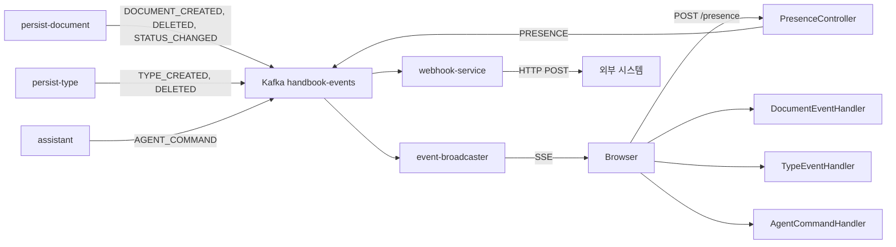

# 도메인 이벤트 계약

Kafka `handbook-events` 토픽을 통한 도메인 이벤트의 스키마·발행·구독 규약.

## 공급자 (Providers)

- **persist-document** — `DOCUMENT_CREATED`, `DOCUMENT_DELETED`, `DOCUMENT_STATUS_CHANGED`, `VALIDATION_REQUESTED`
  - `interfaces/event/KafkaDocumentEventPublisher.kt`
- **persist-type** — `TYPE_CREATED`, `TYPE_DELETED`
  - `interfaces/event/KafkaTypeEventPublisher.kt`
- **assistant** — `AGENT_COMMAND`
  - `interfaces/event/KafkaAgentCommandEventPublisher.kt`
- **event-broadcaster** — `PRESENCE` (HTTP POST → Kafka 재발행)
  - `interfaces/api/PresenceController.kt`

## 소비자 (Consumers)

### 백엔드

- **event-broadcaster** — 전체 이벤트를 워크스페이스별 SSE 로 중계
  - `interfaces/event/EventMessageListener.kt`
- **assistant** — `VALIDATION_REQUESTED` 수신하여 품질 검증 실행
  - `interfaces/event/ValidationEventListener.kt`
- **webhook-service** (신규) — 전체 이벤트 → 웹훅 필터 매칭 → HTTP POST

### 프론트엔드 (SSE 경유)

- **document-ui** — `DOCUMENT_*` → 문서 목록 갱신 + 토스트
  - `client/usecase/DocumentEventHandler.java`
- **type-ui** — `TYPE_*` → 타입 목록 갱신 + ActionManager 초기화
  - `client/usecase/TypeEventHandler.java`
- **agent-ui** — `AGENT_COMMAND` → UI 명령 실행
  - `client/interfaces/AgentSseClient.java`

## 변경 시 체크 대상

| 변경 | 체크 항목 |
|------|----------|
| 신규 EventType 추가 | `event/` 모듈의 `@JsonSubTypes` + 발행자 + 구독자 + DLQ 설정 + webhook 필터 |
| 페이로드 스키마 변경 | 모든 구독자의 역직렬화 호환성 (@JsonProperty, Jackson 3 어노테이션) |
| 토픽 추가 | Spring Cloud Stream binding + DLQ 토픽 + ConfigMap |
| 구독자 추가 | Consumer group 식별자 중복 방지 |

---

## 토픽

모든 도메인 이벤트는 단일 토픽 `handbook-events` 로 발행된다. 파티션 키는 워크스페이스 UUID.

## 이벤트 흐름



## 이벤트 타입

| EventType | 발행 서비스 | 페이로드 | 구독자 |
|-----------|-----------|---------|--------|
| `DOCUMENT_CREATED` | persist-document | Document (id, type, serial, data) | DocumentEventHandler |
| `DOCUMENT_DELETED` | persist-document | Document (id, type, serial) | DocumentEventHandler |
| `DOCUMENT_STATUS_CHANGED` | persist-document | Document (id, status, previousStatus) | DocumentEventHandler |
| `TYPE_CREATED` | persist-type | Type (id, version, attributes) | TypeEventHandler |
| `TYPE_DELETED` | persist-type | Type (id, version) | TypeEventHandler |
| `VALIDATION_REQUESTED` | persist-document | ValidationPayload (typeId, typeVersion, documentId) | assistant QualityMonitor |
| `AGENT_COMMAND` | assistant | AgentCommandPayload (→ [agent-commands.md](agent-commands.md)) | AgentCommandHandler |
| `PRESENCE` | event-broadcaster | PresencePayload (user, userName, type, serial, field) | DocumentEventHandler / TypeEventHandler |

## 이벤트 구조 (공통)

```kotlin
// event/ 모듈
@JsonTypeInfo(use = JsonTypeInfo.Id.NAME, property = "type")
@JsonSubTypes(
    Type(DocumentEvent::class, name = "DOCUMENT_CREATED"),
    Type(DocumentEvent::class, name = "DOCUMENT_DELETED"),
    Type(DocumentEvent::class, name = "DOCUMENT_STATUS_CHANGED"),
    Type(TypeEvent::class, name = "TYPE_CREATED"),
    Type(TypeEvent::class, name = "TYPE_DELETED"),
    Type(ValidationEvent::class, name = "VALIDATION_REQUESTED"),
    Type(AgentCommandEvent::class, name = "AGENT_COMMAND"),
    Type(PresenceEvent::class, name = "PRESENCE")
)
interface Event<T : Serializable> {
    val type: EventType
    val workspace: UUID
    val payload: T
    val timestamp: Instant
    val correlationId: String?  // 요청 추적 ID (§observability)
}
```

## Dead Letter Queue

| 토픽 | 소스 | 용도 |
|------|------|------|
| `handbook-events-dlq` | `handbook-events` | 처리 실패 이벤트 저장. 재시도 3회 후 이동 |

DLQ 발생 조건:
- 역직렬화 실패 (잘못된 JSON, 알 수 없는 EventType)
- 런타임 예외 (SSE 브로드캐스트 실패, DB 연결 실패)
- 타임아웃

Spring Cloud Stream 설정:
```yaml
spring.cloud.stream.kafka.bindings.event-in-0.consumer:
  enableDlq: true
  dlqName: handbook-events-dlq
```

## Correlation ID 전파

| 구간 | 방식 |
|------|------|
| 클라이언트 → Gateway | HTTP 헤더 `X-Correlation-Id` (없으면 Gateway UUID 생성) |
| Gateway → 백엔드 | HTTP 헤더 전파 |
| 백엔드 → Kafka | `ProducerRecord` 헤더 `x-correlation-id` |
| Kafka → event-broadcaster | `ConsumerRecord` 헤더 → MDC 설정 |
| event-broadcaster → SSE | SSE 이벤트 `id` 필드 |

---

SSE 전달 상세는 [sse.md](sse.md) 참조.
