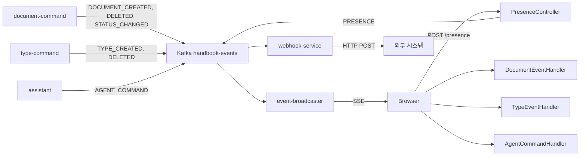

# 도메인 이벤트 계약

Kafka `handbook-events` 토픽을 통한 도메인 이벤트의 스키마·발행·구독 규약.

## 공급자 (Providers)

- **document-command** — `DOCUMENT_CREATED`, `DOCUMENT_DELETED`, `DOCUMENT_STATUS_CHANGED`, `VALIDATION_REQUESTED`
  - `interfaces/event/KafkaDocumentEventPublisher.kt`
- **type-command** — `TYPE_CREATED`, `TYPE_DELETED`
  - `interfaces/event/KafkaTypeEventPublisher.kt`
- **assistant** — `AGENT_COMMAND`
  - `interfaces/event/KafkaAgentCommandEventPublisher.kt`
- **event-broadcaster** — `PRESENCE` (HTTP POST → Kafka 재발행)
  - `interfaces/api/PresenceController.kt`

## 소비자 (Consumers)

### 백엔드

- **event-broadcaster** — 전체 이벤트를 워크스페이스별 SSE 로 중계
  - `interfaces/event/EventMessageListener.kt`
- **assistant** — `VALIDATION_REQUESTED` 수신하여 품질 검증 실행
  - `interfaces/event/ValidationEventListener.kt`
- **document-query** — `DOCUMENT_CREATED`, `DOCUMENT_DELETED` 수신하여 ES 인덱스 동기화
- **webhook-service** (신규) — 전체 이벤트 → 웹훅 필터 매칭 → HTTP POST

### 프론트엔드 (SSE 경유)

- **document-ui** — `DOCUMENT_*` → 문서 목록 갱신 + 토스트
  - `client/usecase/DocumentEventHandler.java`
- **type-ui** — `TYPE_*` → 타입 목록 갱신 + ActionManager 초기화
  - `client/usecase/TypeEventHandler.java`
- **agent-ui** — `AGENT_COMMAND` → UI 명령 실행
  - `client/interfaces/AgentSseClient.java`

## 변경 시 체크 대상

| 변경 | 체크 항목 |
|------|----------|
| 신규 EventType 추가 | `event/` 모듈의 `@JsonSubTypes` + 발행자 + 구독자 + DLQ 설정 + webhook 필터 |
| 페이로드 스키마 변경 | 모든 구독자의 역직렬화 호환성 (@JsonProperty, Jackson 3 어노테이션) |
| 토픽 추가 | Spring Cloud Stream binding + DLQ 토픽 + ConfigMap |
| 구독자 추가 | Consumer group 식별자 중복 방지 |

---

## 토픽

모든 도메인 이벤트는 단일 토픽 `handbook-events` 로 발행된다. 파티션 키는 워크스페이스 UUID.

## 이벤트 흐름



## 이벤트 타입

| EventType | 발행 서비스 | 페이로드 | 구독자 |
|-----------|-----------|---------|--------|
| `DOCUMENT_CREATED` | document-command | Document (id, type, serial, data) | DocumentEventHandler |
| `DOCUMENT_DELETED` | document-command | Document (id, type, serial) | DocumentEventHandler |
| `DOCUMENT_STATUS_CHANGED` | document-command | Document (id, status, previousStatus) | DocumentEventHandler |
| `TYPE_CREATED` | type-command | Type (id, version, attributes) | TypeEventHandler |
| `TYPE_DELETED` | type-command | Type (id, version) | TypeEventHandler |
| `VALIDATION_REQUESTED` | document-command | ValidationPayload (typeId, typeVersion, documentId) | assistant QualityMonitor |
| `AGENT_COMMAND` | assistant | AgentCommandPayload (→ [agent-commands.md](agent-commands.md)) | AgentCommandHandler |
| `PRESENCE` | event-broadcaster | PresencePayload (user, userName, type, serial, field) | DocumentEventHandler / TypeEventHandler |

## 이벤트 구조 (공통)

```kotlin
// event/ 모듈
@JsonTypeInfo(use = JsonTypeInfo.Id.NAME, property = "type")
@JsonSubTypes(
    Type(DocumentEvent::class, name = "DOCUMENT_CREATED"),
    Type(DocumentEvent::class, name = "DOCUMENT_DELETED"),
    Type(DocumentEvent::class, name = "DOCUMENT_STATUS_CHANGED"),
    Type(TypeEvent::class, name = "TYPE_CREATED"),
    Type(TypeEvent::class, name = "TYPE_DELETED"),
    Type(ValidationEvent::class, name = "VALIDATION_REQUESTED"),
    Type(AgentCommandEvent::class, name = "AGENT_COMMAND"),
    Type(PresenceEvent::class, name = "PRESENCE")
)
interface Event<T : Serializable> {
    val type: EventType
    val workspace: UUID
    val payload: T
    val timestamp: Instant
    val correlationId: String?  // 요청 추적 ID (§observability)
}
```

22## 별개 토픽 — `workspace-events`

워크스페이스 도메인의 최상위 CUD 이벤트는 `handbook-events` 와 **분리된 `workspace-events` 토픽** 으로 발행된다. 페이로드도 공통 `Event<T>` 인터페이스를 따르지 않는 raw Map 형태다. 역사적 경위로 분리되어 있으며, 향후 `handbook-events` 로의 통합은 별도 설계 반복 과제이다.

| EventType | 발행 서비스 | 페이로드 | 구독자 |
|-----------|-----------|---------|--------|
| `WORKSPACE_CREATED` | workspace-command | `{workspaceId, name}` | (현재 없음 — shell-ui 후속 반복에서 추가 예정) |
| `WORKSPACE_DELETED` | workspace-command | `{workspaceId}` | (현재 없음 — cascade 로 관련 row 제거 시 클라이언트 캐시 purge 가 필요해지는 시점에 추가) |

**cascade 정책 (1차 구현):** `WORKSPACE_DELETED` 는 `WorkspaceService.delete` 내부에서 cascade 로 그룹·그룹 멤버·웹훅 row 를 삭제한 뒤 트랜잭션 커밋 후에 단일 이벤트로 발행된다. 세부 건수나 하위 엔티티별 이벤트 재발행은 하지 않는다 (YAGNI). `document`/`type` cascade 로 범위가 확장될 때 `cascade: { groups, members, webhooks, documents, types }` 같은 선택적 하위 객체로 페이로드를 확장할 여지를 남겨둔다.

**`handbook-events` 표와의 관계:** 아래 `handbook-events` 이벤트 타입 표에는 의도적으로 `WORKSPACE_*` 를 기재하지 않는다 (다른 토픽이므로). 소비자도 `Event<T>` 역직렬화 경로와는 별개다.

## Dead Letter Queue

| 토픽 | 소스 | 용도 |
|------|------|------|
| `handbook-events-dlq` | `handbook-events` | 처리 실패 이벤트 저장. 재시도 3회 후 이동 |

DLQ 발생 조건:
- 역직렬화 실패 (잘못된 JSON, 알 수 없는 EventType)
- 런타임 예외 (SSE 브로드캐스트 실패, DB 연결 실패)
- 타임아웃

Spring Cloud Stream 설정:
```yaml
spring.cloud.stream.kafka.bindings.event-in-0.consumer:
  enableDlq: true
  dlqName: handbook-events-dlq
```

## Producer Serializer 규약

발행 패턴에 따라 Kafka producer serializer 가 달라진다. **발행 코드와 ConfigMap serializer 가 짝이 맞지 않으면 `ClassCastException: [B cannot be cast to String` 발생.**

| 패턴 | 예시 서비스 | key.serializer | value.serializer | 이유 |
|------|-----------|----------------|------------------|------|
| `KafkaTemplate<String, String>` + ObjectMapper pre-serialize | document-command, type-command, assistant | StringSerializer | StringSerializer | 애플리케이션이 문자열 JSON 을 직접 넣음 |
| `StreamBridge` / `@Bean Function` (Spring Cloud Stream) | workspace-command | StringSerializer | **ByteArraySerializer** | MessageConverter(application/json) 가 이미 byte[] 로 직렬화 |

StreamBridge 쪽에서 StringSerializer 를 쓰려면 `useNativeEncoding: true` + 커스텀 Serializer 구성이 필요하지만 채택하지 않는다 (기본 MessageConverter 체인 유지가 단순).

Spring Cloud Stream binder 지정 방법:
```yaml
spring.cloud.stream.kafka.binder.configuration:
  value.serializer: org.apache.kafka.common.serialization.ByteArraySerializer
  key.serializer: org.apache.kafka.common.serialization.StringSerializer
```

## Correlation ID 전파

| 구간 | 방식 |
|------|------|
| 클라이언트 → Gateway | HTTP 헤더 `X-Correlation-Id` (없으면 Gateway UUID 생성) |
| Gateway → 백엔드 | HTTP 헤더 전파 |
| 백엔드 → Kafka | `ProducerRecord` 헤더 `x-correlation-id` |
| Kafka → event-broadcaster | `ConsumerRecord` 헤더 → MDC 설정 |
| event-broadcaster → SSE | SSE 이벤트 `id` 필드 |

---

SSE 전달 상세는 [sse.md](sse.md) 참조.
