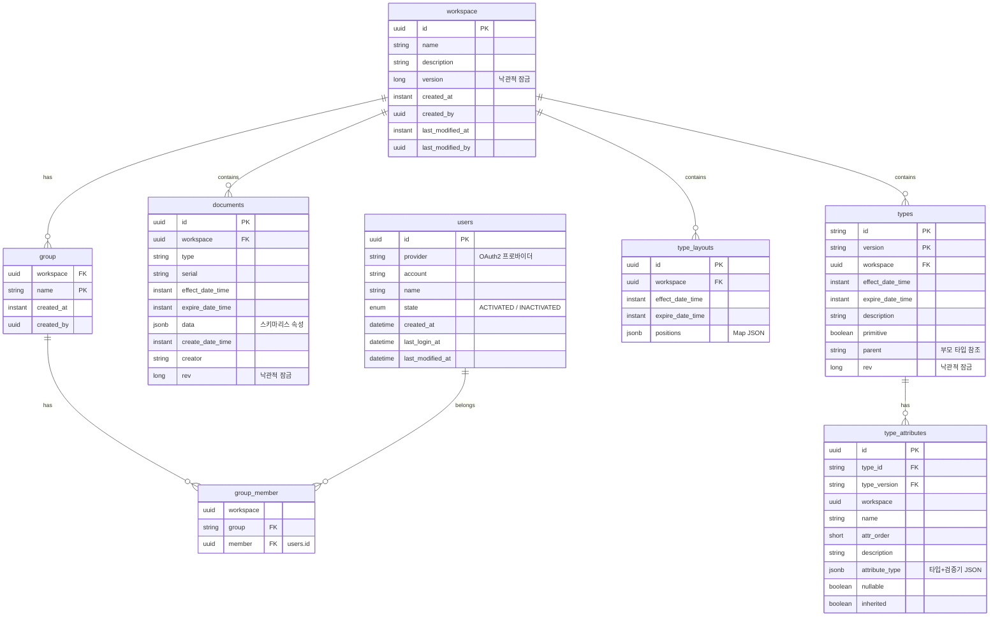

# 데이터베이스 스키마

PostgreSQL + R2DBC. 스키마는 R2dbc 엔티티로 정의되며, Spring Data가 관리한다.

## ER 다이어그램

## 테이블 상세

### documents
| 컬럼 | 타입 | 설명 |
|------|------|------|
| id | UUID (PK) | null 가능 (새 문서, 저장 시 자동 생성) |
| workspace | UUID | 워크스페이스 FK |
| type | String | 타입 이름 (느슨한 참조, FK 아님) |
| serial | String | 문서 식별자 (타입+워크스페이스 내 고유) |
| effect_date_time | Instant | 유효 시작 |
| expire_date_time | Instant | 유효 종료 (불변 이력 — 변경 시 새 버전 생성) |
| data | JSONB | 스키마리스 속성 `{"name":"홍길동","age":"30"}` |
| create_date_time | Instant | 생성 시각 (@CreatedDate) |
| creator | String | 생성자 (@CreatedBy) |
| rev | Long | 낙관적 잠금 (@Version) |

### types
| 컬럼 | 타입 | 설명 |
|------|------|------|
| id + version | String (복합 PK) | 타입 식별자 + 버전 (불변 이력) |
| workspace | UUID | 워크스페이스 FK |
| effect/expire_date_time | Instant | 버전 유효 기간 |
| primitive | Boolean | 원시 타입 여부 |
| parent | String | 부모 타입 참조 (속성 상속) |
| rev | Long | 낙관적 잠금 |

### type_attributes
| 컬럼 | 타입 | 설명 |
|------|------|------|
| type_id + type_version | String (FK) | 소속 타입 |
| attr_order | Short | 속성 순서 |
| attribute_type | JSONB | 타입 + 검증기 `{"type":"NUMBER","min":0,"max":100}` |
| nullable | Boolean | null 허용 |
| inherited | Boolean | 부모 타입에서 상속 |

### type_layouts
| 컬럼 | 타입 | 설명 |
|------|------|------|
| positions | JSONB | 타입별 캔버스 좌표 `{"customer:1.0":{"x":100,"y":200,"width":200,"height":150}}` |
| effect/expire_date_time | Instant | 레이아웃 유효 기간 |

## 설계 결정

| 결정 | 이유 |
|------|------|
| documents.data를 JSONB로 저장 | 타입 스키마가 동적으로 변하므로 고정 컬럼 불가 |
| documents.type은 FK가 아닌 String | 타입 버전과 느슨한 결합. 여러 타입 버전이 동시에 유효할 수 있음 |
| types 복합 PK (id+version) | 불변 이력. 변경 시 기존 버전 보존, 새 버전 생성 |
| @Version 낙관적 잠금 | 동시 편집 충돌 감지 (409 Conflict) |
| documents.data JSONB 머지 (`\|\|`) | 패치 기반 저장: 변경 필드만 전송하여 비충돌 동시 편집 지원. `UPDATE documents SET data = data \|\| $patch WHERE id = $id AND rev = $rev` |
| type_attributes 개별 upsert | 타입 속성 패치: 변경 속성만 upsert (전체 삭제-재삽입 대신), 비충돌 동시 편집 지원 |
| group 테이블명 따옴표 | PostgreSQL 예약어 회피 |

## 엔티티 코드 위치

| 테이블 | 엔티티 파일 |
|--------|-----------|
| documents | `persist-document/interfaces/database/R2dbcDocumentEntity.kt` |
| types | `persist-type/interfaces/database/R2dbcTypeEntity.kt` |
| type_attributes | `persist-type/interfaces/database/R2dbcAttributeEntity.kt` |
| type_layouts | `persist-type/interfaces/database/R2dbcLayoutEntity.kt` |
| workspace | `persist-workspace/interfaces/database/R2dbcWorkspaceEntity.kt` |
| group | `persist-workspace/interfaces/database/R2dbcGroupEntity.kt` |
| group_member | `persist-workspace/interfaces/database/R2dbcGroupMemberEntity.kt` |
| users | `login/interfaces/database/R2dbcUserEntity.kt` |
