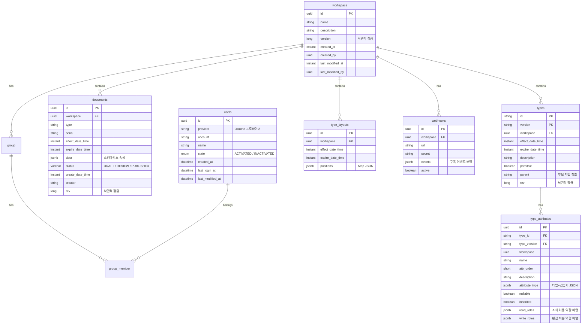

# 데이터베이스 스키마

PostgreSQL + R2DBC. 스키마는 R2dbc 엔티티로 정의되며, Spring Data가 관리한다.

## ER 다이어그램

## 테이블 상세

| 테이블 | 엔티티 클래스 | 설명 |
|--------|--------------|------|
| **workspace** | `workspace-command/src/main/kotlin/.../R2dbcWorkspaceEntity.kt` | 워크스페이스 메타데이터 및 생성 정보 |
| **documents** | `document-command/src/main/kotlin/.../R2dbcDocumentEntity.kt` | 불변 문서 데이터. JSONB로 타입별 가변 필드 저장 |
| **types** | `type-command/src/main/kotlin/.../R2dbcTypeEntity.kt` | 불변 타입 스키마 메타데이터 |
| **type_attributes** | `type-command/src/main/kotlin/.../R2dbcAttributeEntity.kt` | 타입별 속성 정의 및 필드 레벨 권한 |
| **type_layouts** | `type-command/src/main/kotlin/.../R2dbcLayoutEntity.kt` | 캔버스 배치 정보 (버전 관리 지원) |
| **users** | `login/src/main/kotlin/.../R2dbcUserEntity.kt` | 사용자 계정 및 인증 정보 |
| **group** | `workspace-command/src/main/kotlin/.../R2dbcGroupEntity.kt` | 워크스페이스 내 사용자 그룹 |
| **group_member** | `workspace-command/src/main/kotlin/.../R2dbcGroupMemberEntity.kt` | 그룹-사용자 매핑 (다대다) |
| **webhooks** | `workspace-command/src/main/kotlin/.../R2dbcWebhookEntity.kt` | 외부 시스템 연동을 위한 이벤트 구독 설정 |

## 데이터 동기화 (Sync)

시스템은 최종 일관성(Eventual Consistency)을 보장하기 위해 Kafka 이벤트를 통한 비동기 동기화 패턴을 사용한다.

1.  **발행 (Command)**: `*-command` 서비스가 DB 저장 후 `DOCUMENT_CREATED` 등의 이벤트를 Kafka 토픽(`handbook-events`)으로 발행한다.
2.  **소비 (Query/Index)**: 
    *   `document-query` 서비스가 이벤트를 구독하여 Elasticsearch 9.3.3 인덱스를 갱신한다.
    *   `event-broadcaster`가 이벤트를 구독하여 SSE로 브로드캐스트한다.
3.  **검색 (Read)**: 사용자의 전문 검색 및 대량 목록 조회는 Elasticsearch를 통해 처리된다.

---

> 상세 유스케이스는 [USECASE.md](usecases.md) 참조.
