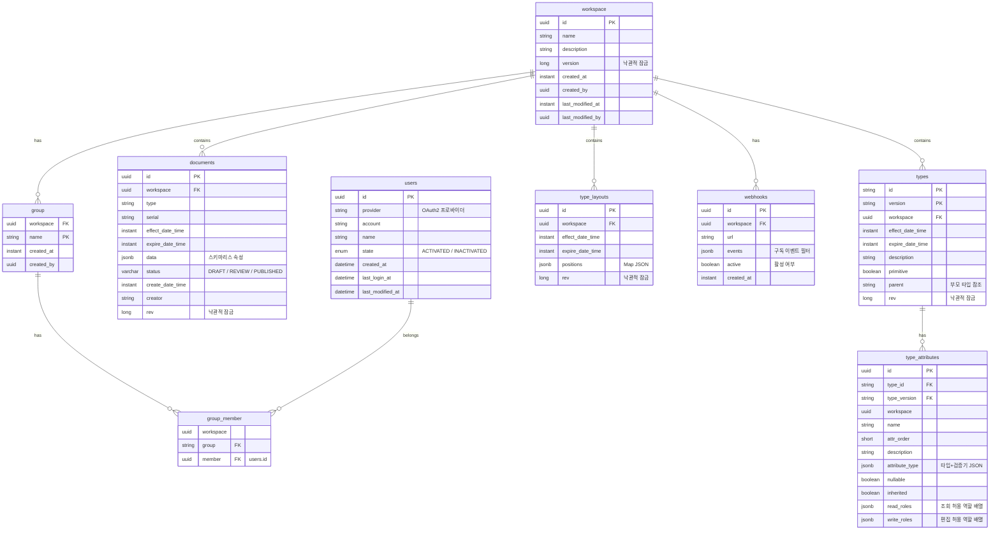

# 데이터베이스 스키마

PostgreSQL + R2DBC. 스키마는 R2dbc 엔티티로 정의되며, Spring Data가 관리한다.

## ER 다이어그램



## 테이블 상세

### documents
| 컬럼 | 타입 | 설명 |
|------|------|------|
| id | UUID (PK) | null 가능 (새 문서, 저장 시 자동 생성) |
| workspace | UUID | 워크스페이스 FK |
| type | String | 타입 이름 (느슨한 참조, FK 아님) |
| serial | String | 문서 식별자 (타입+워크스페이스 내 고유) |
| effect_date_time | Instant | 유효 시작 |
| expire_date_time | Instant | 유효 종료 (불변 이력 — 변경 시 새 버전 생성) |
| data | JSONB | 스키마리스 속성 `{"name":"홍길동","age":"30"}` |
| status | VARCHAR | 문서 상태 (`DRAFT` / `REVIEW` / `PUBLISHED`, 기본값 `DRAFT`) |
| create_date_time | Instant | 생성 시각 (@CreatedDate) |
| creator | String | 생성자 (@CreatedBy) |
| rev | Long | 낙관적 잠금 (@Version) |

### types
| 컬럼 | 타입 | 설명 |
|------|------|------|
| id + version | String (복합 PK) | 타입 식별자 + 버전 (불변 이력) |
| workspace | UUID | 워크스페이스 FK |
| effect/expire_date_time | Instant | 버전 유효 기간 |
| primitive | Boolean | 원시 타입 여부 |
| parent | String | 부모 타입 참조 (속성 상속) |
| rev | Long | 낙관적 잠금 |

### type_attributes
| 컬럼 | 타입 | 설명 |
|------|------|------|
| type_id + type_version | String (FK) | 소속 타입 |
| attr_order | Short | 속성 순서 |
| attribute_type | JSONB | 타입 + 검증기 `{"type":"NUMBER","min":0,"max":100}` |
| nullable | Boolean | null 허용 |
| inherited | Boolean | 부모 타입에서 상속 |
| read_roles | JSONB | 조회 허용 역할 배열 `["MANAGER","VIEWER"]`. 빈 배열 = 제한 없음 (기본값) |
| write_roles | JSONB | 편집 허용 역할 배열 `["MANAGER"]`. 빈 배열 = 제한 없음 (기본값) |

### type_layouts
| 컬럼 | 타입 | 설명 |
|------|------|------|
| positions | JSONB | 타입별 캔버스 좌표 `{"customer:1.0":{"x":100,"y":200,"width":200,"height":150}}` |
| effect/expire_date_time | Instant | 레이아웃 유효 기간 |

### 데이터 무결성 제약 조건 (Data Integrity Triggers)
PostgreSQL 트리거를 통해 애플리케이션 외부의 조작이나 동시성 이슈에서도 타입 데이터의 정합성을 강력하게 보호한다.

1. **`enforce_no_overlap_type_periods`**: 동일한 타입(`id`) 내에서 서로 다른 버전 간에 유효기간(`effect_date_time`, `expire_date_time`)이 중복(Overlap)되지 않도록 차단한다.
2. **`enforce_parent_type_consistency`**: 부모 타입(`parent`)이 설정된 경우, 부모 타입이 자식 타입의 유효기간 동안 존재하며 중간에 공백(gap) 없이 유효기간을 완전히 커버하는지 검증한다.
3. **`prevent_deletion_if_children_exist`**: 부모 타입을 삭제할 때, 해당 유효기간 내에 상속받은 자식 타입이 존재하면 삭제를 방지한다.
4. **`prevent_invalid_parent_period_update`**: 부모 타입의 유효기간을 축소(수정)할 때, 이미 해당 기간에 의존하고 있는 자식 타입이 있다면 수정을 차단한다.

### webhooks
| 컬럼 | 타입 | 설명 |
|------|------|------|
| id | UUID (PK) | 웹훅 식별자 |
| workspace | UUID (FK) | 워크스페이스 FK |
| url | String | 콜백 URL |
| events | JSONB | 구독 이벤트 필터 `["DOCUMENT_CREATED","TYPE_CREATED"]` |
| active | Boolean | 활성 여부 (연속 실패 시 false) |
| created_at | Instant | 등록 시각 |

## Elasticsearch 9.3.3 인덱스 설계

문서 전문 검색 및 고성능 조회를 위해 Elasticsearch 9.3.3을 사용한다.

### 'documents' 인덱스 매핑

| 필드명 | 타입 | 설명 |
|--------|------|------|
| id | keyword | 문서 UUID |
| workspace | keyword | 워크스페이스 UUID |
| type | keyword | 타입 식별자 |
| serial | keyword | 문서 식별 번호 |
| effect_date_time | date | 유효 시작 시각 |
| expire_date_time | date | 유효 종료 시각 |
| status | keyword | 문서 상태 (DRAFT/REVIEW/PUBLISHED) |
| creator | keyword | 생성자 |
| create_date_time | date | 생성 시각 |
| data | object | 스키마리스 데이터 필드 (dynamic mapping) |
| data.* | text | 전문 검색용 분석 필드 (Nori 한글 분석기 적용 가능) |
| _full_text | text | 전체 필드 통합 검색용 필드 (copy_to) |

### PostgreSQL → Elasticsearch 동기화 (CDC/Event 기반)

CQRS 패턴에 따라 쓰기 작업은 PostgreSQL에서 수행되고, 변경 사항은 Kafka를 통해 Elasticsearch로 실시간 동기화된다.

1. **발행**: `document-command` 서비스가 DB 저장 후 `DOCUMENT_CREATED` 또는 `DOCUMENT_DELETED` 이벤트를 Kafka 토픽(`handbook-events`)으로 발행한다.
2. **소비**: `document-query` 서비스의 `KafkaDocumentEventListener`가 해당 이벤트를 구독한다.
3. **인덱싱**: 수신된 문서 데이터를 Elasticsearch `documents` 인덱스에 `upsert`하거나 `delete`한다.
4. **최종 일관성**: 네트워크 지연이나 서비스 일시 장애로 인해 DB와 검색 엔진 간에 약간의 시간차가 발생할 수 있으나, Kafka의 재시도 메커니즘을 통해 데이터 무결성을 보장한다.

## 설계 결정

| 결정 | 이유 |
|------|------|
| documents.data를 JSONB로 저장 | 타입 스키마가 동적으로 변하므로 고정 컬럼 불가 |
| documents.type은 FK가 아닌 String | 타입 버전과 느슨한 결합. 여러 타입 버전이 동시에 유효할 수 있음 |
| types 복합 PK (id+version) | 불변 이력. 변경 시 기존 버전 보존, 새 버전 생성 |
| @Version 낙관적 잠금 | 동시 편집 충돌 감지 (409 Conflict) |
| documents.data JSONB 머지 (`\|\|`) | 패치 기반 저장: 변경 필드만 전송하여 비충돌 동시 편집 지원. `UPDATE documents SET data = data \|\| $patch WHERE id = $id AND rev = $rev` |
| type_attributes 개별 upsert | 타입 속성 패치: 변경 속성만 upsert (전체 삭제-재삽입 대신), 비충돌 동시 편집 지원 |
| group 테이블명 따옴표 | PostgreSQL 예약어 회피 |
| documents.status VARCHAR (ENUM 아님) | 상태 추가 시 마이그레이션 불필요. 애플리케이션 레벨에서 유효성 검증 |
| webhooks.events JSONB | 이벤트 필터를 유연하게 정의. 새 이벤트 타입 추가 시 스키마 변경 불필요 |
| type_attributes.read_roles/write_roles JSONB | 속성별 필드 레벨 권한. 빈 배열 = 제한 없음. 별도 조인 테이블 없이 속성과 함께 조회 가능 |

## 계획된 인덱스 (7.2 성능 최적화)

> 현재 인덱스가 명시적으로 생성되어 있지 않다. 다음 인덱스를 추가하여 검색/조회 성능을 개선한다.

### documents 테이블

| 인덱스 이름 | 컬럼 | 용도 |
|------------|------|------|
| `idx_documents_ws_type_serial` | `(workspace, type, serial)` | 워크스페이스+타입 기준 문서 검색, 단건 조회 시 복합 조건 |
| `idx_documents_ws_effect_expire` | `(workspace, effect_date_time, expire_date_time)` | 시점 기반 유효 문서 조회 (WHERE effect <= ? AND expire > ?) |
| `idx_documents_ws_status` | `(workspace, status)` | 상태별 문서 필터링 (DRAFT/REVIEW/PUBLISHED) |
| `idx_documents_ws_create_dt` | `(workspace, create_date_time DESC)` | 최신 문서 정렬 |

### types 테이블

| 인덱스 이름 | 컬럼 | 용도 |
|------------|------|------|
| `idx_types_ws_effect_expire` | `(workspace, effect_date_time, expire_date_time)` | 시점 기반 유효 타입 조회 |

### webhooks 테이블

| 인덱스 이름 | 컬럼 | 용도 |
|------------|------|------|
| `idx_webhooks_ws_active` | `(workspace, active)` | 이벤트 발생 시 활성 웹훅 조회 |

### 마이그레이션 예시

```sql
-- documents
CREATE INDEX idx_documents_ws_type_serial ON documents (workspace, type, serial);
CREATE INDEX idx_documents_ws_effect_expire ON documents (workspace, effect_date_time, expire_date_time);
CREATE INDEX idx_documents_ws_status ON documents (workspace, status);
CREATE INDEX idx_documents_ws_create_dt ON documents (workspace, create_date_time DESC);

-- types
CREATE INDEX idx_types_ws_effect_expire ON types (workspace, effect_date_time, expire_date_time);

-- webhooks
CREATE INDEX idx_webhooks_ws_active ON webhooks (workspace, active);
```

## Soft Delete 계획 (7.5 UX 개선)

> 현재 문서 삭제는 즉시 하드 삭제(DELETE)이다. Soft Delete를 도입하여 30일 보존 후 하드 삭제하고, 그 사이 복구를 가능하게 한다.

### 컬럼 추가

| 테이블 | 컬럼 | 타입 | 설명 |
|--------|------|------|------|
| documents | `deleted_at` | `TIMESTAMPTZ NULL` | NULL = 활성, 값 존재 = 삭제됨. 30일 후 배치로 하드 삭제 |

### 영향 범위

| 항목 | 변경 내용 |
|------|----------|
| DocumentRepository | `DELETE` → `UPDATE SET deleted_at = NOW()` |
| DocumentSearchService | 조회 쿼리에 `WHERE deleted_at IS NULL` 조건 추가 |
| 하드 삭제 배치 | 스케줄 잡 추가: `DELETE FROM documents WHERE deleted_at < NOW() - INTERVAL '30 days'` |
| 복구 API | `PATCH /workspaces/{ws}/documents/{id}/restore` — `deleted_at = NULL` |
| 인덱스 | `idx_documents_ws_type_serial`에 `WHERE deleted_at IS NULL` 부분 인덱스 고려 |

### 마이그레이션 예시

```sql
ALTER TABLE documents ADD COLUMN deleted_at TIMESTAMPTZ NULL;
CREATE INDEX idx_documents_deleted_at ON documents (deleted_at) WHERE deleted_at IS NOT NULL;
```

## 엔티티 코드 위치

| 테이블 | 엔티티 파일 |
|--------|-----------|
| documents | `document-command/interfaces/database/R2dbcDocumentEntity.kt` |
| types | `type-command/interfaces/database/R2dbcTypeEntity.kt` |
| type_attributes | `type-command/interfaces/database/R2dbcAttributeEntity.kt` |
| type_layouts | `type-command/interfaces/database/R2dbcLayoutEntity.kt` |
| workspace | `workspace-command/interfaces/database/R2dbcWorkspaceEntity.kt` |
| group | `workspace-command/interfaces/database/R2dbcGroupEntity.kt` |
| group_member | `workspace-command/interfaces/database/R2dbcGroupMemberEntity.kt` |
| users | `login/interfaces/database/R2dbcUserEntity.kt` |
