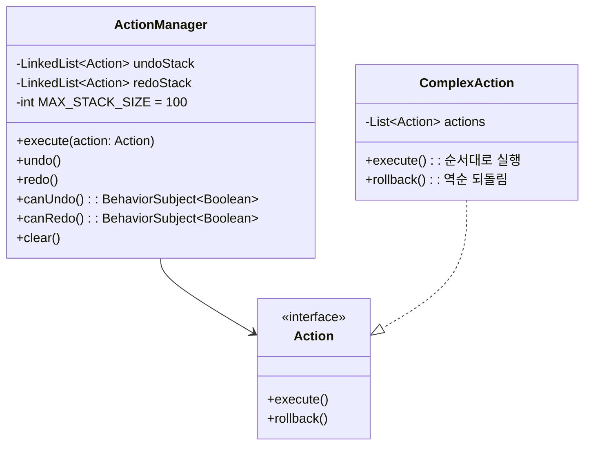

# 공통 설계 패턴

프론트엔드 UI 모듈(document-ui, type-ui, shell-ui)에서 반복되는 핵심 설계 패턴을 정리한다.

---

## Command 패턴 (Action & ActionManager)

`ui-components` 모듈에 정의. 모든 편집 작업은 `Action` 인터페이스(`execute()`, `rollback()`)로 캡슐화된다. `ActionManager`가 Undo/Redo 스택을 관리한다.

- `Action`: `ui-components/domain/Action.java`
- `ActionManager`: `ui-components/client/components/ActionManager.java`



### 규칙

- 스택 최대 100개. 새 액션 실행 시 redo 스택 초기화.
- `BehaviorSubject<Boolean>`으로 canUndo/canRedo 상태를 버튼/메뉴에 전파.
- `ComplexAction`으로 여러 Action을 원자적으로 묶는다 (예: 이동 + 충돌 해소).
- 에이전트 편집도 동일한 Action 경로로 실행되므로 사용자가 Ctrl+Z로 되돌릴 수 있다.

### 적용 모듈

| 모듈 | Action 종류 |
|------|------------|
| **document-ui** | AddDocumentAction, EditDocumentAction, DeleteDocumentAction, SaveAction |
| **type-ui** | CreateBoxAction, DeleteBoxAction, EditBoxAction, MoveBoxAction, ResizeBoxAction, PushOutOverlapAction, ChangeLayoutAction, LoadAction, SaveAction |

---

## 더티 트래킹 & 원자적 저장

`ChangeTracker`(`ui-components/client/components/ChangeTracker.java`)가 키 기반 변경 상태를 추적한다. 사용자 편집은 로컬에만 반영되며, Save 버튼을 누르면 모든 변경점이 하나의 트랜잭션으로 원자적 저장된다.

### 핵심 규칙

1. 편집 → 로컬 더티 상태만 변경 (서버 미반영)
2. Save → created+changed는 PUT, deleted는 DELETE로 원자적 전송
3. Undo로 원본 상태 복원 → 더티 플래그 자동 해제
4. Save 성공 → Undo/Redo 스택 + 더티 상태 초기화
5. 부분 실패 → 실패 항목만 더티 유지, 토스트 알림

### 시각적 상태 (MD3 토큰 기반)

| 상태 | CSS 클래스 | 시각적 표현 | 의미 |
|------|-----------|------------|------|
| **생성** | `.created` | `tertiary-container` 배경, 좌측 3px `tertiary` 보더 | 로컬에서 새로 추가 |
| **수정** | `.changed` | `tertiary` 1px inset box-shadow | 원본 대비 값 변경 |
| **삭제 예정** | `.deleted` | 취소선, 텍스트 75% 투명화 | Save 시 서버에서 삭제 |
| **유효** | `.valid` | `primary` 텍스트 색상 | 서버 검증 통과 |
| **유효하지 않음** | `.invalid` | `error` 텍스트 + `error` 1px inset shadow | 필수값 누락/형식 오류 |
| **충돌** | `.conflict` | `secondary-container` 배경, `secondary` 2px 보더 | 다른 사용자와 동시 수정 |

### Save 버튼 UX

- 더티 없으면 **비활성화** (`disabled`)
- 더티 있으면 변경 건수 뱃지 표시 (예: `Save (3)`)
- 저장 중 **스피너** 표시, 중복 클릭 방지
- 탭/레이아웃 전환 시 미저장 변경 있으면 **확인 다이얼로그**

### 적용 모듈

| 모듈 | 트래커 | 상태 모델 |
|------|--------|----------|
| **document-ui** | `DirtyTracker` | `created(Set)`, `changed(Map)`, `deleted(Set)` |
| **type-ui** | `ChangeTracker` | `NOT_CHANGED` / `CHANGED` / `DELETED` (enum) |

---

## 반응형 상태 관리 (BehaviorSubject)

모든 상태는 RxJava `BehaviorSubject` 기반으로, 변경 시 구독자에게 자동 전파된다.

### 패턴

```
@Singleton
public class SomeState {
    private final BehaviorSubject<T> subject = BehaviorSubject.createDefault(initialValue);
    public void next(T value) { subject.onNext(value); }
    public T getValue() { return subject.getValue(); }
    public Observable<T> asObservable() { return subject; }
}
```

- UI 컴포넌트가 `asObservable()`을 구독하여 상태 변경 시 자동 렌더링
- `getValue()`로 현재 스냅샷 조회
- Dagger `@Singleton`으로 모듈 내 공유

---

## 프레즌스 (다른 사용자 편집 표시)

같은 워크스페이스에서 다른 사용자가 편집 중인 요소를 실시간으로 표시한다.

- **API**: `POST /workspace/{id}/presence`
- **디바운스**: 200ms (빠른 이동 시 이벤트 억제)
- **타임아웃**: 30초 (갱신 없으면 자동 해제)
- **시각**: 사용자별 고유 색상 2px 보더 + 이름 라벨 (3초 후 fade-out)

| 모듈 | 페이로드 |
|------|---------|
| **document-ui** | `{user, type, serial, field}` |
| **type-ui** | `{user, typeKey}` |

---

## 에이전트 연동 (WindowMutationBridge)

`agent-bridge` 모듈의 `WindowMutationBridge`가 CustomEvent 기반으로 GWT 모듈 간 통신을 중개한다.

### 패턴

1. 에이전트 → `MutateCommand.changes[]` → Kafka → SSE → `CustomEvent('handbook-mutate')`
2. 각 모듈의 `MutationReceiver` → `AgentHandler` → 명령 파싱 → `ActionManager.execute(Action)`
3. 동일한 Action/Undo 스택 사용 → 사용자가 에이전트 작업을 Ctrl+Z로 되돌릴 수 있음

### 상태 조회

각 모듈은 `StateProvider.snapshot()` → JSON으로 현재 상태를 에이전트에 제공한다.
