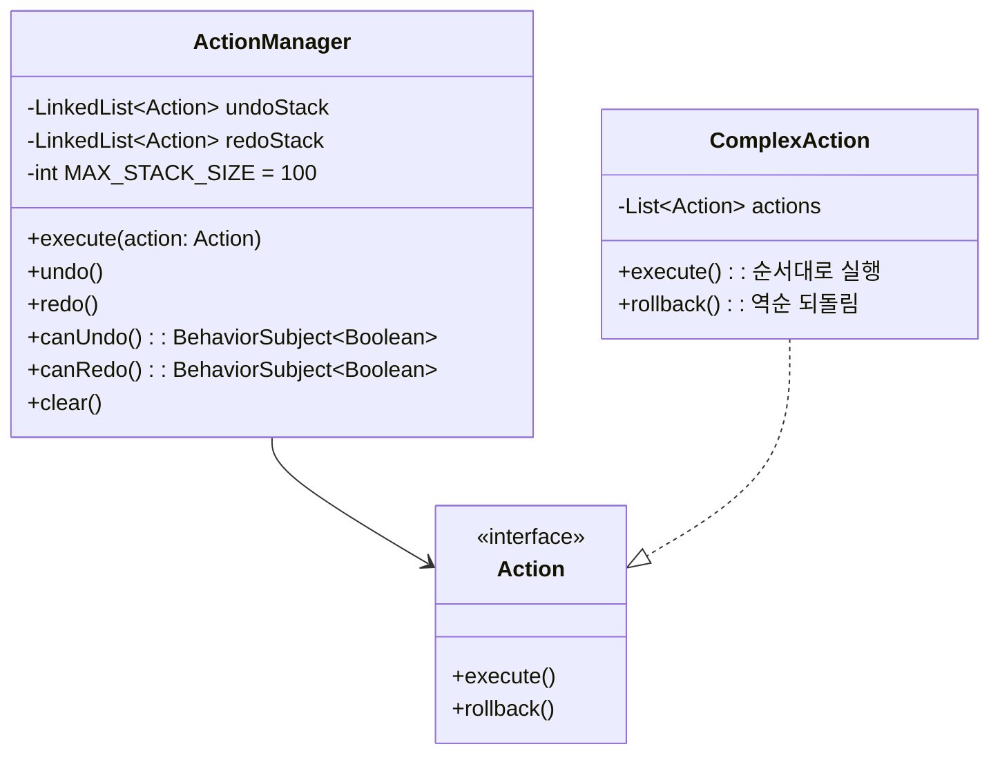

# 공통 설계 패턴

프론트엔드 UI 모듈(document-ui, type-ui, shell-ui)에서 반복되는 핵심 설계 패턴을 정리한다.

---

## Command 패턴 (Action & ActionManager)

`ui-components` 모듈에 정의. 모든 편집 작업은 `Action` 인터페이스(`execute()`, `rollback()`)로 캡슐화된다. `ActionManager`가 Undo/Redo 스택을 관리한다.

- `Action`: `ui-components/src/main/java/dev/sayaya/handbook/domain/Action.java`
- `ActionManager`: `ui-components/src/main/java/dev/sayaya/handbook/client/components/ActionManager.java`



### 규칙

- **스택 제한**: 최대 100개까지 보관하며, 새 액션 실행 시 redo 스택은 초기화된다.
- **상태 전파**: `BehaviorSubject<Boolean>`으로 `canUndo`/`canRedo` 상태를 발행하여 버튼/메뉴의 활성 상태를 자동 제어한다.
- **원자적 묶음**: `ComplexAction`을 사용하여 여러 하위 액션(예: 타입 이동 + 겹침 해소)을 하나의 Undo 단위로 묶는다.
- **에이전트 통합**: 에이전트의 편집 명령도 동일한 Action 인터페이스를 통해 실행되므로, 사용자가 `Ctrl+Z`로 에이전트의 작업을 즉시 되돌릴 수 있다.

---

## 더티 트래킹 & 원자적 저장

`ChangeTracker`(`ui-components`)가 키 기반 변경 상태를 추적한다. 사용자 편집은 로컬에만 반영되며, Save 버튼을 누를 때 모든 변경점이 하나의 트랜잭션으로 원자적 저장된다.

### 핵심 규칙

1. **로컬 우선**: 편집은 즉시 로컬 UI와 `ChangeTracker`에만 반영된다 (낙관적 UI).
2. **상태 구분**: `NOT_CHANGED`, `CHANGED`, `DELETED` 3단계로 관리한다.
3. **원자적 전송**: Save 클릭 시 `CHANGED`는 `PUT/PATCH`, `DELETED`는 `DELETE` 요청으로 묶어 전송한다.
4. **결정적 동기화**: 저장 성공 시에만 Undo 스택과 더티 플래그를 초기화한다. 실패 시 해당 항목은 더티 상태를 유지하여 재시도를 유도한다.

### 시각적 상태 (MD3 디자인 토큰)

| 상태 | CSS 클래스 | 시각적 표현 | 의미 |
|------|-----------|------------|------|
| **생성** | `.created` | `tertiary-container` 배경, 좌측 3px `tertiary` 보더 | 새로 추가된 항목 |
| **수정** | `.changed` | `tertiary` 1px inset box-shadow | 원본 대비 값 변경 |
| **삭제** | `.deleted` | 취소선 + 75% 투명도 | 저장 시 삭제될 항목 |
| **충돌** | `.conflict` | `secondary-container` 배경, 2px `secondary` 보더 | 타인과 동시 수정 발견 |

---

## 반응형 상태 관리 (BehaviorSubject)

모든 UI 상태는 RxJava `BehaviorSubject`를 사용하여 단방향 데이터 흐름(UDF)을 구현한다.

### 구현 패턴

```java
@Singleton
public class DocumentList {
    private final BehaviorSubject<List<DocumentValue>> state = BehaviorSubject.createDefault(emptyList());
    
    public void next(List<DocumentValue> value) { state.onNext(value); }
    public List<DocumentValue> getValue() { return state.getValue(); }
    public Observable<List<DocumentValue>> asObservable() { return state; }
}
```

- **Two-Door 원칙**: 상태를 변경하는 `next()`와 구독하는 `asObservable()`만 노출하여 캡슐화한다.
- **자동 렌더링**: UI 컴포넌트는 `onModuleLoad` 시점에 Observable을 구독하고, `next()` 호출 시 별도 명령 없이 화면을 자동 갱신한다.
- **컴포지션 루트**: Dagger `@Singleton`으로 모듈 내 단일 상태를 공유한다.

---

## 에이전트 커맨드 파싱 (Strategy 패턴)

`agent-ui`로부터 수신한 문자열 명령을 도메인 Action으로 변환할 때 OCP(개방-폐쇄 원칙)를 위해 Strategy 패턴을 사용한다.

- `MutationStrategy`: 개별 명령(CREATE, ADD field 등)의 파싱 로직을 담당.
- `AgentMutationHandler`: 수신된 모든 명령을 순회하며 적절한 전략을 선택하고 `ActionManager`에 위임.

### 장점
- 새로운 커맨드 유형 추가 시 기존 핸들러 수정 없이 새 전략 클래스만 추가하면 됨.
- 각 전략이 독립적으로 테스트 가능함.
