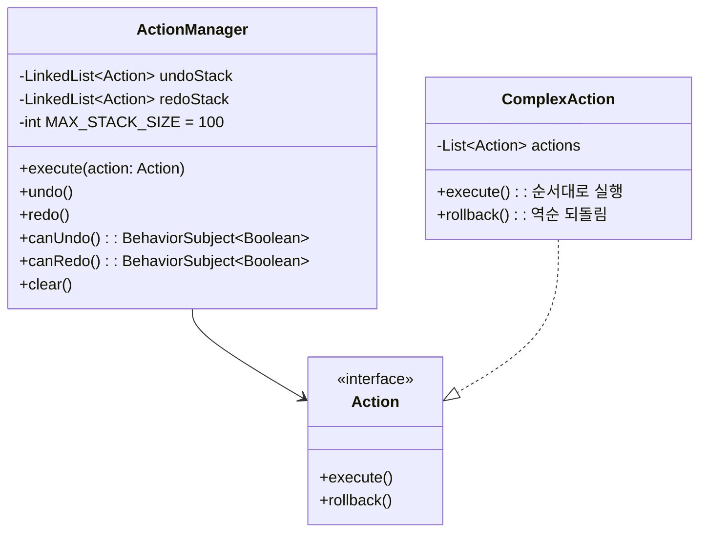
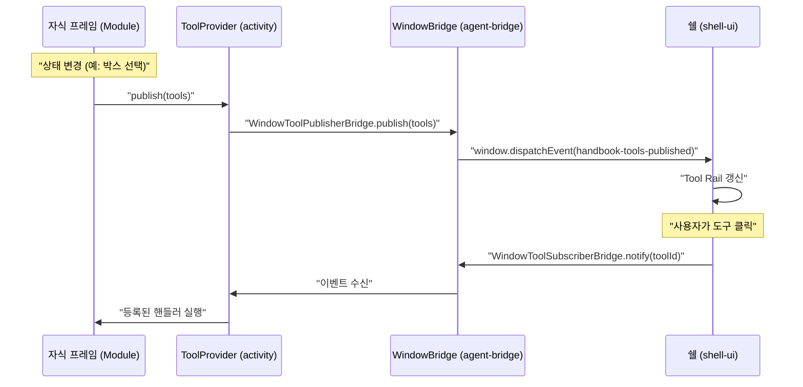
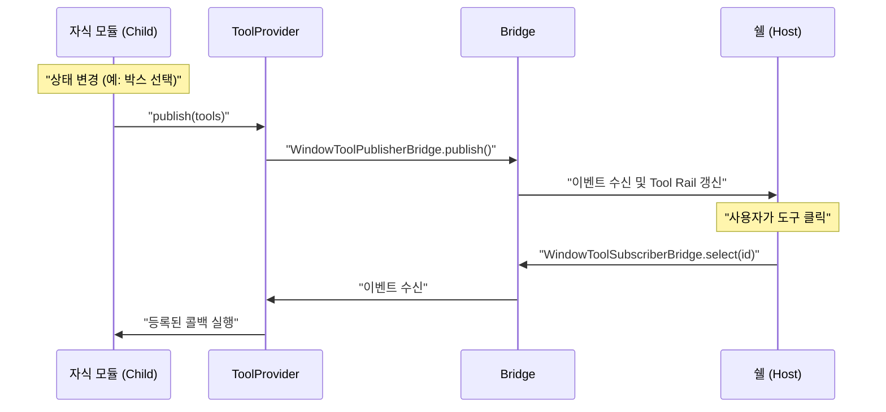
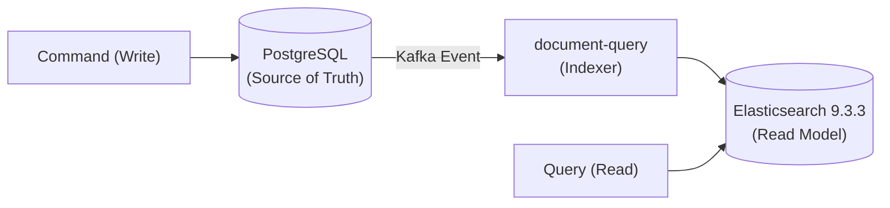

# 공통 설계 패턴

프론트엔드 UI 모듈(document-ui, type-ui, shell-ui)에서 반복되는 핵심 설계 패턴을 정리한다.

---

## Command 패턴 (Action & ActionManager)

`ui-components` 모듈에 정의. 모든 편집 작업은 `Action` 인터페이스(`execute()`, `rollback()`)로 캡슐화된다. `ActionManager`가 Undo/Redo 스택을 관리한다.

- `Action`: `ui-components/domain/Action.java`
- `ActionManager`: `ui-components/client/components/ActionManager.java`



### 규칙

- 스택 최대 100개. 새 액션 실행 시 redo 스택 초기화.
- `BehaviorSubject<Boolean>`으로 canUndo/canRedo 상태를 버튼/메뉴에 전파.
- `ComplexAction`으로 여러 Action을 원자적으로 묶는다 (예: 이동 + 충돌 해소).
- 에이전트 편집도 동일한 Action 경로로 실행되므로 사용자가 Ctrl+Z로 되돌릴 수 있다.

### 적용 모듈

| 모듈 | Action 종류 |
|------|------------|
| **document-ui** | AddDocumentAction, EditDocumentAction, DeleteDocumentAction, SaveAction |
| **type-ui** | CreateBoxAction, DeleteBoxAction, EditBoxAction, MoveBoxAction, ResizeBoxAction, PushOutOverlapAction, ChangeLayoutAction, LoadAction, SaveAction |

---

## 더티 트래킹 & 원자적 저장

`ChangeTracker`(`ui-components/client/components/ChangeTracker.java`)가 키 기반 변경 상태를 추적한다. 사용자 편집은 로컬에만 반영되며, Save 버튼을 누르면 모든 변경점이 하나의 트랜잭션으로 원자적 저장된다.

### 핵심 규칙

1. 편집 → 로컬 더티 상태만 변경 (서버 미반영)
2. Save → created+changed는 PUT, deleted는 DELETE로 원자적 전송
3. Undo로 원본 상태 복원 → 더티 플래그 자동 해제
4. Save 성공 → Undo/Redo 스택 + 더티 상태 초기화
5. 부분 실패 → 실패 항목만 더티 유지, 토스트 알림

### 시각적 상태 (MD3 토큰 기반)

| 상태 | CSS 클래스 | 시각적 표현 | 의미 |
|------|-----------|------------|------|
| **생성** | `.created` | `tertiary-container` 배경, 좌측 3px `tertiary` 보더 | 로컬에서 새로 추가 |
| **수정** | `.changed` | `tertiary` 1px inset box-shadow | 원본 대비 값 변경 |
| **삭제 예정** | `.deleted` | 취소선, 텍스트 75% 투명화 | Save 시 서버에서 삭제 |
| **유효** | `.valid` | `primary` 텍스트 색상 | 서버 검증 통과 |
| **유효하지 않음** | `.invalid` | `error` 텍스트 + `error` 1px inset shadow | 필수값 누락/형식 오류 |
| **충돌** | `.conflict` | `secondary-container` 배경, `secondary` 2px 보더 | 다른 사용자와 동시 수정 |

### Save 버튼 UX

- 더티 없으면 **비활성화** (`disabled`)
- 더티 있으면 변경 건수 뱃지 표시 (예: `Save (3)`)
- 저장 중 **스피너** 표시, 중복 클릭 방지
- 탭/레이아웃 전환 시 미저장 변경 있으면 **확인 다이얼로그**

### 적용 모듈

| 모듈 | 트래커 | 상태 모델 |
|------|--------|----------|
| **document-ui** | `DirtyTracker` | `created(Set)`, `changed(Map)`, `deleted(Set)` |
| **type-ui** | `ChangeTracker` | `NOT_CHANGED` / `CHANGED` / `DELETED` (enum) |

---

## 단방향 데이터 흐름 (Unidirectional Data Flow)

상태 관리는 반응형 스트림(RxJava `BehaviorSubject`)을 기반으로 하되, 상태 변경의 주체와 경로를 통제하는 **단방향 데이터 흐름(UDF)** 원칙을 따른다.

### 핵심 원칙

1. **상태 은닉**: 상태 제공자(`Store`, `Provider`, `List` 등)는 내부적으로만 `BehaviorSubject`를 가지며, 외부에는 읽기 전용 `Observable<T>`과 `getValue()`(스냅샷)만 노출한다.
2. **직접 변경 금지**: 외부에서 `subject.onNext()`를 직접 호출하는 것을 엄격히 금지한다.
3. **Action/Intent 기반 상태 변경**: 상태 변경은 오직 전용 `Store` 내에서 정의된 `Action` 객체나 명시적인 `dispatch(Intent)` / `update(...)` 메서드를 통해서만 수행된다.

### 패턴

```java
@Singleton
public class SomeStore {
    // 1. 내부 상태 (은닉)
    private final BehaviorSubject<T> state = BehaviorSubject.createDefault(initialValue);
    
    // 2. 상태 노출 (읽기 전용)
    public T getValue() { return state.getValue(); }
    public Observable<T> asObservable() { return state; }
    
    // 3. 상태 변경 통제 (명시적 액션/메서드)
    public void dispatch(Action action) {
        T currentState = state.getValue();
        T nextState = reducer(currentState, action);
        state.onNext(nextState);
    }
}
```

- UI 컴포넌트가 `asObservable()`을 구독하여 상태 변경 시 자동 렌더링된다.
- 상태가 변경되는 모든 진입점이 `dispatch` 또는 전용 `update` 메서드로 단일화되므로 상태 추적 및 디버깅이 용이해진다.
- Dagger `@Singleton`으로 모듈 내에서 단일 Store(상태)를 공유한다.

---

## 프레즌스 (다른 사용자 편집 표시)

같은 워크스페이스에서 다른 사용자가 편집 중인 요소를 실시간으로 표시한다.

- **API**: `POST /workspaces/{id}/presence`
- **디바운스**: 200ms (빠른 이동 시 이벤트 억제)
- **타임아웃**: 30초 (갱신 없으면 자동 해제)
- **시각**: 사용자별 고유 색상 2px 보더 + 이름 라벨 (3초 후 fade-out)

| 모듈 | 페이로드 |
|------|---------|
| **document-ui** | `{user, type, serial, field}` |
| **type-ui** | `{user, typeKey}` |
---

## 동적 툴 프로바이더 (Dynamic Tool Provider) 통신

자식 프레임(type-ui, document-ui 등)이 현재 컨텍스트에 맞는 도구 목록을 쉘(shell-ui)에 동적으로 제공하고, 쉘에서 선택된 도구 이벤트를 다시 자식 프레임이 수신하는 브라우저 컨텍스트 간 양방향 통신 패턴이다.

### 통신 원칙

1.  **도구 목록 발행 (Child → Shell)**: 자식 프레임은 활성화된 데이터나 상태가 변경될 때마다 `Tool[]` 목록을 쉘에 발행한다.
2.  **도구 실행 구독 (Shell → Child)**: 쉘은 사용자가 Tool Rail에서 도구를 클릭하면 해당 도구의 식별자 정보를 담아 자식 프레임에 이벤트를 전달한다.
3.  **느슨한 결합**: 쉘은 자식 프레임이 어떤 도구를 제공하는지 미리 알 필요가 없으며, 자식 프레임은 쉘의 UI 구조에 의존하지 않고 인터페이스(`ToolProvider`)를 통해 통신한다.

### 브릿지 메커니즘 (`agent-bridge`)

| 브릿지 | 방향 | 메커니즘 |
|--------|------|----------|
| `WindowToolPublisherBridge` | 자식 → 쉘 | `CustomEvent('handbook-tools-published')` |
| `WindowToolSubscriberBridge` | 쉘 → 자식 | `CustomEvent('handbook-tool-selected')` |

### 데이터 흐름



---

## Dynamic Tool Provider 패턴

프레임 내의 자식 모듈(`type-ui`, `document-ui` 등)이 자신의 액션 도구들을 쉘의 전역 툴 레일(Tool Rail)에 동적으로 등록하고 제어하는 패턴이다.

### 구성 요소
1. **ToolProvider (activity)**: 도구 발행 및 선택 이벤트를 중계하는 싱글톤 Facade.
2. **WindowToolBridge (agent-bridge)**: `window` 객체를 통한 호스트-프레임 간 저수준 통신 레이어.
3. **ToolList/ToolSelected (shell-ui)**: 발행된 도구들을 렌더링하고 클릭 이벤트를 트리거하는 호스트 로직.

### 데이터 흐름


---

## 표준 GWT 빌드 구성 (Standardized GWT Build)

CI 안정성과 컴파일 충돌 방지를 위해 모든 GWT 모듈은 다음 빌드 설정을 준수한다.

### 핵심 규칙
1. **Extension 위치**: `gwt { ... }` 블록은 반드시 `tasks { ... }` 블록 **외부(최상위)**에 위치해야 한다.
2. **테스트 모듈 격리**: `test { modules = [...] }` 설정을 사용하지 않는다. (이 설정은 전체 컴파일 대상을 오염시킬 수 있음)
3. **우선순위 보장**: `modules = listOf(...)` 메인 모듈 정의는 `gwt` 블록의 가장 **마지막**에 배치한다.
4. **테스트 자산 복사**: `gwtTestCompile` 태스크가 `copyTestWebResources`에 의존하도록 설정하여 CI 환경에서의 자산 누락을 방지한다.

---

## MD3 네이티브 컴포넌트 (sayaya-ui)

네이티브 HTML 요소 대신 `sayaya-ui` 라이브러리의 MD3 빌더 패턴 컴포넌트를 사용하여 디자인 시스템 일관성을 유지한다.

### 마이그레이션 매핑

| 네이티브 HTML | MD3 컴포넌트 (sayaya-ui) | 용례 |
|-------------|------------------------|------|
| `<select>` | `SelectElementBuilder.select().outlined()` | type-ui: Array/Map 서브 타입 드롭다운, shell-ui: 워크스페이스 선택 |
| `<input type="checkbox">` | `CheckboxElementBuilder.checkbox()` | type-ui: 그리드 스냅 토글 |
| `<input type="radio">` | `RadioElementBuilder.radio()` | 선택 옵션 그룹 |
| `<input type="text">` | `TextFieldElementBuilder.textField().outlined()` | 모든 텍스트 입력 필드 |
| `<button>` | `ButtonElementBuilder.button().filled()/.outlined()/.text()` | 모든 버튼 |

### 규칙

- 새로운 폼 요소 추가 시 반드시 `sayaya-ui` 빌더를 사용한다.
- 기존 네이티브 요소는 발견 시 MD3 빌더로 마이그레이션한다.
- 빌더 체인: `Builder.create().variant().label().css().element()` 형태로 구성한다.

---

## 재귀 서브 에디터 (ValidatorEditorFactory)

type-ui의 속성 편집에서 Array/Map 타입의 서브 타입 에디터를 재귀적으로 생성하는 패턴이다.

### 구조

- `ValidatorEditorFactory`가 타입 이름으로 적절한 `ValidatorEditor`를 동적 생성한다.
- Array/Map 에디터는 한 단계 깊은 `nested()` 팩토리를 받아 서브 타입 드롭다운 변경 시 재귀적으로 서브 에디터를 생성한다.
- 최대 깊이 3단계(`MAX_DEPTH=3`)로 무한 재귀를 방지한다. 깊이 초과 시 array/map 옵션이 드롭다운에서 제외된다.

### 시각적 계층 (CSS 중첩)

| 깊이 | 좌측 보더 색상 | 배경 |
|------|-------------|------|
| 1단계 | `--md-sys-color-outline-variant` | `surface-container` 50% |
| 2단계 | `--md-sys-color-primary` | `primary-container` 30% |
| 3단계 | `--md-sys-color-tertiary` | `tertiary-container` 30% |

### 적용 모듈

| 모듈 | 사용 위치 |
|------|----------|
| **type-ui** | `AttributeEditorDialog` → `ValidatorEditorFactory` → `ArrayValidatorEditor` / `MapValidatorEditor` |

---

## Parameter Object 패턴 (생성자 과잉 주입 해결)

Dagger 주입 시 생성자 인자가 5개 이상인 경우, 연관된 의존성들을 묶어 하나의 객체(예: `EditorContext`, `ShellContext`)로 캡슐화하는 패턴이다.

### 구조
- 성격이 유사하거나 함께 사용되는 의존성들을 묶어 `XXXContext` 또는 `XXXDependencies` 형태의 Parameter Object를 정의한다.
- 5개 이상의 의존성을 가지는 클래스는 이 Parameter Object를 단일 생성자 파라미터로 주입받는다.

### 장점
- **응집도 향상**: 연관된 의존성들을 논리적인 그룹으로 묶어 관리할 수 있다.
- **유연성 확보**: 새로운 의존성이 추가되거나 기존 의존성이 제거될 때, 의존성을 사용하는 클래스의 생성자 시그니처를 변경하지 않고 Parameter Object만 수정하면 된다.

### 규칙
- 생성자 파라미터가 5개를 초과하는 경우 Parameter Object 추출을 고려한다.
- Context 클래스 내 필드들은 `public` (또는 Kotlin의 경우 프로퍼티)으로 선언하여 접근을 용이하게 한다.

### 적용 모듈
| 모듈 | Context 클래스 | 주입 대상 |
|------|--------------|-----------|
| **type-ui** | `EditorContext` | `StatusHeaderElement` 등 |
| **shell-ui** | `ShellContext` | `ShellInitializer` 등 |

---

## State 패턴 (캔버스 모드 관리)

`type-ui` 캔버스의 모드(View, Layout, Type)에 따른 마우스 및 키보드 이벤트 분기를 제거하기 위해 State 패턴을 적용한다.
기존 `if (mode == LAYOUT)` 식의 분기문 대신 `CanvasState` 인터페이스와 각 모드별 구현체(`ViewState`, `LayoutState`, `TypeState`)에 이벤트 처리를 위임한다.

### 구조
- `CanvasState`: 캔버스의 마우스 다운/무브/업, 더블클릭, 호버 등의 이벤트를 정의하는 인터페이스.
- `ViewState`: 읽기 전용 모드의 이벤트 처리. (팬/줌 등)
- `LayoutState`: 레이아웃 편집 모드의 이벤트 처리. (드래그, 박스 선택/이동/리사이즈 등)
- `TypeState`: 타입 편집 모드의 이벤트 처리. (속성 수정, 필드 추가 등)
- `CanvasElement` 및 `TypeElement`는 현재 활성화된 `CanvasState`에 이벤트를 전달한다.

### 장점
- 캔버스 모드 추가/변경 시 기존 코드를 수정하지 않고 새로운 State 클래스만 추가/수정하면 되므로 OCP(개방-폐쇄 원칙)를 준수한다.
- 각 모드의 이벤트 처리 로직이 개별 클래스로 분리되어 코드 가독성과 유지보수성이 향상된다.

---

## Dynamic Reparenting (동적 DOM 재배치)

반응형 디자인에서 화면 크기(뷰포트)나 상태 변화에 따라, UI 요소(예: 컨트롤러, 액션 버튼)를 단순히 CSS `display`로 숨기고 복제하는 대신, 동일한 DOM 노드의 부모 컨테이너를 동적으로 변경하여 물리적으로 재배치하는 패턴이다.

### 구조
- **Viewport Observer**: GWT/RxJS 기반의 뷰포트 크기 변화 이벤트를 감지한다.
- **Relocation Logic**: 브레이크포인트 경계를 넘을 때, 대상 DOM 요소를 기존 부모에서 `remove()` 하고 새로운 부모 컨테이너(예: 모바일용 Speed Dial 컨테이너)에 `append()` 한다.
- 주로 `type-ui`의 컨트롤러 액션 버튼들을 데스크톱의 상단 상태바에서 모바일의 플로팅 Speed Dial 모드로 전환할 때 사용된다.

### 장점
- **상태 보존**: DOM 노드가 복제되지 않으므로, 해당 노드에 바인딩된 이벤트 리스너와 로컬 상태(RxJS 구독 등)가 중복 없이 그대로 유지된다.
- **메모리 최적화**: 중복된 DOM 생성 및 이벤트 핸들러 관리 비용이 감소한다.

### 적용 모듈
| 모듈 | 사용 위치 |
|------|----------|
| **type-ui** | 데스크톱 컨트롤러 툴바 ↔ 모바일 플로팅 Speed Dial 전환 (`ControllerElement`, `SpeedDialElement` 등) |

---

## CQRS with External Search Engine (PostgreSQL + ES)

데이터의 원천 저장(Source of Truth)과 고성능 검색(Search)을 분리하는 CQRS 패턴을 구현한다.

### 아키텍처 구조



### 핵심 원칙

1. **데이터 저장 (Write)**: 모든 문서와 타입의 CUD 작업은 PostgreSQL을 통해 수행되며, 트랜잭션과 무결성을 보장한다.
2. **이벤트 발행**: 변경 완료 시 Kafka를 통해 도메인 이벤트(`DOCUMENT_CREATED`, `DOCUMENT_DELETED` 등)를 발행한다.
3. **데이터 동기화 (Sync)**: `document-query` 서비스가 이벤트를 수신하여 Elasticsearch 9.3.3 인덱스를 갱신한다. 이는 비동기로 처리되며 최종 일관성(Eventual Consistency)을 따른다.
4. **검색 및 조회 (Read)**: 사용자의 검색 요청 및 대량 목록 조회는 Elasticsearch 9.3.3을 통해 처리한다. PostgreSQL은 단건 상세 조회 및 이력 추적용으로만 사용한다.

### 장점

- **성능**: 복합 필터링 및 전문 검색(Full-text Search) 성능을 극대화한다.
- **확장성**: 읽기와 쓰기 부하를 독립적으로 분리하여 확장할 수 있다.
- **유연성**: 검색 인덱스 구조를 도메인 모델과 다르게 최적화하여 구성할 수 있다.

---

## Strategy 패턴 (에이전트 커맨드 파싱)

`AgentMutationHandler` 등에서 에이전트의 텍스트 기반 뮤테이션 커맨드(`CREATE`, `ADD`, `SET`, `REMOVE`, `DELETE` 등)를 파싱하고 실행할 때 발생하는 거대한 `switch-case`나 분기문을 제거하기 위해 Strategy 패턴을 도입한다.

### 구조
- `MutationStrategy`: 개별 커맨드 접두사별 파싱 및 Action 생성 로직을 캡슐화하는 인터페이스.
- `CreateTypeStrategy`, `AddFieldStrategy`, `SetPropertyStrategy` 등: 특정 커맨드 문자열에 대응하는 구체적인 전략 클래스들.
- `AgentMutationHandler`: 커맨드의 접두사를 확인하여 적절한 `MutationStrategy`를 선택하고, 파싱 결과를 `ActionManager`에 위임한다.

### 장점
- 커맨드 파싱 로직이 각 전략 클래스로 분리되어 단일 책임 원칙(SRP)을 준수하며, `AgentMutationHandler`의 크기가 크게 줄어든다.
- 새로운 커맨드 유형 추가 시 기존 코드를 수정하지 않고 새 `MutationStrategy` 구현체만 추가하면 되므로 개방-폐쇄 원칙(OCP)을 준수한다.
