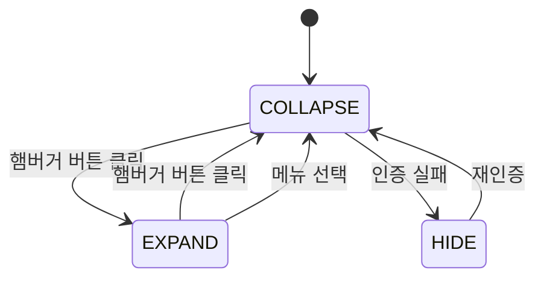
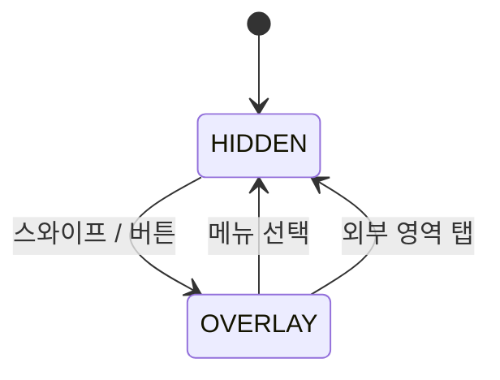

# Handbook UI/UX 디자인 시스템

## 1. 디자인 시스템 개요

Handbook은 **Material Design 3 (MD3)** 기반의 디자인 시스템을 채택하며, CSS 커스텀 프로퍼티(변수)를 통해 디자인 토큰을 체계적으로 관리한다.

### 디자인 토큰 체계

| 토큰 카테고리 | 접두사 | 역할 |
|--------------|--------|------|
| **Color** | `--md-sys-color-*` | 라이트/다크 테마 컬러 팔레트 |
| **Typography** | `--md-sys-typescale-*` | 타입 스케일 (font, size, line-height) |
| **Elevation** | `--md-sys-elevation-*` | 그림자 레벨 (Level 0~5) |
| **Shape** | `--md-sys-shape-*` | 모서리 라운딩 (none~full) |
| **Motion** | `--md-sys-motion-*` | 애니메이션 이징/지속시간 |

모든 토큰은 `:root[color-theme='light']`와 `:root[color-theme='dark']`에서 각각 정의되어, `color-theme` 속성 전환만으로 테마가 변경된다.

### 기술 스택

- **GWT** 기반 SPA (모듈 동적 로딩)
- **Font Awesome** (Sharp Light/Solid) 아이콘
- **Handsontable** 스프레드시트 엔진
- **RxJS** 반응형 상태 관리
- **PWA** 지원 (Service Worker, manifest.json)

---

## 2. 컬러 시스템

### 라이트/다크 테마

`<html>` 요소의 `color-theme` 속성으로 전환한다.

```html
<html color-theme="light">  <!-- 라이트 모드 -->
<html color-theme="dark">   <!-- 다크 모드 -->
```

다크 모드에서는 `color-scheme: dark`가 자동 적용되어 스크롤바, 폼 요소 등 브라우저 기본 UI도 다크 테마를 따른다.

### Primary 팔레트 (Teal 계열)

| 역할 | 라이트 | 다크 | CSS 변수 |
|------|--------|------|----------|
| Primary | `rgb(0 106 100)` | `rgb(85 218 208)` | `--md-sys-color-primary` |
| On Primary | `rgb(255 255 255)` | `rgb(0 55 52)` | `--md-sys-color-on-primary` |
| Primary Container | `rgb(150 242 231)` | `rgb(0 80 75)` | `--md-sys-color-primary-container` |
| On Primary Container | `rgb(0 32 29)` | `rgb(150 242 231)` | `--md-sys-color-on-primary-container` |

### Secondary 팔레트 (Pink 계열)

| 역할 | 라이트 | 다크 | CSS 변수 |
|------|--------|------|----------|
| Secondary | `rgb(160 0 79)` | `rgb(255 177 197)` | `--md-sys-color-secondary` |
| On Secondary | `rgb(255 255 255)` | `rgb(101 0 48)` | `--md-sys-color-on-secondary` |
| Secondary Container | `rgb(255 217 225)` | `rgb(143 0 70)` | `--md-sys-color-secondary-container` |
| On Secondary Container | `rgb(63 0 27)` | `rgb(255 217 225)` | `--md-sys-color-on-secondary-container` |

### Tertiary 팔레트 (Purple 계열)

| 역할 | 라이트 | 다크 | CSS 변수 |
|------|--------|------|----------|
| Tertiary | `rgb(129 0 150)` | `rgb(249 171 255)` | `--md-sys-color-tertiary` |
| On Tertiary | `rgb(255 255 255)` | `rgb(87 0 102)` | `--md-sys-color-on-tertiary` |
| Tertiary Container | `rgb(255 214 254)` | `rgb(123 0 143)` | `--md-sys-color-tertiary-container` |
| On Tertiary Container | `rgb(53 0 63)` | `rgb(255 214 254)` | `--md-sys-color-on-tertiary-container` |

### Error 팔레트

| 역할 | 라이트 | 다크 | CSS 변수 |
|------|--------|------|----------|
| Error | `rgb(179 38 29)` | `rgb(255 180 171)` | `--md-sys-color-error` |
| On Error | `rgb(255 255 255)` | `rgb(105 0 5)` | `--md-sys-color-on-error` |
| Error Container | `rgb(255 218 214)` | `rgb(147 0 15)` | `--md-sys-color-error-container` |
| On Error Container | `rgb(65 0 2)` | `rgb(255 218 214)` | `--md-sys-color-on-error-container` |

### Surface Container 계층

Surface Container는 배경 레이어의 시각적 계층을 표현한다. Lowest에서 Highest로 갈수록 점점 색상이 강해진다.

| 레벨 | 라이트 | 다크 | CSS 변수 |
|------|--------|------|----------|
| Lowest | `rgb(255 255 255)` | `rgb(21 23 23)` | `--md-sys-color-surface-container-lowest` |
| Low | `rgb(238 246 244)` | `rgb(34 37 36)` | `--md-sys-color-surface-container-low` |
| (기본) | `rgb(232 243 241)` | `rgb(39 41 40)` | `--md-sys-color-surface-container` |
| High | `rgb(225 240 237)` | `rgb(49 52 51)` | `--md-sys-color-surface-container-high` |
| Highest | `rgb(220 238 235)` | `rgb(60 63 62)` | `--md-sys-color-surface-container-highest` |

### 다이나믹 컬러 적용

- **Drawer 배경**: `color-mix(in srgb, var(--md-sys-color-surface-container-high) 60%, transparent)` -- 반투명 배경 + `backdrop-filter: blur(5px)`로 글래스모피즘 효과
- **Scrim (배경 딤)**: `color-mix(in srgb, var(--md-sys-color-scrim) 30%~60%, transparent)` -- 오버레이/코치마크에서 사용
- **링크 호버**: `color-mix(in srgb, var(--md-sys-color-primary) 80%, black)` -- Primary 색상에 검정을 20% 혼합

### 확장 컬러

| 역할 | CSS 변수 |
|------|----------|
| Custom Color | `--md-extended-color-custom-color-color` |
| On Custom Color | `--md-extended-color-custom-color-on-color` |
| Custom Color Container | `--md-extended-color-custom-color-color-container` |
| On Custom Color Container | `--md-extended-color-custom-color-on-color-container` |

---

## 3. 타이포그래피

### 폰트 패밀리

| 용도 | 폰트 | CSS 변수 |
|------|-------|----------|
| 헤드라인/라벨 | Montserrat, 'Noto Sans KR', serif | `--md-sys-typescale-headline-large-font` |
| 본문 (모노스페이스) | 'IBM Plex Mono', 'Nanum Gothic Coding', monospace | `--md-sys-typescale-body-large-font` |
| Plain 참조 | 'IBM Plex Mono', 'Nanum Gothic Coding', monospace | `--md-ref-typeface-plain` |

본문에 모노스페이스 폰트를 사용하는 것은 문서 관리 시스템의 데이터 특성(코드, 시리얼 번호, 구조화된 데이터)에 적합한 선택이다.

### MD3 타입 스케일

| 스케일 | Size | Line Height | Font | CSS 변수 (size) |
|--------|------|-------------|------|-----------------|
| Display Large | 3.5625rem (57px) | 4rem (64px) | Montserrat | `--md-sys-typescale-display-large-size` |
| Display Medium | 2.8125rem (45px) | 3.25rem (52px) | Montserrat | `--md-sys-typescale-display-medium-size` |
| Display Small | 2.25rem (36px) | 2.75rem (44px) | Montserrat | `--md-sys-typescale-display-small-size` |
| Headline Large | 2rem (32px) | 3rem (48px) | Montserrat | `--md-sys-typescale-headline-large-size` |
| Headline Small | 1rem (16px) | 1.5rem (24px) | Montserrat | `--md-sys-typescale-headline-small-size` |
| Title Large | 1.375rem (22px) | 1.75rem (28px) | Montserrat | `--md-sys-typescale-title-large-size` |
| Title Medium | 1rem (16px) | 1.5rem (24px) | Montserrat | `--md-sys-typescale-title-medium-size` |
| Title Small | 0.75rem (12px) | 1.25rem (20px) | -- | `--md-sys-typescale-title-small-size` |
| Body Large | 1rem (16px) | 1.25rem (20px) | IBM Plex Mono | `--md-sys-typescale-body-large-size` |
| Body Medium | 0.875rem (14px) | 1rem (16px) | IBM Plex Mono | `--md-sys-typescale-body-medium-size` |
| Body Small | 0.6875rem (11px) | 1rem (16px) | -- | `--md-sys-typescale-body-small-size` |
| Label Large | 0.75rem (12px) | 1rem (16px) | Montserrat | `--md-sys-typescale-label-large-size` |
| Label Medium | 0.6875rem (11px) | 1rem (16px) | -- | `--md-sys-typescale-label-medium-size` |
| Label Small | 0.625rem (10px) | 1rem (16px) | -- | `--md-sys-typescale-label-small-size` |

### 폰트 렌더링

```css
-webkit-font-smoothing: subpixel-antialiased;
font-kerning: auto;
font-optical-sizing: auto;
```

---

## 4. 엘리베이션 (그림자)

MD3 엘리베이션은 `box-shadow`로 구현되며, 두 개의 그림자(키 라이트 + 앰비언트 라이트)를 조합한다.

| 레벨 | 그림자 값 | 주요 사용처 | CSS 변수 |
|------|-----------|-------------|----------|
| Level 0 | `none` | 평면 요소 | `--md-sys-elevation-level0` |
| Level 1 | `0 1px 2px rgba(0,0,0,0.3), 0 1px 3px 1px rgba(0,0,0,0.15)` | 카드, 타입 박스 | `--md-sys-elevation-level1` |
| Level 2 | `0 1px 2px rgba(0,0,0,0.3), 0 2px 6px 2px rgba(0,0,0,0.15)` | 토스트, 코치마크 툴팁, 컨텍스트 메뉴 | `--md-sys-elevation-level2` |
| Level 3 | `0 1px 3px rgba(0,0,0,0.3), 0 4px 8px 3px rgba(0,0,0,0.15)` | 다이얼로그, Drawer (라이트 모드) | `--md-sys-elevation-level3` |
| Level 4 | `0 2px 3px rgba(0,0,0,0.3), 0 6px 10px 4px rgba(0,0,0,0.15)` | 높은 강조 요소 | `--md-sys-elevation-level4` |
| Level 5 | `0 4px 4px rgba(0,0,0,0.3), 0 8px 12px 6px rgba(0,0,0,0.15)` | 최상위 오버레이 | `--md-sys-elevation-level5` |

> **참고**: 다크 모드에서도 동일한 그림자 값을 사용한다. 다크 모드의 Drawer는 그림자 없이 배경색 차이로 계층을 표현한다.

---

## 5. 셰이프 (모서리)

| 토큰 | 값 | 사용처 | CSS 변수 |
|------|-----|--------|----------|
| None | `0` | 테두리 없는 요소 | `--md-sys-shape-corner-none` |
| Extra Small | `4px` | 컨텍스트 메뉴 (`.ctx-menu`) | `--md-sys-shape-corner-extra-small` |
| Small | `8px` | 버튼, 컨트롤러 버튼, 타입 탭, 토스트 | `--md-sys-shape-corner-small` |
| Medium | `12px` | 타입 박스 (`.type-box`), 에이전트 로그 | `--md-sys-shape-corner-medium` |
| Large | `16px` | 모바일 확인 다이얼로그 하단 시트 | `--md-sys-shape-corner-large` |
| Extra Large | `28px` | 다이얼로그 (`.ws-dialog`, `.attr-editor-dialog`), 에이전트 입력 | `--md-sys-shape-corner-extra-large` |
| Full | `9999px` | 선택 인디케이터 (pill shape), 확장 메뉴 아이템 | `--md-sys-shape-corner-full` |

### 컴포넌트별 적용 예시

```
Dialog       → corner-extra-large (28px)
Agent Input  → corner-extra-large (28px)
Type Box     → corner-medium (12px)
Toast        → corner-small (8px)
Button       → corner-small (8px)
Context Menu → corner-extra-small (4px)
Active Item  → corner-full (pill)
```

---

## 6. 모션

### Easing Curves

| 이름 | 값 | 용도 | CSS 변수 |
|------|-----|------|----------|
| Standard | `cubic-bezier(0.2, 0, 0, 1)` | 일반 전환 | `--md-sys-motion-easing-standard` |
| Standard Decelerate | `cubic-bezier(0, 0, 0, 1)` | 요소 진입 | `--md-sys-motion-easing-standard-decelerate` |
| Standard Accelerate | `cubic-bezier(0.3, 0, 1, 1)` | 요소 퇴장 | `--md-sys-motion-easing-standard-accelerate` |
| Emphasized | `cubic-bezier(0.2, 0, 0, 1)` | 강조 전환 (Drawer 등) | `--md-sys-motion-easing-emphasized` |
| Emphasized Decelerate | `cubic-bezier(0.05, 0.7, 0.1, 1)` | 강조 진입 | `--md-sys-motion-easing-emphasized-decelerate` |
| Emphasized Accelerate | `cubic-bezier(0.3, 0, 0.8, 0.15)` | 강조 퇴장 | `--md-sys-motion-easing-emphasized-accelerate` |

### Duration Tokens

| 토큰 | 시간 | 적용 사례 | CSS 변수 |
|------|------|-----------|----------|
| Short 1 | 50ms | 마이크로 인터랙션 | `--md-sys-motion-duration-short1` |
| Short 2 | 100ms | 프레임 전환 (`.frame` transition) | `--md-sys-motion-duration-short2` |
| Short 3 | 150ms | 리사이즈 핸들 페이드, 속성 삭제 버튼 | `--md-sys-motion-duration-short3` |
| Short 4 | 200ms | 타입 탭 배경 전환, 타입 박스 그림자 | `--md-sys-motion-duration-short4` |
| Medium 1 | 250ms | -- | `--md-sys-motion-duration-medium1` |
| Medium 2 | 300ms | Drawer 배경/그림자 전환, 토스트 진입/퇴장 | `--md-sys-motion-duration-medium2` |
| Medium 3 | 350ms | -- | `--md-sys-motion-duration-medium3` |
| Medium 4 | 400ms | Rail 너비 전환, 워크스페이스 드롭다운 | `--md-sys-motion-duration-medium4` |
| Long 1 | 450ms | -- | `--md-sys-motion-duration-long1` |
| Long 2 | 500ms | 에이전트 네비게이트 페이드아웃, 뮤테이트 로그 페이드아웃 | `--md-sys-motion-duration-long2` |

### 적용 사례

- **Rail 확장/축소**: `width 400ms cubic-bezier(.2,0,0,1)` -- Emphasized easing으로 부드러운 너비 전환
- **프레임 전환**: `all 100ms ease-in-out` -- 빠른 fade + slide (`.frame-in`: 위에서, `.frame-out`: 아래로)
- **토스트 진입**: `translateX(20px) -> 0` 0.3s ease -- 오른쪽에서 슬라이드 인
- **다이얼로그 열기**: `opacity 0, translateY(-48%) -> translateY(-50%)` 0.2s -- 위로 살짝 올라오며 등장
- **하이라이트 펄스**: `outline-color` 1s infinite -- Primary 색상 깜빡임

---

## 7. 레이아웃 구조

### MD3 네비게이션 이분법 (2026-04 재정의)

**전역 액션 축 (AppBar)** 와 **네비게이션 축 (Rail / Tabs)** 을 직교 분리.

| 축 | 책임 | 컴포넌트 | MD3 대응 |
|----|------|----------|---------|
| 전역 액션 | 컨텍스트(워크스페이스) + 세션/전역 액션 (테마, Sign In/Out) | `ShellAppBarElement` (leading/center/trailing 3 slot) | Top App Bar (Small) |
| 네비게이션 | 모듈 전환 (Menu 목록) | 데스크톱: `MenuRailElement` / 모바일: `MobileTabsElement` | Navigation Rail / Scrollable Tabs |
| 도구 | 현재 모듈 내 Tool 목록 | `ToolRailElement` | Secondary Rail |

**`Menu.appBarSlot`** 필드로 특정 메뉴(예: `login` SIGN_IN/SIGN_OUT)를 네비게이션 축에서 빼고 AppBar slot 으로 승격 — 세션 액션 semantic 을 네비게이션과 혼동하지 않게 한다. 상세 규약은 `docs/contracts/menus.md#appbarslot-규약`.

### 전체 레이아웃 (데스크톱) — MD3 Top App Bar + Navigation Rail

```
┌────────┬─────────────────────────────────────────────────────┐
│        │ Shell App Bar (fixed, left: drawer-width, right: 0) │
│        │ [▼ Workspace]            [Theme] [Sign Out]         │
│ Drawer ├─────────────────────────────────────────────────────┤
│ fixed  │ Progress Bar                                        │
│ top: 0 ├─────────────────────────────────────────────────────┤
│ 56 /   │                                                     │
│ 256px  │            Frame (전역 깔림 — Drawer 반투명           │
│        │            배경 너머로 비쳐 보임)                     │
│ Menu   │                                                     │
│ Rail + │     ┌─────────────────────────────────────┐         │
│ Tool   │     │  Agent Input (하단 중앙, max-w: 720)│         │
│ Rail   │     └─────────────────────────────────────┘         │
└────────┴─────────────────────────────────────────────────────┘
```

**정석 배치 (2026-04 재구조):** Drawer 가 `fixed top:0 bottom:0 left:0` 로 viewport 전체 세로를 차지하고, AppBar 는 `left: var(--shell-drawer-width)` 로 Drawer 오른쪽만. Frame 은 `left: var(--shell-frame-left-offset) + 16px, top: appbar + mobile-tabs + 16px, right:16px, bottom:16px` 로 **rail 의 collapse 폭 고정 오프셋** + 상하좌우 16px 여백 안에 배치된다. AppBar scroll 상태는 `window.scrollY>0` 시 `[scrolled]` 속성 자동 토글 — 기본 Surface / scrolled 시 Surface-container + elevation 2 로 전환(MD3 Small Top App Bar 스펙 준수).

> **Rail EXPAND = 본문 overlay 의도**: Frame left 는 `--shell-drawer-width` (동적, rail 상태에 따라 확장) 가 아니라 `--shell-frame-left-offset` (collapse 폭 고정) 을 쓴다. 사용자가 rail 을 EXPAND 하면 rail 이 본문 위로 overlay 되는 것이 MD3 Standard Navigation Drawer 의 의도된 동작이므로, 본문은 rail collapse 만큼의 오프셋을 유지하고 rail EXPAND 는 반투명 surface 로 본문 위로 슬라이드 된다.

**CSS 토큰 공유:** `:root` 에 `--shell-drawer-width` (AppBar/MobileTabs 용, 동적) + `--shell-frame-left-offset` (Frame 용, 고정) + `--shell-mobile-tabs-height` (Frame 상단 오프셋, 모바일 전용) + `--shell-app-bar-height` 네 개를 두고 `body:has(...)` 셀렉터로 상태 전이에 따라 재지정. 상세는 [`docs/contracts/frame.md`](contracts/frame.md).

### 전체 레이아웃 (모바일, ≤ 768px)

```
┌──────────────────────────────────┐
│ Shell App Bar (56px)             │
│ [▼ Workspace]       [Theme][Out] │
├──────────────────────────────────┤
│ ◀ Tabs (menu-tabs, scrollable)   │
│ [Home] [Docs] [Types] [… more]   │
├──────────────────────────────────┤
│                                  │
│     Frame (콘텐츠 영역)           │
│                                  │
│  ┌────────────────────────────┐  │
│  │ Agent Input (fixed bottom) │  │
│  └────────────────────────────┘  │
├──────────────────────────────────┤
│   도구 2개↑ 선택 시 ToolRail 드릴인│
│   (하단 바 slide-up)              │
└──────────────────────────────────┘
```

모바일 핵심 변경:
- MenuRail 은 `.menu-rail[mobile] { display:none }` — 네비는 상단 MobileTabs 가 전담.
- 햄버거 토글은 `.menu-rail > #menu-toggle-button` (MD3 Navigation Rail 정석 위치). 모바일(`.menu-rail[mobile]`) 에서는 CSS `display:none` — 네비가 MobileTabs 로 이관되어 Drawer overlay 실질 용도 없음.
- `MobileTabsElement` 3단계 폴백: 평면 → overflow 팝업 → 스크롤. `bottom=true` 메뉴는 overflow 로 먼저 수렴.

### 주요 영역 치수

| 영역 | 크기 | 비고 |
|------|------|------|
| Navigation Rail (Collapse) | 56px 너비 | 아이콘만 표시 |
| Navigation Rail (Expand) | 256px (16rem) 너비 | 아이콘 + 라벨 |
| Tool Rail (Expand) | 256px 너비 | 도구 목록 표시 |
| Frame 영역 (desktop) | `left: calc(3.5rem + 16px), right: 16px, top: calc(56px + 16px), bottom: 16px` | rail collapse 오프셋 + 16px 여백. rail EXPAND 는 본문 위 overlay (의도) |
| Frame 영역 (mobile) | `left: 16px, right: 16px, top: calc(56px + 49px + 16px), bottom: 16px` | AppBar + MobileTabs 높이 합산 + 16px 여백 |
| Agent Input | `max-width: 720px`, 하단 중앙 | 에이전트 명령 입력 |
| Toast Container | 우측 상단 `top: 60px, right: 20px` | 최대 400px 너비 |

### Drawer 토글 메커니즘

**데스크톱 상태 전이:**



**모바일 상태 전이 (< 768px):**



### Frame 전환 애니메이션

프레임 컨테이너는 GWT 모듈을 동적으로 로딩한다. 메뉴 전환 시:

1. 현재 프레임에 `.frame-out` 적용 (위로 1rem 이동 + opacity 0)
2. 100ms 후 DOM에서 제거
3. 새 프레임에 `.frame-in` 적용 (아래로 1rem에서 시작 + opacity 0)
4. `.frame-in` 제거 -> 정상 위치로 fade-in

---

## 8. 반응형 디자인

### Breakpoint 정의

| 이름 | 범위 | 레이아웃 변경 |
|------|------|--------------|
| **Compact** | < 480px | 하단 네비게이션 + 카드 뷰 전환 |
| **Medium** | 480px ~ 768px | 하단 네비게이션 + 수평 스크롤 스프레드시트 |
| **Expanded** | >= 768px | 좌측 Navigation Rail + Tool Rail |

### Compact (< 480px)

- 컨트롤러 패딩 축소 (`4px`)
- 액션 버튼이 전체 너비로 확장
- 에이전트 확인 다이얼로그가 하단 시트로 전환 (`border-radius: 16px 16px 0 0`)
- 스프레드시트가 `CardViewElement`로 대체 가능

### Medium (480px ~ 768px)

- Navigation Rail이 하단으로 이동 (Bottom Navigation, 56px 높이)
- Rail이 가로 방향 flex (`flex-direction: row`)
- Frame이 `left: 0, bottom: 56px`으로 조정
- 스프레드시트의 serial 컬럼 고정, 나머지 수평 스크롤
- 타입 탭 수평 스크롤 (`-webkit-overflow-scrolling: touch`)
- 에이전트 입력 border-radius 축소 (20px)
- 뮤테이트 로그가 전체 너비로 확장

### Expanded (>= 768px)

- 좌측 Navigation Rail (56px collapse / 256px expand)
- Tool Rail 별도 표시
- 스프레드시트 전체 너비
- 에이전트 입력 max-width 720px

### 터치 타겟

모바일에서 모든 인터랙티브 요소는 최소 **48dp** (48px) 터치 타겟을 보장한다:

```css
/* 버튼 */
.doc-ctrl-btn    { min-height: 48px; min-width: 48px; }
.doc-type-tab    { min-height: 48px; }
.ws-submit       { min-height: 48px; }

/* 에이전트 */
.agent-input-send, .agent-input-abort { min-height: 48px; min-width: 48px; }

/* 라디오 */
.ws-section input[type="radio"] { min-width: 24px; min-height: 24px; }
```

---

## 9. 주요 컴포넌트

### Navigation Rail

좌측 네비게이션으로, 메뉴 간 전환을 담당한다.

| 속성 | 값 |
|------|-----|
| Collapse 너비 | 56px (`3.5rem`) |
| Expand 너비 | 256px (`16rem`) |
| 아이템 최소 높이 | 56px |
| 패딩 | 12px (top/bottom), 16px (inline) |
| 폰트 | Headline Large font (Montserrat) |
| 전환 애니메이션 | `width 400ms cubic-bezier(.2,0,0,1)` |

**Active Indicator (선택 상태)**:
- Collapse: `background: var(--md-sys-color-secondary-container)`, `border-radius: var(--md-sys-shape-corner-full)` (pill shape), `padding: 4px 20px`
- Expand: `color: var(--md-sys-color-primary)`, 아이콘도 동일 색상

**State Layer (리플 효과)**:
- Hover: `var(--md-sys-color-on-surface)` 8% opacity
- Pressed: `var(--md-sys-color-on-surface)` 12% opacity

### Drawer

메뉴/도구 Rail을 감싸는 컨테이너.

| 속성 | 값 |
|------|-----|
| z-index | 1000 |
| 배경 | `color-mix(in srgb, var(--md-sys-color-surface-container-high) 60%, transparent)` |
| Backdrop filter | `blur(5px)` |
| 전환 | `background-color, box-shadow, border-radius 300ms ease-in-out` |
| 라이트 모드 그림자 | `var(--md-sys-elevation-level3)` (열린 상태) |
| 다크 모드 그림자 | 없음 (배경색으로 구분) |
| 헤더 워크스페이스 | 최대 384px (`24rem`), outlined select, **중앙 정렬** (`justify-content: center`) |

### 스프레드시트 (Document-UI)

Handsontable 6.2.4 (MIT) 기반의 문서 편집기. MD3 디자인 토큰으로 테마 통일.

```
┌─────────────────────────────────────────────────────┐
│ 컨트롤러 툴바                                        │
│ ┌──────────────────┐  ┌───┬───┬───┬───┬───┐        │
│ │ Customer │ Order │  │ + │ - │💾3│ ↩ │ ↪ │        │
│ │  (타입 탭)       │  │Add│Del│Sav│Und│Red│        │
│ └──────────────────┘  └───┴───┴───┴───┴───┘        │
├─────────────────────────────────────────────────────┤
│ Serial   │ Name     │ Age  │ Email                  │
│──────────┼──────────┼──────┼────────────────────────│
│▎CUST-003 │ 새문서    │      │                (생성)  │
│ CUST-001 │ 홍길동    │ [30] │ hong@example.com (수정)│
│ C̶U̶S̶T̶-̶0̶0̶2̶ │ 김̶철̶수̶    │ 2̶5̶   │ k̶i̶m̶@̶e̶x̶a̶m̶p̶l̶e̶.̶c̶o̶m̶  (삭제)│
│          │          │      │  (Handsontable)         │
├─────────────────────────────────────────────────────┤
│                  < 1 2 3 >  (페이지네이션)            │
└─────────────────────────────────────────────────────┘
```

#### 컨트롤러 & 탭

| 요소 | 스타일 |
|------|--------|
| 컨트롤러 | `padding: 8px 16px`, `border-bottom: 1px solid var(--md-sys-color-outline-variant)` |
| 타입 탭 (기본) | `font-size: label-large`, `border-radius: var(--md-sys-shape-corner-small)`, `color: on-surface-variant` |
| 타입 탭 (선택) | `background: primary-container`, `color: on-primary-container` |
| 버튼 | `border: 1px solid outline`, `border-radius: var(--md-sys-shape-corner-small)`, `background: surface-container` |
| 버튼 (hover) | `background: surface-container-high` |
| 비활성 버튼 | `opacity: 0.4`, `cursor: not-allowed` |
| Save 뱃지 | 더티 건수 표시 (예: `Save (3)`), 더티 없으면 비활성화 |

#### 테이블 구조

| 요소 | 스타일 |
|------|--------|
| 외곽 | `border-radius: 0.5rem`, 외곽 보더만 `outline` 색상 |
| 내부 셀 | 세로 구분선 제거, 가로 구분선 `outline-variant` |
| 헤더 (th) | `surface-container` 배경, `headline-small` 타이포 |
| 셀 (td) | `surface-container` 배경, `body-medium` 타이포 |
| 읽기 전용 셀 | `surface-container-low` 배경, `on-surface-variant` 색상 |
| 행 호버 | `on-surface` 8% 혼합 배경 |
| 짝수 행 | `surface-container-low` 배경 (zebra striping) |

#### 셀 인터랙션

| 상태 | 스타일 |
|------|--------|
| 현재 셀 | `primary` 보더, `primary` 8% 혼합 배경 |
| 선택 영역 | `primary` 보더, `primary` 12% 혼합 배경 |
| 선택된 헤더 | `primary-container` 배경 |
| 편집 중 | `secondary` 2px inset shadow, `surface-bright` 배경 |
| 포커스 | `secondary` 2px outline (접근성) |

#### 더티 트래킹 상태

| 상태 | 스타일 | 설명 |
|------|--------|------|
| 생성 (created) | `tertiary-container` 배경, 좌측 3px `tertiary` 보더 | 로컬에서 새로 추가된 행 |
| 수정 (changed) | `tertiary` 1px inset box-shadow | 원본 대비 값이 변경된 셀 |
| 삭제 예정 (deleted) | 취소선, 텍스트 75% 투명화 | Save 시 서버에서 삭제 |
| 유효 (valid) | `primary` 텍스트 색상 | 서버 검증 통과 |
| 유효하지 않음 (invalid) | `error` 텍스트, `error` 1px inset shadow | 필수값 누락/형식 오류 |
| 충돌 (conflict) | `secondary-container` 배경, `secondary` 2px 좌측 보더 | 다른 사용자와 동시 수정 |

#### 트랜지션

모든 배경색 전환에 `var(--md-sys-motion-duration-medium2)` `var(--md-sys-motion-easing-standard)` 적용.

### 캔버스 (Type-UI)

타입 스키마를 시각적으로 편집하는 캔버스.

| 요소 | 스타일 |
|------|--------|
| 캔버스 배경 | 20px 격자 그리드, `outline-variant` 색상 |
| 타입 박스 | `border-radius: 12px`, `background: surface-container`, `border: 1px solid outline-variant` |
| 타입 박스 (hover) | `box-shadow: 0 4px 12px rgba(0,0,0,0.15)`, `translateY(-1px)` |
| 타입 박스 (선택) | `border-color: primary`, `box-shadow: 0 0 0 2px primary` |
| 타입 헤더 | `padding: 10px 14px`, `background: surface-container-high` |
| 타입 이름 | `font-weight: 600`, `14px` |
| 버전 뱃지 | `12px`, `background: surface-container-highest`, `border-radius: 10px` |
| 속성 행 | `padding: 4px 14px`, `13px`, hover 시 배경 변경 |
| 드래그 고스트 | `border: 3px dashed primary`, `border-radius: 12px`, 15% primary 배경 |

**리사이즈 핸들**: 우하단 12x12px, hover 시에만 표시 (opacity 0 -> 1, 150ms)

**화살표 커넥터**: SVG 기반, `pointer-events: none`, `z-index: 5`

### 컨텍스트 메뉴

타입 캔버스에서 우클릭 시 표시되는 메뉴.

| 속성 | 값 |
|------|-----|
| 최소 너비 | 180px |
| 배경 | `var(--md-sys-color-surface-container)` |
| 모서리 | `var(--md-sys-shape-corner-extra-small)` (4px) |
| 그림자 | `var(--md-sys-elevation-level2)` |
| 테두리 | `1px solid var(--md-sys-color-outline-variant)` |
| 아이템 패딩 | `8px 16px` |
| 진입 애니메이션 | `scale(0.95) -> scale(1)` 120ms |

### 다이얼로그

| 속성 | 값 |
|------|-----|
| 모서리 | `var(--md-sys-shape-corner-extra-large)` (28px) |
| 그림자 | `var(--md-sys-elevation-level3)` 또는 `0 8px 32px rgba(0,0,0,0.25)` |
| 패딩 | 24px |
| 배경 | `var(--md-sys-color-surface)` 또는 `surface-container-high` |
| Scrim | `color-mix(in srgb, var(--md-sys-color-scrim) 30%, transparent)` |
| 진입 애니메이션 | `opacity 0, translateY(-48%) -> translateY(-50%)` 200ms |

**워크스페이스 다이얼로그** (`.ws-dialog`): 420px 너비, CREATE/JOIN 라디오 섹션, 디바이더, 모바일에서 전체 화면

### 에이전트 입력

하단 고정 검색 바 스타일의 AI 에이전트 입력 필드.

| 속성 | 값 |
|------|-----|
| 래퍼 | `max-width: 720px`, `border-radius: 28px`, `padding: 6px 6px 6px 24px` |
| 배경 | `var(--md-sys-color-surface-container-low)` |
| 그림자 | `0 4px 24px rgba(0,0,0,0.15), 0 0 0 1px rgba(0,0,0,0.05)` |
| 포커스 그림자 | `0 6px 32px color-mix(primary 25%)`, `0 0 0 2px primary` |
| 입력 필드 | `16px`, `line-height: 24px`, `padding: 12px 0` |
| 전송 버튼 | `border-radius: 22px`, `background: primary`, `padding: 10px 20px` |
| 중단 버튼 | `border-radius: 22px`, `background: error` |

**Kafka 이벤트 브로드캐스트**: 에이전트 응답은 Kafka AGENT_COMMAND 이벤트로 발행되어 event-broadcaster를 통해 워크스페이스 SSE(`/workspaces/{id}/messages`)로 브로드캐스트된다. 별도 SSE 연결 없이 기존 워크스페이스 이벤트 스트림에서 수신하며, 진행 상황은 상단 Progress Bar에 표시.

**에이전트 UX 원칙 — "동료가 내 화면을 대신 조작해주는 느낌"**: 에이전트 커맨드 수신 시 단순히 결과를 표시하는 것이 아니라, 시각적 애니메이션으로 실행하여 마치 동료가 화면을 조작하는 듯한 경험을 제공한다:
- `navigate` 수신 → 화면 전환 애니메이션 (페이드아웃 + 모듈 로딩 인디케이터)
- `mutate` 수신 → 셀이 하나씩 채워지는 효과 (순차적 변경 로그 표시, 3초 후 페이드아웃)
- `highlight` 수신 → 시선 유도 (대상 요소에 펄스 애니메이션 + 자동 스크롤)
- `attention` 수신 → 코치마크/스포트라이트로 설명 동반 안내

**실시간 협업 UI**: 같은 워크스페이스의 모든 참여자(사용자 + 에이전트)가 동일한 SSE 스트림을 구독하므로, 다른 사용자의 데이터 변경(DOCUMENT_CREATED, TYPE_CREATED 등)도 동일한 이벤트 채널로 수신된다. 이벤트 수신 시 해당 UI 영역을 자동 갱신하여 실시간 협업을 지원한다.

**Preview/Confirm 패턴**: 에이전트 제안 사항은 Before/After 비교 패널로 미리보기 후 확인/거절할 수 있다.

### 토스트 / 스낵바

우측 상단에 표시되는 알림 메시지.

| 유형 | 배경 | 텍스트 | 용도 |
|------|------|--------|------|
| Info | `var(--md-sys-color-primary)` | `var(--md-sys-color-on-primary)` | 일반 안내 |
| Success | `var(--md-sys-color-tertiary)` | `var(--md-sys-color-on-tertiary)` | 성공 완료 |
| Warning | `var(--md-sys-color-error-container)` | `var(--md-sys-color-on-error-container)` | 경고 |
| Error | `var(--md-sys-color-error)` | `var(--md-sys-color-on-error)` | 오류 |

| 속성 | 값 |
|------|-----|
| 위치 | `fixed, top: 60px, right: 20px` |
| 최대 너비 | 400px |
| 모서리 | 8px |
| 그림자 | `var(--md-sys-elevation-level2)` |
| 진입 | `translateX(20px) -> 0` 0.3s |
| 퇴장 | `opacity 1 -> 0, translateY(-10px)` 0.3s |

### Diff 패널

에이전트 변경 사항을 Before/After로 비교하는 패널.

| 속성 | 값 |
|------|-----|
| 위치 | `fixed, right: 20px, top: 60px` |
| 너비 | 320px ~ 450px |
| Before 텍스트 | `line-through`, `color: error` |
| After 텍스트 | `color: tertiary` |
| 화살표 | `color: outline` |
| 진입 | `translateX(20px) -> 0` 0.3s |

### Highlight / Scroll Indicator

| 요소 | 스타일 |
|------|--------|
| Highlight | `outline: 3px solid primary`, 1s 무한 펄스 |
| Scroll Arrived | `outline: 3px solid error-container`, `outline-offset: 4px`, 0.5s 펄스 3회 |

### 대시보드 (Dashboard-UI)

워크스페이스 현황을 한눈에 파악할 수 있는 대시보드 화면이다. Shell에서 메뉴 선택으로 동적 로딩된다.

```
┌──────────────────────────────────────────────────────────────┐
│ 통계 카드 (MD3 Card, flex row, gap: 16px)                     │
│ ┌────────────┐ ┌────────────┐ ┌────────────┐ ┌────────────┐ │
│ │  타입 수    │ │  문서 수    │ │  사용자 수  │ │ 품질 점수   │ │
│ │  12        │ │  1,245     │ │  8         │ │  87%       │ │
│ └────────────┘ └────────────┘ └────────────┘ └────────────┘ │
├──────────────────────────────────────────────────────────────┤
│ 품질 점수 차트                │  최근 변경 타임라인             │
│ ┌─────────────────────┐     │  ┌─────────────────────────┐  │
│ │  타입별 품질 점수      │     │  │ 10:30  문서 생성 (C-003)│  │
│ │  (Bar/Radar chart)   │     │  │ 10:15  타입 변경 (v3)   │  │
│ │                     │     │  │ 09:45  문서 수정 (C-001)│  │
│ └─────────────────────┘     │  └─────────────────────────┘  │
├──────────────────────────────────────────────────────────────┤
│ 에이전트 활동 로그 (시간순 리스트)                               │
│ ┌────────────────────────────────────────────────────────┐   │
│ │ 10:32  [COMPLETE] "3개 타입 생성 완료"                   │   │
│ │ 10:30  [MUTATE] 타입 일괄 생성                          │   │
│ │ 10:28  [NAVIGATE] 타입 캔버스 이동                      │   │
│ └────────────────────────────────────────────────────────┘   │
└──────────────────────────────────────────────────────────────┘
```

| 요소 | 스타일 |
|------|--------|
| 통계 카드 | MD3 Card (`surface-container-low`), `border-radius: 12px`, `padding: 16px 20px` |
| 카드 수치 | `headline-large` (Montserrat), `color: primary` |
| 카드 라벨 | `label-large`, `color: on-surface-variant` |
| 품질 차트 영역 | MD3 Card, `min-height: 240px` |
| 타임라인 아이템 | `padding: 8px 12px`, `border-left: 2px solid outline-variant` |
| 에이전트 로그 아이템 | `padding: 8px 16px`, 아이콘 + 타입 배지 + 설명, hover 시 `surface-container-high` |
| 실시간 갱신 | `/workspaces/{id}/messages` SSE 구독, 이벤트 수신 시 카운터/로그 자동 갱신 |

---

## 10. 접근성

### 터치 타겟

모든 인터랙티브 요소의 터치 타겟은 최소 **48dp**를 보장한다. 모바일 미디어 쿼리에서 `min-height: 48px`, `min-width: 48px`를 명시적으로 설정한다.

### 색상 대비

MD3 컬러 시스템은 4.5:1 이상의 대비비를 보장하도록 설계되었다:
- `on-primary` / `primary` 쌍
- `on-surface` / `surface` 쌍
- `on-error` / `error` 쌍

다크 모드에서는 container 색상의 채도를 낮추고 어둡게 조정하여 대비를 확보한다 (CSS 주석 참조: `[수정] 채도를 낮추고 어둡게 조정`, `[수정] 밝은 텍스트로 대비 확보`).

### 키보드 네비게이션

- 타입 박스에 `outline: none` 기본 + `:focus-visible`에서 `outline: 2px solid primary`, `outline-offset: 2px` 적용
- `-webkit-tap-highlight-color: rgba(0, 0, 0, 0)` 으로 모바일 탭 하이라이트 제거 (커스텀 리플로 대체)
- Rail 아이템에 `outline: none` + 리플 효과로 포커스 표시

### ARIA

- 다이얼로그: `md-dialog` 웹 컴포넌트 사용 (내장 ARIA role)
- 메뉴 아이템: `md-item` 웹 컴포넌트 사용
- 선택 상태: `[selected]` 속성으로 시각적 + 프로그래밍적 표시
- 비활성 상태: `.ctx-disabled`에 `pointer-events: none` + 색상 변경

---

## 11. PWA 지원

### manifest.json

```json
{
  "name": "Handbook",
  "short_name": "Handbook",
  "description": "Document management system with AI agent capabilities",
  "start_url": "/",
  "display": "standalone",
  "background_color": "#ffffff",
  "theme_color": "#1565c0",
  "orientation": "any",
  "icons": [
    { "src": "/icons/icon-192.png", "sizes": "192x192", "type": "image/png" },
    { "src": "/icons/icon-512.png", "sizes": "512x512", "type": "image/png" }
  ]
}
```

### Service Worker

```javascript
if ('serviceWorker' in navigator) {
    navigator.serviceWorker.register('/service-worker.js').catch(function() {});
}
```

- **전략**: Network-first (네트워크 우선, 실패 시 캐시)
- **캐싱 대상**: app shell (HTML, CSS, JS), 아이콘, 폰트
- **오프라인**: 기본 UI 셸은 오프라인에서 로딩 가능, API 호출은 네트워크 필요

### 메타 태그

```html
<meta name="viewport" content="width=device-width, initial-scale=1">
<meta name="theme-color" content="#1565c0">
<link rel="manifest" href="manifest.json">
```

---

## 12. 아이콘

### Font Awesome (Sharp 스타일)

Handbook은 **Font Awesome Sharp** 스타일을 사용한다:

| 스타일 | 파일 | 용도 |
|--------|------|------|
| Sharp Light | `sharp-light.min.js` | 기본 아이콘 (비선택 상태) |
| Sharp Solid | `sharp-solid.min.js` | 강조 아이콘 (선택 상태, 액션 버튼) |

### 아이콘 스타일 가이드

- **Navigation Rail**: Sharp Light (비선택) / Sharp Solid (선택)
- **컨트롤러 버튼**: Sharp Light
- **토스트 닫기**: 텍스트 기반 (`x`)
- **Material Icons**: 일부 시스템 아이콘에 `Material Icons` / `Material Symbols Outlined` 폰트도 병행 사용 (Google Fonts에서 로딩)

### 아이콘 크기

- Rail 아이콘: 기본 크기 (폰트 사이즈 상속)
- 컨트롤러 아이콘: `14px` (Label Large 스케일과 일치)
- 속성 삭제 아이콘: `14px`, hover 시에만 표시

---

## 부록: 컴포넌트 계층 구조

```
global.css (MD3 토큰 정의)
 ├── shell.css ............. Navigation Rail, Drawer, Frame
 ├── ui-components.css ..... Toast, Dialog, Highlight, Diff
 ├── agent.css ............. Agent Input, Preview, Mutation Log
 │
 └── [동적 로딩 모듈별 CSS]
      ├── document-ui.css .. 스프레드시트, 타입 탭, 컨트롤러
      ├── type-ui.css ...... 캔버스, 타입 박스, 컨텍스트 메뉴
      └── workspace.css .... 생성/참여 다이얼로그
```

### CSS 로딩 순서

1. **Google Fonts** (Montserrat, Noto Sans KR, IBM Plex Mono 등)
2. **fontawesome.min.css** (아이콘)
3. **global.css** (디자인 토큰)
4. **shell.css** (레이아웃)
5. **ui-components.css** (공용 컴포넌트)
6. **agent.css** (에이전트 UI)
7. 모듈별 CSS (document-ui, type-ui, workspace 등) -- GWT 모듈 로딩 시 동적 주입
