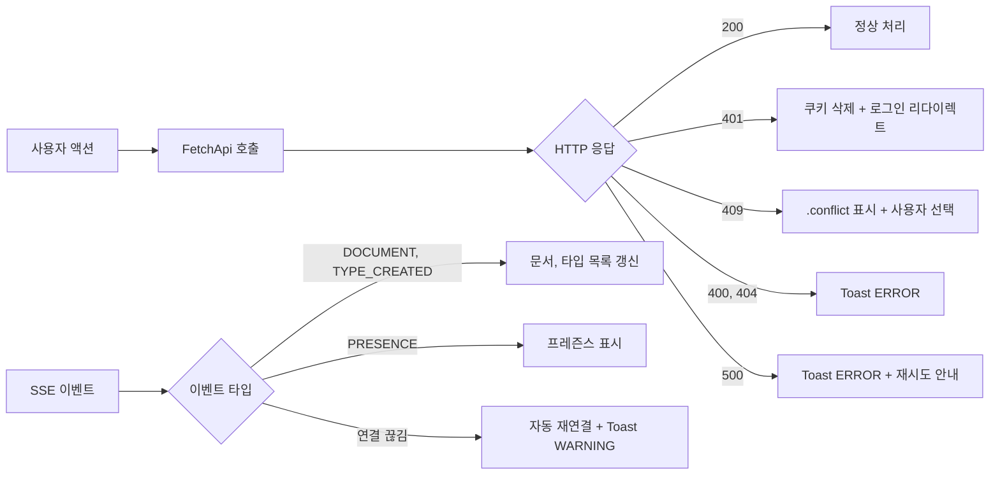
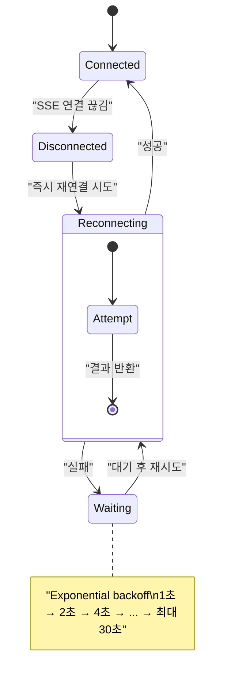

# 오류 처리 전략

## 백엔드 오류 처리

### GlobalExceptionHandler

`authentication` 모듈의 `@RestControllerAdvice`가 모든 백엔드 서비스에서 공유된다. RFC 7807 Problem Detail 형식으로 응답한다.

| HTTP 코드 | Exception | 의미 | 예시 |
|-----------|-----------|------|------|
| 400 | `IllegalArgumentException` | 잘못된 요청 파라미터 | 필수 필드 누락, 잘못된 형식 |
| 401 | `AuthenticationException` | 인증 실패 | JWT 만료, 쿠키 없음 |
| 404 | `NoSuchElementException` | 리소스 없음 | 존재하지 않는 문서/타입 |
| 405 | `UnsupportedOperationException` | 지원하지 않는 작업 | 잘못된 HTTP 메서드 |
| 409 | `DuplicateKeyException` | 충돌 | serial 중복, `@Version` 낙관적 잠금 실패 |
| 500 | `Exception` | 서버 내부 오류 | 예기치 않은 예외 |

### 인증 관련 핸들러

| 핸들러 | 역할 |
|--------|------|
| `NoWwwAuthenticateEntryPoint` | 401 응답 시 `WWW-Authenticate` 헤더 제거 (브라우저 기본 인증 팝업 방지) |
| `ExpiredTokenExceptionHandler` | JWT 만료 시 인증/갱신 쿠키 자동 삭제 (order: -3, 최우선 처리) |
| `AuthorizationExceptionHandler` | `AuthenticationException` 체인 감지 → 401 반환 |

### 낙관적 잠금 (@Version)

`document-command`, `type-command`, `workspace-command` 엔티티에 `@Version` 필드가 있다. 동시 수정 시:

1. 첫 번째 저장 성공 → version 증가
2. 두 번째 저장 시도 → version 불일치 → `DuplicateKeyException` → 409 Conflict
3. 클라이언트가 충돌 상태 표시 → 사용자 선택 (내 변경 유지/서버 수락)

---

## 프론트엔드 오류 처리

### HTTP 응답 분기

```java
switch (response.status) {
    case 200 -> Promise.resolve(response).then(this::parse);
    case 401 -> // 로그인 페이지로 리다이렉트 또는 null 반환
    case 409 -> // 충돌 상태 표시 (.conflict 클래스)
    default  -> Promise.reject("HTTP Error: " + response.status);
}
```

### 토스트 알림 (ToastContainer)

| 레벨 | 배경 색상 | 자동 닫힘 | 용도 |
|------|----------|----------|------|
| `INFO` | `primary` / `on-primary` | 3초 | 정보 알림, 에이전트 작업 완료 |
| `SUCCESS` | `tertiary` / `on-tertiary` | 3초 | 저장 성공, 작업 완료 |
| `WARNING` | `error-container` / `on-error-container` | 수동 닫기 | 협업 충돌 경고, 검증 실패 |
| `ERROR` | `error` / `on-error` | 수동 닫기 | 저장 실패, 서버 오류 |

위치: 우측 상단 고정 (top: 60px, right: 20px, z-index: 10002)

### 확인 다이얼로그 (ConfirmDialog)

- 삭제 확인, 미저장 변경 경고, 에이전트 작업 승인
- MD3 다이얼로그 컨테이너 (`surface-container-high`)
- 사용자 선택을 `onSelect` 콜백으로 전달

### 셀/카드 상태 표시

| 오류 유형 | 시각적 표현 |
|-----------|------------|
| 유효하지 않은 셀 | `.invalid` — error 텍스트 + error 1px inset shadow |
| 충돌 문서/타입 | `.conflict` — secondary-container 배경, secondary 2px 보더 |
| 삭제 예정 | `.deleted` — 취소선 + 75% 투명화 |

---

## 오류 전파 흐름



> **요구사항 참조:** 6.3 에러 핸들링 개선 — API 호출 실패 시 사일런트 실패 금지 (토스트 알림 필수), save/delete/patch 실패 시 충돌 해결 UI, SSE 연결 끊김 시 자동 재연결 + 알림

---

## Graceful Degradation 전략 (7.3 회복성 강화)

선택적 서비스가 장애를 일으키더라도 핵심 기능은 유지되어야 한다.

### 서비스 분류

| 분류 | 서비스 | 장애 시 영향 |
|------|--------|------------|
| **핵심** | gateway, login, document-command, type-command, workspace-command, document-query, type-query | 시스템 사용 불가 — 장애 허용 안 됨 |
| **선택적** | assistant, event-broadcaster, webhook-service | 실시간 기능/AI 기능 중단, CRUD 유지 |

### 선택적 서비스 장애 시 동작

| 서비스 | 정상 | 장애 시 |
|--------|------|---------|
| **event-broadcaster** | SSE 실시간 이벤트 전달 | SSE 연결 끊김 → 클라이언트 재연결 시도 + 수동 새로고침 안내 토스트 |
| **assistant** | AI 에이전트 자연어 처리 | 에이전트 패널에 "서비스 일시 중단" 표시, 수동 CRUD 가능 |
| **webhook-service** | 외부 시스템 콜백 | 실패 이벤트 DB 저장, 서비스 복구 후 재처리 |

### Gateway 레벨 처리 (구현 완료)

```
Gateway → 선택적 서비스 호출 실패
  → CircuitBreaker 필터 → FallbackController (빈 JSON 응답 반환)
  → onErrorResume: 빈 결과 반환 (메뉴 집계)
  → 클라이언트: 기능 비활성화 (핵심 CRUD는 유지)
```

- assistant, event-broadcaster 라우트에 `CircuitBreaker` 필터 적용
- 폴백 URI: `forward:/fallback/empty` → `FallbackController`가 `{"fallback": true, "data": []}` 반환
- 경고 로그 기록 (모니터링 시스템에서 추적)

### SSE 재연결 전략 (7.3) — 서버 측 구현 완료

서버 측: `MessageController`가 각 SSE 이벤트에 `retry(Duration.ofSeconds(5))` 힌트를 포함하여 전송한다. 브라우저의 EventSource가 연결 끊김 시 5초 후 자동 재연결을 시도한다.



- 재연결 중 Toast WARNING: "실시간 연결이 끊어졌습니다. 재연결 시도 중..."
- 재연결 성공 시 Toast INFO: "실시간 연결이 복구되었습니다"
- 최대 재시도 후 실패 시: Toast ERROR + 수동 새로고침 안내

---

## DLQ 에러 복구 흐름 (7.3 회복성 강화)

Kafka 이벤트 처리 실패 시 Dead Letter Queue(DLQ)에 저장하여 데이터 유실을 방지한다.

### DLQ 흐름

```mermaid
flowchart LR
    K["Kafka\nhandbook-events"] --> C["Consumer\n(event-broadcaster)"]
    C -->|처리 성공| SSE["SSE 브로드캐스트"]
    C -->|처리 실패\n(역직렬화 에러, 런타임 예외)| DLQ["handbook-events-dlq\n(Dead Letter Topic)"]
    DLQ --> Monitor["DLQ 모니터링\n(Prometheus 메트릭)"]
    DLQ --> Replay["수동 재처리\n(운영 도구)"]
    Replay -->|재발행| K
```

### DLQ 이벤트 구조

| 헤더 | 값 | 설명 |
|------|------|------|
| `x-original-topic` | `handbook-events` | 원본 토픽 |
| `x-exception-message` | 에러 메시지 | 실패 원인 |
| `x-exception-stacktrace` | 스택 트레이스 | 디버깅용 |
| `x-original-timestamp` | ISO-8601 | 원본 이벤트 발행 시각 |
| `x-correlation-id` | UUID | 요청 추적 ID (7.4) |

### 재처리 정책

| 항목 | 값 |
|------|------|
| 최대 재시도 | 3회 (원본 토픽에서) |
| 재시도 백오프 | 1초, 2초, 4초 (지수 백오프) |
| DLQ 보존 기간 | 7일 |
| 재처리 방법 | 운영 도구를 통한 수동 재발행 또는 자동화 스크립트 |
