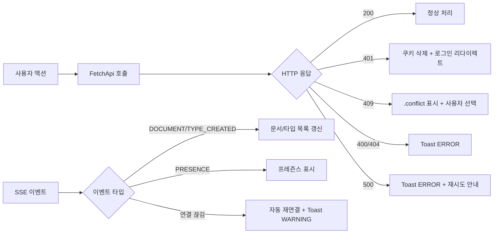

# 오류 처리 전략

## 백엔드 오류 처리

### GlobalExceptionHandler

`authentication` 모듈의 `@RestControllerAdvice`가 모든 백엔드 서비스에서 공유된다. RFC 7807 Problem Detail 형식으로 응답한다.

| HTTP 코드 | Exception | 의미 | 예시 |
|-----------|-----------|------|------|
| 400 | `IllegalArgumentException` | 잘못된 요청 파라미터 | 필수 필드 누락, 잘못된 형식 |
| 401 | `AuthenticationException` | 인증 실패 | JWT 만료, 쿠키 없음 |
| 404 | `NoSuchElementException` | 리소스 없음 | 존재하지 않는 문서/타입 |
| 405 | `UnsupportedOperationException` | 지원하지 않는 작업 | 잘못된 HTTP 메서드 |
| 409 | `DuplicateKeyException` | 충돌 | serial 중복, `@Version` 낙관적 잠금 실패 |
| 500 | `Exception` | 서버 내부 오류 | 예기치 않은 예외 |

### 인증 관련 핸들러

| 핸들러 | 역할 |
|--------|------|
| `NoWwwAuthenticateEntryPoint` | 401 응답 시 `WWW-Authenticate` 헤더 제거 (브라우저 기본 인증 팝업 방지) |
| `ExpiredTokenExceptionHandler` | JWT 만료 시 인증/갱신 쿠키 자동 삭제 (order: -3, 최우선 처리) |
| `AuthorizationExceptionHandler` | `AuthenticationException` 체인 감지 → 401 반환 |

### 낙관적 잠금 (@Version)

`persist-document`, `persist-type`, `persist-workspace` 엔티티에 `@Version` 필드가 있다. 동시 수정 시:

1. 첫 번째 저장 성공 → version 증가
2. 두 번째 저장 시도 → version 불일치 → `DuplicateKeyException` → 409 Conflict
3. 클라이언트가 충돌 상태 표시 → 사용자 선택 (내 변경 유지/서버 수락)

---

## 프론트엔드 오류 처리

### HTTP 응답 분기

```java
switch (response.status) {
    case 200 -> Promise.resolve(response).then(this::parse);
    case 401 -> // 로그인 페이지로 리다이렉트 또는 null 반환
    case 409 -> // 충돌 상태 표시 (.conflict 클래스)
    default  -> Promise.reject("HTTP Error: " + response.status);
}
```

### 토스트 알림 (ToastContainer)

| 레벨 | 배경 색상 | 자동 닫힘 | 용도 |
|------|----------|----------|------|
| `INFO` | `primary` / `on-primary` | 3초 | 정보 알림, 에이전트 작업 완료 |
| `SUCCESS` | `tertiary` / `on-tertiary` | 3초 | 저장 성공, 작업 완료 |
| `WARNING` | `error-container` / `on-error-container` | 수동 닫기 | 협업 충돌 경고, 검증 실패 |
| `ERROR` | `error` / `on-error` | 수동 닫기 | 저장 실패, 서버 오류 |

위치: 우측 상단 고정 (top: 60px, right: 20px, z-index: 10002)

### 확인 다이얼로그 (ConfirmDialog)

- 삭제 확인, 미저장 변경 경고, 에이전트 작업 승인
- MD3 다이얼로그 컨테이너 (`surface-container-high`)
- 사용자 선택을 `onSelect` 콜백으로 전달

### 셀/카드 상태 표시

| 오류 유형 | 시각적 표현 |
|-----------|------------|
| 유효하지 않은 셀 | `.invalid` — error 텍스트 + error 1px inset shadow |
| 충돌 문서/타입 | `.conflict` — secondary-container 배경, secondary 2px 보더 |
| 삭제 예정 | `.deleted` — 취소선 + 75% 투명화 |

---

## 오류 전파 흐름


