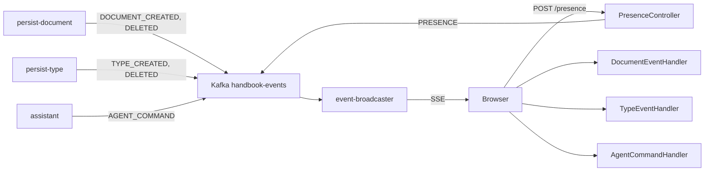

# Kafka 이벤트 카탈로그

## 토픽

모든 도메인 이벤트는 단일 토픽 `handbook-events`로 발행된다. 파티션 키는 워크스페이스 UUID.

## 이벤트 흐름



## 이벤트 타입

| EventType | 발행 서비스 | 페이로드 | 구독자 (프론트엔드) |
|-----------|-----------|---------|-------------------|
| `DOCUMENT_CREATED` | persist-document | Document (id, type, serial, data) | DocumentEventHandler → 문서 목록 갱신 + 토스트 |
| `DOCUMENT_DELETED` | persist-document | Document (id, type, serial) | DocumentEventHandler → 문서 목록 갱신 + 토스트 |
| `TYPE_CREATED` | persist-type | Type (id, version, attributes) | TypeEventHandler → 타입 목록 갱신 + ChangeTracker/ActionManager 초기화 |
| `TYPE_DELETED` | persist-type | Type (id, version) | TypeEventHandler → 타입 목록 갱신 |
| `VALIDATION_REQUESTED` | persist-document | ValidationPayload (typeId, typeVersion, documentId) | (백엔드 전용) 검증 시스템이 소비 |
| `AGENT_COMMAND` | assistant | AgentCommandPayload (seq, type, target, description) | AgentCommandHandler → 에이전트 UI 명령 실행 |
| `PRESENCE` | event-broadcaster | PresencePayload (user, userName, type, serial, field) | DocumentEventHandler / TypeEventHandler → 편집 위치 표시 |

## 이벤트 구조

```kotlin
// 공통 이벤트 인터페이스 (event 모듈)
@JsonTypeInfo(use = JsonTypeInfo.Id.NAME, property = "type")
@JsonSubTypes(
    Type(DocumentEvent::class, name = "DOCUMENT_CREATED"),
    Type(DocumentEvent::class, name = "DOCUMENT_DELETED"),
    Type(TypeEvent::class, name = "TYPE_CREATED"),
    Type(TypeEvent::class, name = "TYPE_DELETED"),
    Type(ValidationEvent::class, name = "VALIDATION_REQUESTED"),
    Type(AgentCommandEvent::class, name = "AGENT_COMMAND"),
    Type(PresenceEvent::class, name = "PRESENCE")
)
interface Event<T : Serializable> {
    val type: EventType
    val workspace: UUID
    val payload: T
    val timestamp: Instant
}
```

## SSE 전달 형식

event-broadcaster가 Kafka 메시지를 수신하여 워크스페이스별 SSE 스트림으로 전달한다.

- **엔드포인트**: `GET /workspace/{workspace}/messages` (text/event-stream)
- **이벤트 포맷**: `event: EVENT_TYPE\ndata: payload_json\n\n`
- **Keep-alive**: 10초마다 ping
- **Replay buffer**: 10ms (새 구독자가 최근 이벤트를 받을 수 있음)

### 프론트엔드 수신 경로

```
SSE → shell-ui (EventSource) → WindowWorkspaceEventBridge.publish()
    → CustomEvent('handbook-workspace-event', detail: "EVENT_TYPE:payload_json")
    → 각 모듈의 WorkspaceEventReceiver.events() 구독
    → DocumentEventHandler / TypeEventHandler
```

## 발행 코드 위치

| 서비스 | 파일 | 클래스 |
|--------|------|--------|
| persist-document | `interfaces/event/KafkaDocumentEventPublisher.kt` | KafkaDocumentEventPublisher |
| persist-type | `interfaces/event/KafkaTypeEventPublisher.kt` | KafkaTypeEventPublisher |
| assistant | `interfaces/event/KafkaAgentCommandEventPublisher.kt` | KafkaAgentCommandEventPublisher |
| event-broadcaster | `interfaces/api/PresenceController.kt` | PresenceController (POST → Kafka) |

## 구독 코드 위치

| 모듈 | 파일 | 수신 이벤트 |
|------|------|-----------|
| event-broadcaster | `interfaces/event/EventMessageListener.kt` | 전체 (Kafka Consumer) |
| document-ui | `client/usecase/DocumentEventHandler.java` | DOCUMENT_CREATED, DOCUMENT_DELETED |
| type-ui | `client/usecase/TypeEventHandler.java` | TYPE_CREATED, TYPE_DELETED |
| agent-ui | `client/interfaces/AgentSseClient.java` | AGENT_COMMAND |
