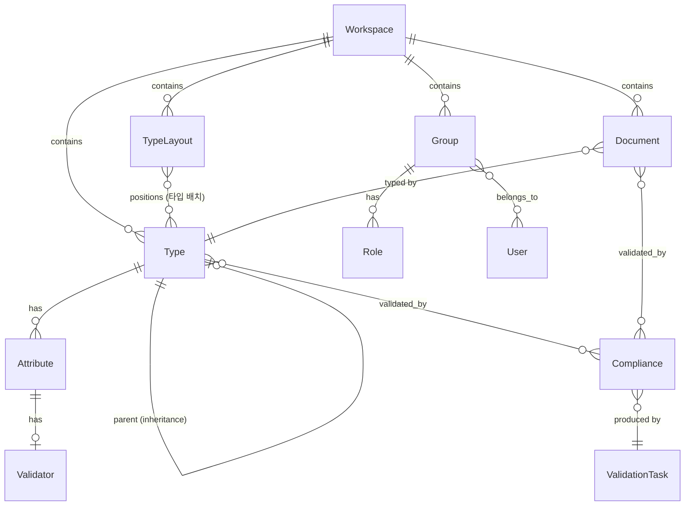
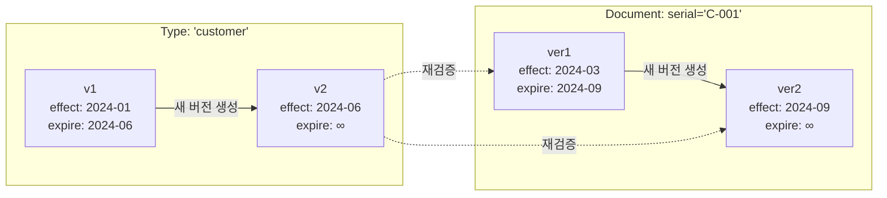
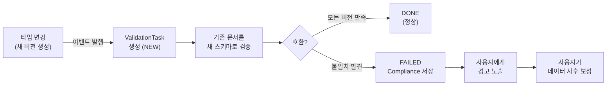

# Handbook - 사용자 요구사항 정의서

## 1. 프로젝트 개요

Handbook은 **운영 중 스키마 변경과 이력 관리를 지원하면서 데이터 정합성을 유지**하는 문서 관리 시스템이다.

사용자는 워크스페이스 내에서 문서 타입(스키마)을 정의하고, 해당 타입에 따라 문서를 생성·관리할 수 있다.
서비스 중단 없이 스키마를 변경할 수 있으며, 변경 전후의 모든 상태를 이력으로 보존한다.
스키마 변경 시 기존 데이터와의 불일치는 검증 시스템이 감지하고, 사용자가 사후 보정하도록 유도한다.

### 핵심 목표

- **운영 중 변경**: 서비스를 중단하지 않고 타입(스키마)을 변경할 수 있다.
- **이력 관리**: 타입과 문서는 변경 시 기존 버전을 수정하지 않고 새 버전을 생성한다 (불변 이력). 모든 버전을 시간 기반(effectDateTime ~ expireDateTime)으로 보존하고, 특정 시점의 상태를 조회할 수 있다.
- **정합성 유지**: 스키마 변경 후 기존 데이터와의 불일치를 자동 감지하고, 사용자에게 경고하여 사후 보정을 유도한다 (강제 차단이 아닌 감지 + 사후 보정 방식).

### 아키텍처 원칙

- **CQRS**: 조회(Search)와 변경(Persist)을 분리한다.
- **이벤트 드리븐**: 도메인 변경 사항을 이벤트로 발행하고, 구독자가 비동기로 처리한다.
- **리액티브**: WebFlux 기반의 비동기·논블로킹 처리를 사용한다.
- **클린 아키텍처**: 각 모듈은 domain → usecase → interfaces 방향으로 의존한다. domain과 usecase는 프레임워크(Spring, Jackson 등)에 의존하지 않으며, 프레임워크 관련 설정은 interfaces 계층에 위치한다.
- **실시간 협업**: 같은 워크스페이스의 모든 참여자(사용자 + AI 에이전트)는 동일한 Kafka 이벤트 채널(`/workspace/{id}/messages` SSE)을 공유한다. 한 사용자의 문서 저장, 다른 사용자의 타입 변경, 에이전트의 커맨드가 모두 같은 스트림으로 전달되어 전원이 실시간으로 변경사항을 관찰한다.
- **에이전트 = 협업자**: AI 에이전트는 별도의 시스템이 아니라 워크스페이스의 또 다른 참여자이다. 에이전트의 커맨드는 프론트엔드에서 시각적으로 실행되어, 마치 동료가 내 화면을 대신 조작해주는 것처럼 느껴진다. 모든 액션은 워크스페이스 이벤트로 기록되어 감사 추적이 가능하다.

### 시스템 구성

| 모듈 | 역할 |
|------|------|
| **workspace** | 워크스페이스·조직·권한 도메인 엔티티 |
| **schema** | 타입 시스템 도메인 엔티티 (Type, Attribute, Compliance 등) |
| **document** | 문서 생명주기 도메인 엔티티 |
| **event** | 도메인 이벤트 정의 (DocumentEvent, TypeEvent 등) |
| **search** | 검색 공유 라이브러리 (페이지네이션 + 필터 VO) |
| **authentication** | JWT 기반 인증·인가 라이브러리 (쿠키 → Spring Security) |
| **gateway** | API Gateway — 메뉴 집계, 서비스 라우팅 |
| **event-broadcaster** | Kafka 이벤트 수신 → SSE 실시간 브로드캐스트 |
| **login** | OAuth2 로그인 + JWT 토큰 발행 백엔드 |
| **login-ui** | 로그인/로그아웃 UI (GWT) |
| **persist-workspace** | 워크스페이스 CUD 백엔드 |
| **persist-type** | 타입 CRUD + 레이아웃 관리 백엔드 |
| **persist-document** | 문서 CUD 백엔드 (저장/삭제 + Kafka 이벤트 발행) |
| **search-type** | 타입 읽기 전용 백엔드 (CQRS 읽기 측) |
| **search-document** | 문서 읽기 전용 백엔드 (검색/단건 조회 + 메뉴 제공) |
| **assistant** | 자연어 요청 해석 + 실행 계획 생성 + Kafka 이벤트 발행 (LLM 연동) |
| **shell-ui** | 웹 애플리케이션 프레임 (GWT) |
| **activity** | 동적 로딩 UI 활동 모듈 (GWT) |
| **agent-protocol** | 에이전트 커맨드 프로토콜 공유 라이브러리 (프론트/백) |
| **agent-ui** | 에이전트 커맨드 UI 렌더링 모듈 (GWT) |
| **ui-components** | 범용 UI 컴포넌트 라이브러리 — Toast, Overlay, Highlight, Scroll, ConfirmDialog, DiffPanel (GWT) |
| **agent-bridge** | GWT 모듈 간 에이전트 통신 브릿지 (CustomEvent + window 속성 기반) |
| **type-ui** | 캔버스 기반 타입 스키마 편집기 (GWT) |
| **workspace-ui** | 워크스페이스 생성/참여 UI (GWT) |
| **document-ui** | 스프레드시트 기반 문서 편집기 (GWT, Handsontable) |
| **dashboard-ui** | 워크스페이스 대시보드 UI (GWT) — 통계, 품질 현황, 에이전트 활동 |
| **e2e** | Playwright 기반 E2E 통합 테스트 |
| **app** | 조합 루트 — Shell-UI, Agent-UI 등 프론트엔드 모듈을 하나의 GWT 애플리케이션으로 조합 |

## 2. 도메인 모델

### 도메인 관계도



### 버전 관리 모델



### 정합성 검증 흐름



### 2.1 Workspace

- 독립된 테넌트 단위로 동작한다.
- 속성: id(UUID), name, description
- 워크스페이스 생성 시 Admin 그룹이 자동 생성되며, 생성자가 해당 그룹에 자동 배정된다.

### 2.2 User

- 속성: id(UUID), name
- 여러 워크스페이스에 소속될 수 있다.

### 2.3 Group

- 속성: id, workspace, name, description
- 워크스페이스 내에서 사용자를 조직화하고, 역할(Role)을 부여하는 단위이다.

### 2.4 Type (문서 타입/스키마)

- 속성: id, version, effectDateTime, expireDateTime, description, primitive, parent
- 버전 관리를 지원한다 (이전/다음 버전 링크, HATEOAS).
- 계층 구조를 지원한다 (parent를 통한 타입 상속).
- 유효 기간(effectDateTime ~ expireDateTime)으로 시간 기반 버전을 관리한다.
- 타입을 변경하면 기존 버전을 수정하지 않고 새 버전이 생성된다 (불변 이력).
- 새 버전 생성 시 해당 타입의 기존 문서에 대해 재검증이 트리거된다.

### 2.5 Attribute (타입 속성)

- 속성: name, order, description, type, nullable, inherited
- 지원하는 속성 타입:
  - **Text**: 단일 텍스트 값 (정규식 패턴 검증 지원)
  - **Bool**: 불리언 값
  - **Number**: 숫자 (범위 제한 지원)
  - **Date**: 날짜 (범위 제한 지원)
  - **Enum**: 허용 값 목록 중 선택
  - **Array**: 동일 타입의 다중 값
  - **Map**: 키-값 쌍 (키/값 각각 타입 지정)
  - **File**: 파일 참조 (확장자 검증)
  - **Document**: 다른 타입 문서에 대한 약한 참조 (serial 기반)

### 2.6 Validator (유효성 검증 규칙)

- **Regex**: 정규식 패턴 매칭
- **Bool**: 불리언 타입 검증
- **Number**: 숫자 범위 검증 (min/max)
- **Date**: 시간 범위 검증 (before/after)
- **Enum**: 허용 값 목록 검증

### 2.7 Document (문서)

- 속성: id, type, serial, data(Map<String, String?>), effectDateTime, expireDateTime
- 메타데이터: createDateTime, creator(UUID)
- 문서는 특정 타입 버전에 고정되지 않는다. 하나의 문서가 여러 버전의 스키마를 동시에 만족할 수 있다.
- 검증 시 현재 유효한 타입 버전 기준으로 호환 여부를 판별하며, 어떤 버전도 만족하지 못할 때만 경고한다.
- serial은 타입·워크스페이스 내에서 고유하다 (영숫자, 하이픈, 밑줄 허용).
- 문서를 변경하면 기존 버전을 수정하지 않고 새 버전이 생성된다 (불변 이력).
- 유효 기간(effectDateTime ~ expireDateTime)으로 버전의 시간 범위를 관리한다.

### 2.8 Type Layout (타입 시각화)

- 타입의 캔버스 시각화를 위한 별도 모델이다 (타입 도메인과 분리).
- 타입별 위치 속성: x, y, width, height
- Layout: workspace, id, effectDateTime, expireDateTime
- 워크스페이스별 타입 캔버스 배치 설정을 관리한다.

### 2.9 Event (도메인 이벤트)

- 속성: id(UUID), workspace, eventType, payload
- 도메인 변경 시 발행되어 후속 처리를 트리거한다.
- 이벤트 타입:
  - 타입 관련: TYPE_CREATED, TYPE_DELETED
  - 문서 관련: DOCUMENT_CREATED, DOCUMENT_DELETED
  - 검증 관련: VALIDATION_REQUESTED

### 2.10 Compliance (문서-스키마 호환성)

- 문서와 타입 버전 간의 호환성 검증 결과를 저장한다.
- 문서가 어떤 타입 버전들과 호환되는지, 어떤 버전과 불일치하는지를 추적한다.
- 불일치 시 구체적인 사유(어떤 속성이, 어떤 규칙에 위배되는지)를 포함한다.

### 2.11 Validation Task (검증 작업)

- 검증 실행의 워크플로우 상태를 추적한다.
- 상태: NEW → PROCESSING → DONE / FAILED
- 완료 시 Compliance 결과를 생성한다.

## 3. 기능 요구사항

### 3.1 워크스페이스 관리

- 워크스페이스를 생성할 수 있다.
- 생성 시 Admin 그룹이 자동 생성되고, 생성자가 자동 배정된다.
- 워크스페이스 삭제 시 관련 데이터가 종속 삭제(cascade)된다.
- 기존 워크스페이스에 조인할 수 있다.
- 로그인 후 참여 중인 워크스페이스가 있으면 마지막 액션을 취한 워크스페이스로 자동 진입한다.
- 참여 중인 워크스페이스가 없으면 워크스페이스 생성 또는 조인 화면으로 이동한다.
- 언제든 다른 워크스페이스로 전환할 수 있다.
- 같은 워크스페이스에 여러 사용자가 동시에 참여하여 실시간으로 협업할 수 있다.
  - 다른 사용자의 문서 저장, 타입 변경 등이 SSE 이벤트로 즉시 반영된다.
  - AI 에이전트의 액션도 동일한 이벤트 스트림으로 전달되어, 모든 참여자가 에이전트의 행동을 실시간으로 관찰할 수 있다.
  - **프레즌스**: 다른 사용자가 편집 중인 셀/타입 박스를 실시간으로 표시한다 (사용자별 고유 색상 보더 + 이름 라벨). 200ms 디바운스, 30초 타임아웃.

### 3.2 사용자 및 그룹 관리

- 사용자를 워크스페이스의 그룹에 배정할 수 있다.
- 그룹을 생성·삭제할 수 있다.
- 그룹에 역할(Role)을 부여하여 권한을 제어한다.

### 3.3 RBAC (역할 기반 접근 제어)

- 권한은 `리소스:동작` 형식의 Permission으로 관리한다.
- 와일드카드를 지원한다 (예: `type:*:view`).

#### Permission 목록

| Permission                                | 설명           |
|-------------------------------------------|----------------|
| `system:audit-logs`                       | 시스템 감사 로그 조회 |
| `{workspace}:role:assign`                 | 역할 부여       |
| `{workspace}:group:create/delete/view`    | 그룹 관리       |
| `{workspace}:user:assign/view`            | 사용자 배정/조회  |
| `{workspace}:type:create/delete`          | 타입 생성/삭제   |
| `{workspace}:type:{type}:view/edit`       | 특정 타입 조회/편집 |
| `{workspace}:type:{type}:document:view/edit` | 문서 조회/편집 |

#### Role 계층

- **System Role**: ADMIN (전체 시스템 접근)
- **Workspace Role**: ADMIN, GROUP_MANAGER, USER_MANAGER, TYPE_MANAGER, VIEWER, USER
- **Type Role**: MANAGER, VIEWER
- **Document Role**: MANAGER, VIEWER

### 3.4 타입(Type) 관리

- 워크스페이스 내에서 문서 타입(스키마)을 정의할 수 있다.
- 타입은 속성(Attribute)의 집합으로 구성된다.
- 타입 변경 시 기존 버전은 보존되고 새 버전이 생성된다 (불변 이력).
- 계층 구조(parent)를 통한 타입 상속을 지원한다.
- primitive 플래그로 기본 타입을 표시할 수 있다.
- 타입별로 접근 권한을 별도로 설정할 수 있다.
- 일괄(batch) 처리를 지원한다.

### 3.5 타입 시각화 (Type Layout)

- 캔버스 위에 타입을 배치하여 시각적으로 관계를 표현한다.
- 타입별 위치(x, y)와 크기(width, height)를 관리한다.
- 레이아웃을 저장·전환할 수 있다.
- 타입의 도메인 데이터와 시각화 데이터는 독립적으로 관리된다.

### 3.6 문서(Document) 관리

- 정의된 타입에 따라 문서를 생성·조회할 수 있다.
- 문서 변경 시 기존 버전은 보존되고 새 버전이 생성된다 (불변 이력).
- serial 기반으로 문서를 식별한다 (타입·워크스페이스 내 고유).
- 일괄(batch) 처리를 지원한다.
- 문서 저장 시 검증(validation)이 자동으로 트리거된다.
- 검색 시 페이지네이션, 정렬, 필터링을 지원한다.
- 다양한 날짜 포맷을 지원한다 (ISO-8601, yyyyMMdd, yyyy.MM.dd 등).
- **더티 트래킹**: 사용자 편집은 로컬 상태에만 반영되며, 서버에 즉시 저장되지 않는다.
- **원자적 저장**: Save 버튼을 누르면 생성/수정/삭제 변경점이 하나의 트랜잭션으로 일괄 저장된다.
- **시각적 상태 구분**: 생성(created), 수정(changed), 삭제 예정(deleted) 셀/행을 색상과 스타일로 구분하여 편집 중에 변경 내역을 즉시 확인할 수 있다.
- **충돌 감지**: 다른 사용자가 같은 문서를 동시에 수정한 경우 `@Version` 기반 낙관적 잠금으로 충돌을 감지하고, 409 Conflict 시 사용자에게 알린다.

### 3.7 이력 조회

- 타입의 과거 버전을 조회할 수 있다 (특정 시점 기준 point-in-time query).
- 문서의 변경 이력을 시간 기반으로 추적할 수 있다.
- 이전 버전의 타입/문서는 삭제되지 않고 보존된다.

### 3.8 인증

- JWT 토큰 기반 인증을 사용한다.
- 쿠키에서 JWT를 추출하여 인증 객체로 변환한다.
- RSA 공개키(PEM 형식)로 토큰 서명을 검증한다.
- 토큰 만료 시 쿠키를 자동 삭제한다.
- 토큰 갱신(refresh) 엔드포인트를 제공한다.

### 3.9 이벤트 처리

- 도메인 변경 시 이벤트를 발행한다.
- Kafka를 통한 이벤트 스트리밍을 지원한다.
- SSE(Server-Sent Events)를 통해 클라이언트에 실시간 알림을 전달한다.
- 워크스페이스 단위로 이벤트를 필터링한다.
- Keep-alive ping을 통해 HTTP/1.1 연결을 유지한다.
- 워크스페이스별 Sink를 lazy 생성하고, 모든 구독자가 해제되면 자동 정리한다.
- 구독자 등록/해제와 Sink 생성/제거는 원자적으로 처리하여 경합 조건을 방지한다.

### 3.10 검증(Validation) — 정합성 유지

- 문서 변경 시 이벤트 기반으로 비동기 검증을 수행한다.
- **타입 새 버전 생성 시 해당 타입의 기존 문서를 새 스키마 기준으로 재검증한다.**
- 속성별 Validator 규칙(Regex, Number, Date, Bool, Enum)을 적용한다.
- 타입 간 관계(parent, Document 참조)의 정합성도 검증 대상에 포함한다.
- 검증 결과를 Compliance로 저장하여, 문서가 호환되는 타입 버전을 추적한다.
- 검증 실패 시 사용자에게 경고를 노출하고, 기존 데이터의 사후 보정을 유도한다 (변경을 차단하지 않는다).
- Kafka 기반의 큐 처리를 지원한다.

### 3.11 웹 UI

#### Shell (애플리케이션 프레임)

- **Navigation Drawer**: Menu Rail과 Tool Rail을 포함하는 접이식 패널. Collapse/Expand/Hide 상태를 가진다.
- **Menu Rail**: 서비스에서 수집된 메뉴 목록을 정렬하여 표시. 메뉴 선택 시 해당 모듈 스크립트를 동적 로딩한다.
- **Tool Rail**: 선택된 메뉴의 도구(Tool) 목록 표시. 도구 선택 시 도구 함수를 실행한다.
- **Frame**: 메인 콘텐츠 영역. 모듈 전환 시 fade-in/out 애니메이션을 적용한다.
- **프로그레스 바**: API 호출 등 비동기 작업 진행 상태를 표시한다.
- **워크스페이스 선택기**: Drawer 내 셀렉트 박스로, 언제든 다른 워크스페이스로 전환할 수 있다.
- URL 기반 라우팅으로 메뉴를 자동 선택한다 (정규식 매칭).
- 브라우저 뒤로가기/앞으로가기를 지원한다 (History API).
- 모듈 스크립트를 동적으로 주입하여 activity 모듈을 로딩한다.
- 사용자 정보를 주기적으로 갱신한다 (토큰 리프레시).

#### 로그인·홈

- 로그인/로그아웃 페이지를 제공한다.
- 자동 토큰 갱신을 지원한다.
- 로그인 후 참여 중인 워크스페이스가 있으면 마지막 액션 워크스페이스로 자동 진입한다.
- 참여 중인 워크스페이스가 없으면 워크스페이스 생성/조인 화면을 표시한다.

#### 타입 관리 (Type Editor)

- 타입의 속성(Attribute)을 추가·삭제하고 Validator를 설정할 수 있다.
- Undo/Redo를 지원한다.

#### 타입 시각화 (Type Canvas)

- 캔버스 기반 시각적 타입 편집기를 제공한다.
- 타입을 캔버스에 추가·삭제·이동할 수 있다.
- 레이아웃을 저장·전환할 수 있다.
- 드래그 앤 드롭, 키보드 네비게이션, 컨텍스트 메뉴를 지원한다.

#### 문서 관리 (Document Editor)

- 탭 기반 인터페이스로 여러 타입의 문서를 동시에 편집할 수 있다.
- 스프레드시트 형태의 테이블 뷰를 제공한다 (Handsontable 6.2.4 MIT).
- 도구 모음: 저장, Undo/Redo, 추가, 삭제, 새로고침, 검증
- 검색 필터링을 지원한다.
- 일괄(batch) 작업을 지원한다.
- 검증 실패(Compliance 불일치) 문서에 대한 경고를 표시한다.
- **더티 트래킹**: 생성/수정/삭제 상태를 셀 단위로 시각적으로 구분한다.
  - 생성된 행: tertiary-container 배경, 좌측 3px tertiary 보더
  - 수정된 셀: tertiary 1px inset box-shadow
  - 삭제 예정 행: 취소선, 75% 투명화
  - 유효하지 않은 셀: error 텍스트, error 1px inset box-shadow (필수값 누락/형식 오류)
  - 충돌 문서: secondary-container 배경, secondary 2px 좌측 보더 (다른 사용자와 동시 수정)
- **Save 버튼**: 더티 없으면 비활성화, 변경 건수 뱃지 표시, 저장 중 스피너 표시
- **타입 전환 경고**: 미저장 변경이 있으면 확인 다이얼로그 표시
- 에이전트 편집과 사용자 편집은 동일한 Action/DirtyTracker 경로로 처리되며, Undo/Redo 가능

#### 사용자 관리

- 현재 사용자 정보를 표시한다.
- 소속 워크스페이스 목록을 표시한다.

## 4. API 엔드포인트

| Method | Path                                        | 설명                          |
|--------|---------------------------------------------|-------------------------------|
| GET    | `/auth/refresh`                             | JWT 토큰 갱신                  |
| GET    | `/menus`                                    | 메뉴 목록 조회 (서비스 집계)     |
| GET    | `/user`                                     | 현재 사용자 정보 조회            |
| POST   | `/workspace`                                | 워크스페이스 생성               |
| GET    | `/workspace/{workspace}/types`              | 타입 목록 조회 (날짜 필터링)     |
| GET    | `/workspace/{workspace}/types/{type}?version=` | 특정 타입 버전 조회           |
| PUT    | `/workspace/{workspace}/types`              | 타입 일괄 저장 (새 버전 생성)    |
| DELETE | `/workspace/{workspace}/types`              | 타입 일괄 삭제                  |
| GET    | `/workspace/{workspace}/documents`          | 문서 검색 (페이지네이션)         |
| GET    | `/workspace/{workspace}/{type}/{serial}`    | 특정 문서 조회                  |
| GET    | `/workspace/{workspace}/{type}/{serial}?date=` | 특정 시점 문서 조회 (이력)    |
| PUT    | `/workspace/{workspace}/documents`          | 문서 일괄 저장 (새 버전 생성)    |
| DELETE | `/workspace/{workspace}/documents`          | 문서 일괄 삭제                  |
| GET    | `/workspace/{workspace}/compliance`         | 호환성 검증 결과 조회           |
| GET    | `/workspace/{workspace}/layouts`            | 레이아웃 목록 조회              |
| GET    | `/workspace/{workspace}/messages`           | SSE 실시간 이벤트 스트림        |
| POST   | `/workspace/{workspace}/presence`           | 프레즌스 (편집 중 셀/타입 공유)  |
| POST   | `/workspace/{workspace}/documents/import`   | 문서 일괄 임포트 (CSV/JSON)     |
| GET    | `/workspace/{workspace}/documents/export`   | 문서 일괄 익스포트 (CSV/JSON)   |
| GET    | `/workspace/{workspace}/dashboard`          | 워크스페이스 현황 대시보드       |
| GET    | `/workspace/{workspace}/audit-logs`         | 감사 로그 조회                  |
| GET    | `/openapi.json`                             | OpenAPI 3.0 스펙               |
| POST   | `/assistant/request`                        | 자연어 요청 → 실행 계획 생성     |
| POST   | `/assistant/execute`                        | 실행 계획 확인 후 실행 (Kafka 발행) |
| POST   | `/assistant/abort`                          | 에이전트 작업 중단               |
| POST   | `/assistant/respond`                        | 에이전트 확인 요청에 대한 사용자 응답    |

### 3.12 API 접근성 (외부 시스템·AI 연동)

#### OpenAPI 스펙

- 모든 REST API에 대해 OpenAPI 3.0 스펙을 자동 생성하여 제공한다.
- 외부 시스템이나 AI 에이전트가 API를 자기 발견(self-discovery)할 수 있도록 한다.

#### 인증 방식 다양화

- 기존 쿠키 기반 JWT 인증 외에 **API Key** 또는 **Bearer Token** 방식의 인증을 추가로 지원한다.
- 프로그래밍 방식 접근(스크립트, AI 에이전트, CI/CD)에 적합한 인증 수단을 제공한다.

#### 벌크 데이터 처리

- CSV/JSON 파일을 통한 문서 일괄 임포트를 지원한다.
- 임포트 시 타입 스키마에 맞게 자동 매핑을 시도하고, 매핑 실패 항목은 사용자에게 확인을 요청한다.
- 문서를 CSV/JSON 형식으로 일괄 익스포트할 수 있다.

### 3.13 사용성 (비개발자 지원)

#### 가이드드 워크플로우

- 타입(스키마) 생성 시 자연어 기반 안내를 제공한다 (예: "어떤 정보를 관리하시겠습니까?" → 속성 자동 제안).
- 정합성 검증 실패 시 구체적인 보정 방법을 안내한다 (어떤 문서의 어떤 필드를 어떻게 수정해야 하는지).

#### 검색·필터링

- 문서 및 타입에 대한 전문 검색(full-text search)을 지원한다.
- 날짜 범위, 상태, 타입별 필터링을 조합하여 사용할 수 있다.

#### 알림·대시보드

- 정합성 검증 실패, 워크스페이스 초대 등 주요 이벤트에 대한 알림을 제공한다.
- 워크스페이스 현황 대시보드를 제공한다 (타입 수, 문서 수, 검증 상태 요약).

#### 감사 로그

- 누가, 언제, 어떤 리소스를 변경했는지 감사 로그를 기록하고 조회할 수 있다.
- 감사 로그는 불변으로 보존한다.

### 3.14 모바일 지원

- 반응형 레이아웃으로 모바일 및 태블릿 화면에서도 사용할 수 있다.
- Navigation Drawer는 모바일에서 오버레이 모드로 동작한다 (하단 시트 또는 슬라이드 메뉴).
- 스프레드시트(문서 편집기)는 모바일에서 카드 뷰로 전환하여 가독성을 확보한다.
- 타입 캔버스는 핀치 줌, 터치 드래그를 지원한다.
- 에이전트 입력창은 모바일 키보드와 호환되도록 하단 고정 배치한다.
- PWA(Progressive Web App)를 지원하여 홈 화면에 추가, 오프라인 캐싱을 제공한다.
- 최소 지원 뷰포트 너비는 360px이다.

### 3.15 대시보드

워크스페이스의 현황을 한눈에 파악할 수 있는 대시보드를 제공한다.

#### 워크스페이스 현황

- 타입 수, 문서 수, 사용자 수 등 기본 통계를 표시한다.
- 최근 변경 이력 (최근 N건의 생성/수정/삭제)을 타임라인으로 표시한다.
- 검증 상태 요약: 정합성 검증 성공/실패/미검증 비율을 표시한다.

#### 데이터 품질 현황

- 데이터 품질 감시 결과를 시각화한다 (결측치, 중복, 이상값 건수).
- 타입별 품질 점수를 차트로 표시한다.
- 품질 이슈 목록을 심각도별로 분류하여 표시하고, 클릭 시 해당 문서로 이동한다.

#### 에이전트 활동 로그

- AI 에이전트의 최근 활동 내역을 표시한다 (요청, 실행, 완료, 오류).
- 에이전트가 발행한 AGENT_COMMAND 이벤트를 시간순으로 표시한다.
- 에이전트 사용 빈도 및 처리 시간 통계를 제공한다.

#### 접근 방식

- 대시보드는 별도 GWT 모듈(`dashboard-ui`)로 구현되었으며, 메뉴에서 선택하여 접근한다.
- `DashboardApi`가 FetchApi를 통해 `dashboard/stats`, `dashboard/quality-issues`, `dashboard/agent-activity` 엔드포인트에서 데이터를 조회한다.
- `StatsProvider`, `QualityIssueList`, `AgentActivityList`가 BehaviorSubject로 상태를 관리하여 UI를 반응적으로 갱신한다.

#### 구현 현황

| 기능 | 상태 | 구현체 |
|------|------|--------|
| 통계 카드 (타입 수, 문서 수, 사용자 수) | 구현 완료 | `StatsCardElement` |
| 품질 이슈 목록 (심각도 배지) | 구현 완료 | `QualityPanelElement` |
| 에이전트 활동 타임라인 | 구현 완료 | `ActivityLogElement` |
| 품질 점수 차트 | 미구현 | - |
| 최근 변경 타임라인 | 미구현 | - |
| 실시간 SSE 카운터 갱신 | 미구현 | - |

### 3.16 데이터 품질 감시 (AI 에이전트)


사후 검증을 넘어 시스템 레벨에서 데이터의 품질을 선제적으로 감시한다.
AI 에이전트가 백그라운드에서 워크스페이스 내 데이터의 패턴을 분석하여 이상을 감지하고, 사용자에게 알린다.

#### 결측치 감지

- 필수 속성(nullable=false)이 비어 있거나 기본값으로만 채워진 문서를 탐지한다.
- 참조 타입 속성이 존재하지 않는 대상을 가리키는 경우를 탐지한다.
- 감지 결과를 AGENT_COMMAND 이벤트(notify)로 워크스페이스에 브로드캐스트한다.

#### 중복 데이터 감지

- 동일 타입 내에서 핵심 속성 조합이 유사하거나 동일한 문서를 탐지한다.
- 유사도 임계값은 워크스페이스 설정으로 조정할 수 있다.
- 중복 의심 문서를 highlight 커맨드로 시각적으로 표시한다.

#### 비정상 데이터 감지 (이상 탐지)

- 수치형 속성에서 통계적 이상값(outlier)을 탐지한다 (예: 평균 대비 3σ 이상 편차).
- 날짜형 속성에서 비논리적 값을 탐지한다 (예: 미래 날짜의 과거 이벤트, 시작일 > 종료일).
- 텍스트형 속성에서 패턴 불일치를 탐지한다 (예: 이메일 형식, 전화번호 형식).

#### 감시 실행 방식

- 에이전트는 주기적(스케줄) 또는 이벤트 트리거(DOCUMENT_CREATED 수신 시)로 감시를 실행한다.
- 감시 결과는 Kafka AGENT_COMMAND 이벤트로 발행되어 event-broadcaster를 통해 워크스페이스 멤버에게 실시간 알림된다.
- 심각도에 따라 notify(info/warning/error) 커맨드를 차등 적용한다.
- 사용자는 에이전트에게 "품질 검사 실행"을 자연어로 요청하여 즉시 감시를 수행할 수 있다.
- `POST /assistant/quality/scan?workspace={id}`로 REST API를 통해 즉시 스캔을 트리거할 수 있다.

#### 구현 현황

| 기능 | 상태 | 구현체 |
|------|------|--------|
| 필수 필드 결측치 감지 | 구현 완료 | `DefaultQualityMonitor.checkMissingRequiredFields()` |
| 동일 시리얼 중복 감지 | 구현 완료 | `DefaultQualityMonitor.checkDuplicateSerials()` |
| 수치형 이상값 감지 (3σ) | 구현 완료 | `DefaultQualityMonitor.checkNumericAnomalies()` |
| 감시 결과 Kafka 발행 | 구현 완료 | `QualityMonitorService` → `AgentCommandEventPublisher` |
| 즉시 스캔 REST API | 구현 완료 | `QualityController` (`POST /assistant/quality/scan`) |
| 감사 추적 저장/조회 | 구현 완료 | `AuditRepository` / `AuditController` (`GET /assistant/audit`) |
| 유사도 기반 중복 감지 | 미구현 | - |
| 날짜/텍스트 패턴 이상 감지 | 미구현 | - |
| 스케줄 기반 주기적 감시 | 미구현 | - |
| 이벤트 트리거 감시 | 미구현 | - |

### 3.17 자연어 기반 변경 요청 (AI 어시스턴트)

사용자가 자연어로 요청하면 시스템이 의도를 해석하여 해당 작업을 수행한다.
비개발자가 스키마 구조나 API를 몰라도 데이터를 관리할 수 있도록 한다.

#### 대화형 워크스페이스 설계 (초기 구축)

사용자가 로그인 후 워크스페이스를 처음 만들 때, 에이전트가 대화를 통해 전체 구조를 함께 설계한다.
사용자는 "어떤 시스템이 필요한지"만 설명하면, 에이전트가 타입·속성·관계를 구성하여 제안한다.

- 사용자가 자연어로 요구사항을 설명하면 에이전트가 워크스페이스 구조(타입, 속성, 관계)를 제안한다.
  - 예: "재고 관리 시스템이 필요해. 제품, 입출고, 창고를 관리하고 싶어"
  - → 에이전트가 3개 타입(제품, 입출고, 창고) + 속성 + 타입 간 관계를 설계하여 제안
- 제안은 **타입 캔버스 미리보기**로 시각화하여 보여준다 (타입 노드 + 관계선).
- 사용자가 수정을 요청하면 반복적으로 조정한다.
  - 예: "입출고에 승인자 필드도 필요해" → 속성 추가 반영
  - 예: "제품에 카테고리가 있으면 좋겠는데, 대분류/중분류/소분류로 나눠줘" → Enum 또는 계층 구조 제안
- 최종 확인 후 타입을 일괄 생성한다.

시나리오 예시:

```
사용자: "병원 진료 기록을 관리하고 싶어"

에이전트:
  attention(coachmark) → "진료 기록 관리를 위해 다음 구조를 제안합니다"
  preview(타입 캔버스) →
    ┌──────────┐     ┌──────────┐     ┌──────────┐
    │  환자     │────▶│  진료기록  │◀────│  의사     │
    │ 이름      │     │ 진료일    │     │ 이름      │
    │ 생년월일   │     │ 증상      │     │ 전문분야   │
    │ 연락처    │     │ 진단      │     │ 면허번호   │
    └──────────┘     │ 처방      │     └──────────┘
                     └──────────┘
  await_confirm → "이 구조로 시작할까요? 수정이 필요하면 말씀해주세요."

사용자: "처방은 별도 타입으로 분리하고, 약품 목록도 관리하고 싶어"

에이전트:
  preview(타입 캔버스 갱신) →
    환자 ──▶ 진료기록 ◀── 의사
                │
                ▼
              처방 ──▶ 약품
  await_confirm → "처방 타입과 약품 타입을 분리했습니다. 이대로 생성할까요?"

사용자: "좋아, 만들어줘"

에이전트:
  mutate → 5개 타입 일괄 생성
  navigate → 타입 캔버스로 이동
  attention(spotlight) → 생성된 타입 캔버스 표시
  complete → "5개 타입이 생성되었습니다. 이제 문서를 입력하거나 스키마를 수정할 수 있습니다."
```

#### 자연어 → 스키마 변경

- 자연어 요청으로 타입(스키마)을 생성·수정할 수 있다.
  - 예: "고객 타입에 전화번호 필드 추가해줘" → 해당 타입의 새 버전에 Text(전화번호) 속성 추가
  - 예: "주문 타입 만들어줘. 주문번호, 고객, 금액, 날짜가 필요해" → 속성 4개를 가진 타입 생성
- 요청을 해석한 결과를 **미리보기**로 보여주고, 사용자가 확인한 후에 실행한다.
- 모호한 요청은 추가 질문으로 명확화한다 (예: "금액의 범위 제한이 필요한가요?").

#### 자연어 → 문서 변경

- 자연어 요청으로 문서를 생성·수정·검색할 수 있다.
  - 예: "지난달 생성된 주문 문서 보여줘" → 날짜 필터링 + 타입 필터링 검색
  - 예: "고객 C-001의 이메일을 xxx@example.com으로 변경해줘" → 해당 문서의 새 버전 생성
  - 예: "만료된 문서 중 검증 실패한 것만 보여줘" → Compliance 상태 필터링
- 변경 작업은 기존 불변 이력 모델을 따른다 (새 버전 생성).

#### 자연어 → 정합성 보정

- 정합성 검증 실패 시 자연어로 보정 방법을 안내하고, 사용자가 승인하면 자동 보정한다.
  - 예: "고객 타입에 필수 필드 '이메일'이 추가되었는데 기존 문서 50건에 값이 없습니다. 기본값으로 채울까요?"
- 일괄 보정 시 영향 범위(몇 건의 문서가 변경되는지)를 미리 보여준다.
- 보정 내역은 감사 로그에 기록한다.

#### 실행 모델

- 사용자의 자연어 요청은 **의도 해석 → 실행 계획 생성 → 미리보기 → 사용자 확인 → 실행** 단계를 거친다.
- 기술적으로 에이전트는 Kafka 이벤트(`AGENT_COMMAND`)를 발행하고, event-broadcaster를 통해 프론트엔드에 커맨드가 전달된다.
- **UX 원칙: 에이전트가 내 화면을 대신 조작해주는 느낌.** 프론트엔드는 수신한 커맨드를 즉시 시각적으로 실행하여, 사용자 눈앞에서 화면이 전환되고, 셀이 편집되고, 타입이 추가되는 과정을 보여준다.
  - `navigate` → 화면이 자연스럽게 전환되며 사용자가 이동 과정을 관찰
  - `highlight` → 대상 요소가 시각적으로 강조되며 사용자의 시선을 유도
  - `mutate` → 스프레드시트 셀이 하나씩 채워지거나 타입 노드가 캔버스에 등장하는 애니메이션
  - `preview` → 변경 전후 diff가 인라인으로 표시되어 사용자가 검토
  - `await_confirm` → 에이전트가 잠시 멈추고 사용자에게 선택지를 제시
- 사용자가 에이전트의 모든 행동을 실시간으로 관찰하고, 언제든 Undo/Redo로 되돌리거나 중단(abort)할 수 있다.
- Assistant는 DB에 직접 접근하지 않으며, 독립 서비스로 수평 확장이 가능하다.
- 워크스페이스별 권한을 그대로 적용한다 (자연어 요청이라도 권한 밖의 작업은 거부).

#### 에이전트 감사 추적 (Audit Trail)

에이전트의 모든 동작은 근거가 있어야 하며, 사후 감사가 가능해야 한다.

- **의도 근거 기록**: 에이전트가 실행 계획을 생성할 때, 원본 사용자 메시지와 LLM의 해석 결과(intent, confidence)를 함께 저장한다.
- **커맨드별 사유**: 각 AGENT_COMMAND 이벤트에 `description` 필드로 해당 동작의 이유를 기록한다 (예: "사용자가 '이메일 필드 추가' 요청 → 고객 타입에 Text(email) 속성 추가").
- **이벤트 불변 로그**: 모든 AGENT_COMMAND 이벤트는 Kafka에 발행되어 이벤트 로그에 영구 보존된다. 삭제·수정이 불가능한 불변 이력이다.
- **감사 조회**: 워크스페이스 관리자는 에이전트의 과거 행동을 시간순으로 조회할 수 있다 — 누가, 언제, 어떤 요청으로, 어떤 커맨드가 실행되었는지 추적 가능.
- **실행 계획 보존**: 사용자가 확인(confirm)한 실행 계획 전체를 저장하여, "왜 이 변경이 발생했는가"를 사후에 확인할 수 있다.

> **협업 모드 vs 감시 모드**
>
> - **협업 모드** (UC-A1~A4): 사용자 요청 기반. 프론트엔드에서 커맨드를 시각적으로 실행하여 "동료가 화면을 조작해주는 느낌"을 제공한다. 사용자가 실시간 관찰·개입·Undo 가능.
> - **감시 모드** (UC-A5, 3.16 데이터 품질 감시): 백그라운드 서버에서 자동 실행. 결과만 `notify` 커맨드로 알리며, 사용자 화면을 직접 조작하지 않는다.

#### 에이전트 → UI 제어 프로토콜

백엔드 에이전트가 프론트엔드 UI를 단계별로 조작할 수 있는 스트리밍 프로토콜을 정의한다.
에이전트가 작업을 수행하면서 변경사항을 실시간으로 UI에 반영하여, 사용자가 진행 과정을 시각적으로 확인할 수 있다.

##### 전송 방식

- 에이전트는 UI 커맨드를 **Kafka 이벤트** (`AGENT_COMMAND`)로 발행한다.
- `event-broadcaster`가 Kafka 이벤트를 수신하여 워크스페이스별 SSE 스트림(`/workspace/{id}/messages`)으로 브로드캐스트한다.
- 같은 워크스페이스의 **모든 멤버**가 에이전트 액션을 실시간으로 관찰할 수 있다.
- 에이전트는 제3의 협업자로서 다른 사용자의 변경 이벤트(DOCUMENT_CREATED, TYPE_CREATED)와 동일한 채널로 행동한다.
- 에이전트가 사용자 확인을 기다리는 구간에서는 `await_confirm` 커맨드로 스트림을 일시 정지한다.
- 사용자 응답은 `POST /assistant/respond`로 전달하며, 에이전트가 다음 커맨드를 발행하여 재개한다.

##### 커맨드 타입

```
navigate      — 특정 화면으로 이동 (메뉴/도구 선택, URL 변경)
highlight     — 특정 요소를 강조 (필드, 행, 타입 노드)
scroll        — 특정 위치로 스크롤/포커스 이동
preview       — 변경 전후 diff를 인라인으로 표시
mutate        — 실제 값 변경 (필드 입력, 행 추가/삭제)
notify        — 토스트/배너 메시지 표시 (정보, 경고, 에러)
progress      — 진행률 표시 (일괄 작업 시)
attention     — 사용자에게 특정 영역을 안내 (코치마크, 툴팁, 오버레이)
await_confirm — 사용자 확인 대기 (계속/취소/수정 선택지 제공)
complete      — 작업 완료 (요약 표시)
```

##### 커맨드 메시지 구조

```json
{
  "seq": 1,
  "type": "navigate",
  "target": { "menu": "type-editor", "tool": "customer" },
  "description": "고객 타입 편집기로 이동합니다"
}
```
```json
{
  "seq": 2,
  "type": "highlight",
  "target": { "selector": "[data-attribute='email']" },
  "style": "pulse",
  "description": "이메일 필드를 찾았습니다"
}
```
```json
{
  "seq": 3,
  "type": "preview",
  "changes": [
    { "path": "attributes[4]", "op": "add", "value": { "name": "phone", "type": "Text" } }
  ],
  "description": "전화번호 필드를 추가합니다"
}
```
```json
{
  "seq": 4,
  "type": "await_confirm",
  "options": ["confirm", "cancel", "edit"],
  "description": "이대로 적용할까요?"
}
```
```json
{
  "seq": 5,
  "type": "mutate",
  "changes": [
    { "path": "attributes[4]", "op": "add", "value": { "name": "phone", "type": "Text" } }
  ],
  "description": "전화번호 필드를 추가했습니다"
}
```
```json
{
  "seq": 6,
  "type": "complete",
  "summary": "고객 타입 v3이 생성되었습니다. 전화번호(Text) 필드가 추가되었습니다.",
  "affectedResources": [{ "type": "Type", "id": "customer", "version": "v3" }]
}
```

##### attention 커맨드 (UI 안내)

`attention`은 사용자에게 "화면의 이 부분을 봐라"고 안내하는 커맨드다. `highlight`가 단순 강조(깜빡임)라면, `attention`은 **설명을 동반한 안내**이다.

```json
{
  "seq": 3,
  "type": "attention",
  "target": { "selector": "#compliance-panel .warning-badge" },
  "style": "coachmark",
  "message": "검증 실패한 문서가 3건 있습니다. 여기서 상세 내역을 확인할 수 있습니다.",
  "position": "bottom",
  "dismissable": true
}
```

지원하는 스타일:

| 스타일 | 설명 | 용도 |
|--------|------|------|
| `coachmark` | 대상 요소 주변에 말풍선 + 반투명 오버레이 | 기능 안내, 온보딩 |
| `spotlight` | 대상만 밝게, 나머지 어둡게 (스포트라이트) | 주의 집중 |
| `pulse` | 대상 요소 테두리 반복 강조 | 변경 사항 알림 |
| `arrow` | 대상을 가리키는 화살표 + 메시지 | 위치 안내 |
| `badge` | 대상 옆에 숫자/아이콘 뱃지 | 알림 카운트 |

##### 프론트엔드 처리

- Shell UI에 `AgentCommandHandler`를 두어 커맨드를 수신하고 해당 UI 컴포넌트에 위임한다.
- `navigate` → UrlBasedMenuResolver / HistoryManager 호출
- `highlight` → 대상 DOM 요소에 애니메이션 클래스 적용
- `attention` → 대상 요소에 코치마크/스포트라이트 오버레이 렌더링
- `preview` → 변경 대상 옆에 diff 오버레이 표시
- `mutate` → 실제 데이터 변경 API 호출 후 UI 갱신
- `await_confirm` → 확인 다이얼로그 표시, 사용자 응답을 에이전트에 반환
- 커맨드 실행 중 사용자가 언제든 **중단(abort)**할 수 있다.

##### 에이전트 외 활용

UI 어텐션 시스템은 에이전트 전용이 아니라 범용 메커니즘이다. 다음 상황에서도 동일한 커맨드를 사용한다.

- **온보딩 가이드**: 신규 사용자 첫 접속 시 주요 UI 요소를 순차적으로 안내
  ```
  attention(coachmark, "#workspace-select", "여기서 워크스페이스를 선택합니다")
  → attention(coachmark, ".rail .item:first", "메뉴를 선택하여 시작하세요")
  ```
- **정합성 경고**: 검증 실패 이벤트 수신 시 해당 문서/필드를 자동으로 안내
  ```
  attention(badge, "#menu-documents", "3")
  → navigate(documents, customer)
  → attention(spotlight, "tr[data-serial='C-042'] td.email", "이 필드가 새 스키마와 호환되지 않습니다")
  ```
- **협업 공유**: 사용자가 특정 위치를 다른 사용자에게 공유 ("이 부분 확인해주세요")
  ```
  attention(arrow, "[data-attribute='amount']", "김팀장: 이 금액 확인 부탁드립니다")
  ```

##### 시나리오 예시

사용자: "고객 타입에 전화번호 필드 추가해줘"

```
 1. navigate      → 타입 편집기 > 고객 타입으로 이동
 2. attention     → (spotlight) 현재 속성 목록을 안내: "현재 5개 속성이 정의되어 있습니다"
 3. preview       → 속성 목록 끝에 '전화번호(Text)' diff 표시
 4. attention     → (coachmark) diff 영역 안내: "여기에 새 필드가 추가됩니다"
 5. await_confirm → "전화번호(Text, nullable) 필드를 추가합니다. 적용할까요?"
 6. mutate        → 타입 새 버전 생성 API 호출
 7. attention     → (pulse) 추가된 필드 강조: "전화번호 필드가 추가되었습니다"
 8. notify        → "검증 작업이 시작되었습니다 (기존 문서 127건 대상)"
 9. complete      → "고객 타입 v3 생성 완료"
```

### 부록: 에이전트 기반 데이터베이스 설계 E2E 시나리오

> 이 시나리오는 **개발 경험이 없는 제조업 관리자**가 AI 에이전트의 도움만으로 생산 관리 시스템의 데이터베이스를 설계·생성·운영하는 전 과정을 보여준다. 10개 커맨드 타입이 실제 흐름에서 어떻게 사용되는지 확인할 수 있다.

---

#### Phase 1: 로그인 ~ 워크스페이스 생성

사용자가 시스템에 처음 로그인한다. 워크스페이스가 없으므로 빈 대시보드가 표시된다.

사용자: "뭘 해야 하는지 모르겠어."

```
seq  type           payload
───  ─────────────  ───────────────────────────────────────────────────
 1   attention      (coachmark) 화면 중앙 "워크스페이스 만들기" 버튼을 가리키며:
                    "여기를 눌러 새 워크스페이스를 만들 수 있습니다.
                     또는 저에게 어떤 시스템이 필요한지 말씀해 주세요."
```

사용자: "워크스페이스가 뭔지도 잘 모르겠는데, 그냥 도와줘."

```
seq  type           payload
───  ─────────────  ───────────────────────────────────────────────────
 2   await_confirm  "워크스페이스는 데이터를 저장하는 공간입니다.
                     어떤 업무를 관리하고 싶으신지 알려주시면
                     제가 알맞은 구조를 만들어 드리겠습니다.
                     계속할까요?"
                    [계속] [직접 만들기]
```

사용자: [계속] 선택

---

#### Phase 2: 요구사항 대화

에이전트가 사용자의 업무 요구사항을 자연어로 수집한다.

사용자: "우리 회사는 제조업이야. 생산 관리 시스템이 필요해. 원자재 입고, 생산 계획, 생산 실적, 출하까지 관리하고 싶어."

```
seq  type           payload
───  ─────────────  ───────────────────────────────────────────────────
 3   await_confirm  "제조 생산 관리 시스템이군요. 몇 가지 확인하겠습니다.
                     원자재를 납품하는 공급업체도 함께 관리할까요?"
                    [예, 공급업체도 관리] [아니오, 원자재만]
```

사용자: [예, 공급업체도 관리] 선택

```
seq  type           payload
───  ─────────────  ───────────────────────────────────────────────────
 4   await_confirm  "생산한 제품의 종류(완제품 목록)도 별도로 관리할까요?
                     아니면 출하 시에만 제품명을 적으면 될까요?"
                    [별도로 제품 목록 관리] [출하 시 직접 입력]
```

사용자: [별도로 제품 목록 관리] 선택

```
seq  type           payload
───  ─────────────  ───────────────────────────────────────────────────
 5   notify         (info) "파악된 요구사항: 공급업체, 원자재, 생산계획,
                    작업지시, 생산실적, 제품, 출하 — 총 7개 영역"
```

---

#### Phase 3: 타입 구조 설계 제안

에이전트가 대화 내용을 바탕으로 타입 구조를 설계하고, 타입 캔버스에 미리보기를 표시한다.

```
seq  type           payload
───  ─────────────  ───────────────────────────────────────────────────
 6   navigate       워크스페이스 생성 → 타입 캔버스 화면으로 이동
 7   attention      (coachmark) 타입 캔버스 영역:
                    "여기에 데이터 구조를 시각적으로 설계합니다.
                     지금부터 제안드리는 구조를 미리보기로 보여드릴게요."
 8   preview        타입 캔버스에 7개 타입 미리보기 표시:
                    ┌─────────────┐     ┌──────────────┐
                    │ 공급업체     │────▶│ 원자재        │
                    │ ─────────── │     │ ──────────── │
                    │ 업체명  Text │     │ 품명    Text  │
                    │ 연락처  Text │     │ 규격    Text  │
                    │ 주소    Text │     │ 단위    Text  │
                    └─────────────┘     │ 단가  Number  │
                                        │ 공급업체  Ref  │
                                        └──────┬───────┘
                                               │
                    ┌──────────────┐    ┌───────▼──────┐
                    │ 생산계획      │    │ 작업지시      │
                    │ ──────────── │    │ ──────────── │
                    │ 계획일  Date  │    │ 지시일  Date  │
                    │ 제품    Ref   │    │ 생산계획 Ref  │
                    │ 목표수량 Num  │    │ 라인    Text  │
                    │ 상태   Text   │    │ 목표수량 Num  │
                    └──────────────┘    └───────┬──────┘
                                                │
                    ┌──────────────┐    ┌────────▼─────┐
                    │ 제품          │    │ 생산실적      │
                    │ ──────────── │    │ ──────────── │
                    │ 제품명  Text  │    │ 작업지시 Ref  │
                    │ 규격    Text  │    │ 생산일  Date  │
                    │ 단위    Text  │    │ 생산수량 Num  │
                    └──────┬───────┘    └──────────────┘
                           │
                    ┌──────▼───────┐
                    │ 출하          │
                    │ ──────────── │
                    │ 출하일  Date  │
                    │ 제품    Ref   │
                    │ 수량   Number │
                    │ 거래처  Text  │
                    └──────────────┘
 9   scroll         캔버스를 전체 보기(fit-to-view)로 조정
10   highlight      7개 타입 노드를 순서대로 깜빡여 전체 구조 강조
11   attention      (coachmark) 공급업체 → 원자재 연결선:
                    "공급업체와 원자재가 참조(Ref)로 연결됩니다.
                     하나의 공급업체가 여러 원자재를 납품할 수 있어요."
12   attention      (coachmark) 생산계획 → 작업지시 → 생산실적 흐름:
                    "생산계획을 세우면 작업지시가 나가고,
                     현장에서 생산실적을 기록하는 흐름입니다."
13   await_confirm  "이 구조로 시작할까요? 수정이 필요하면 말씀해 주세요."
                    [이대로 생성] [수정 필요]
```

---

#### Phase 4: 사용자 피드백 반영

사용자가 추가 요구사항을 전달하고, 에이전트가 구조를 수정한다.

사용자: "품질검사도 필요해. 그리고 원자재에 LOT번호 관리가 되어야 해."

```
seq  type           payload
───  ─────────────  ───────────────────────────────────────────────────
14   preview        타입 캔버스 갱신:
                    - [추가] 품질검사 타입 (검사일 Date, 작업지시 Ref,
                      검사항목 Text, 판정 Text, 비고 Text)
                    - [변경] 원자재 타입에 'LOT번호 Text' 필드 추가
                    (diff: 추가된 타입은 녹색, 변경된 필드는 파란색)
15   scroll         새로 추가된 '품질검사' 타입 노드로 포커스 이동
16   highlight      품질검사 타입 노드 및 원자재의 LOT번호 필드 강조
17   attention      (coachmark) 품질검사 타입:
                    "작업지시별로 품질검사를 기록할 수 있도록 추가했습니다.
                     판정 필드에서 합격/불합격을 관리합니다."
18   await_confirm  "변경 사항을 확인해주세요:
                     1) 품질검사 타입 신규 추가
                     2) 원자재에 LOT번호 필드 추가
                     적용할까요?"
                    [적용] [추가 수정]
```

사용자: "작업지시에 담당자 배정 기능도 넣어줘."

```
seq  type           payload
───  ─────────────  ───────────────────────────────────────────────────
19   preview        타입 캔버스 갱신:
                    - [변경] 작업지시 타입에 '담당자 Text' 필드 추가
                    (diff: 추가된 필드 파란색 표시)
20   highlight      작업지시 타입의 '담당자' 필드 강조
21   await_confirm  "작업지시 타입에 '담당자' 필드를 추가했습니다.
                     이제 최종 구조를 확정할까요?"
                    [최종 확정] [추가 수정]
```

사용자: [최종 확정] 선택

---

#### Phase 5: 최종 확인 및 생성

에이전트가 최종 구조를 요약하고, 사용자 확인 후 실제 타입을 생성한다.

```
seq  type           payload
───  ─────────────  ───────────────────────────────────────────────────
22   preview        최종 타입 구조 전체 요약 미리보기:
                    ┌───────────────────────────────────────────┐
                    │ 최종 구조 (8개 타입)                       │
                    ├───────────────────────────────────────────┤
                    │ 1. 공급업체  — 3개 필드                    │
                    │ 2. 원자재    — 6개 필드 (LOT번호 포함)     │
                    │ 3. 제품      — 3개 필드                    │
                    │ 4. 생산계획  — 4개 필드                    │
                    │ 5. 작업지시  — 5개 필드 (담당자 포함)      │
                    │ 6. 생산실적  — 3개 필드                    │
                    │ 7. 품질검사  — 5개 필드                    │
                    │ 8. 출하      — 4개 필드                    │
                    └───────────────────────────────────────────┘
23   await_confirm  "위 8개 타입을 생성합니다. 진행할까요?"
                    [생성] [취소]
```

사용자: [생성] 선택

```
seq  type           payload
───  ─────────────  ───────────────────────────────────────────────────
24   mutate         워크스페이스 생성 API 호출 (이름: "생산관리시스템")
25   progress       "[1/8] 공급업체 타입 생성 중..."
26   mutate         공급업체 타입 생성 API 호출
27   progress       "[2/8] 원자재 타입 생성 중..."
28   mutate         원자재 타입 생성 API 호출
29   progress       "[3/8] 제품 타입 생성 중..."
30   mutate         제품 타입 생성 API 호출
31   progress       "[4/8] 생산계획 타입 생성 중..."
32   mutate         생산계획 타입 생성 API 호출
33   progress       "[5/8] 작업지시 타입 생성 중..."
34   mutate         작업지시 타입 생성 API 호출
35   progress       "[6/8] 생산실적 타입 생성 중..."
36   mutate         생산실적 타입 생성 API 호출
37   progress       "[7/8] 품질검사 타입 생성 중..."
38   mutate         품질검사 타입 생성 API 호출
39   progress       "[8/8] 출하 타입 생성 중..."
40   mutate         출하 타입 생성 API 호출
41   navigate       타입 캔버스 화면으로 이동 (생성된 결과 반영)
42   attention      (spotlight) 생성된 8개 타입을 캔버스에서 하이라이트:
                    "8개 타입이 모두 생성되었습니다."
43   complete       "생산관리시스템 워크스페이스와 8개 타입 생성이
                     완료되었습니다. 이제 데이터를 입력하거나
                     구조를 수정할 수 있습니다."
```

---

#### Phase 6: 초기 데이터 입력 안내

사용자가 첫 데이터를 입력할 수 있도록 에이전트가 안내한다.

사용자: "이제 원자재를 등록하려면 어떻게 해?"

```
seq  type           payload
───  ─────────────  ───────────────────────────────────────────────────
44   navigate       문서 편집기 > 원자재 타입 선택
45   attention      (coachmark) 문서 목록 상단의 "새 문서" 버튼:
                    "여기서 원자재를 등록할 수 있습니다.
                     버튼을 눌러 새 원자재 정보를 입력해 보세요."
46   highlight      "새 문서" 버튼 강조
```

사용자: "엑셀에 있는 원자재 목록을 한번에 올릴 수 있어?"

```
seq  type           payload
───  ─────────────  ───────────────────────────────────────────────────
47   navigate       데이터 가져오기(Import) 화면으로 이동
48   attention      (coachmark) 파일 업로드 영역:
                    "CSV 또는 Excel 파일을 여기에 끌어다 놓으세요.
                     컬럼명이 필드명과 일치하면 자동으로 매핑됩니다."
49   scroll         매핑 설정 영역으로 스크롤 이동
50   attention      (coachmark) 컬럼 매핑 테이블:
                    "파일의 컬럼과 원자재 필드를 연결합니다.
                     이름이 비슷하면 자동으로 매핑되고,
                     수동으로 변경할 수도 있습니다."
```

사용자가 파일을 업로드한다. 150건의 원자재 데이터가 포함된 CSV 파일.

```
seq  type           payload
───  ─────────────  ───────────────────────────────────────────────────
51   preview        매핑 결과 미리보기:
                    품명 → 품명 ✓ | 규격 → 규격 ✓ | 단위 → 단위 ✓
                    단가 → 단가 ✓ | LOT번호 → LOT번호 ✓
                    업체명 → 공급업체(Ref) ⚠ 참조 매핑 필요
52   attention      (coachmark) '업체명' 매핑 경고:
                    "'업체명' 컬럼은 공급업체 타입의 참조 필드입니다.
                     공급업체 데이터를 먼저 등록하거나,
                     업체명으로 자동 생성할 수 있습니다."
53   await_confirm  "업체명에 해당하는 공급업체가 없으면 자동 생성할까요?"
                    [자동 생성] [건너뛰기] [취소]
```

사용자: [자동 생성] 선택

```
seq  type           payload
───  ─────────────  ───────────────────────────────────────────────────
54   mutate         CSV 데이터 기반 공급업체 자동 생성 (12개 업체)
55   progress       "[1/2] 공급업체 12건 생성 완료"
56   mutate         원자재 150건 일괄 생성
57   progress       "[2/2] 원자재 150건 가져오기 완료"
58   navigate       문서 편집기 > 원자재 목록으로 이동
59   highlight      새로 생성된 원자재 목록 강조
60   notify         (info) "공급업체 12건, 원자재 150건이
                    성공적으로 등록되었습니다."
61   complete       "데이터 가져오기가 완료되었습니다."
```

---

#### Phase 7: 스키마 변경 (운영 중)

수 주 후, 사용자가 운영 중인 시스템의 스키마를 변경한다.

사용자: "생산실적에 불량수량 필드를 추가하고 싶어."

```
seq  type           payload
───  ─────────────  ───────────────────────────────────────────────────
62   navigate       타입 편집기 > 생산실적 타입으로 이동
63   scroll         속성 목록 하단으로 스크롤
64   attention      (spotlight) 현재 속성 목록 안내:
                    "현재 생산실적 타입에는 3개 필드가 있습니다:
                     작업지시(Ref), 생산일(Date), 생산수량(Number)"
65   preview        속성 목록 diff 표시:
                    작업지시  Ref     (기존)
                    생산일    Date    (기존)
                    생산수량  Number  (기존)
                  + 불량수량  Number  (추가, nullable, 기본값: null)
66   attention      (coachmark) diff 영역:
                    "불량수량 필드가 Number 타입으로 추가됩니다.
                     기존 데이터에는 null이 들어갑니다."
67   await_confirm  "생산실적 타입에 '불량수량(Number, nullable)'
                     필드를 추가합니다. 적용할까요?"
                    [적용] [수정] [취소]
```

사용자: [적용] 선택

```
seq  type           payload
───  ─────────────  ───────────────────────────────────────────────────
68   mutate         생산실적 타입 새 버전 생성 API 호출
                    (v1 → v2, 불량수량 필드 추가)
69   notify         (info) "기존 생산실적 320건에 대해
                    검증이 시작됩니다."
70   navigate       타입 캔버스로 이동 (갱신된 구조 반영)
71   highlight      생산실적 타입 노드의 '불량수량' 필드 강조
72   attention      (badge) 정합성 검증(Compliance) 메뉴에 뱃지 표시:
                    "320건의 기존 문서에 대한 검증이 진행 중입니다.
                     정합성 메뉴에서 결과를 확인할 수 있습니다."
73   complete       "생산실적 타입 v2 생성 완료.
                     320건 검증이 백그라운드로 진행됩니다."
```

---

#### Phase 8: 정합성 보정

검증 결과를 확인한 사용자가 에이전트에게 일괄 보정을 요청한다.

사용자: "불량수량이 빈 거 0으로 채워줘."

```
seq  type           payload
───  ─────────────  ───────────────────────────────────────────────────
74   navigate       정합성 검증 결과 화면으로 이동
75   scroll         '불량수량 = null' 검증 항목으로 스크롤
76   preview        일괄 변경 미리보기:
                    ┌────────────────────────────────────────────┐
                    │ 대상: 생산실적 320건                        │
                    │ 변경: 불량수량 null → 0                     │
                    ├────────────────────────────────────────────┤
                    │ #001  2026-03-15  A라인  불량수량: null → 0 │
                    │ #002  2026-03-15  B라인  불량수량: null → 0 │
                    │ #003  2026-03-16  A라인  불량수량: null → 0 │
                    │ ...                                        │
                    │ #320  2026-04-04  C라인  불량수량: null → 0 │
                    └────────────────────────────────────────────┘
77   await_confirm  "생산실적 320건의 불량수량을 0으로 변경합니다.
                     진행할까요?"
                    [진행] [취소]
```

사용자: [진행] 선택

```
seq  type           payload
───  ─────────────  ───────────────────────────────────────────────────
78   mutate         생산실적 일괄 업데이트 API 호출
                    (불량수량: null → 0, 대상 320건)
79   progress       "일괄 변경 진행 중... [32/320] 10%"
80   progress       "일괄 변경 진행 중... [160/320] 50%"
81   progress       "일괄 변경 진행 중... [320/320] 100%"
82   notify         (info) "320건 변경 완료. 정합성 위반 항목이
                    0건으로 감소했습니다."
83   highlight      정합성 대시보드의 '위반 0건' 표시 강조
84   complete       "생산실적 320건의 불량수량 보정이 완료되었습니다.
                     모든 문서가 현재 스키마와 일치합니다."
```

---

> **사용된 커맨드 요약**
>
> | 커맨드 | 사용 횟수 | 주요 사용 맥락 |
> |---|---|---|
> | `navigate` | 8회 | 화면 전환 (캔버스, 편집기, 임포트, 정합성) |
> | `highlight` | 6회 | 생성된 요소, 변경된 필드 시각적 강조 |
> | `scroll` | 5회 | 포커스 이동, fit-to-view, 특정 항목 탐색 |
> | `preview` | 7회 | 타입 구조 미리보기, diff 표시, 일괄 변경 미리보기 |
> | `mutate` | 12회 | 타입 생성, 데이터 가져오기, 일괄 업데이트 |
> | `notify` | 4회 | 요구사항 요약, 검증 시작, 변경 완료 알림 |
> | `progress` | 7회 | 타입 일괄 생성, 데이터 가져오기, 일괄 보정 진행률 |
> | `attention` | 11회 | coachmark 안내, spotlight 강조, badge 알림 |
> | `await_confirm` | 7회 | 구조 확인, 생성 승인, 일괄 작업 승인 |
> | `complete` | 5회 | 각 Phase 종료 시 작업 완료 요약 |

## 5. 비기능 요구사항

### 5.1 기술 스택

- **백엔드**: Kotlin, Spring Boot, Spring WebFlux (리액티브)
- **프론트엔드**: Java (GWT → JavaScript 컴파일), Material Design 3
- **데이터베이스**: PostgreSQL (R2DBC, 리액티브)
- **메시징**: Kafka (Spring Cloud Stream)
- **인프라**: Kubernetes, Helm Charts, Jib 컨테이너화
- **서비스 디스커버리**: Zookeeper

### 5.2 데이터 무결성

- 트랜잭션 경계를 통한 원자적 일괄 처리를 보장한다.
- 워크스페이스 삭제 시 종속 삭제(cascade)를 수행한다.
- 복합 인덱스를 통한 쿼리 성능을 최적화한다.
- 테이블 파티셔닝(생성 날짜 기준)을 적용한다.

### 5.3 회복성

- 외부 서비스 호출 시 3회 재시도(1초 간격, 지수 백오프)를 적용한다.
- 외부 서비스 실패 시에도 graceful degradation을 보장한다.

### 5.4 모니터링

- Spring Boot Actuator를 통한 상태 확인을 제공한다.
- Prometheus 메트릭을 수집한다.

### 5.5 품질

- 모든 모듈의 테스트 커버리지 최소 80% 유지 (Kover).
- Kotest + MockK 기반 테스트 프레임워크 사용.

### 5.6 배포

- Kubernetes 환경에 배포한다.
- Helm Chart를 통해 인프라를 관리한다.
