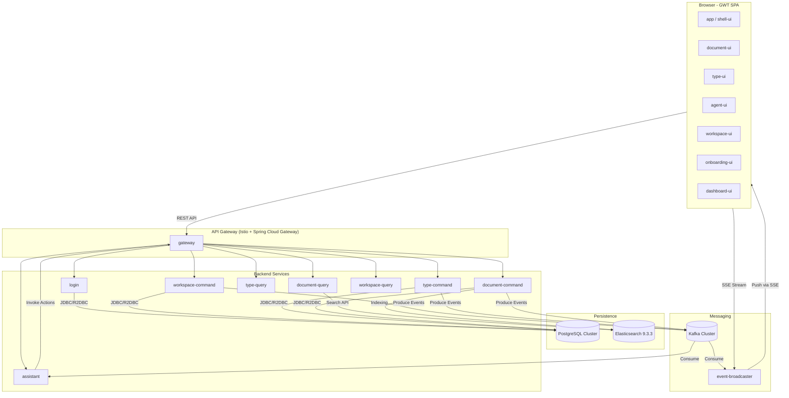
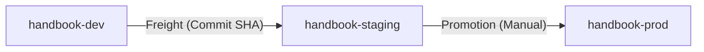

# Handbook 시스템 구성도

헬름차트(`charts/handbook/`)와 설계 문서를 기반으로 작성한 런타임 아키텍처 개요.

## 전체 구성도

## 핵심 설계 원칙

### 1. CQRS (Command Query Responsibility Segregation)
- **명령(Command)**: `*-command` 모듈이 담당. PostgreSQL(R2DBC)에 데이터를 영속화하고 Kafka 이벤트를 발행한다.
- **조회(Query)**: `*-query` 모듈이 담당. Elasticsearch나 PostgreSQL 읽기 전용 복제본을 사용하여 고성능 검색 및 조회를 수행한다.
- **메뉴 집계**: `gateway`가 각 `*-query` 모듈의 `/menus` 엔드포인트를 호출하여 전체 메뉴 구조를 동적으로 구성한다.

### 2. 이벤트 드리븐 & 실시간 협업
- 모든 상태 변경은 `handbook-events` 토픽을 통해 전파된다.
- `event-broadcaster`가 이 이벤트를 수신하여 SSE(Server-Sent Events) 스트림으로 변환, 브라우저에 실시간으로 푸시한다.
- 참여 중인 모든 사용자(및 에이전트)는 동일한 스트림을 공유하여 타인의 편집 상태(Presence)를 실시간으로 관찰한다.

### 3. Shared Domain (Java-GWT 공유)
- 백엔드와 프론트엔드가 동일한 Java 도메인 소스를 공유한다.
- **캡슐화된 네이티브 모델**: `private` 필드 + `@JsProperty` + `@JsOverlay` 게터를 통해 자바의 캡슐화와 JS의 성능을 동시에 확보한다.

## 외부 설정 및 인프라 매핑

| 설정 구분 | 파일/경로 | 비고 |
|-----------|----------|------|
| **DB 연결** | `infrastructure/templates/cloudnative-pg/postgresql.yaml` | `handbook-postgresql` 프래그먼트. 모든 CUD/조회 서비스 공통 |
| **Kafka 연결** | `infrastructure/templates/kafka/kafka.yaml` | `handbook-kafka` 프래그먼트. 이벤트 발행/구독 서비스 공통 |
| **인증/보안** | `infrastructure/templates/authentication/authentication.yaml` | `handbook-authentication` 프래그먼트. JWT 검증 및 OAuth2 설정 |
| **관측성** | `infrastructure/templates/observability/configmap.yaml` | Prometheus 메트릭, 구조화 로깅 패턴 설정 |

### Spring Boot 설정 로딩 규칙
1. 서비스 Jar 내부의 `application.yml`에서 `spring.config.import: [classpath:postgresql.yaml, ...]` 로 필요한 인프라 프래그먼트를 선언한다.
2. Helm ConfigMap이 `/app/resources/application.yml`에 마운트되어 Jar 내부 설정을 덮어쓴다 (머지가 아닌 파일 단위 교체).
3. 운영 환경의 민감 정보(DB 패스워드 등)는 Secret을 통해 환경변수로 주입받는다.

## 배포 및 프로모션 (Kargo + ArgoCD)

전체 시스템은 **GitOps** 기반의 Kargo 파이프라인을 통해 배포된다.

1. **Build**: GitHub Actions가 이미지를 빌드하여 `handbook-dev`에 자동 배포한다.
2. **Freight**: Kargo가 성공적인 빌드를 'Freight' 번들로 묶는다.
3. **Promotion**: 
    - `argocd-update` 스텝이 ArgoCD Application의 Helm 파라미터(`freight.commit`)를 갱신한다.
    - `handbook-lib`의 `handbook.frontend-sync-job`이 실행되어 S3 버킷(`handbook-{stage}/static/`)의 정적 자산을 동기화한다.

## Clean URL 및 라우팅 전략

Gateway(Istio) 레벨에서 `Accept` 헤더와 경로를 기반으로 요청을 분리한다.

- **SEO 랜딩**: `/` 또는 `/en/` 요청 시 S3의 프리렌더링된 정적 HTML을 반환한다.
- **앱 셸 (SPA)**: `Accept: text/html` 요청 시 `/app.html`을 반환하며, 인라인 스크립트가 로그인 여부를 판단하여 리다이렉트한다.
- **REST API**: `/workspaces/**`, `/auth/**` 등 API 경로는 백엔드 서비스로 라우팅한다.
- **정적 자산**: `/js/**`, `/css/**` 경로는 S3 버킷의 모듈별 디렉토리로 매핑된다.
