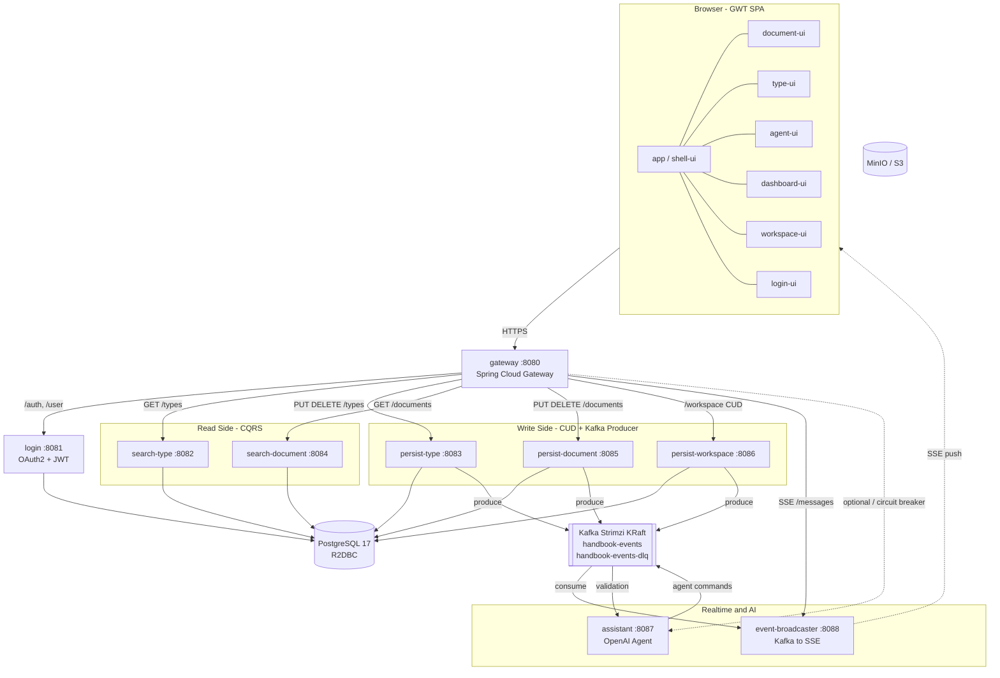

# Handbook 시스템 구성도

헬름차트(`charts/handbook/`)와 설계 문서를 기반으로 작성한 런타임 아키텍처 개요.

## 전체 구성도



## 서비스 카탈로그

| 서비스 | 포트 | 역할 | 저장소 |
|--------|------|------|--------|
| gateway | 8080 | API Gateway, 라우팅, `/menus` 집계, CircuitBreaker | - |
| login | 8081 | OAuth2(Google) + JWT 발급 | PostgreSQL |
| search-type | 8082 | 타입 조회 (CQRS Read) | PostgreSQL |
| persist-type | 8083 | 타입 CUD + 이벤트 발행 | PostgreSQL, Kafka |
| search-document | 8084 | 문서 조회 (CQRS Read) | PostgreSQL |
| persist-document | 8085 | 문서 CUD + 이벤트 발행 | PostgreSQL, Kafka |
| persist-workspace | 8086 | 워크스페이스 CUD + 이벤트 발행 | PostgreSQL, Kafka |
| assistant | 8087 | AI 에이전트 (OpenAI) — optional | Kafka |
| event-broadcaster | 8088 | Kafka → SSE 실시간 브로드캐스트 | Kafka |

## 프론트엔드 모듈 (GWT)

- **app / shell-ui**: SPA 엔트리, Drawer / MenuRail, 동적 모듈 로딩
- **document-ui**: Handsontable 기반 스프레드시트 에디터
- **type-ui**: Canvas 기반 타입 스키마 에디터
- **agent-ui**: AI 에이전트 채팅 UI
- **dashboard-ui / workspace-ui / login-ui**: 대시보드, 워크스페이스, 로그인
- **ui-components**: Action / ActionManager / ChangeTracker / ToastContainer 공용
- **agent-bridge**: CustomEvent 기반 모듈 간 브리지

## 통신 패턴

### HTTP (Gateway 경유)

```
/auth/**, /user                     -> login
/workspace/*/types/** (GET)         -> search-type
/workspace/*/types/** (PUT/DELETE)  -> persist-type
/workspace/*/documents/** (GET)     -> search-document
/workspace/*/documents/** (PUT/DEL) -> persist-document
/workspace/** (POST/PUT/DELETE)     -> persist-workspace
/workspace/*/messages (SSE)         -> event-broadcaster
/assistant/**                       -> assistant (CircuitBreaker)
/menus                              -> gateway aggregates search-type + search-document
```

### Kafka 토픽

단일 도메인 이벤트 토픽 `handbook-events` 로 모든 이벤트가 통합 발행된다 (파티션 키: 워크스페이스 UUID).

- **handbook-events** — 도메인 이벤트 통합 토픽
  - Producer: persist-document, persist-type, persist-workspace, assistant
  - Consumer: event-broadcaster, assistant
  - 재시도 3회 후 `handbook-events-dlq`
- **handbook-events-dlq** — Dead Letter Queue

Kafka 브로커는 OpenShift 에 설치된 **Streams for Apache Kafka** 오퍼레이터(Strimzi) 가 KRaft 모드로 운영. Helm 차트는 `Kafka` / `KafkaNodePool` / `KafkaTopic` CR 만 선언한다.

### 실시간 경로

```
persist-*  ->  Kafka (handbook-events)  ->  event-broadcaster  ->  SSE  ->  Browser
```

사용자 변경과 AI 에이전트 커맨드가 동일한 SSE 스트림(`/workspace/{id}/messages`)으로 통합 전달된다.

## 기술 스택

- **Frontend**: GWT 2.13, Kotlin 2.3, Elemento 2.4.9, Handsontable 6.2.4
- **Backend**: Spring Boot 4.0.1, Spring Cloud 2025.1.1, Spring WebFlux
- **Data**: PostgreSQL 17, R2DBC
- **Messaging**: Kafka (Spring Cloud Stream)
- **Auth**: OAuth2 (Google), JWT RS256, JJWT 0.13
- **Test**: Kotest 6.1.3, MockK, Testcontainers, Playwright 1.52

## 헬름차트 구성 (`charts/handbook/`)

- **gateway** — API Gateway 배포
- **event-broadcaster** — Kafka→SSE 브로드캐스트 배포
- **infrastructure** — 공용 인프라
  - `cloudnative-pg/` — PostgreSQL Cluster CR + `handbook-postgresql` 공통 Spring fragment
  - `kafka/` — Strimzi `Kafka` / `KafkaNodePool` / `KafkaTopic` CR + `handbook-kafka` 공통 Spring fragment
  - `authentication/` — `handbook-authentication` 공통 Spring fragment (JWT)
  - `s3/` · `observability/` — 기존 공용 인프라
- **handbook-operator** — github-actions-runner-set (CI/CD)

### 공통 Spring config fragment 주입 패턴

DB / Kafka / JWT 같이 여러 서비스가 공통으로 쓰는 Spring 설정은 `infrastructure/` 서브차트가 소유하는 ConfigMap 에 **fragment 단위** 로 선언된다. 각 서비스는 필요한 fragment 만 골라 쓴다:

1. 서비스의 jar 내부 `application.yml` 에서 `spring.config.import: [classpath:postgresql.yaml, classpath:kafka.yaml, ...]` 로 가져올 fragment 를 선언
2. Deployment 는 해당 ConfigMap 을 `/app/resources/<name>.yaml` 경로에 `subPath` 로 마운트

| Fragment ConfigMap | classpath 리소스 | 소유 리소스 | 대상 서비스 |
|--------------------|-----------------|-------------|-------------|
| `handbook-postgresql` | `classpath:postgresql.yaml` | `infrastructure/templates/cloudnative-pg/postgresql.yaml` | persist-\*, search-\*, login |
| `handbook-kafka` | `classpath:kafka.yaml` | `infrastructure/templates/kafka/kafka.yaml` | persist-\*, event-broadcaster, assistant |
| `handbook-authentication` | `classpath:authentication.yaml` | `infrastructure/templates/authentication/authentication.yaml` | gateway, event-broadcaster, persist-\*, search-\* |
| `observability` | `classpath:observability.yaml` | `infrastructure/templates/observability/` | 모든 Spring 서비스 |
