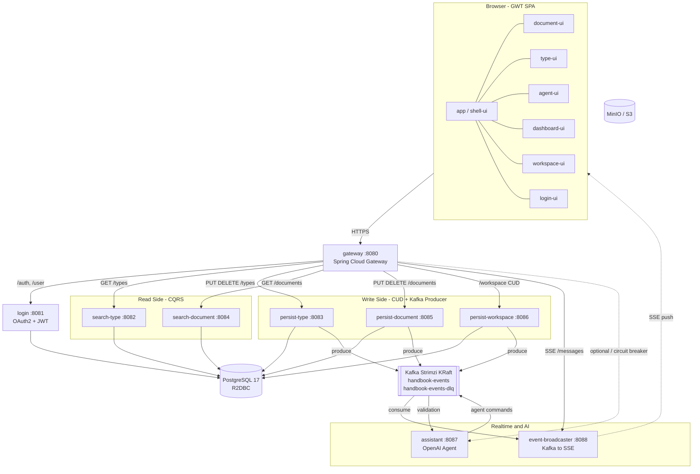

# Handbook 시스템 구성도

헬름차트(`charts/handbook/`)와 설계 문서를 기반으로 작성한 런타임 아키텍처 개요.

## 전체 구성도



## 서비스 카탈로그

| 서비스 | 포트 | 역할 | 저장소 |
|--------|------|------|--------|
| gateway | 8080 | API Gateway, 라우팅, `/menus` 집계, CircuitBreaker | - |
| login | 8081 | OAuth2(Google) + JWT 발급 | PostgreSQL |
| search-type | 8082 | 타입 조회 (CQRS Read) | PostgreSQL |
| persist-type | 8083 | 타입 CUD + 이벤트 발행 | PostgreSQL, Kafka |
| search-document | 8084 | 문서 조회 (CQRS Read) | PostgreSQL |
| persist-document | 8085 | 문서 CUD + 이벤트 발행 | PostgreSQL, Kafka |
| persist-workspace | 8086 | 워크스페이스 CUD + 이벤트 발행 | PostgreSQL, Kafka |
| assistant | 8087 | AI 에이전트 (OpenAI) — optional | Kafka |
| event-broadcaster | 8088 | Kafka → SSE 실시간 브로드캐스트 | Kafka |

## 프론트엔드 모듈 (GWT)

- **app / shell-ui**: SPA 엔트리, Drawer / MenuRail, 동적 모듈 로딩
- **document-ui**: Handsontable 기반 스프레드시트 에디터
- **type-ui**: Canvas 기반 타입 스키마 에디터
- **agent-ui**: AI 에이전트 채팅 UI
- **dashboard-ui / workspace-ui / login-ui**: 대시보드, 워크스페이스, 로그인
- **ui-components**: Action / ActionManager / ChangeTracker / ToastContainer 공용
- **agent-bridge**: CustomEvent 기반 모듈 간 브리지

## 통신 패턴

### HTTP (Gateway 경유)

```
/auth/**, /user                     -> login
/workspace/*/types/** (GET)         -> search-type
/workspace/*/types/** (PUT/DELETE)  -> persist-type
/workspace/*/documents/** (GET)     -> search-document
/workspace/*/documents/** (PUT/DEL) -> persist-document
/workspace/** (POST/PUT/DELETE)     -> persist-workspace
/workspace/*/messages (SSE)         -> event-broadcaster
/assistant/**                       -> assistant (CircuitBreaker)
/menus                              -> gateway aggregates search-type + search-document
```

### Kafka 토픽

단일 도메인 이벤트 토픽 `handbook-events` 로 모든 이벤트가 통합 발행된다 (파티션 키: 워크스페이스 UUID).

- **handbook-events** — 도메인 이벤트 통합 토픽
  - Producer: persist-document, persist-type, persist-workspace, assistant
  - Consumer: event-broadcaster, assistant
  - 재시도 3회 후 `handbook-events-dlq`
- **handbook-events-dlq** — Dead Letter Queue

Kafka 브로커는 OpenShift 에 설치된 **Streams for Apache Kafka** 오퍼레이터(Strimzi) 가 KRaft 모드로 운영. Helm 차트는 `Kafka` / `KafkaNodePool` / `KafkaTopic` CR 만 선언한다.

### 실시간 경로

```
persist-*  ->  Kafka (handbook-events)  ->  event-broadcaster  ->  SSE  ->  Browser
```

사용자 변경과 AI 에이전트 커맨드가 동일한 SSE 스트림(`/workspace/{id}/messages`)으로 통합 전달된다.

## 기술 스택

- **Frontend**: GWT 2.13, Kotlin 2.3, Elemento 2.4.9, Handsontable 6.2.4
- **Backend**: Spring Boot 4.0.1, Spring Cloud 2025.1.1, Spring WebFlux
- **Data**: PostgreSQL 17, R2DBC
- **Messaging**: Kafka (Spring Cloud Stream)
- **Auth**: OAuth2 (Google), JWT RS256, JJWT 0.13
- **Test**: Kotest 6.1.3, MockK, Testcontainers, Playwright 1.52

## 헬름차트 구성 (`charts/handbook/`)

- **gateway** — API Gateway 배포
- **event-broadcaster** — Kafka→SSE 브로드캐스트 배포
- **shell-ui** / **login-ui** — GWT 정적 자산 deploy 파이프라인 (Warehouse + Stage 만, Deployment 없음). GHA 가 prerelease 로 빌드 산출물을 publish, Kargo Stage 가 환경별 S3 버킷으로 promotion. login-ui 는 `/js/login/**`, `/js/logout/**` 만 HTTPRoute 로 노출(HTML 엔트리포인트 없음 — shell 이 동적 로드)
- **infrastructure** — 공용 인프라
  - `cloudnative-pg/` — PostgreSQL Cluster CR + `handbook-postgresql` 공통 Spring fragment
  - `kafka/` — Strimzi `Kafka` / `KafkaNodePool` / `KafkaTopic` CR + `handbook-kafka` 공통 Spring fragment
  - `authentication/` — `handbook-authentication` 공통 Spring fragment (JWT)
  - `s3/` · `observability/` — 기존 공용 인프라
  - `gateway/` — **Kubernetes Gateway API 진입점** (Gateway + OpenShift Route + catch-all HTTPRoute). Istio GatewayClass 가 `handbook-istio` Service 를 자동 프로비저닝하고, OpenShift Route 가 `handbook-<stage>.sayaya.cloud` 호스트로 TLS edge 노출. catch-all HTTPRoute 는 나머지 경로를 Spring Cloud Gateway 로 포워딩
- **handbook-operator** — github-actions-runner-set (CI/CD)

### 외부 진입점 (Ingress)

```
Browser ──TLS──▶ DNS *.apps.sayaya.cloud → 192.168.1.9 (nginx LB, L4 stream)
                    │
                    ▼
               OpenShift Router (cluster nodes :443, wildcard cert)
                    │  Route `handbook` (TLS edge)
                    ▼
               handbook-istio Service (Gateway API 자동 프로비저닝, MetalLB)
                    │
               ┌────┴────┐
               ▼         ▼
      HTTPRoute "shell-ui"            HTTPRoute "gateway" (catch-all)
      (/, /shell.html, /js/shell/**)  (/*)
               │                              │
               ▼                              ▼
       Service `ceph-rgw` (ExternalName)  service-gateway:8080 (Spring Cloud Gateway)
       → openshift-storage Ceph RGW       → 백엔드 서비스
       → bucket=handbook-<stage>/static
```

dev 호스트는 `handbook.apps.sayaya.cloud` (OpenShift Router 기본 wildcard cert 자동 적용). HTTPRoute 더 구체적인 path 가 catch-all 보다 우선. 상세는 `docs/ingress-options.md` 참조.

### Kargo Promotion 파이프라인 — Release Train (v2)

```
[gateway-dev]            ┐
[event-broadcaster-dev]  ┤   release-staging              release-prod
[login-dev]              ┼─→ (모든 서비스 dev 통과     →  (release-staging
[shell-ui-dev]           ┤    Freight 를 한 번에            통과 번들을 그대로
[login-ui-dev]           ┘    atomic 배포, 수동 trigger)    전진, 수동 trigger)
   (auto promote)
```

- **dev**: 서비스별 독립 `<svc>-dev` Stage. 자기 Warehouse 만 구독 + autoPromotion=true → Freight 발행 즉시 dev 환경 자동 배포
- **release-staging**: 모든 서비스 Warehouse 를 multi-source 로 구독 (`sources.stages: [<svc>-dev]`). 사람이 릴리즈 후보 결정 시점에 수동 승격 → 모든 서비스의 staging Application 동시 update
- **release-prod**: release-staging 단일 upstream 구독 → 동일 digest/commit 번들이 그대로 prod 로 전파, 수동 승격
- **promotionTemplate 분기**: JVM 백엔드는 `compose-output(imageFrom)` + `argocd-update.helm.images[image.tag]`, GWT 프론트엔드(`*-ui`) 는 `argocd-update.helm.images[freight.commit, bucket]` 로 같은 release-* Stage 에서 두 패턴이 `hasSuffix "-ui"` 분기로 공존

**ApplicationSet** 은 (service × stage) 매트릭스로 staging/prod Application 도 계속 생성 — Kargo Stage 가 그 Application 들의 helm parameter 를 update 해야 하므로 deployment manifest 가 필요. Stage CR 자체는 dev 만 서비스별로 생성.

### 정적 자산 배포 모델 (GWT 프론트엔드)

JVM 백엔드와 동일한 Release Train 흐름을 따르되, deploy 액션은 ArgoCD Sync Hook Job 이 수행한다.

1. **Build** (`<module>-deploy.yaml`): `:<module>:build` → 정적 자산 추출 → tar → `gh release create <module>-<sha> --prerelease`. GHA 는 빌드 + publish 까지만, deploy 액션 0번
2. **Warehouse**: git 구독, `commitSelectionStrategy: Lexical` + `includeTags: ^<module>-` + `strictSemvers: false` 로 새 prerelease 감지 → Freight. (Lexical 은 sha 기반 tag 에 대해 사전순 정렬이라 "최신" 을 보장 못 하므로 publish 시 이전 release 를 정리하는 것이 전제)
3. **Stage**: `<module>-dev` 만 서비스 subchart 가 만들고, staging/prod 는 release-staging/release-prod 번들 Stage 가 처리. promotion 시 `argocd-update.helm.images[freight.commit, bucket]` 으로 chart 의 sync-job 에 commit SHA + 환경별 bucket 주입
4. **Sync Job** (`templates/sync-job.yaml`): ArgoCD reconcile 시 매 freight commit 마다 새 Job 으로 인스턴스화 (`argocd.argoproj.io/hook: Sync` + `BeforeHookCreation` 정리). Job 컨테이너(`amazon/aws-cli`)가 **unauthenticated** `curl` 로 GitHub release asset 다운로드(public repo) → `aws s3 sync s3://${bucket}/static/` 후 종료. `ttlSecondsAfterFinished` 로 자동 정리

⚠️ **Kargo argocd-update 표현식 함정**: `helm` 블록은 `parameters` 를 허용하지 않고 `images` 배열만 받는다. key 에 임의 helm path 지정 가능. commit SHA 는 `${{ commitFrom("...").ID }}` (Go struct 필드명 대문자) — `.id`/`.tag` 는 `has no field` 에러.

### Spring 설정 주입 모델

운영 환경의 모든 Spring 설정은 ConfigMap 이 소유한다. jar 의 `src/main/resources/application.yml` 은 로컬 IDE 실행용 default 로만 사용한다.

- **서비스 ConfigMap** 의 `application.yml` 키가 jar 의 동명 파일을 **파일 단위로 overwrite** 한다 (`/app/resources/application.yml` 에 subPath 마운트). 머지가 아니므로 jar 와 중복되더라도 운영에 필요한 모든 설정(application.name, routes, cloud.stream bindings, kafka producer 등)을 서비스 ConfigMap 안에 다 적는다.
- `SPRING_CONFIG_ADDITIONAL_LOCATION` 은 사용하지 않는다 — 머지 우선순위가 모호해진다.
- DB / Kafka / JWT / observability 처럼 여러 서비스가 공통으로 쓰는 설정은 `infrastructure/` 서브차트의 **fragment ConfigMap** 으로 선언되고, 각 서비스 ConfigMap 의 `spring.config.import: [classpath:observability.yaml, ...]` 로 import 된다. fragment ConfigMap 도 `/app/resources/<name>.yaml` 에 subPath 마운트되어 classpath 에 노출.

| Fragment ConfigMap | classpath 리소스 | 소유 리소스 | 대상 서비스 |
|--------------------|-----------------|-------------|-------------|
| `handbook-postgresql` | `classpath:postgresql.yaml` | `infrastructure/templates/cloudnative-pg/postgresql.yaml` | persist-\*, search-\*, login |
| `handbook-kafka` | `classpath:kafka.yaml` | `infrastructure/templates/kafka/kafka.yaml` | persist-\*, event-broadcaster, assistant |
| `handbook-authentication` | `classpath:authentication.yaml` | `infrastructure/templates/authentication/authentication.yaml` | gateway, event-broadcaster, persist-\*, search-\* |
| `observability` | `classpath:observability.yaml` | `infrastructure/templates/observability/configmap.yaml` | 모든 Spring 서비스 (management/health probes/metrics tags/prometheus exposure/console 로깅 패턴 — correlationId 포함) |
