# Handbook - 유스케이스 정의서

> 모듈별 상세 유스케이스 및 시퀀스 다이어그램은 각 모듈의 USECASE.md를 참조한다:
> - [shell-ui](../shell-ui/USECASE.md) — 프레임, 네비게이션, i18n
> - [type-ui](../type-ui/USECASE.md) — 타입 캔버스 편집
> - [document-ui](../document-ui/USECASE.md) — 문서 스프레드시트 편집
> - [onboarding-ui](../onboarding-ui/USECASE.md) — 워크스페이스 생성/참여 (온보딩)
> - [workspace-ui](../workspace-ui/USECASE.md) — 워크스페이스 관리 (대시보드)
> - [agent-ui](../agent-ui/USECASE.md) — 에이전트 UI 커맨드
> - [dashboard-ui](../dashboard-ui/USECASE.md) — 대시보드 (통계, 품질, 에이전트 활동/실행/아티팩트)
> - [agent-protocol](../agent-protocol/USECASE.md) — 에이전트 프로토콜
> - [type-command](../type-command/USECASE.md) — 타입 저장/삭제 API
> - [document-command](../document-command/USECASE.md) — 문서 저장/삭제 API
> - [document-query](../document-query/USECASE.md) — 문서 검색 API
> - [login](../login/USECASE.md) — JWT 인증/토큰 발급
> - [login-ui](../login-ui/USECASE.md) — OAuth2 로그인 UI
> - [assistant](../assistant/USECASE.md) — AI 어시스턴트 (자연어 → 실행 계획)

## 액터 정의

| 액터 | 설명 |
|------|------|
| **사용자(User)** | 시스템에 로그인하여 문서를 조회·편집하는 일반 사용자 |
| **타입 관리자(Type Manager)** | 타입(스키마)을 정의하고 변경할 수 있는 권한을 가진 사용자 |
| **워크스페이스 관리자(WS Admin)** | 워크스페이스의 그룹·사용자·역할을 관리하는 사용자 |
| **시스템 관리자(System Admin)** | 전체 시스템에 대한 관리 권한을 가진 사용자 |
| **검증 시스템(Validator)** | 이벤트를 구독하여 문서-스키마 정합성을 비동기로 검증하는 내부 시스템 |
| **AI 에이전트(Assistant)** | 사용자의 자연어 요청을 해석하여 Gateway API를 통해 작업을 수행하는 내부 시스템 |
| **비로그인 방문자(Anonymous Visitor)** | 로그인 없이 SEO 랜딩에 접근하는 사용자 (첫 방문자, 제품 탐색자) |
| **검색엔진 크롤러(Crawler)** | Googlebot 등 검색엔진 인덱싱 봇. 쿠키 없이 방문하며 렌더링 엔진이 JS 를 실행할 수 있다 |
| **외부 AI 에이전트(External Agent)** | Gemini Desktop·ChatGPT 등 외부 AI 에이전트. API Key / MCP 로 Handbook 을 조작한다 |

## 유스케이스 개요

```mermaid
graph TB
    subgraph 액터
        U["사용자"]
        TM["타입 관리자"]
        WA["워크스페이스 관리자"]
        SA["시스템 관리자"]
        V["검증 시스템"]
        AI["AI 에이전트"]
        AV["비로그인 방문자"]
        CR["검색엔진 크롤러"]
        EA["외부 AI 에이전트"]
    end

    subgraph "랜딩"
        UC07["UC-07: SEO 랜딩 방문"]
        UC08["UC-08: 로그인 사용자<br/>자동 리다이렉트"]
        UC09["UC-09: 앱 내부 랜딩"]
    end

    subgraph "인증"
        UC01["UC-01: OAuth2 로그인"]
        UC02["UC-02: 토큰 갱신"]
        UC03["UC-03: 로그아웃"]
    end

    subgraph "워크스페이스 진입"
        UC04["UC-04: 홈 화면 진입"]
        UC05["UC-05: 워크스페이스 전환"]
        UC06["UC-06: 워크스페이스 조인"]
    end

    subgraph "워크스페이스 관리"
        UC10["UC-10: 워크스페이스 생성"]
        UC11["UC-11: 워크스페이스 삭제"]
    end

    subgraph "사용자·그룹 관리"
        UC20["UC-20: 그룹 생성"]
        UC21["UC-21: 그룹 삭제"]
        UC22["UC-22: 사용자 배정"]
        UC23["UC-23: 역할 부여"]
        UC24["UC-24: 권한 조회"]
    end

    subgraph "타입 관리"
        UC30["UC-30: 타입 정의"]
        UC31["UC-31: 타입 변경<br/>(새 버전 생성)"]
        UC32["UC-32: 타입 삭제"]
        UC33["UC-33: 타입 조회"]
        UC34["UC-34: 타입 이력 조회"]
    end

    subgraph "타입 시각화"
        UC40["UC-40: 캔버스에 타입 배치"]
        UC41["UC-41: 레이아웃 저장·전환"]
    end

    subgraph "문서 관리"
        UC50["UC-50: 문서 생성"]
        UC51["UC-51: 문서 변경<br/>(새 버전 생성)"]
        UC52["UC-52: 문서 삭제"]
        UC53["UC-53: 문서 조회"]
        UC54["UC-54: 문서 검색"]
        UC55["UC-55: 문서 이력 조회"]
        UC56["UC-56: 문서 일괄<br/>임포트"]
        UC57["UC-57: 문서 일괄<br/>익스포트"]
    end

    subgraph "정합성 검증"
        UC60["UC-60: 문서 검증"]
        UC61["UC-61: 스키마 변경<br/>재검증"]
        UC62["UC-62: 호환성 결과 조회"]
        UC63["UC-63: 데이터 사후 보정"]
    end

    subgraph "권한·차트"
        UC66["UC-66: 필드 레벨<br/>권한 설정 및 적용"]
        UC67["UC-67: 대시보드<br/>차트 조회"]
    end

    subgraph "Shell 네비게이션"
        UC70["UC-70: 메뉴 선택"]
        UC71["UC-71: 도구 실행"]
        UC72["UC-72: URL 라우팅"]
    end

    subgraph "AI 어시스턴트"
        UC80["UC-80: 대화형<br/>워크스페이스 설계"]
        UC81["UC-81: 자연어<br/>스키마 변경"]
        UC82["UC-82: 자연어<br/>문서 변경"]
        UC83["UC-83: 자연어<br/>정합성 보정"]
        UC84["UC-84: UI 안내<br/>(온보딩·협업)"]
        UC85["UC-85: 외부 AI 에이전트<br/>Tool Use"]
    end

    subgraph "운영"
        UC90["UC-90: 감사 로그 조회"]
        UC91["UC-91: 대시보드 조회"]
        UC92["UC-92: 데이터 품질<br/>현황 확인"]
        UC93["UC-93: 데이터 품질<br/>감시 실행 (에이전트)"]
        UC94["UC-94: 에이전트<br/>실행 상태 조회"]
        UC95["UC-95: 에이전트<br/>아티팩트 조회"]
    end

    AV --- UC07
    CR --- UC07
    U --- UC08 & UC09
    EA --- UC85
    UC07 -.->|CTA 클릭| UC01
    UC08 -->|쿠키 보유| UC04
    U --- UC01 & UC02 & UC03
    U --- UC04 & UC05 & UC06
    U --- UC53 & UC54 & UC55 & UC56 & UC57
    U --- UC62
    U --- UC70 & UC71 & UC72
    U --- UC80 & UC81 & UC82 & UC83 & UC84
    U --- UC91 & UC92 & UC67 & UC94 & UC95
    U --- UC93

    TM --- UC66

    AI --- UC93

    UC70 -.->|스크립트 로딩| UC71

    UC01 -->|로그인 후| UC04
    UC04 -.->|참여 WS 있음| UC05
    UC04 -.->|참여 WS 없음| UC10
    UC04 -.->|참여 WS 없음| UC06
    UC04 -.->|참여 WS 없음| UC80

    TM --- UC30 & UC31 & UC32 & UC33 & UC34
    TM --- UC40 & UC41
    TM --- UC50 & UC51 & UC52

    WA --- UC10 & UC11
    WA --- UC20 & UC21 & UC22 & UC23 & UC24

    SA --- UC10 & UC23 & UC90

    V --- UC60 & UC61

    AI --- UC80 & UC81 & UC82 & UC83 & UC84

    UC50 -.->|트리거| UC60
    UC51 -.->|트리거| UC60
    UC31 -.->|트리거| UC61
    UC62 -.->|불일치 시| UC63

    UC80 -.->|Gateway 경유| UC30
    UC81 -.->|Gateway 경유| UC31
    UC82 -.->|Gateway 경유| UC51
    UC83 -.->|Gateway 경유| UC63
```

---

## 랜딩

### UC-07: SEO 랜딩 방문

| 항목 | 내용 |
|------|------|
| **액터** | 비로그인 방문자, 검색엔진 크롤러 |
| **선행 조건** | 없음 |
| **후행 조건** | 방문자/크롤러가 로케일별 정적 HTML 을 응답받는다. 크롤러는 콘텐츠를 인덱싱할 수 있다 |

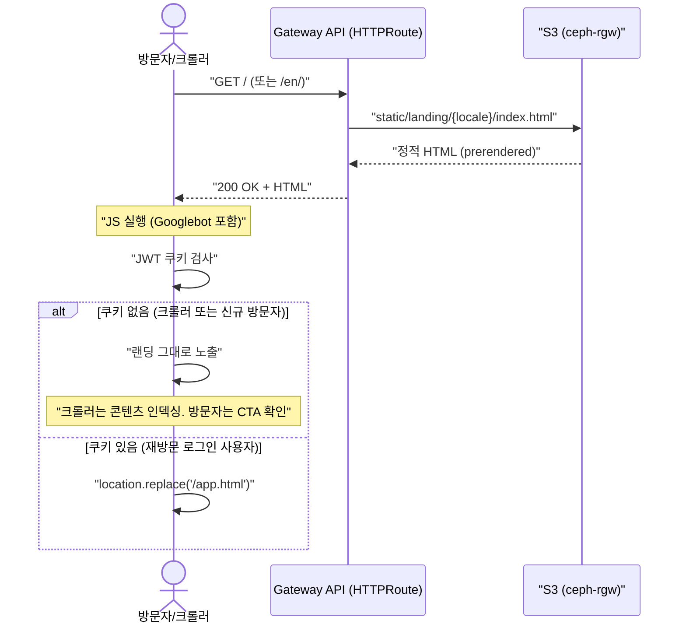
```mermaid
sequenceDiagram
    actor V as 방문자/크롤러
    participant GW as Gateway API (HTTPRoute)
    participant S3 as "S3 (ceph-rgw)"

    V->>GW: "GET / (또는 /en/)"
    GW->>S3: "static/landing/{locale}/index.html"
    S3-->>GW: "정적 HTML (prerendered)"
    GW-->>V: "200 OK + HTML"
    Note over V: "JS 실행 (Googlebot 포함)"
    V->>V: "JWT 쿠키 검사"
    alt 쿠키 없음 (크롤러 또는 신규 방문자)
        V->>V: "랜딩 그대로 노출"
        Note over V: "크롤러는 콘텐츠 인덱싱. 방문자는 CTA 확인"
    else 쿠키 있음 (재방문 로그인 사용자)
        V->>V: "location.replace('/app.html')"
    end
```

**기본 흐름:**
1. 방문자 또는 크롤러가 `/` 또는 `/en/` 으로 접속한다.
2. Gateway HTTPRoute 가 요청을 S3 의 `static/landing/{locale}/index.html` 로 매핑하여 정적 HTML 을 반환한다.
3. HTML 에 포함된 인라인 `defer` 스크립트가 JWT 쿠키를 검사한다.
4. 쿠키가 없으면 랜딩을 그대로 노출한다.
5. 크롤러는 HTML 의 `<title>`, `<meta>`, JSON-LD, 기능 설명 카드를 인덱싱한다.
6. 방문자는 히어로·기능 설명·CTA 앵커(`<a href="/app.html">`, `<a href="/auth/login">`)를 본다.

**대안 흐름:**
- 2a. `/` 요청인데 `Accept-Language` 가 `en` 인 경우에도 ko HTML 을 반환한다 (자동 리다이렉트 금지 — §3.22.2 다국어 SEO 제약).
- 3a. JWT 쿠키가 유효하면 UC-08 로 전환.
- 5a. 크롤러가 `/sitemap.xml` 을 별도 요청하여 다른 로케일을 발견하면 각 로케일을 개별 URL 로 인덱싱한다.

---

### UC-08: 로그인 사용자 랜딩 자동 리다이렉트

| 항목 | 내용 |
|------|------|
| **액터** | 로그인 상태 사용자 |
| **선행 조건** | JWT 쿠키가 브라우저에 유효하게 보관되어 있다 |
| **후행 조건** | 사용자가 `/app.html` 로 이동해 앱 셸을 로딩한다 |

**기본 흐름:**
1. 사용자가 `/` 또는 `/en/` 에 접속한다 (SERP 클릭, 북마크, 직접 입력 등).
2. 랜딩 HTML 이 로딩되고 인라인 스크립트가 JWT 쿠키를 감지한다.
3. `location.replace('/app.html')` 로 즉시 앱 진입점으로 이동한다.
4. 브라우저가 `/app.html` 을 요청하고, 앱 셸이 정상 부팅한다.
5. `UrlBasedMenuResolver` 가 기본 메뉴(대시보드 또는 마지막 액션 워크스페이스) 로 라우팅한다.

**예외 흐름:**
- 2a. 쿠키가 만료되었으면 리다이렉트하지 않고 랜딩을 그대로 노출한다 (UC-07 의 미로그인 경로).
- 3a. `location.replace` 실패 시(아주 드문 구형 브라우저) 랜딩을 그대로 노출한다.

**주의:** 크롤러는 쿠키가 없으므로 이 흐름을 타지 않는다. 결과적으로 크롤러는 항상 UC-07 만 경험한다.

---

### UC-09: 앱 내부 랜딩 방문

| 항목 | 내용 |
|------|------|
| **액터** | 사용자 (로그인·비로그인 모두) |
| **선행 조건** | 사용자가 `/app.html` 진입점에 접근했다 |
| **후행 조건** | 메뉴레일에서 선택한 랜딩 activity 가 프레임을 로딩되고, 상태별 CTA 가 표시된다 |

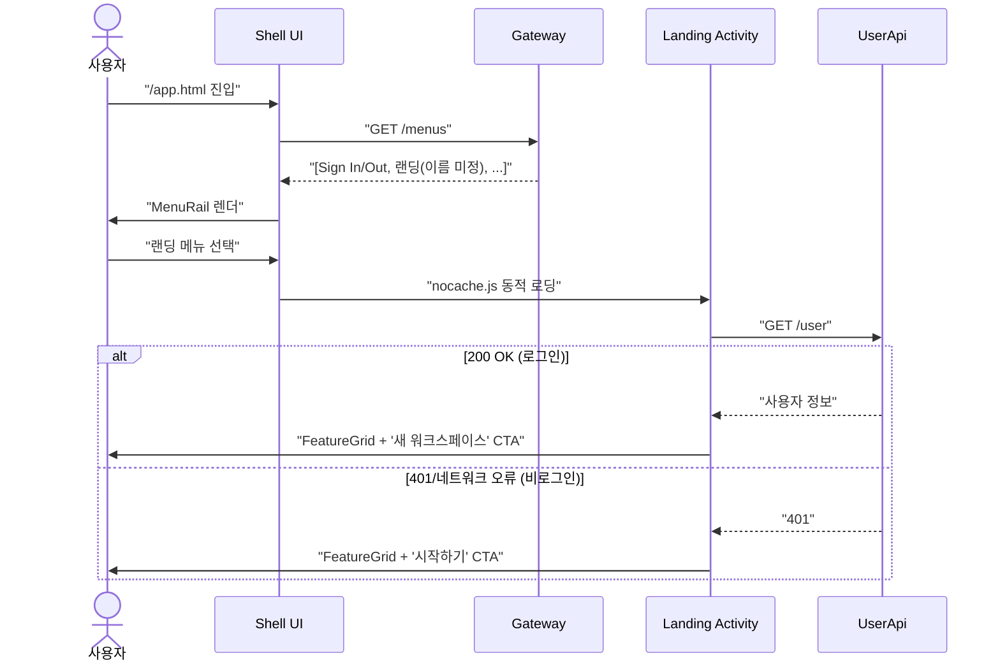
```mermaid
sequenceDiagram
    actor U as 사용자
    participant Shell as Shell UI
    participant GW as Gateway
    participant LA as Landing Activity
    participant API as UserApi

    U->>Shell: "/app.html 진입"
    Shell->>GW: "GET /menus"
    GW-->>Shell: "[Sign In/Out, 랜딩(이름 미정), ...]"
    Shell->>U: "MenuRail 렌더"
    U->>Shell: "랜딩 메뉴 선택"
    Shell->>LA: "nocache.js 동적 로딩"
    LA->>API: "GET /user"
    alt 200 OK (로그인)
        API-->>LA: "사용자 정보"
        LA->>U: "FeatureGrid + '새 워크스페이스' CTA"
    else 401/네트워크 오류 (비로그인)
        API-->>LA: "401"
        LA->>U: "FeatureGrid + '시작하기' CTA"
    end
```

**기본 흐름:**
1. 사용자가 `/app.html` 에 접근한다.
2. Shell UI 가 `/menus` 로 메뉴 목록을 받는다 (랜딩 엔트리 포함).
3. 사용자가 MenuRail 에서 랜딩 메뉴를 선택한다.
4. Shell 이 해당 activity 스크립트를 동적 로딩하여 프레임에 주입한다.
5. Landing Activity 가 `GET /user` 로 로그인 상태를 판별한다.
6. 공통 FeatureGrid 와 상태별 CTA 를 렌더한다.

**대안 흐름:**
- 2a. 비로그인 사용자는 `/menus` 응답에서 랜딩 엔트리를 항상 받는다 (`MenuSupplier` 가 인증 분기 없음).
- 5a. `GET /user` 가 401 이거나 네트워크 오류면 비로그인 variant 로 폴백 — "시작하기" CTA.
- 6a. 사용자가 "새 워크스페이스" CTA 를 선택하면 UC-10 (워크스페이스 생성) 으로 전환.

---

## 인증

### UC-01: OAuth2 로그인

| 항목 | 내용 |
|------|------|
| **액터** | 사용자 |
| **선행 조건** | OAuth2 제공자에 계정이 존재한다 |
| **후행 조건** | JWT 토큰이 HTTP-only 쿠키에 저장된다. 신규 사용자는 자동 생성된다 |

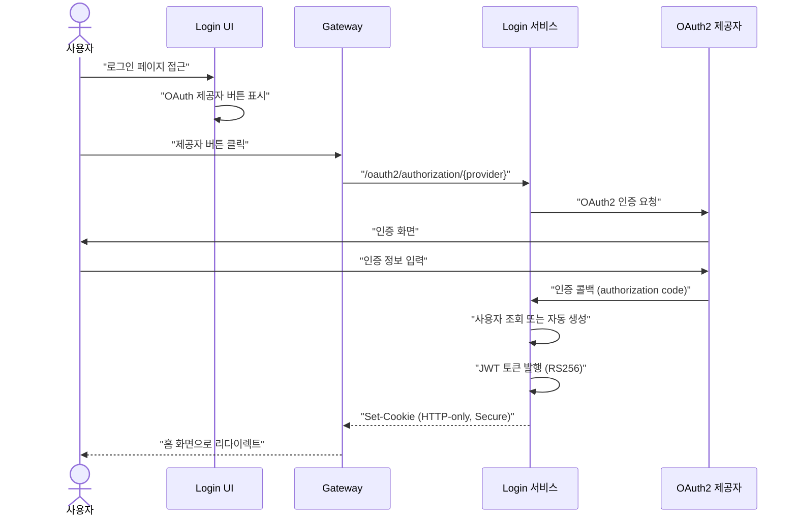
```mermaid
sequenceDiagram
    actor U as 사용자
    participant UI as Login UI
    participant GW as Gateway
    participant L as Login 서비스
    participant IdP as OAuth2 제공자

    U->>UI: "로그인 페이지 접근"
    UI->>UI: "OAuth 제공자 버튼 표시"
    U->>GW: "제공자 버튼 클릭"
    GW->>L: "/oauth2/authorization/{provider}"
    L->>IdP: "OAuth2 인증 요청"
    IdP->>U: "인증 화면"
    U->>IdP: "인증 정보 입력"
    IdP->>L: "인증 콜백 (authorization code)"
    L->>L: "사용자 조회 또는 자동 생성"
    L->>L: "JWT 토큰 발행 (RS256)"
    L-->>GW: "Set-Cookie (HTTP-only, Secure)"
    GW-->>U: "홈 화면으로 리다이렉트"
```

**기본 흐름:**
1. 사용자가 로그인 페이지에 접근한다.
2. OAuth2 제공자 버튼 목록이 표시된다.
3. 사용자가 제공자를 선택하면 해당 IdP의 인증 화면으로 이동한다.
4. 인증 완료 후 콜백이 Login 서비스로 전달된다.
5. Login 서비스가 사용자를 조회하거나 (최초 로그인 시) 자동 생성한다.
6. JWT 토큰을 발행하여 HTTP-only Secure 쿠키로 설정한다.
7. 홈 화면 진입(UC-04)으로 리다이렉트한다.

**예외 흐름:**
- 4a. OAuth2 인증 실패 시 오류 메시지를 표시한다.

---

### UC-02: 토큰 갱신

| 항목 | 내용 |
|------|------|
| **액터** | 사용자 (자동) |
| **선행 조건** | 유효한 JWT 토큰이 쿠키에 존재한다 |
| **후행 조건** | 새로운 JWT 토큰이 쿠키에 저장된다 |

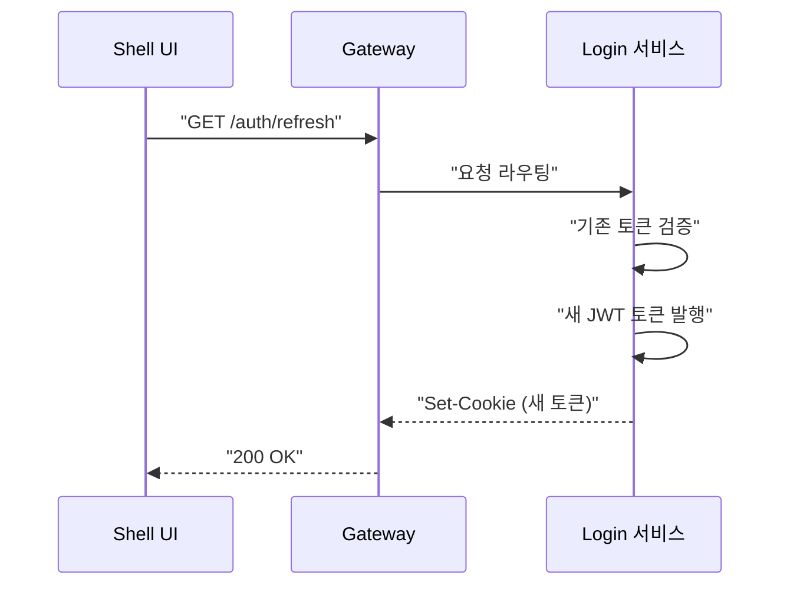
```mermaid
sequenceDiagram
    participant Shell as Shell UI
    participant GW as Gateway
    participant L as Login 서비스

    Shell->>GW: "GET /auth/refresh"
    GW->>L: "요청 라우팅"
    L->>L: "기존 토큰 검증"
    L->>L: "새 JWT 토큰 발행"
    L-->>GW: "Set-Cookie (새 토큰)"
    GW-->>Shell: "200 OK"
```

**기본 흐름:**
1. Shell UI의 UserApi가 10분 주기로 `/auth/refresh`를 호출한다.
2. Login 서비스가 기존 토큰을 검증하고 새 토큰을 발행한다.
3. 새 토큰이 쿠키에 저장된다.

**예외 흐름:**
- 2a. 토큰이 만료되어 갱신 불가 시 쿠키를 삭제하고 로그인 페이지로 리다이렉트한다.

---

### UC-03: 로그아웃

| 항목 | 내용 |
|------|------|
| **액터** | 사용자 |
| **선행 조건** | 로그인 상태이다 |
| **후행 조건** | 쿠키가 삭제되고 로그인 페이지로 이동한다 |

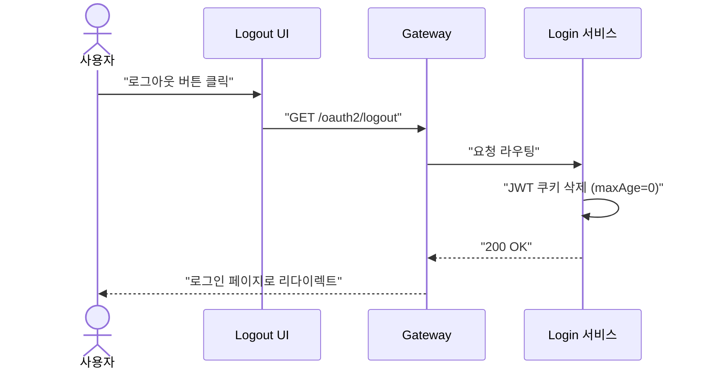
```mermaid
sequenceDiagram
    actor U as 사용자
    participant UI as Logout UI
    participant GW as Gateway
    participant L as Login 서비스

    U->>UI: "로그아웃 버튼 클릭"
    UI->>GW: "GET /oauth2/logout"
    GW->>L: "요청 라우팅"
    L->>L: "JWT 쿠키 삭제 (maxAge=0)"
    L-->>GW: "200 OK"
    GW-->>U: "로그인 페이지로 리다이렉트"
```

**기본 흐름:**
1. 사용자가 메뉴에서 로그아웃을 선택한다.
2. Logout UI가 `/oauth2/logout`을 호출한다.
3. Login 서비스가 JWT 쿠키를 삭제한다 (maxAge=0).
4. 로그인 페이지로 리다이렉트한다.

---

## 워크스페이스 진입

### UC-04: 홈 화면 진입

| 항목 | 내용 |
|------|------|
| **액터** | 사용자 |
| **선행 조건** | 로그인 상태이다 |
| **후행 조건** | 사용자가 워크스페이스 내부 또는 워크스페이스 생성/조인 화면에 도달한다 |

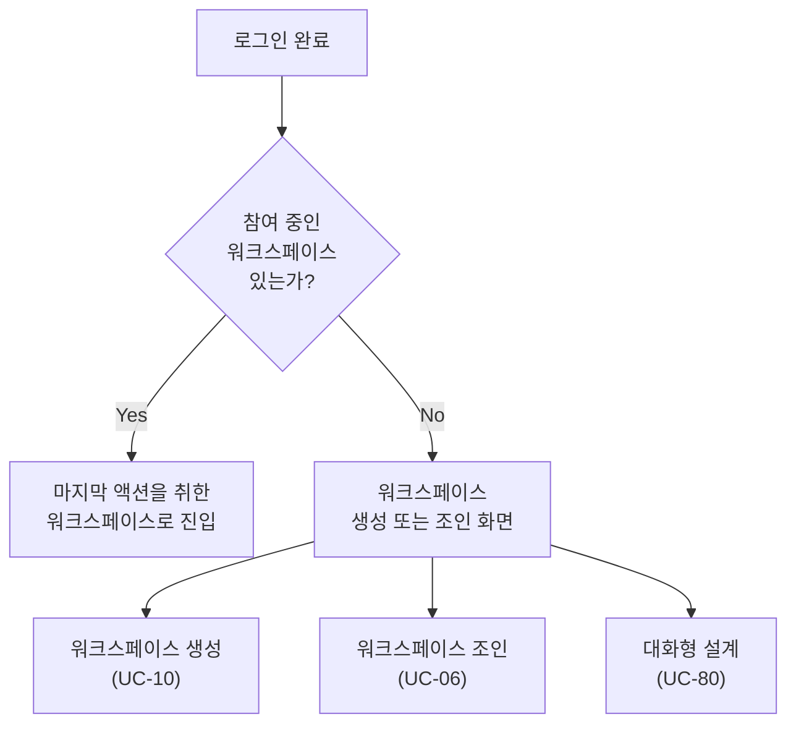
```mermaid
flowchart TD
    A["로그인 완료"] --> B{"참여 중인<br/>워크스페이스<br/>있는가?"}
    B -->|Yes| C["마지막 액션을 취한<br/>워크스페이스로 진입"]
    B -->|No| D["워크스페이스<br/>생성 또는 조인 화면"]
    D --> E["워크스페이스 생성<br/>(UC-10)"]
    D --> F["워크스페이스 조인<br/>(UC-06)"]
    D --> G["대화형 설계<br/>(UC-80)"]
```

**기본 흐름:**
1. 시스템이 사용자의 참여 중인 워크스페이스 목록을 조회한다.
2. 참여 중인 워크스페이스가 있으면, 마지막으로 액션을 취한 워크스페이스로 자동 진입한다.

**대안 흐름:**
- 2a. 참여 중인 워크스페이스가 없으면, Shell 이 `onboarding-ui` 모듈을 자동 주입해 워크스페이스 생성(UC-10), 조인(UC-06), 또는 대화형 설계(UC-80) 화면을 표시한다. 주입 메커니즘 상세는 **UC-12 (빈 워크스페이스 자동 온보딩)** 참조.

---

### UC-05: 워크스페이스 전환

| 항목 | 내용 |
|------|------|
| **액터** | 사용자 |
| **선행 조건** | 로그인 상태이며, 2개 이상의 워크스페이스에 참여 중이다 |
| **후행 조건** | 선택한 워크스페이스로 전환되고, 해당 워크스페이스가 마지막 액션 워크스페이스로 기록된다 |

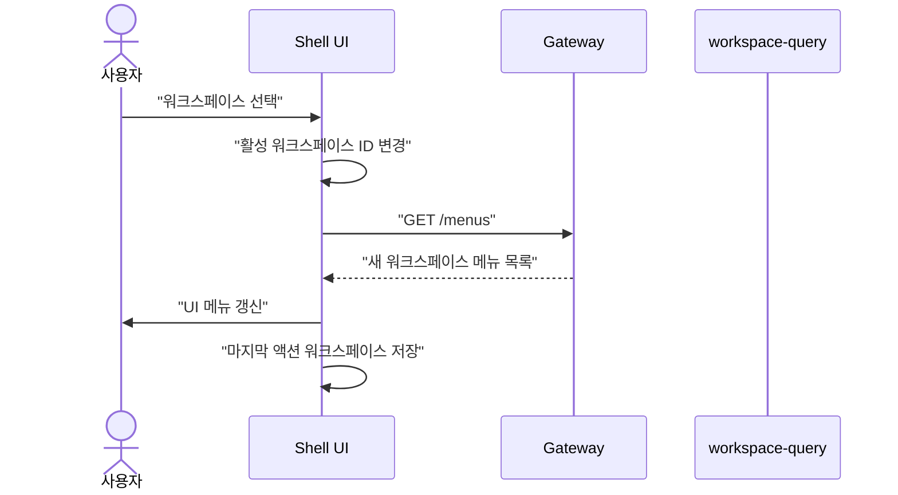
```mermaid
sequenceDiagram
    actor U as 사용자
    participant Shell as Shell UI
    participant GW as Gateway
    participant API as workspace-query

    U->>Shell: "워크스페이스 선택"
    Shell->>Shell: "활성 워크스페이스 ID 변경"
    Shell->>GW: "GET /menus"
    GW-->>Shell: "새 워크스페이스 메뉴 목록"
    Shell->>U: "UI 메뉴 갱신"
    Shell->>Shell: "마지막 액션 워크스페이스 저장"
```

**기본 흐름:**
1. 사용자가 Shell UI의 워크스페이스 선택기를 통해 다른 워크스페이스를 선택한다.
2. 시스템이 선택한 워크스페이스로 전환한다.
3. 해당 워크스페이스의 메뉴와 콘텐츠가 로딩된다.
4. 선택한 워크스페이스가 마지막 액션 워크스페이스로 기록된다.

---

### UC-06: 워크스페이스 조인

| 항목 | 내용 |
|------|------|
| **액터** | 사용자 |
| **선행 조건** | 로그인 상태이며, 조인 가능한 워크스페이스가 존재한다 |
| **후행 조건** | 조인 요청이 전송되거나, 사용자가 워크스페이스에 참여한다 |

**기본 흐름:**
1. 사용자가 조인할 워크스페이스 ID를 입력한다.
2. `POST /workspaces/{id}/join` 엔드포인트로 참여 요청을 전송한다.
3. 시스템이 워크스페이스 관리자에게 조인 요청을 전달한다.
4. 관리자가 승인하면 사용자가 해당 워크스페이스에 배정된다.
5. 해당 워크스페이스로 자동 진입한다.

**대안 흐름:**
- 4a. 관리자가 거부하면 사용자에게 거부 사유를 알린다.

> **요구사항 참조:** 6.1 워크스페이스 참여 (JOIN) — POST /workspaces/{id}/join 엔드포인트, workspace-ui SubmitButton JOIN 모드 처리

---

## 워크스페이스 관리

### UC-10: 워크스페이스 생성

| 항목 | 내용 |
|------|------|
| **액터** | 사용자 (로그인한 누구나) |
| **선행 조건** | 로그인 상태이다 |
| **후행 조건** | 워크스페이스, Admin 그룹이 생성되고, 생성자가 Admin 그룹에 배정된다 |

**기본 흐름:**
1. 사용자가 워크스페이스 이름과 설명을 입력한다.
2. 시스템이 워크스페이스를 생성한다 (Gateway → workspace-command).
3. Admin 그룹이 자동 생성된다.
4. 생성자가 Admin 그룹에 자동 배정된다.
5. 외부 서비스에 워크스페이스 생성 이벤트가 발행된다.

**대안 흐름:**
- 1a. AI 에이전트의 대화형 설계(UC-80)를 통해 워크스페이스 생성과 타입 구조 설계를 동시에 진행할 수 있다.

---

### UC-11: 워크스페이스 삭제

| 항목 | 내용 |
|------|------|
| **액터** | 워크스페이스 관리자 |
| **선행 조건** | 해당 워크스페이스의 ADMIN 권한을 가진다 |
| **후행 조건** | 워크스페이스와 모든 종속 데이터(그룹, 타입, 문서, 레이아웃 등)가 삭제된다 |

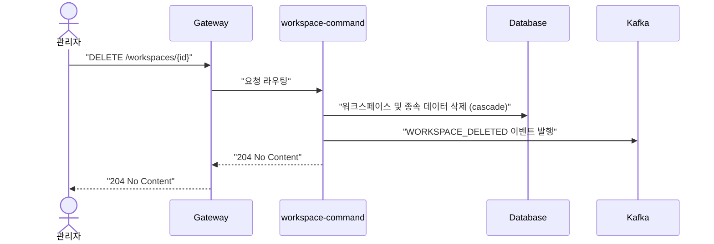
```mermaid
sequenceDiagram
    actor Admin as 관리자
    participant GW as Gateway
    participant API as workspace-command
    participant DB as Database
    participant Kafka

    Admin->>GW: "DELETE /workspaces/{id}"
    GW->>API: "요청 라우팅"
    API->>DB: "워크스페이스 및 종속 데이터 삭제 (cascade)"
    API->>Kafka: "WORKSPACE_DELETED 이벤트 발행"
    API-->>GW: "204 No Content"
    GW-->>Admin: "204 No Content"
```

**기본 흐름:**
1. 관리자가 워크스페이스 삭제를 요청한다.
2. 시스템이 종속 데이터를 포함하여 cascade 삭제한다.

---

### UC-12: 빈 워크스페이스 자동 온보딩

| 항목 | 내용 |
|------|------|
| **액터** | Shell UI (시스템) |
| **선행 조건** | 사용자가 로그인 완료 상태이며, 참여 중인 워크스페이스 목록이 비어 있다 |
| **후행 조건** | `workspace-ui` 모듈이 자동 로드되어 Create/Join 온보딩 화면이 표시된다 |

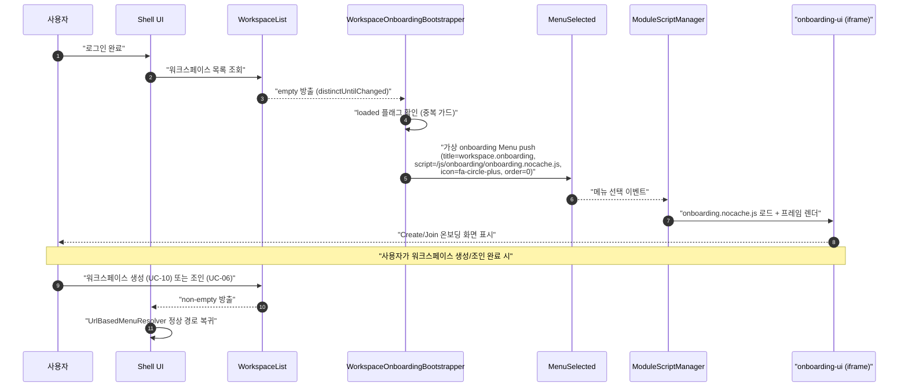
```mermaid
sequenceDiagram
    autonumber
    participant User as 사용자
    participant Shell as Shell UI
    participant WL as WorkspaceList
    participant OB as WorkspaceOnboardingBootstrapper
    participant MS as MenuSelected
    participant MSM as ModuleScriptManager
    participant OUI as "onboarding-ui (iframe)"

    User->>Shell: "로그인 완료"
    Shell->>WL: "워크스페이스 목록 조회"
    WL-->>OB: "empty 방출 (distinctUntilChanged)"
    OB->>OB: "loaded 플래그 확인 (중복 가드)"
    OB->>MS: "가상 onboarding Menu push<br/>(title=workspace.onboarding,<br/>script=/js/onboarding/onboarding.nocache.js,<br/>icon=fa-circle-plus, order=0)"
    MS-->>MSM: "메뉴 선택 이벤트"
    MSM->>OUI: "onboarding.nocache.js 로드 + 프레임 렌더"
    OUI-->>User: "Create/Join 온보딩 화면 표시"

    Note over User,OUI: "사용자가 워크스페이스 생성/조인 완료 시"
    User->>WL: "워크스페이스 생성 (UC-10) 또는 조인 (UC-06)"
    WL-->>Shell: "non-empty 방출"
    Shell->>Shell: "UrlBasedMenuResolver 정상 경로 복귀"
```

**기본 흐름:**
1. 사용자가 로그인하면 Shell 이 `WorkspaceList` 를 구독한다.
2. `WorkspaceList` 가 빈 목록을 방출한다.
3. `WorkspaceOnboardingBootstrapper` 가 이를 감지하고 `loaded` 플래그로 중복 실행을 가드한다.
4. 가상 onboarding `Menu` (title=`workspace.onboarding`, script=`js/workspaces/workspace.nocache.js`, icon=`fa-circle-plus`, iconType=`solid`, order=`0`) 를 `MenuSelected` 에 1회 push 한다.
5. `ModuleScriptManager` 가 기존 파이프라인에 따라 `workspace.nocache.js` 를 로드하고 프레임을 렌더한다.
6. 사용자는 UC-10 (생성) 또는 UC-06 (조인) 을 수행한다.

**대안 흐름:**
- 4a. 가상 Menu 는 `MenuList` 에 등록되지 않으므로 MenuRail / MobileTabs 에는 노출되지 않는다 (오직 `MenuSelected` 스트림에만 흐름).
- 6a. 사용자가 워크스페이스를 생성/조인하여 `WorkspaceList` 가 non-empty 로 전환되면 `UrlBasedMenuResolver` 의 정상 경로로 복귀한다. Bootstrapper 는 `loaded=true` 로 고정되어 재실행되지 않는다.
- 2a. `WorkspaceList` 가 non-empty 를 먼저 방출하면 Bootstrapper 는 push 를 수행하지 않고, UC-04 의 기본 흐름(마지막 액션 워크스페이스 진입)이 진행된다.

**관련 컴포넌트:**
- `shell-ui/src/main/java/dev/sayaya/handbook/client/usecase/WorkspaceOnboardingBootstrapper.java`
- `WorkspaceList`, `MenuSelected`, `ModuleScriptManager` (shell-ui)
- `workspace-ui` 모듈 (`workspace.nocache.js`)

---

## 사용자·그룹 관리

### UC-20: 그룹 생성

| 항목 | 내용 |
|------|------|
| **액터** | 워크스페이스 관리자 |
| **선행 조건** | `{workspace}:group:create` 권한을 가진다 |
| **후행 조건** | 워크스페이스에 새 그룹이 생성된다 |

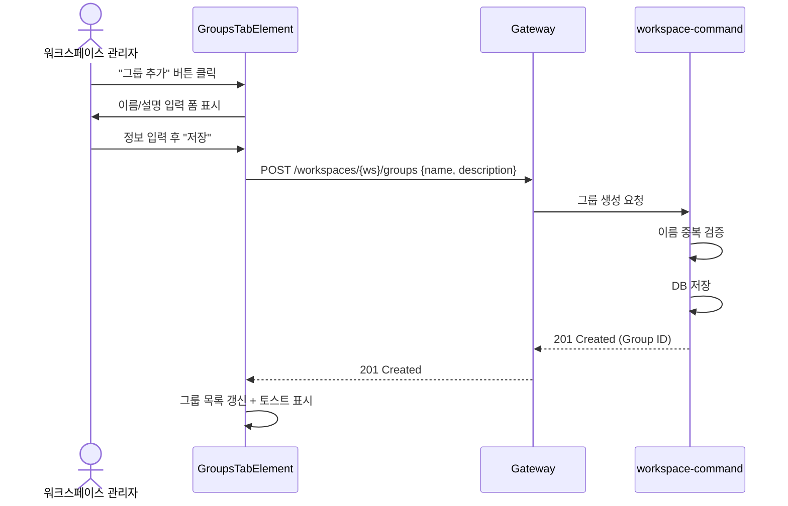
```mermaid
sequenceDiagram
    actor Admin as 워크스페이스 관리자
    participant UI as GroupsTabElement
    participant GW as Gateway
    participant API as workspace-command

    Admin->>UI: "그룹 추가" 버튼 클릭
    UI->>Admin: 이름/설명 입력 폼 표시
    Admin->>UI: 정보 입력 후 "저장"
    UI->>GW: POST /workspaces/{ws}/groups {name, description}
    GW->>API: 그룹 생성 요청
    API->>API: 이름 중복 검증
    API->>API: DB 저장
    API-->>GW: 201 Created (Group ID)
    GW-->>UI: 201 Created
    UI->>UI: 그룹 목록 갱신 + 토스트 표시
```

**기본 흐름:**
1. 관리자가 그룹 관리 탭에서 "그룹 추가" 버튼을 클릭한다.
2. 시스템이 그룹 이름과 설명을 입력할 수 있는 폼을 제공한다.
3. 관리자가 정보를 입력하고 저장을 요청한다.
4. 시스템이 워크스페이스 내에 고유한 이름인지 확인 후 그룹을 생성한다.

---

### UC-21: 그룹 삭제

| 항목 | 내용 |
|------|------|
| **액터** | 워크스페이스 관리자 |
| **선행 조건** | `{workspace}:group:delete` 권한을 가진다 |
| **후행 조건** | 그룹이 삭제되고, 소속 사용자의 그룹 배정이 해제된다 |

**기본 흐름:**
1. 관리자가 삭제할 그룹을 선택하고 삭제를 요청한다.
2. 시스템이 ConfirmDialog를 통해 재확인한다.
3. 승인 시 시스템이 해당 그룹과 그룹-멤버 매핑, 그룹-역할 매핑을 모두 삭제한다.

---

### UC-22: 사용자 배정 (멤버 추가/삭제)

| 항목 | 내용 |
|------|------|
| **액터** | 워크스페이스 관리자 |
| **선행 조건** | `{workspace}:user:assign` 권한을 가진다 |
| **후행 조건** | 사용자가 지정된 그룹에 배정되거나 제거된다 |

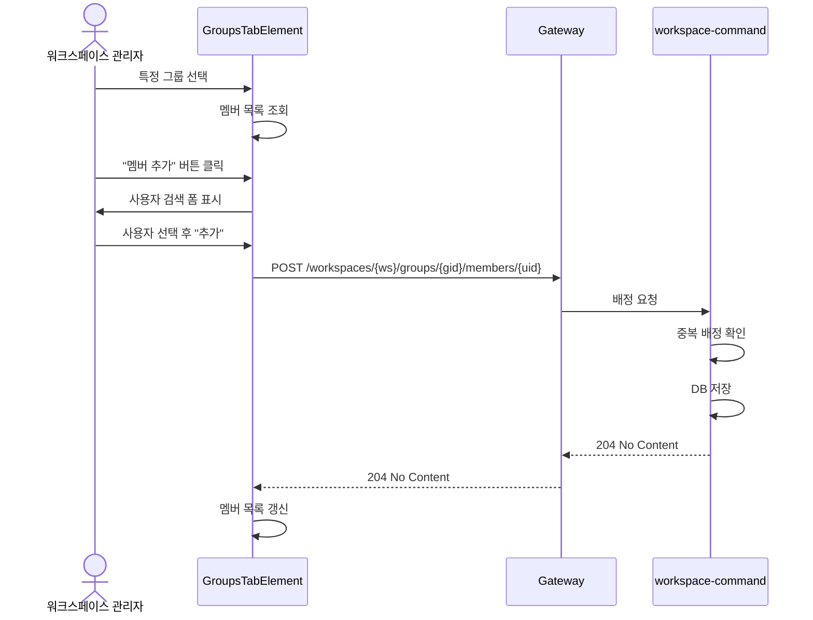
```mermaid
sequenceDiagram
    actor Admin as 워크스페이스 관리자
    participant UI as GroupsTabElement
    participant GW as Gateway
    participant API as workspace-command

    Admin->>UI: 특정 그룹 선택
    UI->>UI: 멤버 목록 조회
    Admin->>UI: "멤버 추가" 버튼 클릭
    UI->>Admin: 사용자 검색 폼 표시
    Admin->>UI: 사용자 선택 후 "추가"
    UI->>GW: POST /workspaces/{ws}/groups/{gid}/members/{uid}
    GW->>API: 배정 요청
    API->>API: 중복 배정 확인
    API->>API: DB 저장
    API-->>GW: 204 No Content
    GW-->>UI: 204 No Content
    UI->>UI: 멤버 목록 갱신
```

**기본 흐름:**
1. 관리자가 특정 그룹을 선택하고 "멤버 추가"를 클릭한다.
2. 시스템이 사용자 검색(이름/이메일) 기능을 제공한다.
3. 관리자가 대상 사용자를 선택하여 추가를 요청한다.
4. 시스템이 해당 그룹에 사용자를 배정한다.

---

### UC-23: 역할 부여 (RBAC)

| 항목 | 내용 |
|------|------|
| **액터** | 워크스페이스 관리자 |
| **선행 조건** | `{workspace}:role:assign` 권한을 가진다 |
| **후행 조건** | 그룹에 역할이 부여되고, 소속 사용자가 해당 Permission을 획득한다 |

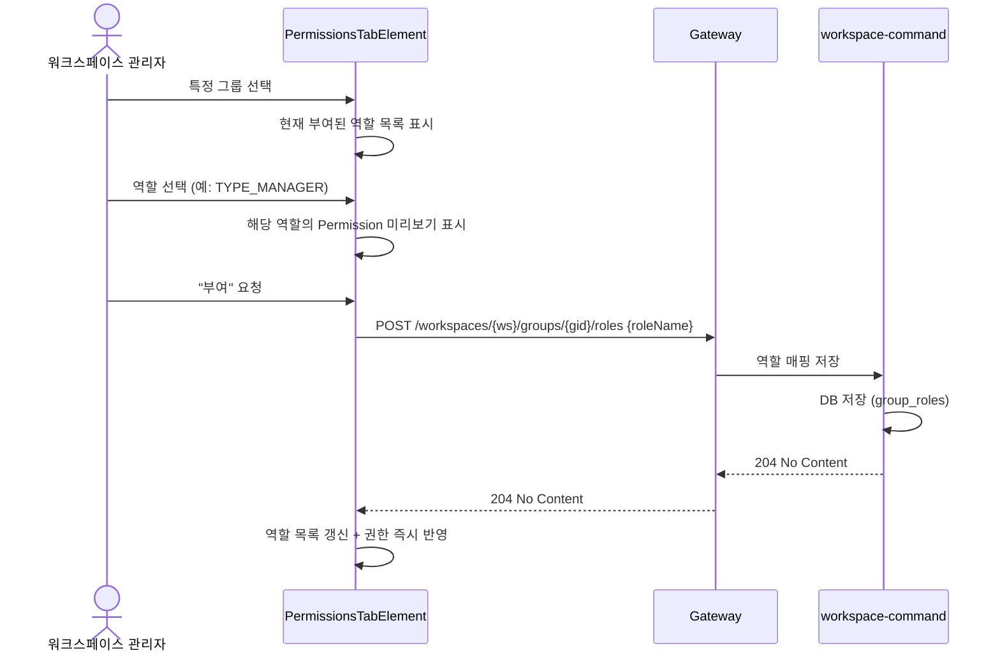
```mermaid
sequenceDiagram
    actor Admin as 워크스페이스 관리자
    participant UI as PermissionsTabElement
    participant GW as Gateway
    participant API as workspace-command

    Admin->>UI: 특정 그룹 선택
    UI->>UI: 현재 부여된 역할 목록 표시
    Admin->>UI: 역할 선택 (예: TYPE_MANAGER)
    UI->>UI: 해당 역할의 Permission 미리보기 표시
    Admin->>UI: "부여" 요청
    UI->>GW: POST /workspaces/{ws}/groups/{gid}/roles {roleName}
    GW->>API: 역할 매핑 저장
    API->>API: DB 저장 (group_roles)
    API-->>GW: 204 No Content
    GW-->>UI: 204 No Content
    UI->>UI: 역할 목록 갱신 + 권한 즉시 반영
```

**기본 흐름:**
1. 관리자가 권한 관리 탭에서 그룹을 선택한다.
2. 시스템이 부여 가능한 표준 역할 목록을 제공한다.
3. 관리자가 역할을 선택하면 시스템이 해당 역할이 포함하는 상세 Permission 목록을 미리보기로 보여준다.
4. 관리자가 부여를 확정하면 시스템이 그룹-역할 매핑을 저장한다.

---

### UC-24: 권한 및 멤버 조회

| 항목 | 내용 |
|------|------|
| **액터** | 워크스페이스 관리자 |
| **선행 조건** | 워크스페이스에 진입한 상태이다 |
| **후행 조건** | - |

**기본 흐름:**
1. 관리자가 그룹 또는 사용자의 권한 목록을 요청한다.
2. 시스템이 해당 그룹/사용자에게 부여된 역할과 그로부터 유도된 모든 Permission 목록을 병합하여 반환한다.

---

## 타입 관리

### UC-30: 타입 정의

| 항목 | 내용 |
|------|------|
| **액터** | 타입 관리자, AI 에이전트 |
| **선행 조건** | `{workspace}:type:create` 권한을 가진다 |
| **후행 조건** | 타입이 로컬 더티 상태(CHANGED)로 추가된다. Save 후 서버에 저장되고 TYPE_CREATED 이벤트가 발행된다 |

**기본 흐름:**
1. 타입 관리자가 캔버스에서 "Add Type"을 클릭한다.
2. `CreateBoxAction`이 실행되어 타입 카드가 캔버스에 추가되고, `ChangeTracker`에 CHANGED로 마킹된다.
3. 타입 이름, 설명, effectDateTime을 입력하고, 속성(Attribute)을 추가한다. 속성 타입은 9종(text, number, date, enum, bool, array, map, file, document)이며, array/map은 `ValidatorEditorFactory`를 통해 재귀적 서브 타입 에디터를 제공한다 (최대 3단계).
4. Save 버튼 클릭 시 `PUT /workspaces/{id}/types`로 원자적 저장된다.
5. TYPE_CREATED 이벤트가 발행된다.

**대안 흐름:**
- 2a. 기존 타입을 parent로 지정하여 속성을 상속받을 수 있다.

**에이전트 시나리오:**
- 사용자가 "주문 타입 만들어줘. 주문번호, 고객, 금액, 날짜가 필요해"라고 요청한다.
- 에이전트가 속성 타입을 자동 추론한다 (주문번호→Text, 고객→Document(고객 타입 참조), 금액→Number, 날짜→Date).
- `preview`로 타입 구조를 보여주고, `await_confirm`으로 사용자 확인 후 Gateway를 통해 생성한다.
- 대화형 설계(UC-80)에서 여러 타입을 일괄 생성할 때도 이 흐름을 반복한다.

---

### UC-31: 타입 변경 (새 버전 생성)

| 항목 | 내용 |
|------|------|
| **액터** | 타입 관리자, AI 에이전트 |
| **선행 조건** | `{workspace}:type:{type}:edit` 권한을 가진다. 해당 타입이 존재한다 |
| **후행 조건** | 기존 버전은 보존되고 새 버전이 생성된다. 기존 문서에 대한 재검증이 트리거된다 |

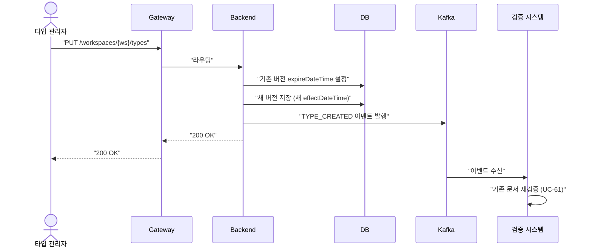
```mermaid
sequenceDiagram
    actor TM as 타입 관리자
    participant GW as Gateway
    participant API as Backend
    participant DB
    participant Kafka
    participant V as 검증 시스템

    TM->>GW: "PUT /workspaces/{ws}/types"
    GW->>API: "라우팅"
    API->>DB: "기존 버전 expireDateTime 설정"
    API->>DB: "새 버전 저장 (새 effectDateTime)"
    API->>Kafka: "TYPE_CREATED 이벤트 발행"
    API-->>GW: "200 OK"
    GW-->>TM: "200 OK"
    Kafka->>V: "이벤트 수신"
    V->>V: "기존 문서 재검증 (UC-61)"
```

**기본 흐름:**
1. 타입 관리자가 캔버스에서 기존 타입의 속성을 변경한다 (속성 추가·삭제, Validator 변경 등).
2. `EditBoxAction`이 실행되고 `ChangeTracker`에 CHANGED로 마킹된다.
3. 새 버전의 effectDateTime을 지정한다.
4. Save 버튼 클릭 시 원자적 저장. 시스템이 기존 버전의 expireDateTime을 설정하고, 새 버전을 생성한다.
5. TYPE_CREATED 이벤트가 발행된다.
6. 검증 시스템이 해당 타입의 기존 문서를 새 스키마 기준으로 재검증한다 (UC-61).

**에이전트 시나리오:**
- 사용자가 "고객 타입에 전화번호 필드 추가해줘"라고 요청한다.
- 에이전트가 타입 편집기로 `navigate`한 뒤 현재 속성을 `attention`(spotlight)으로 안내한다.
- 새 속성을 `preview`(diff)로 보여주고, `await_confirm` 후 Gateway를 통해 새 버전을 생성한다.
- 재검증이 트리거되면 `notify`로 "기존 문서 N건에 대한 검증이 시작되었습니다"를 안내한다.

---

### UC-32: 타입 삭제

| 항목 | 내용 |
|------|------|
| **액터** | 타입 관리자, AI 에이전트 |
| **선행 조건** | `{workspace}:type:delete` 권한을 가진다 |
| **후행 조건** | 타입이 로컬 더티 상태(DELETED)로 마킹된다. Save 후 서버에서 삭제되고 TYPE_DELETED 이벤트가 발행된다 |

**기본 흐름:**
1. 타입 관리자가 삭제할 타입을 선택하고 Delete 키 또는 "Remove Type" 버튼을 클릭한다.
2. `DeleteBoxAction`이 실행되고 `ChangeTracker`에 DELETED로 마킹된다.
3. 타입 카드가 삭제 예정 상태로 표시된다 (50% 투명화, 취소선). Undo 가능.
4. Save 버튼 클릭 시 서버에서 삭제되고 TYPE_DELETED 이벤트가 발행된다.

---

### UC-33: 타입 조회

| 항목 | 내용 |
|------|------|
| **액터** | 사용자, 타입 관리자 |
| **선행 조건** | `{workspace}:type:{type}:view` 권한을 가진다 |
| **후행 조건** | - |

**기본 흐름:**
1. 사용자가 워크스페이스의 타입 목록을 요청한다.
2. 시스템이 현재 유효한 타입 목록을 반환한다 (effectDateTime 기준 필터링).

**대안 흐름:**
- 1a. 특정 날짜를 지정하여 해당 시점에 유효했던 타입 목록을 조회할 수 있다.

---

### UC-34: 타입 이력 조회 및 버전 Diff

| 항목 | 내용 |
|------|------|
| **액터** | 사용자, 타입 관리자 |
| **선행 조건** | `{workspace}:type:{type}:view` 권한을 가진다 |
| **후행 조건** | 두 버전 간 변경점이 DiffPanel에 표시된다 |

**기본 흐름:**
1. 사용자가 특정 타입의 버전 이력을 요청한다.
2. 시스템이 해당 타입의 모든 버전을 시간순으로 반환한다.
3. 사용자가 비교할 두 버전을 선택한다.
4. 시스템이 두 버전의 속성/설명/부모 변경점을 계산하여 반환한다.
5. DiffPanel에 "before → after" 형식으로 변경점이 표시된다.

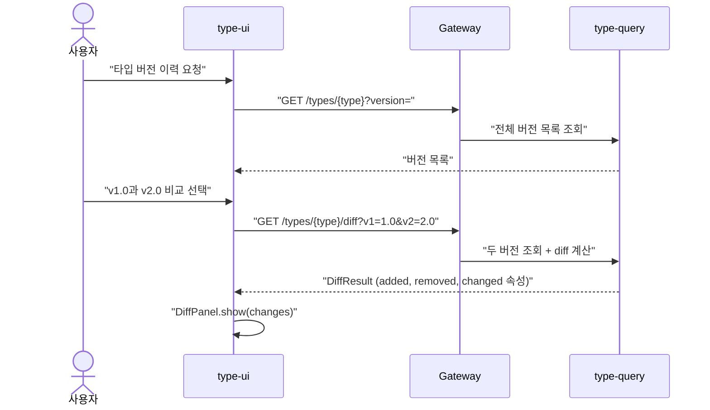
```mermaid
sequenceDiagram
    actor User as 사용자
    participant UI as type-ui
    participant GW as Gateway
    participant API as type-query

    User->>UI: "타입 버전 이력 요청"
    UI->>GW: "GET /types/{type}?version="
    GW->>API: "전체 버전 목록 조회"
    API-->>UI: "버전 목록"

    User->>UI: "v1.0과 v2.0 비교 선택"
    UI->>GW: "GET /types/{type}/diff?v1=1.0&v2=2.0"
    GW->>API: "두 버전 조회 + diff 계산"
    API-->>UI: "DiffResult (added, removed, changed 속성)"
    UI->>UI: "DiffPanel.show(changes)"
```

---

## 타입 시각화

### UC-40: 캔버스에 타입 배치

| 항목 | 내용 |
|------|------|
| **액터** | 타입 관리자 |
| **선행 조건** | 타입이 존재하고, 레이아웃이 존재한다 |
| **후행 조건** | 타입의 캔버스 위치·크기가 저장된다 |

**기본 흐름:**
1. 타입 관리자가 캔버스에서 타입을 드래그하여 배치한다.
2. 타입의 위치(x, y)와 크기(width, height)가 레이아웃에 저장된다.

**대안 흐름:**
- 1a. 컨텍스트 메뉴로 타입을 캔버스에 추가할 수 있다.
- 1b. 키보드 방향키로 타입을 이동할 수 있다.
- 1c. document 참조 속성이 있으면 SVG 화살표가 자동 렌더링된다. 화살표 호버 시 출발지 속성과 도착지 타입이 하이라이트된다 (상세: UC-T18).

---

### UC-41: 레이아웃 저장·전환

| 항목 | 내용 |
|------|------|
| **액터** | 타입 관리자 |
| **선행 조건** | 워크스페이스가 존재한다 |
| **후행 조건** | 레이아웃이 저장되거나 전환된다 |

**기본 흐름:**
1. 타입 관리자가 현재 캔버스 배치를 레이아웃으로 저장한다.
2. 저장된 레이아웃 간에 전환할 수 있다.

---

## 문서 관리

### UC-50: 문서 생성

| 항목 | 내용 |
|------|------|
| **액터** | 사용자, 타입 관리자, AI 에이전트 |
| **선행 조건** | `{workspace}:type:{type}:document:edit` 권한을 가진다. 해당 타입이 존재한다 |
| **후행 조건** | 문서가 로컬 더티 상태(created)로 추가된다. Save 후 서버에 저장되고 DOCUMENT_CREATED 이벤트가 발행된다 |

**기본 흐름:**
1. 사용자가 타입을 선택하고 Add 버튼을 클릭한다.
2. `AddDocumentAction`이 실행되어 빈 행이 스프레드시트에 추가된다.
3. 행이 `.created` 상태로 표시된다 (tertiary-container 배경, 좌측 3px tertiary 보더).
4. 사용자가 serial, 데이터, effectDateTime을 입력한다.
5. Save 버튼 클릭 시 서버에 원자적으로 저장된다 (UC-50a).
6. DOCUMENT_CREATED 이벤트가 발행되고, 검증이 트리거된다 (UC-60).

**예외 흐름:**
- 5a. serial이 중복되면 409 Conflict 오류를 반환하고, 해당 행에 `.conflict` 상태를 표시한다.

**에이전트 시나리오:**
- 사용자가 "새 고객 등록해줘. 이름 홍길동, 이메일 hong@example.com"이라고 요청한다.
- 에이전트가 고객 타입의 스키마를 조회하여 필수 필드를 확인하고, 누락된 필드가 있으면 추가 질문한다.
- `DOC_ADD` → `DOC_EDIT` 명령으로 행 추가 및 값 입력 (동일한 DirtyTracker 경로).
- `preview`로 생성될 문서를 보여주고, `await_confirm` 후 `DOC_SAVE`로 저장한다.
- 사용자는 에이전트 편집을 Undo(Ctrl+Z)로 되돌릴 수 있다.

---

### UC-51: 문서 변경 (새 버전 생성)

| 항목 | 내용 |
|------|------|
| **액터** | 사용자, 타입 관리자, AI 에이전트 |
| **선행 조건** | `{workspace}:type:{type}:document:edit` 권한을 가진다. 해당 문서가 존재한다 |
| **후행 조건** | 셀이 `.changed` 상태로 표시된다. Save 후 기존 버전은 보존되고 새 버전이 생성된다. 검증이 트리거된다 |

**기본 흐름:**
1. 사용자가 스프레드시트에서 셀을 클릭하여 값을 수정한다. 속성 타입에 따라 전용 입력 위젯이 활성화된다 (enum→드롭다운, date→날짜선택, number→숫자입력, bool→체크박스, document→텍스트 입력. 상세: UC-D16).
2. `afterChange` 이벤트가 `EditDocumentAction(before, after)`을 생성한다.
3. `ActionManager`에서 실행되고, `DirtyTracker.changed`에 등록된다.
4. 변경된 셀에 `.changed` 상태가 표시된다 (tertiary 1px inset box-shadow).
5. Undo(Ctrl+Z)로 원본값이 복원되면 더티 플래그가 자동 해제된다.
6. Save 버튼 클릭 시 서버에 원자적으로 저장된다. 기존 버전의 expireDateTime이 설정되고 새 버전이 생성된다.
7. DOCUMENT_CREATED 이벤트가 발행되고, 검증이 트리거된다 (UC-60).

**에이전트 시나리오:**
- 사용자가 "고객 C-001의 이메일을 new@example.com으로 변경해줘"라고 요청한다.
- 에이전트가 해당 문서를 검색하고 문서 편집기로 `navigate`한다.
- `DOC_EDIT CUST-001 email new@example.com` 명령으로 셀을 편집한다 (동일한 DirtyTracker 경로).
- 변경 대상 필드를 `attention`(spotlight)으로 안내하고, 변경 전후를 `preview`(diff)로 보여준다.
- `await_confirm` 후 `DOC_SAVE`로 저장한다.
- 사용자는 에이전트 편집을 Undo(Ctrl+Z)로 되돌릴 수 있다.

---

### UC-52: 문서 삭제

| 항목 | 내용 |
|------|------|
| **액터** | 사용자, 타입 관리자, AI 에이전트 |
| **선행 조건** | `{workspace}:type:{type}:document:edit` 권한을 가진다 |
| **후행 조건** | 행이 `.deleted` 상태로 표시된다. Save 후 서버에서 삭제되고 DOCUMENT_DELETED 이벤트가 발행된다 |

**기본 흐름:**
1. 사용자가 삭제할 행을 선택하고 Delete 버튼을 클릭한다.
2. `DeleteDocumentAction`이 실행되어 행이 `.deleted` 상태로 표시된다 (취소선, 75% 투명화).
3. `DirtyTracker.deleted`에 등록된다.
4. Undo(Ctrl+Z)로 삭제를 취소할 수 있다.
5. Save 버튼 클릭 시 서버에서 삭제되고 DOCUMENT_DELETED 이벤트가 발행된다.

**에이전트 시나리오:**
- `DOC_DELETE <serial>` 명령으로 동일한 DirtyTracker 경로를 거쳐 삭제 마킹된다.

---

### UC-53: 문서 조회

| 항목 | 내용 |
|------|------|
| **액터** | 사용자 |
| **선행 조건** | `{workspace}:type:{type}:document:view` 권한을 가진다 |
| **후행 조건** | - |

**기본 흐름:**
1. 사용자가 타입과 serial을 지정하여 문서를 요청한다.
2. 시스템이 현재 유효한 버전의 문서 데이터를 반환한다.

---

### UC-54: 문서 검색

| 항목 | 내용 |
|------|------|
| **액터** | 사용자, AI 에이전트 |
| **선행 조건** | `{workspace}:type:{type}:document:view` 권한을 가진다 |
| **후행 조건** | - |

**기본 흐름:**
1. 사용자가 검색 조건(필터, 정렬, 페이지)을 지정한다.
2. 시스템이 조건에 맞는 문서 목록을 페이지네이션하여 반환한다.

**대안 흐름:**
- 1a. 전문 검색(full-text search)으로 문서 내용을 키워드 검색할 수 있다.
- 1b. 날짜 범위, 상태, 타입별 필터를 조합할 수 있다.

---

### UC-55: 문서 이력 조회 및 버전 Diff

| 항목 | 내용 |
|------|------|
| **액터** | 사용자 |
| **선행 조건** | `{workspace}:type:{type}:document:view` 권한을 가진다 |
| **후행 조건** | 두 시점 간 변경 필드가 DiffPanel에 표시된다 |

**기본 흐름:**
1. 사용자가 특정 문서의 과거 시점 날짜를 지정한다.
2. 시스템이 해당 시점에 유효했던 버전의 문서 데이터를 반환한다 (point-in-time query).
3. 사용자가 비교할 두 시점을 선택한다.
4. 시스템이 두 시점의 문서 data 필드를 비교하여 변경점을 반환한다.
5. DiffPanel에 "before → after" 형식으로 변경 필드가 표시된다.

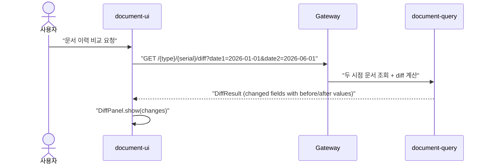
```mermaid
sequenceDiagram
    actor User as 사용자
    participant UI as document-ui
    participant GW as Gateway
    participant API as document-query

    User->>UI: "문서 이력 비교 요청"
    UI->>GW: "GET /{type}/{serial}/diff?date1=2026-01-01&date2=2026-06-01"
    GW->>API: "두 시점 문서 조회 + diff 계산"
    API-->>UI: "DiffResult (changed fields with before/after values)"
    UI->>UI: "DiffPanel.show(changes)"
```

---

### UC-56: 문서 일괄 임포트

| 항목 | 내용 |
|------|------|
| **액터** | 사용자, 타입 관리자 |
| **선행 조건** | `{workspace}:type:{type}:document:edit` 권한을 가진다 |
| **후행 조건** | 파일의 데이터가 문서로 생성되고, 각 문서에 대해 DOCUMENT_CREATED 이벤트가 발행된다 |

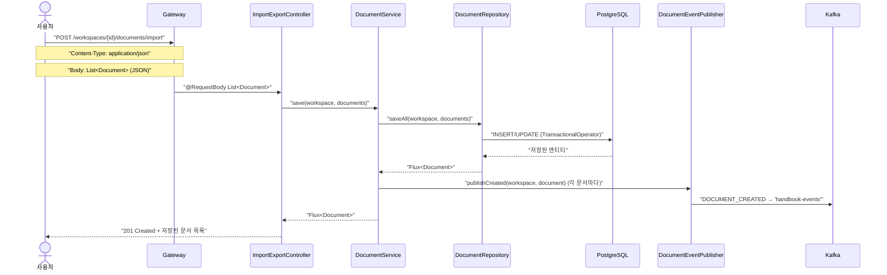
```mermaid
sequenceDiagram
    actor U as 사용자
    participant GW as Gateway
    participant Ctrl as ImportExportController
    participant Svc as DocumentService
    participant Repo as DocumentRepository
    participant DB as PostgreSQL
    participant Pub as DocumentEventPublisher
    participant K as Kafka

    U->>GW: "POST /workspaces/{id}/documents/import"
    Note over U,GW: "Content-Type: application/json"
    Note over U,GW: "Body: List<Document> (JSON)"
    GW->>Ctrl: "@RequestBody List<Document>"
    Ctrl->>Svc: "save(workspace, documents)"
    Svc->>Repo: "saveAll(workspace, documents)"
    Repo->>DB: "INSERT/UPDATE (TransactionalOperator)"
    DB-->>Repo: "저장된 엔티티"
    Repo-->>Svc: "Flux<Document>"
    Svc->>Pub: "publishCreated(workspace, document) (각 문서마다)"
    Pub->>K: "DOCUMENT_CREATED → 'handbook-events'"
    Svc-->>Ctrl: "Flux<Document>"
    Ctrl-->>U: "201 Created + 저장된 문서 목록"
```

**기본 흐름:**
1. 사용자가 JSON 형식의 문서 목록을 `POST /workspaces/{id}/documents/import`로 전송한다.
2. `ImportExportController`가 `DocumentService.save()`를 호출하여 문서를 일괄 저장한다.
3. 저장된 각 문서에 대해 DOCUMENT_CREATED 이벤트가 Kafka로 발행된다.
4. 저장된 문서 목록이 201 Created와 함께 응답으로 반환된다.

**예외 흐름:**
- 1a. serial 중복 시 409 Conflict가 반환된다.
- 1b. CSV 지원은 향후 추가 예정. 현재는 JSON만 지원한다.

---

### UC-57: 문서 일괄 익스포트

| 항목 | 내용 |
|------|------|
| **액터** | 사용자 |
| **선행 조건** | `{workspace}:type:{type}:document:view` 권한을 가진다 |
| **후행 조건** | 문서 데이터가 JSON 파일로 다운로드된다 |

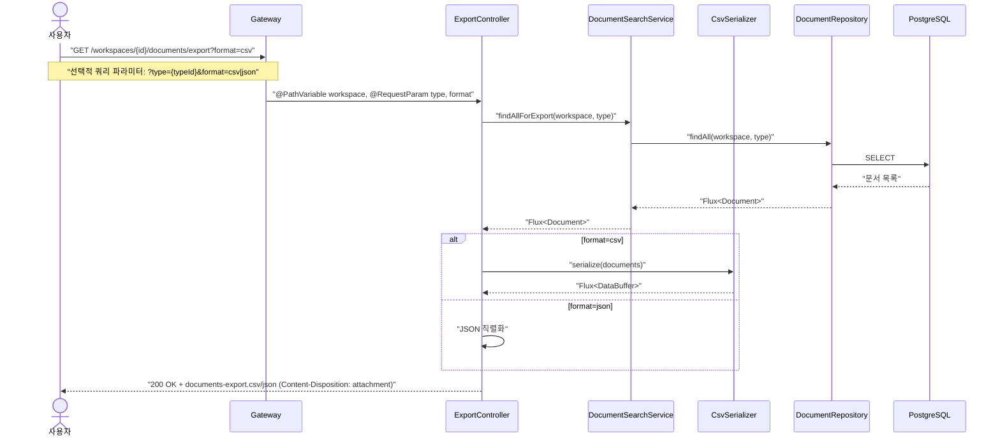
```mermaid
sequenceDiagram
    actor U as 사용자
    participant GW as Gateway
    participant Ctrl as ExportController
    participant Svc as DocumentSearchService
    participant Csv as CsvSerializer
    participant Repo as DocumentRepository
    participant DB as PostgreSQL

    U->>GW: "GET /workspaces/{id}/documents/export?format=csv"
    Note over U,GW: "선택적 쿼리 파라미터: ?type={typeId}&format=csv|json"
    GW->>Ctrl: "@PathVariable workspace, @RequestParam type, format"
    Ctrl->>Svc: "findAllForExport(workspace, type)"
    Svc->>Repo: "findAll(workspace, type)"
    Repo->>DB: SELECT
    DB-->>Repo: "문서 목록"
    Repo-->>Svc: "Flux<Document>"
    Svc-->>Ctrl: "Flux<Document>"
    alt format=csv
        Ctrl->>Csv: "serialize(documents)"
        Csv-->>Ctrl: "Flux<DataBuffer>"
    else format=json
        Ctrl->>Ctrl: "JSON 직렬화"
    end
    Ctrl-->>U: "200 OK + documents-export.csv/json (Content-Disposition: attachment)"
```

**기본 흐름:**
1. 사용자가 `GET /workspaces/{id}/documents/export`를 호출한다. 선택적으로 `type` 쿼리 파라미터로 타입별 필터링, `format` 파라미터로 출력 형식(csv/json)을 지정할 수 있다.
2. `ExportController`가 `DocumentSearchService.findAllForExport()`를 호출하여 문서를 조회한다.
3. CSV 형식이면 `CsvSerializer`로, JSON 형식이면 ObjectMapper로 직렬화하여 파일로 반환한다.

---

### UC-58: 프레즌스 (편집 중 사용자 표시)

| 항목 | 내용 |
|------|------|
| **액터** | 사용자 |
| **선행 조건** | 워크스페이스에 2명 이상 동시 접속 중 |
| **후행 조건** | 다른 사용자의 편집 위치가 실시간으로 표시된다 |

**기본 흐름:**
1. 사용자 A가 스프레드시트에서 셀을 선택하거나, 캔버스에서 타입 박스를 선택한다.
2. 200ms 디바운스 후 `POST /workspaces/{id}/presence`로 현재 위치를 전송한다.
   - 문서: `{user, type, serial, field}`
   - 타입: `{user, typeKey}`
3. SSE를 통해 PRESENCE 이벤트가 다른 사용자에게 전달된다.
4. 해당 셀/타입 박스에 사용자별 고유 색상 보더(2px)와 이름 라벨이 표시된다.
5. 사용자 A가 포커스를 해제하면 `{user, type: null}`로 프레즌스를 해제한다.
6. 30초 동안 갱신이 없으면 자동 해제된다 (연결 끊김 대비).

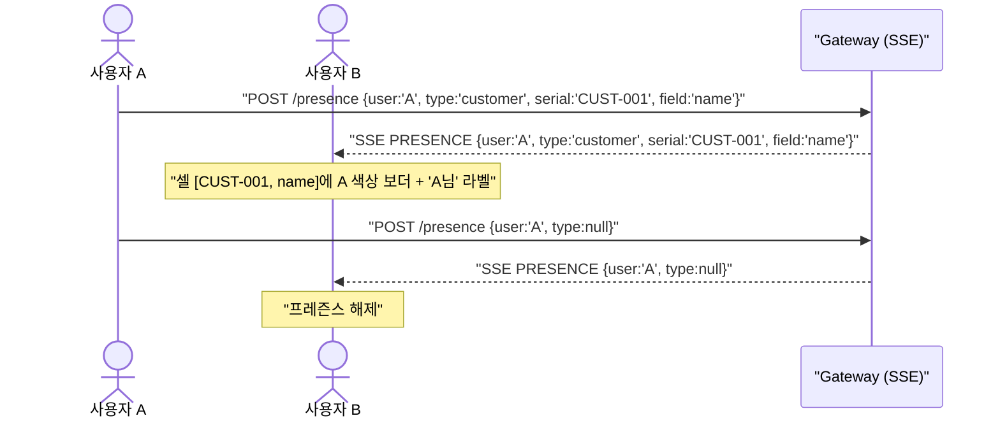
```mermaid
sequenceDiagram
    actor A as 사용자 A
    actor B as 사용자 B
    participant GW as "Gateway (SSE)"

    A->>GW: "POST /presence {user:'A', type:'customer', serial:'CUST-001', field:'name'}"
    GW-->>B: "SSE PRESENCE {user:'A', type:'customer', serial:'CUST-001', field:'name'}"
    Note over B: "셀 [CUST-001, name]에 A 색상 보더 + 'A님' 라벨"

    A->>GW: "POST /presence {user:'A', type:null}"
    GW-->>B: "SSE PRESENCE {user:'A', type:null}"
    Note over B: "프레즌스 해제"
```

---

### UC-59: 실시간 협업 — 패치 기반 병합 및 충돌 방지

| 항목 | 내용 |
|------|------|
| **액터** | 사용자 A, 사용자 B |
| **선행 조건** | 같은 워크스페이스에서 동시 작업 중 |
| **후행 조건** | 서로 다른 필드 수정 시 자동 병합. 같은 필드 수정 시 충돌 안내 |

**기본 흐름 (비충돌 — 서로 다른 필드):**
1. A가 문서 CUST-001의 "이름" 필드를, B가 "전화번호" 필드를 편집한다.
2. A가 Save → PATCH 요청 (변경 필드: `{"이름": "홍길동"}`, version=1).
3. 서버가 JSONB 머지 (`data || patch_data`) → version 2로 업데이트.
4. SSE로 B에게 DOCUMENT_CREATED 이벤트 전달 → B의 목록 갱신.
5. B가 Save → PATCH 요청 (변경 필드: `{"전화번호": "010-1234"}`, version=2).
6. 서버가 JSONB 머지 → version 3. **A의 "이름" 변경은 유지됨.**

**충돌 흐름 (같은 필드):**
1. A와 B가 같은 문서의 같은 "이름" 필드를 편집한다.
2. A가 먼저 Save → version 1 → 2.
3. B가 Save (version=1) → 서버가 version 불일치 감지 → 409 Conflict.
4. B에게 `.conflict` 표시 + 사용자 선택 ("내 변경 유지" / "서버 버전 수락").

**알림 흐름:**
1. 저장 성공 시 DOCUMENT_CREATED 이벤트 발행.
2. SSE를 통해 다른 사용자에게 전달.
3. `DocumentEventHandler`가 문서 목록 갱신 + 토스트 표시.

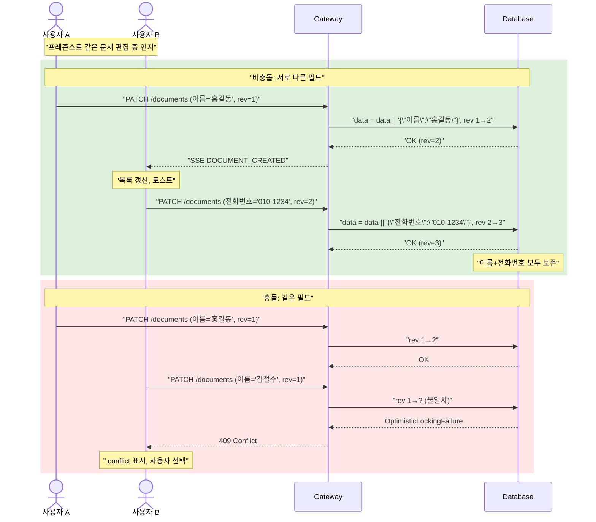
```mermaid
sequenceDiagram
    actor A as 사용자 A
    actor B as 사용자 B
    participant GW as Gateway
    participant DB as Database

    Note over A,B: "프레즌스로 같은 문서 편집 중 인지"

    rect rgb(220, 240, 220)
        Note over A,DB: "비충돌: 서로 다른 필드"
        A->>GW: "PATCH /documents (이름='홍길동', rev=1)"
        GW->>DB: "data = data || '{\"이름\":\"홍길동\"}', rev 1→2"
        DB-->>GW: "OK (rev=2)"
        GW-->>B: "SSE DOCUMENT_CREATED"
        Note over B: "목록 갱신, 토스트"

        B->>GW: "PATCH /documents (전화번호='010-1234', rev=2)"
        GW->>DB: "data = data || '{\"전화번호\":\"010-1234\"}', rev 2→3"
        DB-->>GW: "OK (rev=3)"
        Note over DB: "이름+전화번호 모두 보존"
    end

    rect rgb(255, 230, 230)
        Note over A,DB: "충돌: 같은 필드"
        A->>GW: "PATCH /documents (이름='홍길동', rev=1)"
        GW->>DB: "rev 1→2"
        DB-->>GW: OK

        B->>GW: "PATCH /documents (이름='김철수', rev=1)"
        GW->>DB: "rev 1→? (불일치)"
        DB-->>GW: OptimisticLockingFailure
        GW-->>B: 409 Conflict
        Note over B: ".conflict 표시, 사용자 선택"
    end
```

---

## 정합성 검증

### UC-60: 문서 검증

| 항목 | 내용 |
|------|------|
| **액터** | 검증 시스템 (이벤트 트리거) |
| **선행 조건** | DOCUMENT_CREATED 이벤트가 발행되어 VALIDATION_REQUESTED가 Kafka에 발행되었다 |
| **후행 조건** | ValidationTask가 완료되고, Compliance 결과가 저장된다. 이슈 발견 시 AGENT_COMMAND NOTIFY 이벤트가 발행된다 |

```mermaid
flowchart TD
    A["DOCUMENT_CREATED<br/>이벤트 수신"] --> B["ValidationTask 생성<br/>(NEW)"]
    B --> C["PROCESSING"]
    C --> D["현재 유효한<br/>타입 버전 조회"]
    D --> E["각 버전별<br/>Validator 규칙 적용"]
    E --> F{"하나 이상의 버전 만족?"}
    F -->|Yes| G["DONE"]
    F -->|No| H["FAILED"]
    G --> I["Compliance 저장<br/>(호환 버전 기록)"]
    H --> I
    I --> J["결과를 SSE로<br/>클라이언트에 전달"]
```

**기본 흐름:**
1. document-command가 VALIDATION_REQUESTED 이벤트를 Kafka에 발행한다.
2. assistant 모듈의 `ValidationEventListener`가 VALIDATION_REQUESTED를 수신한다.
3. `QualityMonitorService.validate()`가 typeId/documentId로 필터링하여 검증을 실행한다.
4. 발견된 이슈는 `AGENT_COMMAND(NOTIFY)` 이벤트로 Kafka에 발행되어 워크스페이스 SSE로 브로드캐스트된다.
5. ValidationTask를 생성하고 Compliance 결과를 저장한다.
6. ValidationTask를 완료한다 (DONE 또는 FAILED).
7. 결과를 SSE로 클라이언트에 전달한다.

---

### UC-61: 스키마 변경 재검증

| 항목 | 내용 |
|------|------|
| **액터** | 검증 시스템 (이벤트 트리거) |
| **선행 조건** | TYPE_CREATED 이벤트가 발행되어 VALIDATION_REQUESTED가 Kafka에 발행되었다 |
| **후행 조건** | 해당 타입의 모든 기존 문서에 대한 Compliance가 갱신된다. 이슈 발견 시 AGENT_COMMAND NOTIFY 이벤트가 발행된다 |

**기본 흐름:**
1. assistant 모듈의 `ValidationEventListener`가 VALIDATION_REQUESTED를 수신한다.
2. 해당 타입의 현재 유효한 문서를 모두 조회한다.
3. 각 문서에 대해 새 타입 버전 기준으로 검증을 수행한다 (UC-60과 동일한 검증 로직).
4. Compliance 결과를 갱신한다.
5. 불일치가 발견된 문서가 있으면 경고를 SSE로 전달한다.

---

### UC-62: 호환성 결과 조회

| 항목 | 내용 |
|------|------|
| **액터** | 사용자 |
| **선행 조건** | 로그인 상태이다 |
| **후행 조건** | - |

**기본 흐름:**
1. 사용자가 워크스페이스의 호환성 검증 결과를 요청한다.
2. 시스템이 Compliance 목록을 반환한다 (불일치 문서, 위반 속성, 위반 규칙).

**대안 흐름:**
- 1a. 문서 편집기에서 불일치 문서에 경고 아이콘이 자동으로 표시된다.

---

### UC-63: 데이터 사후 보정

| 항목 | 내용 |
|------|------|
| **액터** | 사용자, 타입 관리자, AI 에이전트 |
| **선행 조건** | Compliance 불일치가 존재한다 |
| **후행 조건** | 문서가 새 버전으로 보정되고, 재검증이 트리거된다 |

```mermaid
sequenceDiagram
    actor U as 사용자
    participant UI as 문서 편집기
    participant GW as Gateway
    participant API as Backend
    participant V as 검증 시스템

    UI->>UI: "불일치 문서에 경고 표시"
    U->>UI: "경고 문서 확인"
    UI->>GW: "GET /workspaces/{ws}/compliance"
    GW->>API: "라우팅"
    API-->>GW: "불일치 사유 반환"
    GW-->>UI: "불일치 사유"
    U->>UI: "데이터 보정 입력"
    UI->>GW: "PUT /workspaces/{ws}/documents (새 버전)"
    GW->>API: "라우팅"
    API-->>GW: "200 OK"
    GW-->>UI: "200 OK"
    API->>V: "DOCUMENT_CREATED 이벤트"
    V->>V: "재검증 (UC-60)"
    V-->>UI: "SSE로 검증 결과 전달"
```

**기본 흐름:**
1. 사용자가 문서 편집기에서 불일치 경고를 확인한다.
2. Compliance 상세 사유(어떤 속성, 어떤 규칙 위반)를 확인한다.
3. 사용자가 해당 문서의 데이터를 보정한다.
4. 보정된 데이터로 새 버전이 생성된다 (UC-51).
5. 재검증이 트리거되어 정합성이 확인된다 (UC-60).

**에이전트 시나리오:**
- 스키마 변경으로 검증 실패가 발생하면 에이전트가 `attention`(badge)으로 자동 안내한다.
- 사용자가 "검증 실패한 문서 보정해줘"라고 요청한다.
- 에이전트가 실패 사유를 분석하여 보정 방법을 제안한다.
  - 예: "고객 타입에 필수 필드 '이메일'이 추가되었는데 50건에 값이 없습니다. 기본값 'unknown@example.com'으로 채울까요?"
- `preview`로 영향 범위(대상 문서 수, 변경 내용)를 보여준다.
- `await_confirm` 후 `progress`로 진행률을 표시하며 일괄 보정을 실행한다.
- 보정 완료 후 재검증 결과를 `attention`(spotlight)으로 안내한다.
- 보정 내역은 감사 로그에 기록된다 (UC-90).

---

## Shell 네비게이션

### UC-70: 메뉴 선택

| 항목 | 내용 |
|------|------|
| **액터** | 사용자, AI 에이전트 (navigate 커맨드) |
| **선행 조건** | 워크스페이스에 진입한 상태이다 |
| **후행 조건** | 선택된 메뉴의 모듈 스크립트가 로딩되고, Frame에 콘텐츠가 표시된다 |

```mermaid
sequenceDiagram
    actor U as 사용자
    participant Shell
    participant MenuRail
    participant ToolRail
    participant Frame

    U->>MenuRail: "메뉴 클릭"
    MenuRail->>Shell: "MenuSelected 이벤트"
    Shell->>Shell: "모듈 스크립트 동적 주입"
    Shell->>ToolRail: "해당 메뉴의 Tool 목록 표시"
    Shell->>Frame: "기존 콘텐츠 fade-out"
    Shell->>Frame: "새 콘텐츠 fade-in"
```

**기본 흐름:**
1. 사용자가 Menu Rail에서 메뉴를 클릭한다.
2. 시스템이 해당 메뉴의 모듈 스크립트를 동적으로 로딩한다.
3. Tool Rail에 해당 메뉴의 도구 목록이 표시된다.
4. Frame 영역의 콘텐츠가 fade 애니메이션과 함께 교체된다.

**대안 흐름:**
- 1a. 도구가 하나뿐인 메뉴는 선택 즉시 도구가 자동 실행된다.
- 1b. AI 에이전트의 `navigate` 커맨드로 메뉴가 자동 선택될 수 있다.

---

### UC-71: 도구 실행

| 항목 | 내용 |
|------|------|
| **액터** | 사용자 |
| **선행 조건** | 메뉴가 선택된 상태이며, Tool Rail에 도구가 표시되어 있다 |
| **후행 조건** | 도구의 함수가 실행되고, Frame 콘텐츠가 갱신된다 |

**기본 흐름:**
1. 사용자가 Tool Rail에서 도구를 클릭한다.
2. 시스템이 해당 도구의 함수(ToolFunction)를 실행한다.
3. Frame 영역의 콘텐츠가 갱신된다.

---

### UC-72: URL 라우팅

| 항목 | 내용 |
|------|------|
| **액터** | 사용자 |
| **선행 조건** | 워크스페이스에 진입한 상태이다 |
| **후행 조건** | URL에 매칭되는 메뉴가 자동 선택된다 |

**기본 흐름:**
1. 사용자가 URL을 직접 입력하거나 브라우저 뒤로가기/앞으로가기를 사용한다.
2. 시스템이 현재 URL을 각 메뉴의 `urlRegex` 패턴과 매칭한다. 명시적인 메뉴 선택(클릭 등) 시에는 메뉴의 `url` 필드 값을 브라우저 주소창에 반영한다.
3. 매칭되는 메뉴가 자동 선택된다 (UC-70).
4. Drawer가 자동으로 Collapse 상태가 된다.

**예외 흐름:**
- 2a. 매칭되는 메뉴가 없으면 현재 상태를 유지한다.

---

## AI 어시스턴트

### UC-80: 대화형 워크스페이스 설계

| 항목 | 내용 |
|------|------|
| **액터** | 사용자, AI 에이전트 |
| **선행 조건** | 로그인 상태이며, 워크스페이스를 생성하려 한다 |
| **후행 조건** | 사용자가 승인한 타입 구조가 워크스페이스에 생성된다 |

**기본 흐름:**
1. 사용자가 자연어로 필요한 시스템을 설명한다 (예: "재고 관리 시스템이 필요해").
2. 에이전트가 의도를 해석하여 타입 구조(타입, 속성, 관계)를 설계한다.
3. 에이전트가 타입 캔버스 미리보기로 구조를 시각화한다 (`preview` 커맨드).
4. 에이전트가 사용자에게 구조를 안내한다 (`attention` 커맨드).
5. 사용자가 수정을 요청하면 에이전트가 구조를 조정한다 (반복).
6. `await_confirm` 커맨드 발행 시, AssistantService가 `Sinks.One`으로 커맨드 스트림을 일시정지한다. 사용자가 `POST /assistant/respond`로 응답하면 스트림이 재개된다. "cancel" 응답 시 실행이 중단된다.
7. 사용자가 최종 승인하면 에이전트가 Gateway를 통해 타입을 일괄 생성한다 (`mutate` 커맨드).
8. 에이전트가 타입 캔버스로 이동하여 결과를 보여준다 (`navigate` + `attention`).

```mermaid
sequenceDiagram
    participant U as 사용자
    participant F as Shell UI
    participant GW as Gateway
    participant A as Assistant
    participant L as LLM
    participant K as Kafka
    participant EB as event-broadcaster
    participant S as Backend

    U->>F: "'병원 진료 기록 관리가 필요해'"
    F->>GW: "POST /assistant/request"
    GW->>A: "라우팅"
    A->>L: "의도 해석 + 타입 설계"
    L-->>A: "타입 구조"
    A->>K: "AGENT_COMMAND (preview: 환자, 진료기록, 의사)"
    K->>EB: "이벤트 수신"
    EB-->>F: "SSE /workspaces/{id}/messages"
    A->>K: "AGENT_COMMAND (attention: '이 구조로 시작할까요?')"
    K->>EB: "이벤트 수신"
    EB-->>F: "SSE"
    A->>K: "AGENT_COMMAND (await_confirm)"
    K->>EB: "이벤트 수신"
    EB-->>F: "SSE"
    U->>F: "'처방은 별도 타입으로 분리해줘'"
    F->>GW: "POST /assistant/respond"
    GW->>A: "응답 전달"
    A->>L: "구조 수정"
    L-->>A: "수정된 구조"
    A->>K: "AGENT_COMMAND (preview: 갱신된 캔버스)"
    K->>EB: "이벤트 수신"
    EB-->>F: "SSE"
    A->>K: "AGENT_COMMAND (await_confirm)"
    K->>EB: "이벤트 수신"
    EB-->>F: "SSE"
    U->>F: confirm
    F->>GW: "POST /assistant/respond"
    GW->>A: "응답 전달"
    A->>GW: "PUT /workspaces/{ws}/types (일괄 생성)"
    GW->>S: "라우팅"
    S-->>GW: "생성 완료"
    GW-->>A: "결과"
    A->>K: "AGENT_COMMAND (navigate: 타입 캔버스)"
    K->>EB: "이벤트 수신"
    EB-->>F: "SSE"
    A->>K: "AGENT_COMMAND (attention: 생성된 타입)"
    K->>EB: "이벤트 수신"
    EB-->>F: "SSE"
    A->>K: "AGENT_COMMAND (complete: '5개 타입 생성 완료')"
    K->>EB: "이벤트 수신"
    EB-->>F: "SSE"
```

---

### UC-81: 자연어 스키마 변경

| 항목 | 내용 |
|------|------|
| **액터** | 사용자, AI 에이전트 |
| **선행 조건** | 워크스페이스에 진입한 상태이다. 타입 변경 권한이 있다 |
| **후행 조건** | 타입의 새 버전이 생성된다 |

**기본 흐름:**
1. 사용자가 자연어로 스키마 변경을 요청한다 (예: "고객 타입에 전화번호 추가해줘").
2. 에이전트가 해당 타입 편집기로 이동한다 (`navigate`).
3. 에이전트가 현재 속성 목록을 안내한다 (`attention`).
4. 에이전트가 변경 사항을 미리보기로 보여준다 (`preview`).
5. 사용자가 승인하면 에이전트가 Gateway를 통해 타입 새 버전을 생성한다 (`mutate`).
6. 에이전트가 결과를 안내한다 (`attention` + `complete`).

**예외 흐름:**
- 1a. 모호한 요청이면 에이전트가 추가 질문한다 (`await_confirm` + 선택지).
- 5a. 권한이 없으면 Gateway가 거부하고 에이전트가 사유를 안내한다 (`notify`).

---

### UC-82: 자연어 문서 변경

| 항목 | 내용 |
|------|------|
| **액터** | 사용자, AI 에이전트 |
| **선행 조건** | 워크스페이스에 진입한 상태이다. 문서 편집 권한이 있다 |
| **후행 조건** | 문서의 새 버전이 생성되거나, 검색 결과가 표시된다 |

**기본 흐름:**
1. 사용자가 자연어로 문서 작업을 요청한다.
2. 에이전트가 요청 유형을 판별한다 (검색 / 생성 / 수정).
3. (검색) 에이전트가 문서 목록 화면으로 이동하여 필터를 적용한다.
4. (수정) 에이전트가 해당 문서를 찾아 변경 사항을 미리보기로 보여준다.
5. 사용자가 승인하면 에이전트가 Gateway를 통해 문서 새 버전을 생성한다.

---

### UC-83: 자연어 정합성 보정

| 항목 | 내용 |
|------|------|
| **액터** | 사용자, AI 에이전트 |
| **선행 조건** | 정합성 검증 실패 문서가 존재한다 |
| **후행 조건** | 보정된 문서의 새 버전이 생성된다. 감사 로그에 기록된다 |

**기본 흐름:**
1. 에이전트가 정합성 검증 실패를 감지하고 사용자에게 안내한다 (`attention` + badge).
2. 사용자가 보정을 요청한다.
3. 에이전트가 영향 범위(대상 문서 수, 변경 내용)를 미리보기로 보여준다 (`preview`).
4. 사용자가 승인하면 에이전트가 Gateway를 통해 일괄 보정을 실행한다 (`mutate` + `progress`).
5. 보정 내역이 감사 로그에 기록된다 (UC-90).

---

### UC-84: UI 안내 (온보딩·협업)

| 항목 | 내용 |
|------|------|
| **액터** | 사용자, 시스템, AI 에이전트 |
| **선행 조건** | 없음 |
| **후행 조건** | 사용자가 안내된 UI 요소를 확인한다 |

**기본 흐름 (온보딩):**
1. 신규 사용자가 처음 접속한다.
2. 시스템이 주요 UI 요소를 순차적으로 안내한다 (`attention` coachmark 시퀀스).
3. 사용자가 각 안내를 확인하며 UI를 학습한다.

**기본 흐름 (협업 공유):**
1. 사용자 A가 특정 UI 위치를 선택하여 공유 메시지를 작성한다.
2. 시스템이 사용자 B에게 알림을 전송한다.
3. 사용자 B가 알림을 클릭하면 해당 위치로 이동하고 `attention` 커맨드가 실행된다.

**기본 흐름 (정합성 경고):**
1. 검증 실패 이벤트가 SSE로 수신된다.
2. 해당 메뉴에 `attention` badge가 표시된다.
3. 사용자가 해당 메뉴에 진입하면 문제 필드에 `attention` spotlight이 표시된다.

---

### UC-85: 외부 AI 에이전트 Tool Use

| 항목 | 내용 |
|------|------|
| **액터** | 외부 AI 에이전트 (Gemini Desktop 등 MCP 클라이언트, 또는 OpenAPI function calling) |
| **선행 조건** | 사용자가 발급한 Personal Access Token (PAT) 이 에이전트에 주입되어 있다 |
| **후행 조건** | 에이전트의 요청이 Handbook API 로 실행되고, 감사 로그에 `caller_type=external_agent` (또는 `mcp_client`) 로 기록된다 |

```mermaid
sequenceDiagram
    participant EA as 외부 AI 에이전트
    participant MCP as "mcp-server<br/>(후속)"
    participant GW as Gateway
    participant SVC as 백엔드 서비스
    participant AUD as "Audit Log"

    Note over EA: "사용자 자연어: '주문 타입에 배송일 필드 추가'"
    EA->>EA: "OpenAPI / MCP tool 스펙 참조"
    alt OpenAPI function calling 경로
        EA->>GW: "PATCH /workspaces/{id}/types (Bearer PAT)"
    else MCP 경로 (후속)
        EA->>MCP: "tool call: patch_type(workspace, type, changes)"
        MCP->>GW: "PATCH /workspaces/{id}/types (Bearer PAT)"
    end
    GW->>GW: "PAT 검증 + RBAC 적용 (§3.3)"
    GW->>SVC: "라우팅"
    SVC-->>GW: "200 OK / 409 Conflict / 403 Forbidden"
    GW->>AUD: "caller_type=external_agent, caller_id=token_id"
    GW-->>EA: "응답"
```

**기본 흐름 (OpenAPI function calling 경로):**
1. 사용자가 외부 AI 에이전트에게 자연어로 작업을 요청한다.
2. 에이전트가 `/openapi.json` 또는 `/llms.txt` 로부터 Handbook 능력을 참조한다.
3. 에이전트가 적절한 엔드포인트를 선택해 Bearer PAT 헤더와 함께 호출한다.
4. Gateway 가 PAT 를 검증하고 워크스페이스·역할 범위(§3.3) 를 확인한다.
5. 백엔드 서비스가 요청을 수행한다 (기존 API 흐름).
6. 감사 로그에 `caller_type=external_agent`, `caller_id=<token_id>` 로 기록된다.
7. 결과가 에이전트로 반환된다.

**대안 흐름 (MCP 경로 — 후속 반복):**
- 2a. 에이전트가 MCP 클라이언트라면 `mcp-server` 에 연결해 노출된 `tools` 목록을 받는다.
- 3a. `mcp-server` 가 도구 호출을 Gateway REST API 호출로 변환하여 위임한다 (DB 직접 접근 금지).
- 6a. 감사 로그의 `caller_type` 은 `mcp_client` 로 기록되어 OpenAPI 경로와 구분된다.

**예외 흐름:**
- 4a. PAT 가 만료되었거나 유효하지 않으면 401 반환.
- 4b. PAT 범위 밖 워크스페이스 접근 시 403 반환.
- 5a. 낙관적 잠금 충돌(`@Version`) 시 409 반환. 에이전트가 최신 rev 로 재시도하거나 사용자에게 보고.
- 모든 실패도 감사 로그에 기록된다 (성공·실패 여부 필드 포함).

**주의:**
- 내부 `assistant` (UC-80~UC-84) 와 외부 AI 에이전트는 감사 로그 `caller_type` 으로 구분된다.
- Rate limiting 은 **토큰 단위** 로 적용된다 (§7.1, §3.23.4).
- MCP 서버 구현은 **§3.23.2 기준 후속 반복** — 초기 릴리스에는 OpenAPI function calling 경로만 제공.

---

## 운영

### UC-90: 감사 로그 조회

| 항목 | 내용 |
|------|------|
| **액터** | 시스템 관리자, 워크스페이스 관리자 |
| **선행 조건** | `system:audit-logs` 또는 워크스페이스 ADMIN 권한을 가진다 |
| **후행 조건** | - |

**기본 흐름:**
1. 관리자가 감사 로그를 요청한다 (기간, 리소스 타입, 사용자 필터).
2. 시스템이 해당 조건의 변경 이력을 반환한다 (누가, 언제, 어떤 리소스를, 어떻게 변경했는지).

---

### UC-91: 대시보드 조회

| 항목 | 내용 |
|------|------|
| **액터** | 사용자 |
| **선행 조건** | 워크스페이스에 진입한 상태이다 |
| **후행 조건** | - |

**기본 흐름:**
1. 사용자가 워크스페이스 대시보드를 조회한다.
2. 시스템이 현황 요약을 반환한다 (타입 수, 문서 수, 검증 상태 요약, 최근 변경 이력).
3. 품질 이슈를 `GET /workspaces/{id}/quality-issues`로 조회한다.
4. 에이전트 활동 이력을 `GET /workspaces/{id}/agent-activity`로 조회한다.
5. SSE(`/workspaces/{id}/messages`)를 구독하여 실시간으로 카운터와 타임라인을 갱신한다.

> **요구사항 참조:** 6.2 대시보드 API 통합 — 워크스페이스 기반 API URL, 품질 이슈/에이전트 활동 조회 엔드포인트

---

### UC-92: 데이터 품질 현황 확인

| 항목 | 내용 |
|------|------|
| **액터** | 사용자 |
| **선행 조건** | 워크스페이스에 진입한 상태이다. 데이터 품질 감시가 1회 이상 실행된 상태이다 |
| **후행 조건** | - |

**기본 흐름:**
1. 사용자가 대시보드에서 데이터 품질 현황 영역을 확인한다.
2. 시스템이 타입별 품질 점수(결측치, 중복, 이상값 건수)를 차트로 표시한다.
3. 품질 이슈 목록이 심각도별로 분류되어 표시된다.
4. 사용자가 이슈를 클릭하면 해당 문서로 이동한다.

---

### UC-93: 데이터 품질 감시 실행 (에이전트)

| 항목 | 내용 |
|------|------|
| **액터** | 사용자, AI 에이전트 |
| **선행 조건** | 워크스페이스에 진입한 상태이다. 문서가 1건 이상 존재한다 |
| **후행 조건** | 감시 결과가 AGENT_COMMAND 이벤트로 워크스페이스에 브로드캐스트된다 |

**기본 흐름:**
1. 사용자가 에이전트에게 "품질 검사 실행"을 요청한다.
2. 에이전트가 의도를 해석하여 품질 검사 실행 계획을 생성한다.
3. 에이전트가 워크스페이스 내 문서를 스캔한다 (결측치, 중복, 이상값).
4. 감시 결과를 심각도에 따라 AGENT_COMMAND 이벤트(notify)로 발행한다.
5. event-broadcaster가 SSE를 통해 워크스페이스 멤버에게 실시간 알림한다.

**대안 흐름:**
- 1a. 스케줄 또는 DOCUMENT_CREATED 이벤트 트리거로 자동 실행될 수 있다.
- 4a. 이슈가 없으면 notify(info: "품질 이상 없음") 커맨드를 발행한다.

```mermaid
sequenceDiagram
    actor User as 사용자
    participant A as Assistant
    participant Parser as IntentParser
    participant QM as QualityMonitor
    participant K as Kafka
    participant EB as event-broadcaster
    participant C as "클라이언트 (SSE)"

    User->>A: "품질 검사 실행"
    A->>Parser: "parse(message)"
    Parser-->>A: "ExecutionPlan (quality check)"
    A->>QM: "scan workspace documents"
    QM->>QM: "결측치 / 중복 / 이상값 분석"
    QM-->>A: "감시 결과 (이슈 목록 + 심각도)"
    A->>K: "AGENT_COMMAND (notify: 이슈 알림)"
    K->>EB: "이벤트 수신"
    EB-->>C: "SSE /workspaces/{id}/messages"
    Note over C: "대시보드 품질 현황 자동 갱신"
```

---

### UC-94: 에이전트 실행 상태 조회

| 항목 | 내용 |
|------|------|
| **액터** | 사용자 |
| **선행 조건** | 워크스페이스에 진입한 상태이다 |
| **후행 조건** | 현재 진행 중인 에이전트 실행 목록과 진행률이 표시된다 |

**기본 흐름:**
1. 사용자가 에이전트 실행 상태를 조회한다 (GET /assistant/executions?workspace={id}).
2. 시스템이 해당 워크스페이스에서 진행 중인 모든 실행의 상태를 반환한다.
3. 각 실행에 대해 executionId, 실행 계획, 현재 그룹, 전체 그룹 수, 진행률(%), 상태가 표시된다.
4. SSE AGENT_COMMAND `type:"progress"` 이벤트로 실시간 갱신된다 (currentGroup/totalGroups/parallel/stepCount).

**대안 흐름:**
- 1a. 진행 중인 실행이 없으면 빈 목록이 반환된다.

**프론트엔드 표시:**
- **shell-ui**: 툴바의 `ActiveExecutionBadge`에 활성 실행 수 표시. 클릭 시 `ActiveExecutionPopover`로 상세 진행률 확인 (UC-S15).
- **agent-ui**: `ProgressHandler`가 그룹 수준 진행률을 프로그레스 바에 표시 (UC-A7).
- **dashboard-ui**: `ActiveExecutionsWidget`이 전체 실행 목록을 카드로 표시, SSE로 실시간 갱신 (UC-DB4).

```mermaid
sequenceDiagram
    actor User as 사용자
    participant GW as Gateway
    participant A as Assistant
    participant Ctx as "ExecutionContext Map"

    User->>GW: "GET /assistant/executions?workspace={id}"
    GW->>A: "getExecutions(workspace)"
    A->>Ctx: "filter by workspace"
    Ctx-->>A: "List<ExecutionContext>"
    A->>A: "각 context에서 상태 추출"
    Note over A: "executionId, plan, currentGroup,<br/>totalGroups, progress %, status"
    A-->>User: "200 OK + List<ExecutionStatus>"
```

---

### UC-95: 에이전트 아티팩트 조회

| 항목 | 내용 |
|------|------|
| **액터** | 사용자 |
| **선행 조건** | 워크스페이스에 진입한 상태이다. 1건 이상의 완료된 에이전트 실행이 존재한다 |
| **후행 조건** | 실행 결과 아티팩트 목록이 시간순으로 표시된다 |

**기본 흐름:**
1. 사용자가 에이전트 아티팩트를 조회한다 (GET /assistant/artifacts?workspace={id}).
2. 시스템이 AuditEntry에서 artifact 필드가 존재하는 항목을 필터링하여 반환한다.
3. 각 아티팩트에 executionId, summary(실행 결과 요약), changes(변경 목록: type/target/description), timestamp가 포함된다.

**대안 흐름:**
- 1a. 완료된 실행이 없으면 빈 목록이 반환된다.

**프론트엔드 표시:**
- **agent-ui**: `CompleteHandler`가 `complete` 커맨드 수신 시 `ArtifactSummaryPanel`로 아티팩트 요약 표시 (UC-A8).
- **dashboard-ui**: `ArtifactListWidget`이 최근 아티팩트 카드 목록 표시. `AgentActivityList` 활동 행에 아티팩트 링크 추가 (UC-DB5).

```mermaid
sequenceDiagram
    actor User as 사용자
    participant GW as Gateway
    participant A as Assistant
    participant Repo as AuditRepository

    User->>GW: "GET /assistant/artifacts?workspace={id}"
    GW->>A: "getArtifacts(workspace)"
    A->>Repo: "findByWorkspace(workspace)"
    Repo-->>A: "Flux<AuditEntry>"
    A->>A: "artifact != null 필터링"
    Note over A: "Artifact: executionId, summary,<br/>changes[{type, target, description}],<br/>timestamp"
    A-->>User: "200 OK + List<Artifact>"
```

---

### UC-64: 문서 상태 전이

| 항목 | 내용 |
|------|------|
| **액터** | 작성자, 승인자 |
| **선행 조건** | 문서가 워크스페이스에 존재한다 |
| **후행 조건** | 문서의 상태가 변경되고, 상태 변경 이벤트가 발행된다 |

**기본 흐름:**
1. 작성자가 DRAFT 문서를 REVIEW 상태로 전환 요청한다 (PATCH /workspaces/{workspace}/documents/{id}/status).
2. 시스템이 현재 상태와 요청 상태의 전이 유효성을 검증한다.
3. 시스템이 요청자의 권한을 검증한다 (작성자/승인자).
4. 상태를 변경하고 DOCUMENT_STATUS_CHANGED 이벤트를 발행한다.
5. 승인자가 REVIEW 문서를 PUBLISHED로 승인하거나 DRAFT로 반려한다.

**대안 흐름:**
- 2a. 유효하지 않은 전이 요청 시 400 Bad Request를 반환한다.
- 3a. 권한이 없는 경우 403 Forbidden을 반환한다.
- 5a. PUBLISHED 문서를 재편집하려면 DRAFT로 되돌린 후 수정한다.

```mermaid
sequenceDiagram
    actor Author as 작성자
    actor Approver as 승인자
    participant API as document-command
    participant DB as Database
    participant K as Kafka
    participant EB as event-broadcaster
    participant C as "클라이언트 (SSE)"

    Author->>API: "PATCH /documents/{id}/status {status: 'REVIEW'}"
    API->>DB: "문서 상태 조회"
    DB-->>API: "status = DRAFT"
    API->>API: "전이 유효성 검증 (DRAFT→REVIEW ✓)"
    API->>API: "권한 검증 (작성자 ✓)"
    API->>DB: "UPDATE status = REVIEW"
    API->>K: "DOCUMENT_STATUS_CHANGED"
    K->>EB: "이벤트 수신"
    EB-->>C: "SSE 알림"
    API-->>Author: "200 OK"

    Approver->>API: "PATCH /documents/{id}/status {status: 'PUBLISHED'}"
    API->>DB: "문서 상태 조회"
    DB-->>API: "status = REVIEW"
    API->>API: "전이 유효성 검증 (REVIEW→PUBLISHED ✓)"
    API->>API: "권한 검증 (승인자 ✓)"
    API->>DB: "UPDATE status = PUBLISHED"
    API->>K: "DOCUMENT_STATUS_CHANGED"
    K->>EB: "이벤트 수신"
    EB-->>C: "SSE 알림"
    API-->>Approver: "200 OK"
```

---

### UC-65: 웹훅 등록 및 발행

| 항목 | 내용 |
|------|------|
| **액터** | 워크스페이스 관리자, 외부 시스템 |
| **선행 조건** | 워크스페이스가 존재한다 |
| **후행 조건** | 웹훅이 등록되고, 이벤트 발생 시 등록된 URL로 HTTP POST가 전송된다 |

**기본 흐름:**
1. 관리자가 웹훅 URL과 구독 이벤트를 등록한다 (POST /workspaces/{workspace}/webhooks).
2. 시스템이 URL 유효성을 검증하고 웹훅을 저장한다.
3. 이벤트가 발생하면 webhook-service가 Kafka에서 이벤트를 수신한다.
4. 해당 워크스페이스의 활성 웹훅 중 이벤트 필터가 일치하는 웹훅을 조회한다.
5. 등록된 URL로 HTTP POST 콜백을 전송한다.

**대안 흐름:**
- 5a. 전송 실패 시 최대 3회 재시도한다 (지수 백오프: 1초, 2초, 4초).
- 5b. 3회 모두 실패하면 웹훅을 비활성화(active=false)하고 관리자에게 알린다.

```mermaid
sequenceDiagram
    actor Admin as 관리자
    participant API as Gateway
    participant DB as Database
    participant K as Kafka
    participant WS as webhook-service
    participant Ext as 외부 시스템

    Note over Admin,Ext: "웹훅 등록"
    Admin->>API: "POST /workspaces/{ws}/webhooks {url, events}"
    API->>DB: "INSERT webhooks"
    API-->>Admin: "201 Created"

    Note over Admin,Ext: "이벤트 발생 시 콜백"
    K->>WS: "DOCUMENT_CREATED 이벤트 수신"
    WS->>DB: "워크스페이스 활성 웹훅 조회"
    DB-->>WS: "webhooks (url, events 필터)"
    WS->>WS: "이벤트 필터 매칭"
    WS->>Ext: "HTTP POST {event, workspace, payload, timestamp}"
    Ext-->>WS: "200 OK"

    Note over WS,Ext: "실패 시 재시도"
    WS->>Ext: "HTTP POST (재시도 1회, 1초 후)"
    Ext-->>WS: "500 Error"
    WS->>Ext: "HTTP POST (재시도 2회, 2초 후)"
    Ext-->>WS: "500 Error"
    WS->>Ext: "HTTP POST (재시도 3회, 4초 후)"
    Ext-->>WS: "500 Error"
    WS->>DB: "UPDATE webhooks SET active=false"
```

---

### UC-66: 필드 레벨 권한 설정 및 적용

| 항목 | 내용 |
|------|------|
| **액터** | 타입 관리자, 사용자 |
| **선행 조건** | 워크스페이스에 타입이 정의되어 있다 |
| **후행 조건** | 속성별 read_roles/write_roles가 저장되고, 문서 편집 시 권한에 따라 셀 접근이 제한된다 |

**기본 흐름:**
1. 타입 관리자가 타입 정의 화면에서 속성의 `read_roles`/`write_roles`를 설정한다.
2. PATCH `/workspaces/{ws}/types`로 속성 권한을 포함하여 저장한다.
3. 서버가 `type_attributes` 테이블의 `read_roles`/`write_roles` 컬럼을 업데이트한다.
4. 사용자가 해당 타입의 문서를 스프레드시트에서 연다.
5. 클라이언트가 타입 조회 시 각 속성의 권한 정보를 수신한다.
6. 사용자의 역할과 속성별 `write_roles`를 비교하여, 권한 없는 셀을 읽기 전용으로 표시한다.
7. `read_roles`에 포함되지 않은 속성의 셀은 마스킹 처리한다.

**대안 흐름:**
- 2a. `read_roles`/`write_roles`가 빈 배열이면 제한 없음 (모든 역할 허용).
- 6a. 읽기 전용 셀에 편집을 시도하면 무시하고 토스트로 안내한다.

```mermaid
sequenceDiagram
    actor TM as 타입 관리자
    actor U as 사용자
    participant API as Gateway
    participant DB as type_attributes

    Note over TM,DB: "권한 설정"
    TM->>API: "PATCH /workspaces/{ws}/types<br/>{attributes: [{name:'salary', write_roles:['MANAGER']}]}"
    API->>DB: "UPDATE type_attributes SET write_roles='[\"MANAGER\"]'"
    API-->>TM: "200 OK"

    Note over U,DB: "문서 편집 시 적용"
    U->>API: "GET /workspaces/{ws}/types/{type}"
    API-->>U: "{attributes: [{name:'salary', write_roles:['MANAGER'], read_roles:[]}]}"
    Note over U: "사용자 역할 = VIEWER → salary 셀 읽기 전용"
    U->>U: "스프레드시트에서 salary 셀 편집 차단 (readOnly)"
```

---

### UC-67: 대시보드 차트 조회

| 항목 | 내용 |
|------|------|
| **액터** | 사용자 |
| **선행 조건** | 워크스페이스에 진입한 상태이다 |
| **후행 조건** | 시계열 차트 및 분포 차트가 대시보드에 표시된다 |

**기본 흐름:**
1. 사용자가 대시보드에서 차트 영역을 확인한다.
2. 클라이언트가 `GET /workspaces/{ws}/stats/timeline?from=&to=&interval=day`로 시계열 데이터를 조회한다.
3. 문서 생성 추이, 검증 실패율 추이, 에이전트 사용량 추이를 라인 차트로 표시한다.
4. 클라이언트가 `GET /workspaces/{ws}/stats/distribution`으로 타입별 문서 분포를 조회한다.
5. 타입별 문서 분포를 파이 차트로 표시한다.
6. 사용자가 기간이나 집계 간격을 변경하면 차트가 갱신된다.

**대안 흐름:**
- 2a. 데이터가 없으면 빈 차트와 안내 메시지를 표시한다.

```mermaid
sequenceDiagram
    actor U as 사용자
    participant Dash as dashboard-ui
    participant API as Gateway

    U->>Dash: "대시보드 차트 탭 선택"
    Dash->>API: "GET /workspaces/{ws}/stats/timeline?from=2026-03-01&to=2026-04-08&interval=day"
    API-->>Dash: "{documentCreations: [...], validationFailures: [...], agentUsage: [...]}"
    Dash->>Dash: "라인 차트 렌더링 (문서 생성, 검증 실패율, 에이전트 사용량)"

    Dash->>API: "GET /workspaces/{ws}/stats/distribution"
    API-->>Dash: "{types: [{name:'customer', count:120}, {name:'order', count:85}]}"
    Dash->>Dash: "파이 차트 렌더링 (타입별 문서 분포)"

    U->>Dash: "기간 변경 (주별)"
    Dash->>API: "GET /workspaces/{ws}/stats/timeline?from=2026-01-01&to=2026-04-08&interval=week"
    API-->>Dash: "{documentCreations: [...], ...}"
    Dash->>Dash: "차트 갱신"
```

---

## 추가 요구사항 (섹션 6) — UC 매핑

| 요구사항 | 관련 UC | 모듈 UC | 설명 | 상태 |
|----------|---------|---------|------|------|
| 6.1 워크스페이스 참여 (JOIN) | UC-06 | UC-W2 (onboarding-ui) | POST /workspaces/{id}/join 엔드포인트, SubmitButton JOIN 모드 처리 | ✅ 구현 완료 (API + UI 연동) |
| 6.2 대시보드 API 통합 | UC-91, UC-92 | UC-DB1~DB5 (dashboard-ui) | 워크스페이스 기반 API URL, 품질 이슈/에이전트 활동 조회 엔드포인트 | ✅ 구현 완료 |
| 6.3 에러 핸들링 개선 | UC-50~UC-57 (문서), UC-30~UC-32 (타입) | UC-D5 (document-ui) | API 호출 실패 시 토스트 알림, 충돌 해결 UI, SSE 재연결 | ✅ 구현 완료 (ToastContainer, SSE retry) |
| 6.4 페이지네이션 경계 처리 | UC-54 | UC-D8 (document-ui) | 마지막 페이지 Next 비활성화, hasMore 플래그, 결과 없음 UI | ✅ 구현 완료 |
| 6.5 입력 검증 강화 | UC-06, UC-10 | UC-W1, UC-W2 (onboarding-ui) | 워크스페이스 이름 검증 (클라이언트+서버), 영숫자/한글/공백/하이픈/언더스코어, 최대 255자 | ✅ 구현 완료 |
| 6.6 접근성 (Accessibility) | 전체 UI UC | 전체 프론트엔드 모듈 | role 속성, aria-label, 키보드 네비게이션 (Tab/Enter/Escape) | ✅ 구현 완료 |
| 6.7 파일 업로드 | UC-50 (문서 생성/편집) | UC-PD6 (document-command) | File 속성 multipart/form-data 업로드 엔드포인트, S3/로컬 저장소 연동 | ✅ 구현 완료 |
| 6.8 사용자 설정 | — | UC-S15, UC-S16 (shell-ui) | 언어/테마 퍼시스턴스, 설정 패널 UI | ✅ 구현 완료 |
| 6.9 감사 로그 UI | UC-91, UC-92 | UC-DB6 (dashboard-ui) | 감사 이력 통합 타임라인, 기간/사용자/이벤트 타입 필터 | ✅ 구현 완료 |
| 6.10 벌크 작업 | UC-50, UC-51, UC-30 | UC-D21 (document-ui), UC-T23 (type-ui) | 문서 다중 선택 일괄 삭제/상태 변경, 타입 다중 선택 일괄 삭제 | 🚧 부분 구현 (UI 구현, 테스트 미작성) |
| 6.11 세션 관리 | UC-01 (인증) | UC-S17 (shell-ui) | 토큰 자동 갱신, 만료 경고, 로그인 리다이렉트 | ✅ 구현 완료 |
| 6.12 타입 버전 히스토리 UI | UC-30, UC-31 | UC-T24 (type-ui), UC-ST4 (type-query) | 타입 버전 목록 브라우징, 두 버전 간 diff 비교 | 🚧 부분 구현 (API 완료, UI 테스트 미작성) |
| 6.13 워크스페이스 관리 | UC-20~UC-24 | UC-PW5~PW8, UC-WM1~WM4 | 그룹 생성/삭제, 멤버 배정, 역할 부여 (workspace-ui, workspace-command) | ✅ 구현 완료 |

---

## 품질 향상 요구사항 (섹션 7) — UC 매핑

| 요구사항 | 관련 UC | 모듈 UC | 설명 | 상태 |
|----------|---------|---------|------|------|
| 7.1 CORS 설정 | UC-GW1 (API 라우팅) | UC-GW5 (gateway) | Gateway에 허용 도메인/메서드/헤더 명시. 프로덕션 와일드카드 금지 | ✅ 구현 완료 — `GatewayConfig.corsWebFilter()` |
| 7.1 CSP 헤더 | UC-GW1 (API 라우팅) | UC-GW5 (gateway) | Content-Security-Policy 헤더 추가 | ✅ 구현 완료 — `AuthenticationAutoConfig.contentSecurityPolicy` |
| 7.1 인증 Rate Limiting | UC-01 (로그인) | UC-GW6 (gateway) | `/auth/**` 경로 IP당 분당 20회 제한, 429 반환 | ✅ 구현 완료 — `RateLimitFilter` |
| 7.1 파일 업로드 크기 제한 | UC-PD6 (파일 업로드) | UC-PD7 (document-command) | maxFileSize(기본 50MB) 초과 시 413 반환 | ✅ 구현 완료 — `FileUploadController.maxFileSize` |
| 7.1 검색 쿼리 제한 | UC-54 (문서 검색) | UC-SD7 (document-query) | 전문 검색 쿼리 최대 1000자, 초과 시 400 반환 | ✅ 구현 완료 — `DocumentController.MAX_QUERY_LENGTH` |
| 7.2 DB 인덱스 | UC-54 (문서 검색) | UC-SD8 (document-query) | documents/types 복합 인덱스 4건 | ✅ 구현 완료 — `V2__add_indexes.sql` |
| 7.2 Export 스트리밍 | UC-57 (문서 익스포트) | UC-SD9 (document-query) | chunked transfer encoding. 메모리 일괄 적재 금지 | ✅ 구현 완료 — `ExportController` (스트리밍 방식) |
| 7.2 Elasticsearch 연동 | UC-54 | UC-SD7 | ES 9.3.3 인덱싱 및 전문 검색 최적화 | ✅ 구현 완료 |
| 7.3 SSE 재연결 | UC-EB1 (SSE 연결) | UC-EB6 (event-broadcaster) | SSE 이벤트에 retry(5초) 힌트 포함 | ✅ 구현 완료 — `MessageController.retry(Duration.ofSeconds(5))` |
| 7.3 Kafka DLQ | UC-EB2 (Kafka→SSE) | UC-EB7 (event-broadcaster) | 실패 이벤트를 handbook-events-dlq 토픽에 저장 | ✅ 구현 완료 — `application.yml` (enableDlq, dlqName) |
| 7.3 Webhook 실패 모니터링 | UC-65 (웹훅) | — | 실패한 웹훅 호출을 Micrometer 카운터로 기록. 지수 백오프 3회 재시도 | ✅ 구현 완료 — `WebhookSender` (MeterRegistry, webhook_failures_total) |
| 7.3 서비스 graceful degradation | UC-GW2 (메뉴 집계) | — | assistant, event-broadcaster 장애 시 CircuitBreaker → FallbackController 빈 응답 | ✅ 구현 완료 — `FallbackController`, `application.yml` (CircuitBreaker 필터) |
| 7.4 요청 추적 ID | UC-GW1 (API 라우팅) | UC-GW7 (gateway) | X-Correlation-Id 생성, 요청/응답 헤더 전파, MDC 로깅 | ✅ 구현 완료 — `CorrelationIdFilter` |
| 7.4 Prometheus 메트릭 | — | 전 모듈 | /actuator/prometheus 노출. 전 서비스 application.yml에 설정 | ✅ 구현 완료 — 전 모듈 `application.yml` (management.endpoints) |
| 7.4 구조화 로깅 | — | 전 모듈 | 로그 패턴에 correlationId 포함 | ✅ 구현 완료 — 전 모듈 `application.yml` (logging.pattern.console) |
| 7.5 빈 상태 UI | UC-53, UC-54 (문서 조회/검색) | 전체 프론트엔드 | "결과 없음" 오버레이 | ✅ 구현 완료 — `SpreadsheetElement` (empty overlay) |
| 7.5 삭제 확인 | UC-52 (문서 삭제), UC-32 (타입 삭제) | 전체 프론트엔드 | 파괴적 작업 전 ConfirmDialog 필수 | ✅ 구현 완료 — `ConfirmDialog` (document-ui, type-ui) |
| 7.5 Soft Delete | - | - | 즉시 삭제 대신 30일 보존 후 하드 삭제 | ❌ 미구현 |
| 7.6 테스트 커버리지 80% | - | - | Kover 최소 커버리지 충족 | ❌ 미구현 |
| 7.6 누락 Javadoc 보완 | - | - | 헬퍼/유틸리티 클래스 문서화 | ❌ 미구현 |
| 7.5 성공 피드백 | UC-50, UC-51 (문서 생성/변경) | 전체 프론트엔드 | 저장/삭제/생성 완료 시 SUCCESS 토스트 표시 | ✅ 구현 완료 — `SaveButton`, `SubmitButton` |
| 7.5 Soft Delete | UC-52 (문서 삭제) | UC-PD8 (document-command) | 즉시 삭제 대신 30일 보존 후 하드 삭제. 복구 가능 | ❌ 미구현 (계획) |
| 7.6 AssistantService 분리 | UC-80~UC-84 (AI 어시스턴트) | UC-A12 (assistant) | SubAgentOrchestrator를 AssistantService에서 분리 | ✅ 부분 구현 — `SubAgentOrchestrator` (usecase 계층 추출 완료) |
| 7.6 테스트 커버리지 80% | — | 전 모듈 | Kover 최소 커버리지 80%. 에러 경로/타임아웃 테스트 보강 | ❌ 미구현 (계획) |
| 7.6 누락 Javadoc 보완 | — | 전 모듈 | 헬퍼/유틸리티 클래스 문서화 | ❌ 미구현 (계획) |
