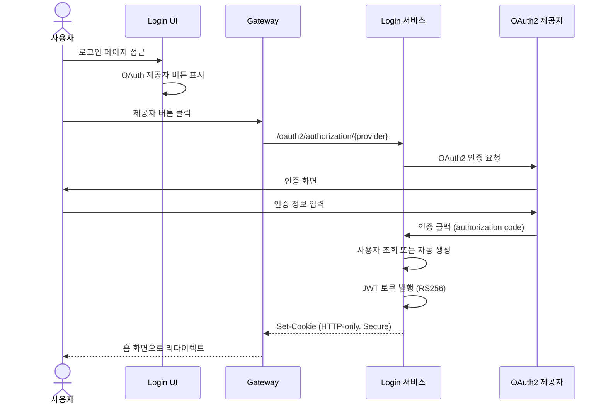
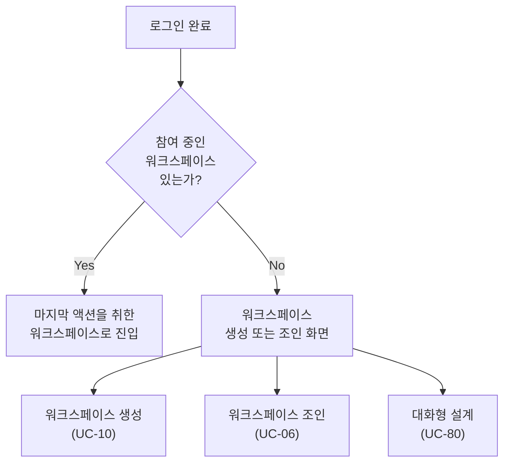
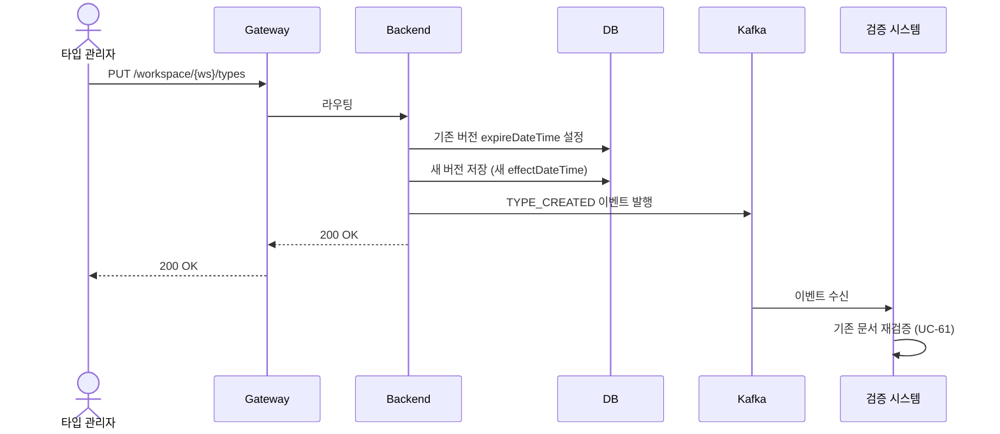
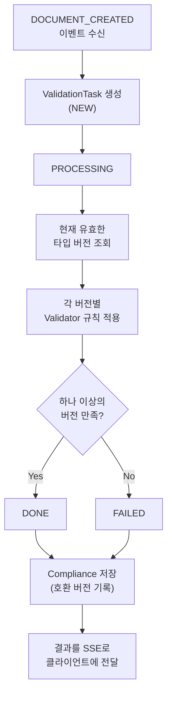
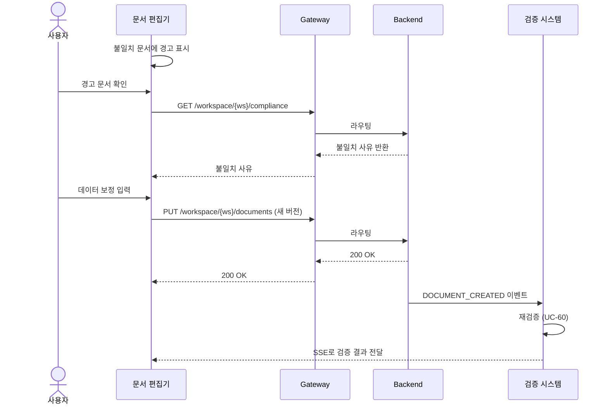
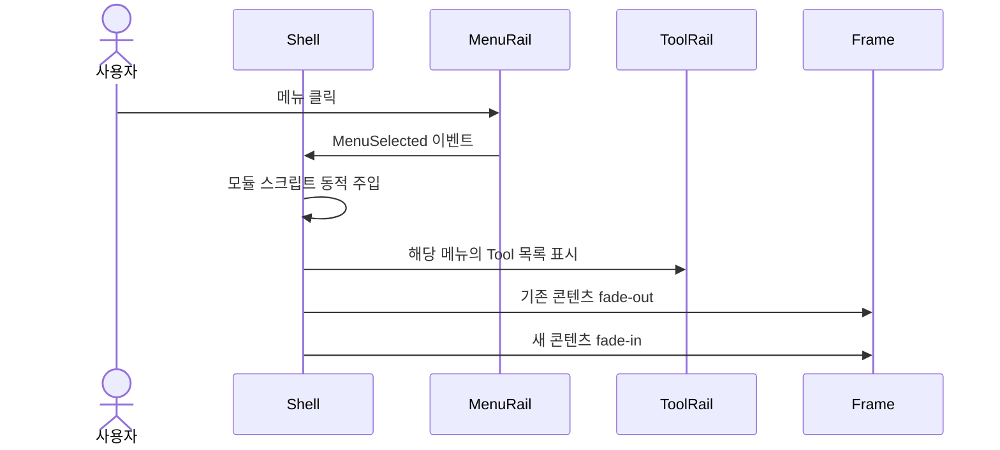
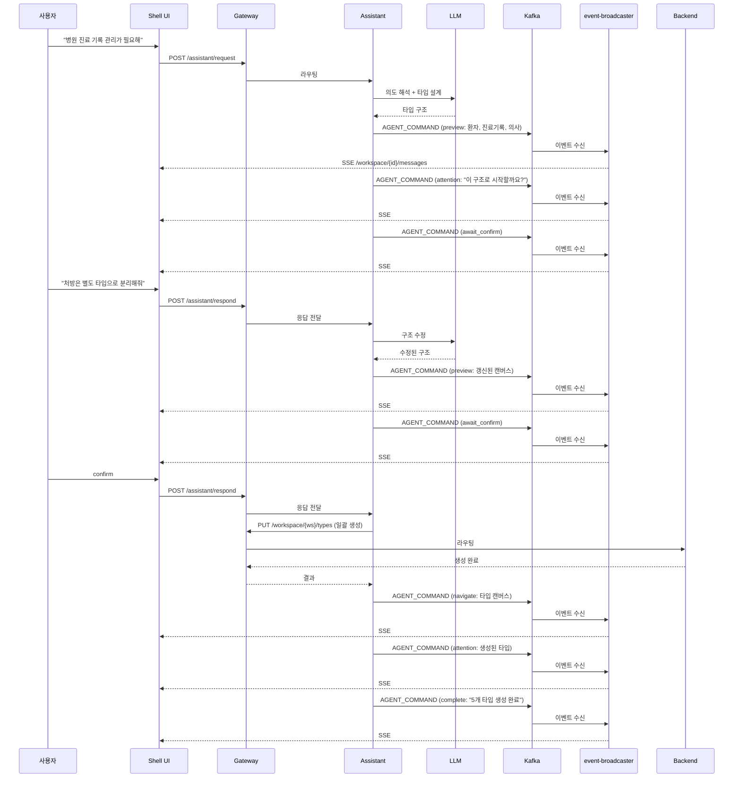
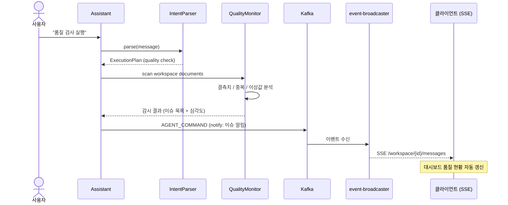

# Handbook - 유스케이스 정의서

> 모듈별 상세 유스케이스 및 시퀀스 다이어그램은 각 모듈의 USECASE.md를 참조한다:
> - [shell-ui](../shell-ui/USECASE.md) — 프레임, 네비게이션, i18n
> - [type-ui](../type-ui/USECASE.md) — 타입 캔버스 편집
> - [document-ui](../document-ui/USECASE.md) — 문서 스프레드시트 편집
> - [workspace-ui](../workspace-ui/USECASE.md) — 워크스페이스 생성/참여
> - [agent-ui](../agent-ui/USECASE.md) — 에이전트 UI 커맨드
> - [agent-protocol](../agent-protocol/USECASE.md) — 에이전트 프로토콜
> - [persist-type](../persist-type/USECASE.md) — 타입 저장/삭제 API
> - [persist-document](../persist-document/USECASE.md) — 문서 저장/삭제 API
> - [search-document](../search-document/USECASE.md) — 문서 검색 API
> - [login](../login/USECASE.md) — JWT 인증/토큰 발급
> - [login-ui](../login-ui/USECASE.md) — OAuth2 로그인 UI
> - [assistant](../assistant/USECASE.md) — AI 어시스턴트 (자연어 → 실행 계획)

## 액터 정의

| 액터 | 설명 |
|------|------|
| **사용자(User)** | 시스템에 로그인하여 문서를 조회·편집하는 일반 사용자 |
| **타입 관리자(Type Manager)** | 타입(스키마)을 정의하고 변경할 수 있는 권한을 가진 사용자 |
| **워크스페이스 관리자(WS Admin)** | 워크스페이스의 그룹·사용자·역할을 관리하는 사용자 |
| **시스템 관리자(System Admin)** | 전체 시스템에 대한 관리 권한을 가진 사용자 |
| **검증 시스템(Validator)** | 이벤트를 구독하여 문서-스키마 정합성을 비동기로 검증하는 내부 시스템 |
| **AI 에이전트(Assistant)** | 사용자의 자연어 요청을 해석하여 Gateway API를 통해 작업을 수행하는 내부 시스템 |

## 유스케이스 개요

```mermaid
graph TB
    subgraph 액터
        U["사용자"]
        TM["타입 관리자"]
        WA["워크스페이스 관리자"]
        SA["시스템 관리자"]
        V["검증 시스템"]
        AI["AI 에이전트"]
    end

    subgraph "인증"
        UC01["UC-01: OAuth2 로그인"]
        UC02["UC-02: 토큰 갱신"]
        UC03["UC-03: 로그아웃"]
    end

    subgraph "워크스페이스 진입"
        UC04["UC-04: 홈 화면 진입"]
        UC05["UC-05: 워크스페이스 전환"]
        UC06["UC-06: 워크스페이스 조인"]
    end

    subgraph "워크스페이스 관리"
        UC10["UC-10: 워크스페이스 생성"]
        UC11["UC-11: 워크스페이스 삭제"]
    end

    subgraph "사용자·그룹 관리"
        UC20["UC-20: 그룹 생성"]
        UC21["UC-21: 그룹 삭제"]
        UC22["UC-22: 사용자 배정"]
        UC23["UC-23: 역할 부여"]
        UC24["UC-24: 권한 조회"]
    end

    subgraph "타입 관리"
        UC30["UC-30: 타입 정의"]
        UC31["UC-31: 타입 변경<br/>(새 버전 생성)"]
        UC32["UC-32: 타입 삭제"]
        UC33["UC-33: 타입 조회"]
        UC34["UC-34: 타입 이력 조회"]
    end

    subgraph "타입 시각화"
        UC40["UC-40: 캔버스에 타입 배치"]
        UC41["UC-41: 레이아웃 저장·전환"]
    end

    subgraph "문서 관리"
        UC50["UC-50: 문서 생성"]
        UC51["UC-51: 문서 변경<br/>(새 버전 생성)"]
        UC52["UC-52: 문서 삭제"]
        UC53["UC-53: 문서 조회"]
        UC54["UC-54: 문서 검색"]
        UC55["UC-55: 문서 이력 조회"]
        UC56["UC-56: 문서 일괄<br/>임포트"]
        UC57["UC-57: 문서 일괄<br/>익스포트"]
    end

    subgraph "정합성 검증"
        UC60["UC-60: 문서 검증"]
        UC61["UC-61: 스키마 변경<br/>재검증"]
        UC62["UC-62: 호환성 결과 조회"]
        UC63["UC-63: 데이터 사후 보정"]
    end

    subgraph "Shell 네비게이션"
        UC70["UC-70: 메뉴 선택"]
        UC71["UC-71: 도구 실행"]
        UC72["UC-72: URL 라우팅"]
    end

    subgraph "AI 어시스턴트"
        UC80["UC-80: 대화형<br/>워크스페이스 설계"]
        UC81["UC-81: 자연어<br/>스키마 변경"]
        UC82["UC-82: 자연어<br/>문서 변경"]
        UC83["UC-83: 자연어<br/>정합성 보정"]
        UC84["UC-84: UI 안내<br/>(온보딩·협업)"]
    end

    subgraph "운영"
        UC90["UC-90: 감사 로그 조회"]
        UC91["UC-91: 대시보드 조회"]
        UC92["UC-92: 데이터 품질<br/>현황 확인"]
        UC93["UC-93: 데이터 품질<br/>감시 실행 (에이전트)"]
    end

    U --- UC01 & UC02 & UC03
    U --- UC04 & UC05 & UC06
    U --- UC53 & UC54 & UC55 & UC56 & UC57
    U --- UC62
    U --- UC70 & UC71 & UC72
    U --- UC80 & UC81 & UC82 & UC83 & UC84
    U --- UC91 & UC92
    U --- UC93

    AI --- UC93

    UC70 -.->|스크립트 로딩| UC71

    UC01 -->|로그인 후| UC04
    UC04 -.->|참여 WS 있음| UC05
    UC04 -.->|참여 WS 없음| UC10
    UC04 -.->|참여 WS 없음| UC06
    UC04 -.->|참여 WS 없음| UC80

    TM --- UC30 & UC31 & UC32 & UC33 & UC34
    TM --- UC40 & UC41
    TM --- UC50 & UC51 & UC52

    WA --- UC10 & UC11
    WA --- UC20 & UC21 & UC22 & UC23 & UC24

    SA --- UC10 & UC23 & UC90

    V --- UC60 & UC61

    AI --- UC80 & UC81 & UC82 & UC83 & UC84

    UC50 -.->|트리거| UC60
    UC51 -.->|트리거| UC60
    UC31 -.->|트리거| UC61
    UC62 -.->|불일치 시| UC63

    UC80 -.->|Gateway 경유| UC30
    UC81 -.->|Gateway 경유| UC31
    UC82 -.->|Gateway 경유| UC51
    UC83 -.->|Gateway 경유| UC63
```

---

## 인증

### UC-01: OAuth2 로그인

| 항목 | 내용 |
|------|------|
| **액터** | 사용자 |
| **선행 조건** | OAuth2 제공자에 계정이 존재한다 |
| **후행 조건** | JWT 토큰이 HTTP-only 쿠키에 저장된다. 신규 사용자는 자동 생성된다 |

**기본 흐름:**
1. 사용자가 로그인 페이지에 접근한다.
2. OAuth2 제공자 버튼 목록이 표시된다.
3. 사용자가 제공자를 선택하면 해당 IdP의 인증 화면으로 이동한다.
4. 인증 완료 후 콜백이 Login 서비스로 전달된다.
5. Login 서비스가 사용자를 조회하거나 (최초 로그인 시) 자동 생성한다.
6. JWT 토큰을 발행하여 HTTP-only Secure 쿠키로 설정한다.
7. 홈 화면 진입(UC-04)으로 리다이렉트한다.

**예외 흐름:**
- 4a. OAuth2 인증 실패 시 오류 메시지를 표시한다.

---

### UC-02: 토큰 갱신

| 항목 | 내용 |
|------|------|
| **액터** | 사용자 (자동) |
| **선행 조건** | 유효한 JWT 토큰이 쿠키에 존재한다 |
| **후행 조건** | 새로운 JWT 토큰이 쿠키에 저장된다 |

**기본 흐름:**
1. Shell UI의 UserApi가 10분 주기로 `/auth/refresh`를 호출한다.
2. Login 서비스가 기존 토큰을 검증하고 새 토큰을 발행한다.
3. 새 토큰이 쿠키에 저장된다.

**예외 흐름:**
- 2a. 토큰이 만료되어 갱신 불가 시 쿠키를 삭제하고 로그인 페이지로 리다이렉트한다.

---

### UC-03: 로그아웃

| 항목 | 내용 |
|------|------|
| **액터** | 사용자 |
| **선행 조건** | 로그인 상태이다 |
| **후행 조건** | 쿠키가 삭제되고 로그인 페이지로 이동한다 |

**기본 흐름:**
1. 사용자가 메뉴에서 로그아웃을 선택한다.
2. Logout UI가 `/oauth2/logout`을 호출한다.
3. Login 서비스가 JWT 쿠키를 삭제한다 (maxAge=0).
4. 로그인 페이지로 리다이렉트한다.

---

## 워크스페이스 진입

### UC-04: 홈 화면 진입

| 항목 | 내용 |
|------|------|
| **액터** | 사용자 |
| **선행 조건** | 로그인 상태이다 |
| **후행 조건** | 사용자가 워크스페이스 내부 또는 워크스페이스 생성/조인 화면에 도달한다 |

**기본 흐름:**
1. 시스템이 사용자의 참여 중인 워크스페이스 목록을 조회한다.
2. 참여 중인 워크스페이스가 있으면, 마지막으로 액션을 취한 워크스페이스로 자동 진입한다.

**대안 흐름:**
- 2a. 참여 중인 워크스페이스가 없으면, 워크스페이스 생성(UC-10), 조인(UC-06), 또는 대화형 설계(UC-80) 화면을 표시한다.

---

### UC-05: 워크스페이스 전환

| 항목 | 내용 |
|------|------|
| **액터** | 사용자 |
| **선행 조건** | 로그인 상태이며, 2개 이상의 워크스페이스에 참여 중이다 |
| **후행 조건** | 선택한 워크스페이스로 전환되고, 해당 워크스페이스가 마지막 액션 워크스페이스로 기록된다 |

**기본 흐름:**
1. 사용자가 Shell UI의 워크스페이스 선택기를 통해 다른 워크스페이스를 선택한다.
2. 시스템이 선택한 워크스페이스로 전환한다.
3. 해당 워크스페이스의 메뉴와 콘텐츠가 로딩된다.
4. 선택한 워크스페이스가 마지막 액션 워크스페이스로 기록된다.

---

### UC-06: 워크스페이스 조인

| 항목 | 내용 |
|------|------|
| **액터** | 사용자 |
| **선행 조건** | 로그인 상태이며, 조인 가능한 워크스페이스가 존재한다 |
| **후행 조건** | 조인 요청이 전송되거나, 사용자가 워크스페이스에 참여한다 |

**기본 흐름:**
1. 사용자가 조인할 워크스페이스 ID를 입력한다.
2. 시스템이 워크스페이스 관리자에게 조인 요청을 전송한다.
3. 관리자가 승인하면 사용자가 해당 워크스페이스에 배정된다.
4. 해당 워크스페이스로 자동 진입한다.

**대안 흐름:**
- 3a. 관리자가 거부하면 사용자에게 거부 사유를 알린다.

---

## 워크스페이스 관리

### UC-10: 워크스페이스 생성

| 항목 | 내용 |
|------|------|
| **액터** | 사용자 (로그인한 누구나) |
| **선행 조건** | 로그인 상태이다 |
| **후행 조건** | 워크스페이스, Admin 그룹이 생성되고, 생성자가 Admin 그룹에 배정된다 |

**기본 흐름:**
1. 사용자가 워크스페이스 이름과 설명을 입력한다.
2. 시스템이 워크스페이스를 생성한다 (Gateway → persist-workspace).
3. Admin 그룹이 자동 생성된다.
4. 생성자가 Admin 그룹에 자동 배정된다.
5. 외부 서비스에 워크스페이스 생성 이벤트가 발행된다.

**대안 흐름:**
- 1a. AI 에이전트의 대화형 설계(UC-80)를 통해 워크스페이스 생성과 타입 구조 설계를 동시에 진행할 수 있다.

---

### UC-11: 워크스페이스 삭제

| 항목 | 내용 |
|------|------|
| **액터** | 워크스페이스 관리자 |
| **선행 조건** | 해당 워크스페이스의 ADMIN 권한을 가진다 |
| **후행 조건** | 워크스페이스와 모든 종속 데이터(그룹, 타입, 문서, 레이아웃 등)가 삭제된다 |

**기본 흐름:**
1. 관리자가 워크스페이스 삭제를 요청한다.
2. 시스템이 종속 데이터를 포함하여 cascade 삭제한다.

---

## 사용자·그룹 관리

### UC-20: 그룹 생성

| 항목 | 내용 |
|------|------|
| **액터** | 워크스페이스 관리자 |
| **선행 조건** | `{workspace}:group:create` 권한을 가진다 |
| **후행 조건** | 워크스페이스에 새 그룹이 생성된다 |

**기본 흐름:**
1. 관리자가 그룹 이름과 설명을 입력한다.
2. 시스템이 워크스페이스 내에 그룹을 생성한다.

---

### UC-21: 그룹 삭제

| 항목 | 내용 |
|------|------|
| **액터** | 워크스페이스 관리자 |
| **선행 조건** | `{workspace}:group:delete` 권한을 가진다 |
| **후행 조건** | 그룹이 삭제되고, 소속 사용자의 그룹 배정이 해제된다 |

**기본 흐름:**
1. 관리자가 삭제할 그룹을 선택한다.
2. 시스템이 그룹을 삭제한다.

---

### UC-22: 사용자 배정

| 항목 | 내용 |
|------|------|
| **액터** | 워크스페이스 관리자 |
| **선행 조건** | `{workspace}:user:assign` 권한을 가진다 |
| **후행 조건** | 사용자가 지정된 그룹에 배정된다 |

**기본 흐름:**
1. 관리자가 사용자와 대상 그룹을 선택한다.
2. 시스템이 사용자를 해당 그룹에 배정한다.

---

### UC-23: 역할 부여

| 항목 | 내용 |
|------|------|
| **액터** | 워크스페이스 관리자, 시스템 관리자 |
| **선행 조건** | `{workspace}:role:assign` 권한을 가진다 |
| **후행 조건** | 그룹에 역할이 부여되고, 소속 사용자가 해당 Permission을 획득한다 |

**기본 흐름:**
1. 관리자가 대상 그룹과 부여할 역할을 선택한다.
2. 시스템이 그룹에 역할을 부여한다.

---

### UC-24: 권한 조회

| 항목 | 내용 |
|------|------|
| **액터** | 워크스페이스 관리자 |
| **선행 조건** | 워크스페이스에 진입한 상태이다 |
| **후행 조건** | - |

**기본 흐름:**
1. 관리자가 그룹 또는 사용자의 권한 목록을 요청한다.
2. 시스템이 해당 그룹/사용자에게 부여된 역할과 Permission 목록을 반환한다.

---

## 타입 관리

### UC-30: 타입 정의

| 항목 | 내용 |
|------|------|
| **액터** | 타입 관리자, AI 에이전트 |
| **선행 조건** | `{workspace}:type:create` 권한을 가진다 |
| **후행 조건** | 새 타입(v1)이 생성되고, TYPE_CREATED 이벤트가 발행된다 |

**기본 흐름:**
1. 타입 관리자가 타입 이름, 설명, effectDateTime을 입력한다.
2. 속성(Attribute)을 추가하고, 각 속성의 타입과 Validator를 설정한다.
3. 시스템이 타입 v1을 생성한다.
4. TYPE_CREATED 이벤트가 발행된다.

**대안 흐름:**
- 2a. 기존 타입을 parent로 지정하여 속성을 상속받을 수 있다.

**에이전트 시나리오:**
- 사용자가 "주문 타입 만들어줘. 주문번호, 고객, 금액, 날짜가 필요해"라고 요청한다.
- 에이전트가 속성 타입을 자동 추론한다 (주문번호→Text, 고객→Document(고객 타입 참조), 금액→Number, 날짜→Date).
- `preview`로 타입 구조를 보여주고, `await_confirm`으로 사용자 확인 후 Gateway를 통해 생성한다.
- 대화형 설계(UC-80)에서 여러 타입을 일괄 생성할 때도 이 흐름을 반복한다.

---

### UC-31: 타입 변경 (새 버전 생성)

| 항목 | 내용 |
|------|------|
| **액터** | 타입 관리자, AI 에이전트 |
| **선행 조건** | `{workspace}:type:{type}:edit` 권한을 가진다. 해당 타입이 존재한다 |
| **후행 조건** | 기존 버전은 보존되고 새 버전이 생성된다. 기존 문서에 대한 재검증이 트리거된다 |

**기본 흐름:**
1. 타입 관리자가 기존 타입의 속성을 변경한다 (속성 추가·삭제, Validator 변경 등).
2. 새 버전의 effectDateTime을 지정한다.
3. 시스템이 기존 버전의 expireDateTime을 설정하고, 새 버전을 생성한다.
4. TYPE_CREATED 이벤트가 발행된다.
5. 검증 시스템이 해당 타입의 기존 문서를 새 스키마 기준으로 재검증한다 (UC-61).

**에이전트 시나리오:**
- 사용자가 "고객 타입에 전화번호 필드 추가해줘"라고 요청한다.
- 에이전트가 타입 편집기로 `navigate`한 뒤 현재 속성을 `attention`(spotlight)으로 안내한다.
- 새 속성을 `preview`(diff)로 보여주고, `await_confirm` 후 Gateway를 통해 새 버전을 생성한다.
- 재검증이 트리거되면 `notify`로 "기존 문서 N건에 대한 검증이 시작되었습니다"를 안내한다.

---

### UC-32: 타입 삭제

| 항목 | 내용 |
|------|------|
| **액터** | 타입 관리자 |
| **선행 조건** | `{workspace}:type:delete` 권한을 가진다 |
| **후행 조건** | 타입이 삭제되고, TYPE_DELETED 이벤트가 발행된다 |

**기본 흐름:**
1. 타입 관리자가 삭제할 타입을 선택한다.
2. 시스템이 타입을 삭제하고 TYPE_DELETED 이벤트를 발행한다.

---

### UC-33: 타입 조회

| 항목 | 내용 |
|------|------|
| **액터** | 사용자, 타입 관리자 |
| **선행 조건** | `{workspace}:type:{type}:view` 권한을 가진다 |
| **후행 조건** | - |

**기본 흐름:**
1. 사용자가 워크스페이스의 타입 목록을 요청한다.
2. 시스템이 현재 유효한 타입 목록을 반환한다 (effectDateTime 기준 필터링).

**대안 흐름:**
- 1a. 특정 날짜를 지정하여 해당 시점에 유효했던 타입 목록을 조회할 수 있다.

---

### UC-34: 타입 이력 조회

| 항목 | 내용 |
|------|------|
| **액터** | 사용자, 타입 관리자 |
| **선행 조건** | `{workspace}:type:{type}:view` 권한을 가진다 |
| **후행 조건** | - |

**기본 흐름:**
1. 사용자가 특정 타입의 버전 이력을 요청한다.
2. 시스템이 해당 타입의 모든 버전을 시간순으로 반환한다 (이전/다음 버전 링크 포함, HATEOAS).

---

## 타입 시각화

### UC-40: 캔버스에 타입 배치

| 항목 | 내용 |
|------|------|
| **액터** | 타입 관리자 |
| **선행 조건** | 타입이 존재하고, 레이아웃이 존재한다 |
| **후행 조건** | 타입의 캔버스 위치·크기가 저장된다 |

**기본 흐름:**
1. 타입 관리자가 캔버스에서 타입을 드래그하여 배치한다.
2. 타입의 위치(x, y)와 크기(width, height)가 레이아웃에 저장된다.

**대안 흐름:**
- 1a. 컨텍스트 메뉴로 타입을 캔버스에 추가할 수 있다.
- 1b. 키보드 방향키로 타입을 이동할 수 있다.

---

### UC-41: 레이아웃 저장·전환

| 항목 | 내용 |
|------|------|
| **액터** | 타입 관리자 |
| **선행 조건** | 워크스페이스가 존재한다 |
| **후행 조건** | 레이아웃이 저장되거나 전환된다 |

**기본 흐름:**
1. 타입 관리자가 현재 캔버스 배치를 레이아웃으로 저장한다.
2. 저장된 레이아웃 간에 전환할 수 있다.

---

## 문서 관리

### UC-50: 문서 생성

| 항목 | 내용 |
|------|------|
| **액터** | 사용자, 타입 관리자 |
| **선행 조건** | `{workspace}:type:{type}:document:edit` 권한을 가진다. 해당 타입이 존재한다 |
| **후행 조건** | 문서가 생성되고, DOCUMENT_CREATED 이벤트가 발행되며, 검증이 트리거된다 |

**기본 흐름:**
1. 사용자가 타입을 선택하고 serial, 데이터, effectDateTime을 입력한다.
2. 시스템이 문서를 저장한다.
3. DOCUMENT_CREATED 이벤트가 발행된다.
4. 검증 시스템이 문서를 현재 유효한 타입 버전 기준으로 검증한다 (UC-60).

**예외 흐름:**
- 2a. serial이 중복되면 오류를 반환한다.

**에이전트 시나리오:**
- 사용자가 "새 고객 등록해줘. 이름 홍길동, 이메일 hong@example.com"이라고 요청한다.
- 에이전트가 고객 타입의 스키마를 조회하여 필수 필드를 확인하고, 누락된 필드가 있으면 추가 질문한다.
- `preview`로 생성될 문서를 보여주고, `await_confirm` 후 Gateway를 통해 생성한다.

---

### UC-51: 문서 변경 (새 버전 생성)

| 항목 | 내용 |
|------|------|
| **액터** | 사용자, 타입 관리자, AI 에이전트 |
| **선행 조건** | `{workspace}:type:{type}:document:edit` 권한을 가진다. 해당 문서가 존재한다 |
| **후행 조건** | 기존 버전은 보존되고 새 버전이 생성된다. 검증이 트리거된다 |

**기본 흐름:**
1. 사용자가 기존 문서의 데이터를 변경한다.
2. 시스템이 기존 버전의 expireDateTime을 설정하고, 새 버전을 생성한다.
3. DOCUMENT_CREATED 이벤트가 발행된다.
4. 검증 시스템이 새 버전을 검증한다 (UC-60).

**에이전트 시나리오:**
- 사용자가 "고객 C-001의 이메일을 new@example.com으로 변경해줘"라고 요청한다.
- 에이전트가 해당 문서를 검색하고 문서 편집기로 `navigate`한다.
- 변경 대상 필드를 `attention`(spotlight)으로 안내하고, 변경 전후를 `preview`(diff)로 보여준다.
- `await_confirm` 후 Gateway를 통해 새 버전을 생성한다.

---

### UC-52: 문서 삭제

| 항목 | 내용 |
|------|------|
| **액터** | 사용자, 타입 관리자 |
| **선행 조건** | `{workspace}:type:{type}:document:edit` 권한을 가진다 |
| **후행 조건** | 문서가 삭제되고, DOCUMENT_DELETED 이벤트가 발행된다 |

**기본 흐름:**
1. 사용자가 삭제할 문서를 선택한다.
2. 시스템이 문서를 삭제하고 DOCUMENT_DELETED 이벤트를 발행한다.

---

### UC-53: 문서 조회

| 항목 | 내용 |
|------|------|
| **액터** | 사용자 |
| **선행 조건** | `{workspace}:type:{type}:document:view` 권한을 가진다 |
| **후행 조건** | - |

**기본 흐름:**
1. 사용자가 타입과 serial을 지정하여 문서를 요청한다.
2. 시스템이 현재 유효한 버전의 문서 데이터를 반환한다.

---

### UC-54: 문서 검색

| 항목 | 내용 |
|------|------|
| **액터** | 사용자, AI 에이전트 |
| **선행 조건** | `{workspace}:type:{type}:document:view` 권한을 가진다 |
| **후행 조건** | - |

**기본 흐름:**
1. 사용자가 검색 조건(필터, 정렬, 페이지)을 지정한다.
2. 시스템이 조건에 맞는 문서 목록을 페이지네이션하여 반환한다.

**대안 흐름:**
- 1a. 전문 검색(full-text search)으로 문서 내용을 키워드 검색할 수 있다.
- 1b. 날짜 범위, 상태, 타입별 필터를 조합할 수 있다.

---

### UC-55: 문서 이력 조회

| 항목 | 내용 |
|------|------|
| **액터** | 사용자 |
| **선행 조건** | `{workspace}:type:{type}:document:view` 권한을 가진다 |
| **후행 조건** | - |

**기본 흐름:**
1. 사용자가 특정 문서의 과거 시점 날짜를 지정한다.
2. 시스템이 해당 시점에 유효했던 버전의 문서 데이터를 반환한다 (point-in-time query).

---

### UC-56: 문서 일괄 임포트

| 항목 | 내용 |
|------|------|
| **액터** | 사용자, 타입 관리자 |
| **선행 조건** | `{workspace}:type:{type}:document:edit` 권한을 가진다 |
| **후행 조건** | 파일의 데이터가 문서로 생성된다 |

**기본 흐름:**
1. 사용자가 CSV 또는 JSON 파일을 업로드한다.
2. 시스템이 타입 스키마에 맞게 컬럼/필드를 자동 매핑한다.
3. 매핑 미리보기를 보여주고 사용자가 확인한다.
4. 문서를 일괄 생성한다.

**예외 흐름:**
- 2a. 매핑 실패 항목은 사용자에게 수동 매핑을 요청한다.

---

### UC-57: 문서 일괄 익스포트

| 항목 | 내용 |
|------|------|
| **액터** | 사용자 |
| **선행 조건** | `{workspace}:type:{type}:document:view` 권한을 가진다 |
| **후행 조건** | 문서 데이터가 파일로 다운로드된다 |

**기본 흐름:**
1. 사용자가 대상 타입과 필터 조건을 지정한다.
2. 시스템이 조건에 맞는 문서를 CSV 또는 JSON 형식으로 생성한다.
3. 파일이 다운로드된다.

---

## 정합성 검증

### UC-60: 문서 검증

| 항목 | 내용 |
|------|------|
| **액터** | 검증 시스템 (이벤트 트리거) |
| **선행 조건** | DOCUMENT_CREATED 이벤트가 발행되었다 |
| **후행 조건** | ValidationTask가 완료되고, Compliance 결과가 저장된다 |

**기본 흐름:**
1. 검증 시스템이 DOCUMENT_CREATED 이벤트를 수신한다.
2. ValidationTask를 생성한다 (NEW → PROCESSING).
3. 현재 유효한 타입 버전들을 조회한다.
4. 각 타입 버전의 Validator 규칙으로 문서 데이터를 검증한다.
5. Compliance 결과를 저장한다 (호환 버전, 불일치 사유).
6. ValidationTask를 완료한다 (DONE 또는 FAILED).
7. 결과를 SSE로 클라이언트에 전달한다.

---

### UC-61: 스키마 변경 재검증

| 항목 | 내용 |
|------|------|
| **액터** | 검증 시스템 (이벤트 트리거) |
| **선행 조건** | TYPE_CREATED 이벤트가 발행되었다 (타입 새 버전 생성) |
| **후행 조건** | 해당 타입의 모든 기존 문서에 대한 Compliance가 갱신된다 |

**기본 흐름:**
1. 검증 시스템이 TYPE_CREATED 이벤트를 수신한다.
2. 해당 타입의 현재 유효한 문서를 모두 조회한다.
3. 각 문서에 대해 새 타입 버전 기준으로 검증을 수행한다 (UC-60과 동일한 검증 로직).
4. Compliance 결과를 갱신한다.
5. 불일치가 발견된 문서가 있으면 경고를 SSE로 전달한다.

---

### UC-62: 호환성 결과 조회

| 항목 | 내용 |
|------|------|
| **액터** | 사용자 |
| **선행 조건** | 로그인 상태이다 |
| **후행 조건** | - |

**기본 흐름:**
1. 사용자가 워크스페이스의 호환성 검증 결과를 요청한다.
2. 시스템이 Compliance 목록을 반환한다 (불일치 문서, 위반 속성, 위반 규칙).

**대안 흐름:**
- 1a. 문서 편집기에서 불일치 문서에 경고 아이콘이 자동으로 표시된다.

---

### UC-63: 데이터 사후 보정

| 항목 | 내용 |
|------|------|
| **액터** | 사용자, 타입 관리자, AI 에이전트 |
| **선행 조건** | Compliance 불일치가 존재한다 |
| **후행 조건** | 문서가 새 버전으로 보정되고, 재검증이 트리거된다 |

**기본 흐름:**
1. 사용자가 문서 편집기에서 불일치 경고를 확인한다.
2. Compliance 상세 사유(어떤 속성, 어떤 규칙 위반)를 확인한다.
3. 사용자가 해당 문서의 데이터를 보정한다.
4. 보정된 데이터로 새 버전이 생성된다 (UC-51).
5. 재검증이 트리거되어 정합성이 확인된다 (UC-60).

**에이전트 시나리오:**
- 스키마 변경으로 검증 실패가 발생하면 에이전트가 `attention`(badge)으로 자동 안내한다.
- 사용자가 "검증 실패한 문서 보정해줘"라고 요청한다.
- 에이전트가 실패 사유를 분석하여 보정 방법을 제안한다.
  - 예: "고객 타입에 필수 필드 '이메일'이 추가되었는데 50건에 값이 없습니다. 기본값 'unknown@example.com'으로 채울까요?"
- `preview`로 영향 범위(대상 문서 수, 변경 내용)를 보여준다.
- `await_confirm` 후 `progress`로 진행률을 표시하며 일괄 보정을 실행한다.
- 보정 완료 후 재검증 결과를 `attention`(spotlight)으로 안내한다.
- 보정 내역은 감사 로그에 기록된다 (UC-90).

---

## Shell 네비게이션

### UC-70: 메뉴 선택

| 항목 | 내용 |
|------|------|
| **액터** | 사용자, AI 에이전트 (navigate 커맨드) |
| **선행 조건** | 워크스페이스에 진입한 상태이다 |
| **후행 조건** | 선택된 메뉴의 모듈 스크립트가 로딩되고, Frame에 콘텐츠가 표시된다 |

**기본 흐름:**
1. 사용자가 Menu Rail에서 메뉴를 클릭한다.
2. 시스템이 해당 메뉴의 모듈 스크립트를 동적으로 로딩한다.
3. Tool Rail에 해당 메뉴의 도구 목록이 표시된다.
4. Frame 영역의 콘텐츠가 fade 애니메이션과 함께 교체된다.

**대안 흐름:**
- 1a. 도구가 하나뿐인 메뉴는 선택 즉시 도구가 자동 실행된다.
- 1b. AI 에이전트의 `navigate` 커맨드로 메뉴가 자동 선택될 수 있다.

---

### UC-71: 도구 실행

| 항목 | 내용 |
|------|------|
| **액터** | 사용자 |
| **선행 조건** | 메뉴가 선택된 상태이며, Tool Rail에 도구가 표시되어 있다 |
| **후행 조건** | 도구의 함수가 실행되고, Frame 콘텐츠가 갱신된다 |

**기본 흐름:**
1. 사용자가 Tool Rail에서 도구를 클릭한다.
2. 시스템이 해당 도구의 함수(ToolFunction)를 실행한다.
3. Frame 영역의 콘텐츠가 갱신된다.

---

### UC-72: URL 라우팅

| 항목 | 내용 |
|------|------|
| **액터** | 사용자 |
| **선행 조건** | 워크스페이스에 진입한 상태이다 |
| **후행 조건** | URL에 매칭되는 메뉴가 자동 선택된다 |

**기본 흐름:**
1. 사용자가 URL을 직접 입력하거나 브라우저 뒤로가기/앞으로가기를 사용한다.
2. 시스템이 현재 URL을 각 메뉴의 urlRegex 패턴과 매칭한다.
3. 매칭되는 메뉴가 자동 선택된다 (UC-70).
4. Drawer가 자동으로 Collapse 상태가 된다.

**예외 흐름:**
- 2a. 매칭되는 메뉴가 없으면 현재 상태를 유지한다.

---

## AI 어시스턴트

### UC-80: 대화형 워크스페이스 설계

| 항목 | 내용 |
|------|------|
| **액터** | 사용자, AI 에이전트 |
| **선행 조건** | 로그인 상태이며, 워크스페이스를 생성하려 한다 |
| **후행 조건** | 사용자가 승인한 타입 구조가 워크스페이스에 생성된다 |

**기본 흐름:**
1. 사용자가 자연어로 필요한 시스템을 설명한다 (예: "재고 관리 시스템이 필요해").
2. 에이전트가 의도를 해석하여 타입 구조(타입, 속성, 관계)를 설계한다.
3. 에이전트가 타입 캔버스 미리보기로 구조를 시각화한다 (`preview` 커맨드).
4. 에이전트가 사용자에게 구조를 안내한다 (`attention` 커맨드).
5. 사용자가 수정을 요청하면 에이전트가 구조를 조정한다 (반복).
6. 사용자가 최종 승인하면 에이전트가 Gateway를 통해 타입을 일괄 생성한다 (`mutate` 커맨드).
7. 에이전트가 타입 캔버스로 이동하여 결과를 보여준다 (`navigate` + `attention`).

---

### UC-81: 자연어 스키마 변경

| 항목 | 내용 |
|------|------|
| **액터** | 사용자, AI 에이전트 |
| **선행 조건** | 워크스페이스에 진입한 상태이다. 타입 변경 권한이 있다 |
| **후행 조건** | 타입의 새 버전이 생성된다 |

**기본 흐름:**
1. 사용자가 자연어로 스키마 변경을 요청한다 (예: "고객 타입에 전화번호 추가해줘").
2. 에이전트가 해당 타입 편집기로 이동한다 (`navigate`).
3. 에이전트가 현재 속성 목록을 안내한다 (`attention`).
4. 에이전트가 변경 사항을 미리보기로 보여준다 (`preview`).
5. 사용자가 승인하면 에이전트가 Gateway를 통해 타입 새 버전을 생성한다 (`mutate`).
6. 에이전트가 결과를 안내한다 (`attention` + `complete`).

**예외 흐름:**
- 1a. 모호한 요청이면 에이전트가 추가 질문한다 (`await_confirm` + 선택지).
- 5a. 권한이 없으면 Gateway가 거부하고 에이전트가 사유를 안내한다 (`notify`).

---

### UC-82: 자연어 문서 변경

| 항목 | 내용 |
|------|------|
| **액터** | 사용자, AI 에이전트 |
| **선행 조건** | 워크스페이스에 진입한 상태이다. 문서 편집 권한이 있다 |
| **후행 조건** | 문서의 새 버전이 생성되거나, 검색 결과가 표시된다 |

**기본 흐름:**
1. 사용자가 자연어로 문서 작업을 요청한다.
2. 에이전트가 요청 유형을 판별한다 (검색 / 생성 / 수정).
3. (검색) 에이전트가 문서 목록 화면으로 이동하여 필터를 적용한다.
4. (수정) 에이전트가 해당 문서를 찾아 변경 사항을 미리보기로 보여준다.
5. 사용자가 승인하면 에이전트가 Gateway를 통해 문서 새 버전을 생성한다.

---

### UC-83: 자연어 정합성 보정

| 항목 | 내용 |
|------|------|
| **액터** | 사용자, AI 에이전트 |
| **선행 조건** | 정합성 검증 실패 문서가 존재한다 |
| **후행 조건** | 보정된 문서의 새 버전이 생성된다. 감사 로그에 기록된다 |

**기본 흐름:**
1. 에이전트가 정합성 검증 실패를 감지하고 사용자에게 안내한다 (`attention` + badge).
2. 사용자가 보정을 요청한다.
3. 에이전트가 영향 범위(대상 문서 수, 변경 내용)를 미리보기로 보여준다 (`preview`).
4. 사용자가 승인하면 에이전트가 Gateway를 통해 일괄 보정을 실행한다 (`mutate` + `progress`).
5. 보정 내역이 감사 로그에 기록된다 (UC-90).

---

### UC-84: UI 안내 (온보딩·협업)

| 항목 | 내용 |
|------|------|
| **액터** | 사용자, 시스템, AI 에이전트 |
| **선행 조건** | 없음 |
| **후행 조건** | 사용자가 안내된 UI 요소를 확인한다 |

**기본 흐름 (온보딩):**
1. 신규 사용자가 처음 접속한다.
2. 시스템이 주요 UI 요소를 순차적으로 안내한다 (`attention` coachmark 시퀀스).
3. 사용자가 각 안내를 확인하며 UI를 학습한다.

**기본 흐름 (협업 공유):**
1. 사용자 A가 특정 UI 위치를 선택하여 공유 메시지를 작성한다.
2. 시스템이 사용자 B에게 알림을 전송한다.
3. 사용자 B가 알림을 클릭하면 해당 위치로 이동하고 `attention` 커맨드가 실행된다.

**기본 흐름 (정합성 경고):**
1. 검증 실패 이벤트가 SSE로 수신된다.
2. 해당 메뉴에 `attention` badge가 표시된다.
3. 사용자가 해당 메뉴에 진입하면 문제 필드에 `attention` spotlight이 표시된다.

---

## 운영

### UC-90: 감사 로그 조회

| 항목 | 내용 |
|------|------|
| **액터** | 시스템 관리자, 워크스페이스 관리자 |
| **선행 조건** | `system:audit-logs` 또는 워크스페이스 ADMIN 권한을 가진다 |
| **후행 조건** | - |

**기본 흐름:**
1. 관리자가 감사 로그를 요청한다 (기간, 리소스 타입, 사용자 필터).
2. 시스템이 해당 조건의 변경 이력을 반환한다 (누가, 언제, 어떤 리소스를, 어떻게 변경했는지).

---

### UC-91: 대시보드 조회

| 항목 | 내용 |
|------|------|
| **액터** | 사용자 |
| **선행 조건** | 워크스페이스에 진입한 상태이다 |
| **후행 조건** | - |

**기본 흐름:**
1. 사용자가 워크스페이스 대시보드를 조회한다.
2. 시스템이 현황 요약을 반환한다 (타입 수, 문서 수, 검증 상태 요약, 최근 변경 이력).
3. SSE(`/workspace/{id}/messages`)를 구독하여 실시간으로 카운터와 타임라인을 갱신한다.

---

### UC-92: 데이터 품질 현황 확인

| 항목 | 내용 |
|------|------|
| **액터** | 사용자 |
| **선행 조건** | 워크스페이스에 진입한 상태이다. 데이터 품질 감시가 1회 이상 실행된 상태이다 |
| **후행 조건** | - |

**기본 흐름:**
1. 사용자가 대시보드에서 데이터 품질 현황 영역을 확인한다.
2. 시스템이 타입별 품질 점수(결측치, 중복, 이상값 건수)를 차트로 표시한다.
3. 품질 이슈 목록이 심각도별로 분류되어 표시된다.
4. 사용자가 이슈를 클릭하면 해당 문서로 이동한다.

---

### UC-93: 데이터 품질 감시 실행 (에이전트)

| 항목 | 내용 |
|------|------|
| **액터** | 사용자, AI 에이전트 |
| **선행 조건** | 워크스페이스에 진입한 상태이다. 문서가 1건 이상 존재한다 |
| **후행 조건** | 감시 결과가 AGENT_COMMAND 이벤트로 워크스페이스에 브로드캐스트된다 |

**기본 흐름:**
1. 사용자가 에이전트에게 "품질 검사 실행"을 요청한다.
2. 에이전트가 의도를 해석하여 품질 검사 실행 계획을 생성한다.
3. 에이전트가 워크스페이스 내 문서를 스캔한다 (결측치, 중복, 이상값).
4. 감시 결과를 심각도에 따라 AGENT_COMMAND 이벤트(notify)로 발행한다.
5. event-broadcaster가 SSE를 통해 워크스페이스 멤버에게 실시간 알림한다.

**대안 흐름:**
- 1a. 스케줄 또는 DOCUMENT_CREATED 이벤트 트리거로 자동 실행될 수 있다.
- 4a. 이슈가 없으면 notify(info: "품질 이상 없음") 커맨드를 발행한다.

