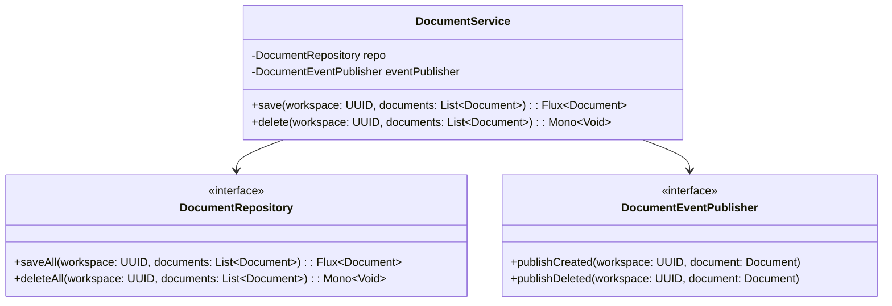

# Persist-Document 클래스 다이어그램

## Usecase 계층

## Interfaces 계층

```mermaid
classDiagram
    class DocumentController {
        -DocumentService svc
        +save(workspace: UUID, documents: List~Document~): Flux~Document~
        +delete(workspace: UUID, documents: List~Document~): Mono~Void~
        +handleDuplicate(ex: DuplicateKeyException): Mono~String~
    }

    class R2dbcDocumentEntity {
        +workspace: UUID
        +id: UUID
        +type: String
        +serial: String
        +effectDateTime: Instant
        +expireDateTime: Instant
        +data: Json
        +status: String
        +createDateTime: Instant?
        +creator: String?
        +rev: Long?
        +toDomain(): Document
        +fromDomain(workspace: UUID, document: Document, serializedData: String)$ R2dbcDocumentEntity
    }

    class R2dbcDocumentEntityRepository {
        <<interface>>
        +findByWorkspaceAndId(workspace: UUID, id: UUID): Mono~R2dbcDocumentEntity~
    }

    class R2dbcDocumentRepositoryAdapter {
        -R2dbcDocumentEntityRepository repo
        -ObjectMapper objectMapper
        -TransactionalOperator tx
        +saveAll(workspace, documents): Flux~Document~
        +deleteAll(workspace, documents): Mono~Void~
    }

    class KafkaDocumentEventPublisher {
        -KafkaTemplate kafkaTemplate
        -ObjectMapper objectMapper
        -String topic
        +publishCreated(workspace, document)
        +publishDeleted(workspace, document)
    }

    class DocumentConfig {
        <<Configuration>>
        +objectMapper(): ObjectMapper
        +documentRepositoryAdapter(): R2dbcDocumentRepositoryAdapter
        +documentEventPublisher(): DocumentEventPublisher
        +documentService(): DocumentService
    }

    DocumentController --> DocumentService
    R2dbcDocumentRepositoryAdapter ..|> DocumentRepository
    R2dbcDocumentRepositoryAdapter --> R2dbcDocumentEntityRepository
    R2dbcDocumentRepositoryAdapter --> R2dbcDocumentEntity
    KafkaDocumentEventPublisher ..|> DocumentEventPublisher
    DocumentConfig ..> R2dbcDocumentRepositoryAdapter : creates
    DocumentConfig ..> KafkaDocumentEventPublisher : creates
    DocumentConfig ..> DocumentService : creates

    class FileUploadController {
        -FileStorageService fileStorageService
        -Set~String~ allowedExtensions
        +upload(workspace: UUID, filePart: FilePart): Mono~FileUploadResponse~
    }

    class FileStorageService {
        <<interface>>
        +upload(workspace: UUID, filename: String, bytes: byte[]): Mono~String~
    }

    class LocalFileStorageAdapter {
        -Path basePath
        +upload(workspace: UUID, filename: String, bytes: byte[]): Mono~String~
    }

    class FileConfig {
        <<Configuration>>
        +allowedExtensions(): Set~String~
        +fileStorageService(): FileStorageService
    }

    FileUploadController --> FileStorageService
    LocalFileStorageAdapter ..|> FileStorageService
    FileConfig ..> LocalFileStorageAdapter : creates
```

## 설계 패턴

| 패턴 | 적용 위치 | 설명 |
|------|----------|------|
| **Port & Adapter (Hexagonal)** | DocumentRepository, DocumentEventPublisher | usecase의 포트 인터페이스를 interfaces에서 구현 |
| **Transaction Script** | DocumentService | 비즈니스 로직을 순수 클래스로 구현, Spring 어노테이션 없음 |
| **Domain Event** | KafkaDocumentEventPublisher | 저장/삭제 후 Kafka 이벤트 발행으로 시스템 간 느슨한 결합 |
| **Optimistic Locking** | R2dbcDocumentEntity (@Version) | 동시 편집 충돌 방지 |
