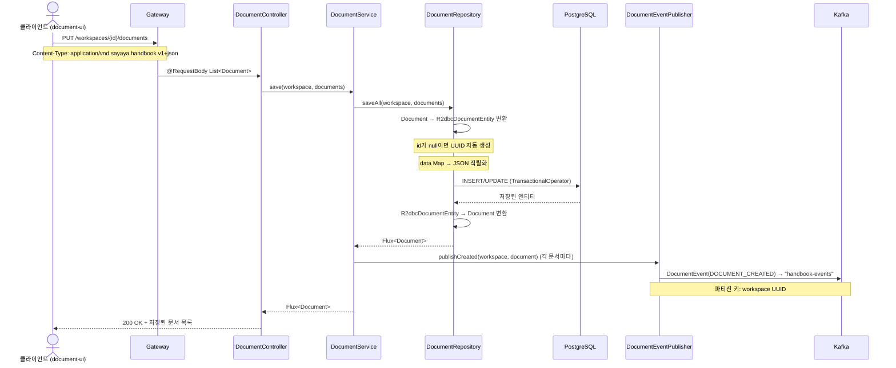
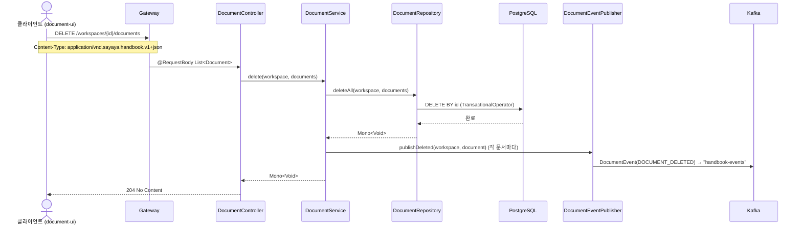
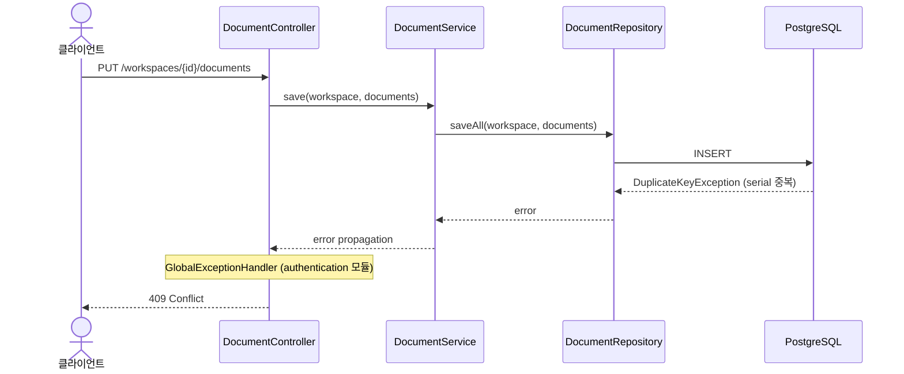
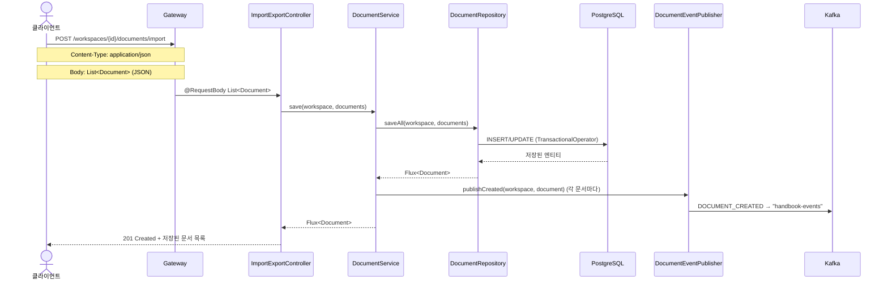
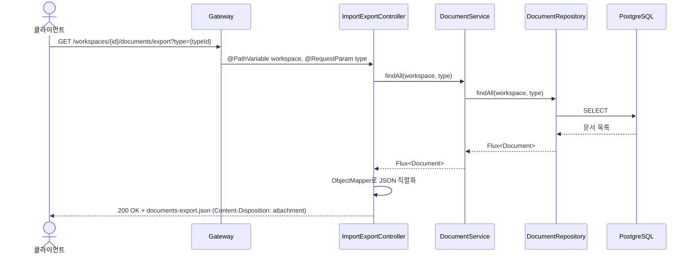
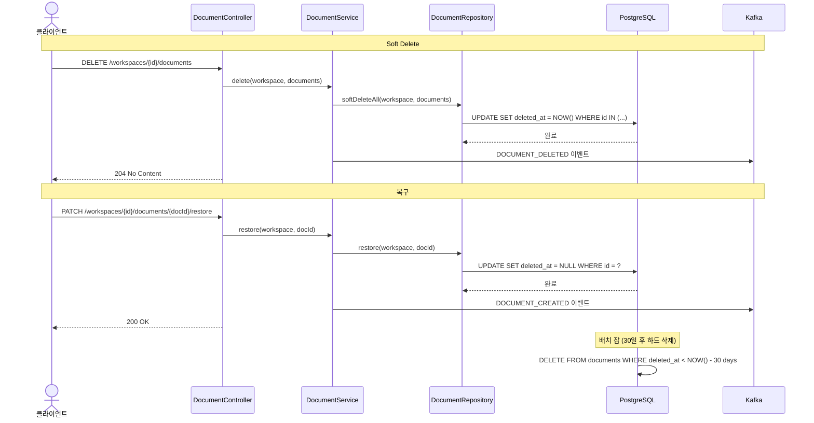

# Persist-Document 유스케이스

## 문서 저장 시퀀스

## 문서 삭제 시퀀스

## 중복 키 에러 시퀀스

---

## UC-PD1: 문서 저장

| 항목 | 내용 |
|------|------|
| **액터** | 사용자 (document-ui 경유) |
| **선행조건** | 워크스페이스 접근 권한 보유 |
| **정상 흐름** | 1. 클라이언트가 `PUT /workspaces/{id}/documents`로 문서 목록을 전송한다. 2. `DocumentService.save()`가 `DocumentRepository.saveAll()`을 호출한다. 3. id가 null인 문서는 새 UUID가 할당된다. 4. `data` 필드(Map<String,String?>)는 JSON 문자열로 직렬화되어 저장된다. 5. 저장 후 각 문서에 대해 `DOCUMENT_CREATED` 이벤트가 Kafka로 발행된다. 6. 저장된 문서 목록(id, createDateTime, creator 포함)이 응답으로 반환된다. |
| **대안 흐름** | serial 중복 시 `DuplicateKeyException` → `GlobalExceptionHandler` (authentication 모듈의 `@RestControllerAdvice`)가 409 Conflict 반환. |

## UC-PD2: 문서 삭제

| 항목 | 내용 |
|------|------|
| **액터** | 사용자 (document-ui 경유) |
| **선행조건** | 삭제 대상 문서가 존재 |
| **정상 흐름** | 1. 클라이언트가 `DELETE /workspaces/{id}/documents`로 삭제 대상 문서 목록을 전송한다. 2. `DocumentService.delete()`가 `DocumentRepository.deleteAll()`을 호출한다. 3. 트랜잭션 내에서 문서가 삭제된다. 4. 삭제 후 각 문서에 대해 `DOCUMENT_DELETED` 이벤트가 Kafka로 발행된다. 5. 204 No Content가 반환된다. |

## UC-PD3: 이벤트 발행

| 항목 | 내용 |
|------|------|
| **액터** | 시스템 (DocumentService 내부) |
| **선행조건** | 문서 저장 또는 삭제 완료 |
| **정상 흐름** | 1. `KafkaDocumentEventPublisher`가 `DocumentEvent`를 생성한다. 2. `"handbook-events"` 토픽에 workspace UUID를 파티션 키로 발행한다. 3. `event-broadcaster`가 이벤트를 수신하여 SSE로 UI에 전파한다. |

## UC-PD4: 문서 일괄 임포트

| 항목 | 내용 |
|------|------|
| **액터** | 사용자 (document-ui 또는 외부 시스템 경유) |
| **선행조건** | 워크스페이스 접근 권한 보유, 대상 타입이 정의됨 |
| **정상 흐름** | 1. 클라이언트가 `POST /workspaces/{id}/documents/import`로 JSON 형식의 문서 목록을 전송한다. 2. `ImportExportController`가 `DocumentService.save()`를 호출하여 일괄 저장한다. 3. 저장된 각 문서에 대해 `DOCUMENT_CREATED` 이벤트가 Kafka로 발행된다. 4. 201 Created와 함께 저장된 문서 목록이 반환된다. |
| **대안 흐름** | serial 중복 시 409 Conflict. CSV 지원은 향후 추가 예정. |
| **요구사항** | 3.12 API 접근성 — JSON 파일을 통한 문서 일괄 임포트 |

## UC-PD5: 문서 일괄 익스포트

| 항목 | 내용 |
|------|------|
| **액터** | 사용자 (document-ui 또는 외부 시스템 경유) |
| **선행조건** | 워크스페이스 접근 권한 보유 |
| **정상 흐름** | 1. 클라이언트가 `GET /workspaces/{id}/documents/export`를 호출한다. 선택적으로 `type` 쿼리 파라미터로 타입별 필터링이 가능하다. 2. `ImportExportController`가 `DocumentService.findAll()`로 문서를 조회한다. 3. 조회된 문서를 JSON으로 직렬화하여 `documents-export.json` 첨부 파일로 반환한다. |
| **대안 흐름** | 문서가 없는 경우 빈 배열 JSON이 반환된다. |

## UC-PD6: 파일 업로드

| 항목 | 내용 |
|------|------|
| **액터** | 사용자 (document-ui 경유) |
| **선행조건** | 워크스페이스 접근 권한 보유, File 속성 타입이 정의된 타입 존재 |
| **정상 흐름** | 1. 클라이언트가 `POST /workspaces/{id}/documents/files`로 multipart/form-data 파일을 업로드한다. 2. `FileUploadController`가 `FileStorageService`를 호출하여 저장소 백엔드(S3 또는 로컬 파일시스템)에 파일을 저장한다. 3. 파일 확장자가 `AttributeType.File`의 extensions 규칙에 부합하는지 검증한다. 4. 저장된 파일의 참조 URL이 응답으로 반환된다. |
| **대안 흐름** | 허용되지 않은 확장자 → 400 Bad Request. 파일 크기 초과 → 413 Payload Too Large. |
| **요구사항** | 6.7 파일 업로드 |
| **상태** | 구현 완료 (FileUploadController, LocalFileStorageAdapter) |

---

## UC-PD7: 파일 업로드 크기 제한

| 항목 | 내용 |
|------|------|
| **액터** | 사용자 (document-ui 경유) |
| **선행조건** | 파일 업로드 요청 |
| **정상 흐름** | 1. `FileUploadController`가 `@Value("\${file.max-size:52428800}")` 프로퍼티로 최대 파일 크기를 설정한다 (기본 50MB). 2. 업로드된 파일의 바이트 수가 `maxFileSize`를 초과하면 413 Payload Too Large를 반환한다. 3. 이내이면 정상 처리된다. |
| **요구사항** | 7.1 보안 강화 — 파일 업로드 크기 제한 |
| **상태** | ✅ 구현 완료 |
| **구현 클래스** | `FileUploadController` (maxFileSize 검증) |

## UC-PD8: Soft Delete (계획)

| 항목 | 내용 |
|------|------|
| **액터** | 사용자 (document-ui 경유) |
| **선행조건** | 삭제 대상 문서가 존재 |
| **정상 흐름** | 1. 클라이언트가 `DELETE /workspaces/{id}/documents`로 삭제 요청을 전송한다. 2. `DocumentRepository`가 물리 삭제 대신 `deleted_at = NOW()`로 업데이트한다. 3. `DOCUMENT_DELETED` 이벤트가 Kafka로 발행된다. 4. 삭제된 문서는 일반 조회에서 제외된다 (`WHERE deleted_at IS NULL`). 5. 30일 후 배치 잡이 `deleted_at < NOW() - 30일`인 문서를 하드 삭제한다. 6. 복구가 필요하면 `PATCH /workspaces/{ws}/documents/{id}/restore`로 `deleted_at = NULL`로 복원한다. |
| **대안 흐름** | 30일 이내 복구 요청 시 소프트 삭제 해제. 30일 초과 시 복구 불가. |
| **요구사항** | 7.5 UX 개선 — Soft Delete |
| **상태** | ❌ 미구현 (계획) |

---

## 트레이서빌리티 매트릭스

| UC | 시퀀스 다이어그램 | 주요 클래스 | 테스트 |
|----|---|---|---|
| UC-PD1 (저장) | 문서 저장 | DocumentController, DocumentService, DocumentRepository, R2dbcDocumentEntity, R2dbcDocumentRepositoryAdapter, KafkaDocumentEventPublisher | DocumentServiceTest, DocumentControllerTest |
| UC-PD2 (삭제) | 문서 삭제 | DocumentController, DocumentService, DocumentRepository, R2dbcDocumentRepositoryAdapter, KafkaDocumentEventPublisher | DocumentServiceTest, DocumentControllerTest |
| UC-PD3 (이벤트) | 문서 저장/삭제 (후반) | KafkaDocumentEventPublisher, DocumentEvent | DocumentServiceTest |
| UC-PD4 (임포트) | 문서 일괄 임포트 | ImportExportController, DocumentService, DocumentRepository | ImportExportControllerTest |
| UC-PD5 (익스포트) | 문서 일괄 익스포트 | ImportExportController, DocumentService, DocumentRepository | ImportExportControllerTest |
| UC-PD6 (파일 업로드) | — | FileUploadController, FileStorageService, LocalFileStorageAdapter, FileConfig | FileUploadControllerTest, LocalFileStorageAdapterTest |
| UC-PD7 (크기 제한) | — | FileUploadController (maxFileSize 검증) | FileUploadControllerTest |
| UC-PD8 (Soft Delete) | Soft Delete | DocumentRepository, DocumentService, 배치 잡 | ❌ 미구현 (계획) |
