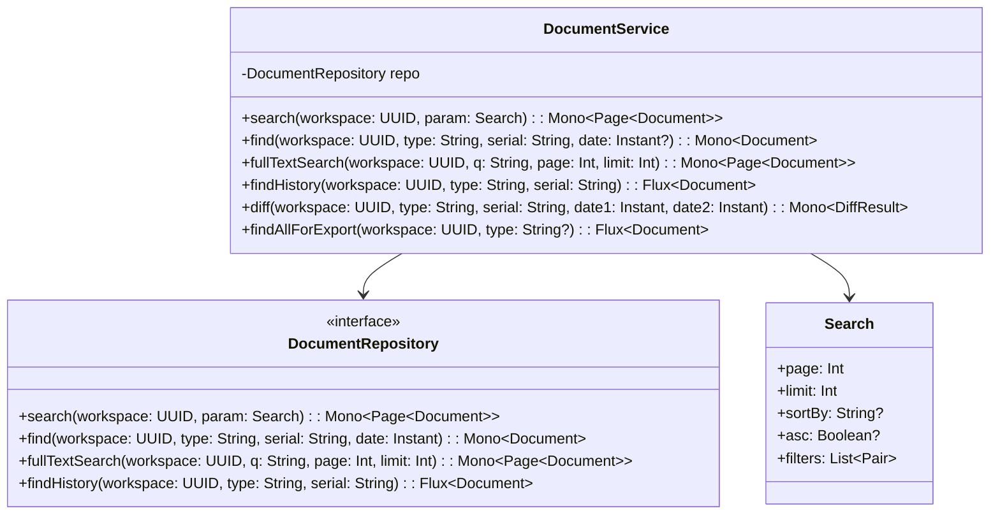
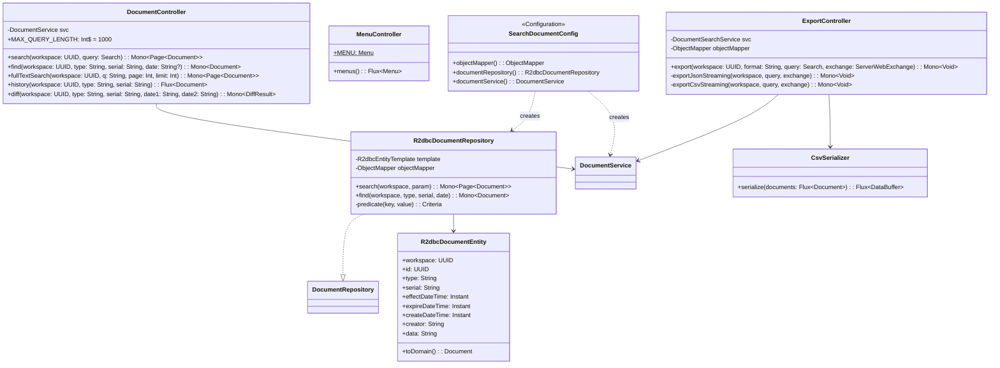

# Search-Document 클래스 다이어그램

## Usecase 계층

## Interfaces 계층

## 설계 패턴

| 패턴 | 적용 위치 | 설명 |
|------|----------|------|
| **CQRS (읽기 분리)** | document-query 전체 | document-command(쓰기)와 분리된 읽기 전용 서비스 |
| **Port & Adapter** | DocumentRepository | usecase의 포트를 R2dbcDocumentRepository가 구현 |
| **Criteria Builder** | R2dbcDocumentRepository.predicate() | 동적 검색 조건을 Criteria 객체로 조합 |
| **Menu Provider** | MenuController | Gateway가 수집하는 메뉴 정보 제공 |
| **Input Validation** | DocumentController (MAX_QUERY_LENGTH) | 검색 쿼리 길이 제한으로 보안 강화 |
| **Streaming Export** | ExportController | ServerWebExchange 직접 write로 메모리 최적화된 내보내기 |
