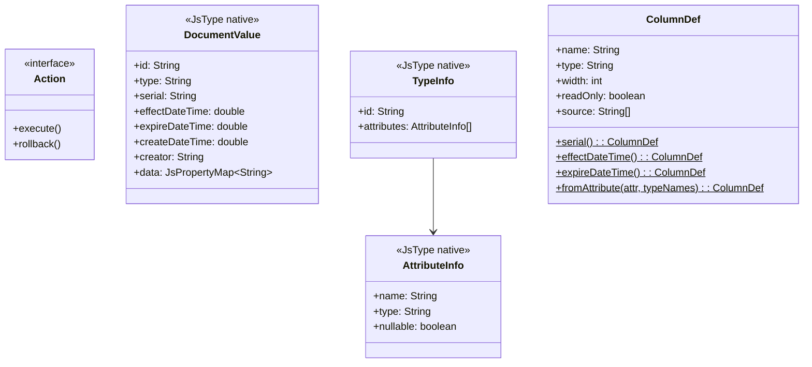
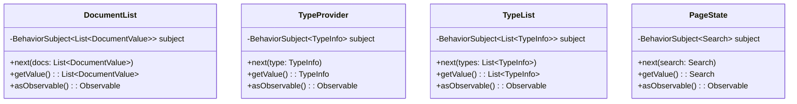
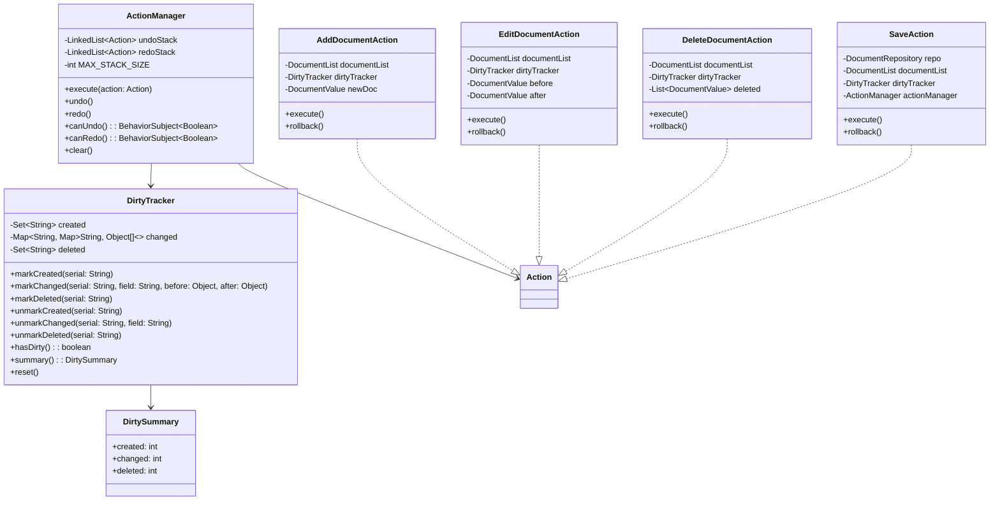
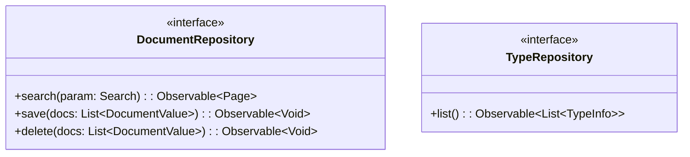
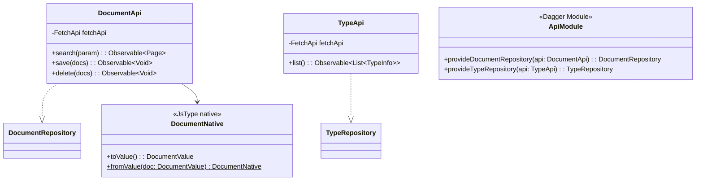
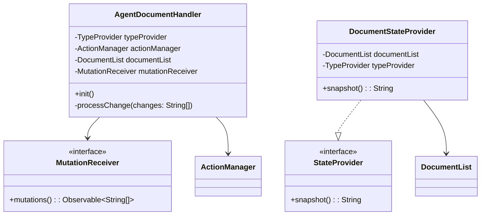
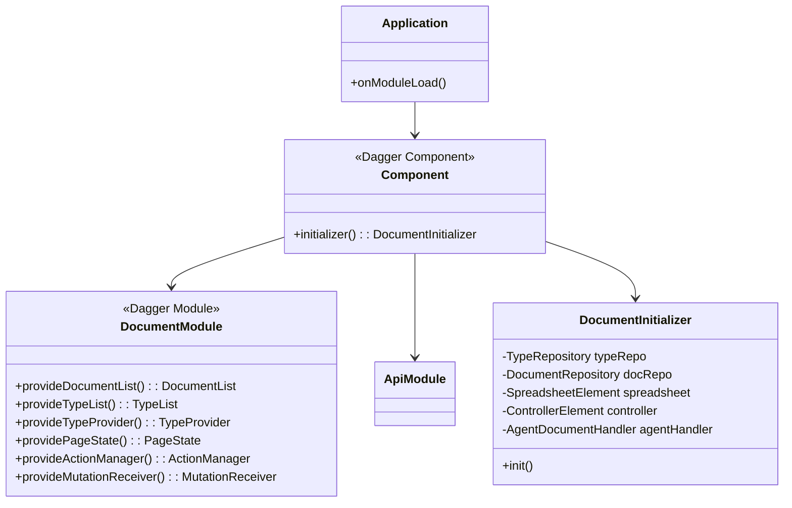
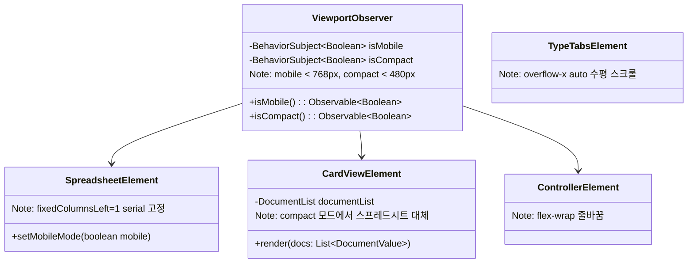

# Document-UI 클래스 다이어그램

## Domain 계층

## Usecase 계층 — 상태 관리

## Usecase 계층 — Action & ActionManager & DirtyTracker

## Usecase 계층 — 포트

## Interfaces 계층 — API

## Interfaces 계층 — UI 컴포넌트

```mermaid
classDiagram
    class SpreadsheetElement {
        -Handsontable instance
        -ColumnDef[] columns
        +render(data: List~DocumentValue~)
        +updateColumns(columns: ColumnDef[])
        +getSelected(): List~int~
    }

    class ColumnFactory {
        +create(type: TypeInfo): ColumnDef[]$
        +create(type: TypeInfo, allTypes: List~TypeInfo~): ColumnDef[]$
    }

    class DataProvider {
        +toArray(docs: List~DocumentValue~, columns: ColumnDef[]): Object[][]
        +fromArray(data: Object[][], columns: ColumnDef[]): List~DocumentValue~
    }

    class TypeTabsElement {
        -TypeList typeList
        -TypeProvider typeProvider
        +render()
    }

    class ControllerElement {
        +element(): HTMLElement
    }

    class AddButton {
        -ActionManager actionManager
        -DocumentList documentList
    }

    class DeleteButton {
        -ActionManager actionManager
        -DocumentList documentList
        -SpreadsheetElement spreadsheet
    }

    class SaveButton {
        -ActionManager actionManager
    }

    class UndoButton {
        -ActionManager actionManager
    }

    class RedoButton {
        -ActionManager actionManager
    }

    class PaginationElement {
        -PageState pageState
        +render(totalElements: int)
    }

    class SelectedRows {
        -BehaviorSubject~Set~Integer~~ subject
        +toggle(rowIndex: int)
        +clear()
        +getValue(): Set~Integer~
        +asObservable(): Observable~Set~Integer~~
        +subscribe(consumer: Consumer)
    }

    class BulkDeleteButton {
        -ActionManager actionManager
        -DocumentList documentList
        -SelectedRows selectedRows
        -LabelProvider labelProvider
    }

    class BulkStatusButton {
        -ActionManager actionManager
        -DocumentList documentList
        -SelectedRows selectedRows
        -LabelProvider labelProvider
        -HTMLSelectElement select (DRAFT/REVIEW/PUBLISHED)
    }

    ControllerElement --> TypeTabsElement
    ControllerElement --> AddButton
    ControllerElement --> DeleteButton
    ControllerElement --> SaveButton
    ControllerElement --> UndoButton
    ControllerElement --> RedoButton
    ControllerElement --> PaginationElement
    ControllerElement --> BulkDeleteButton
    ControllerElement --> BulkStatusButton
    BulkDeleteButton --> SelectedRows
    BulkStatusButton --> SelectedRows
    SpreadsheetElement --> ColumnFactory
    SpreadsheetElement --> DataProvider
```

## 에이전트 연동

## DI 조합

## 설계 패턴

| 패턴 | 적용 위치 | 설명 |
|------|----------|------|
| **Command** | Action, ActionManager | 모든 편집을 Action으로 캡슐화하여 Undo/Redo 지원 |
| **Observer (BehaviorSubject)** | DocumentList, TypeProvider, PageState | 상태 변경 시 자동 전파 |
| **Port & Adapter** | DocumentRepository, TypeRepository | usecase 포트를 API 어댑터가 구현 |
| **Factory** | ColumnFactory | TypeInfo의 속성 + TypeList(전체 타입 목록)을 기반으로 Handsontable 컬럼 정의로 변환. document 속성은 타입 이름 드롭다운 제공 |
| **Adapter** | DataProvider | DocumentValue ↔ Handsontable 2D 배열 변환 |
| **Facade** | DocumentInitializer | 초기화 로직을 하나의 진입점으로 통합 |
| **Bridge (WindowMutationBridge)** | AgentDocumentHandler | GWT 모듈 간 CustomEvent 기반 통신 |

## 모바일 지원

| 클래스 | 모바일 동작 |
|--------|-----------|
| `ViewportObserver` | matchMedia 감지. mobile(<768px), compact(<480px) 두 단계 |
| `SpreadsheetElement` | 모바일: fixedColumnsLeft=1 (serial 고정) + 수평 스크롤 |
| `CardViewElement` | compact 모드 전용. 문서별 카드 리스트 표시. 스프레드시트 숨김 |
| `TypeTabsElement` | overflow-x: auto 수평 스크롤 탭 바 |
| `ControllerElement` | flex-wrap으로 줄바꿈. 핵심 버튼(Save, Add)만 1행 표시 |
| `PaginationElement` | 모바일: 이전/다음 버튼만 표시, 페이지 번호 생략 |
