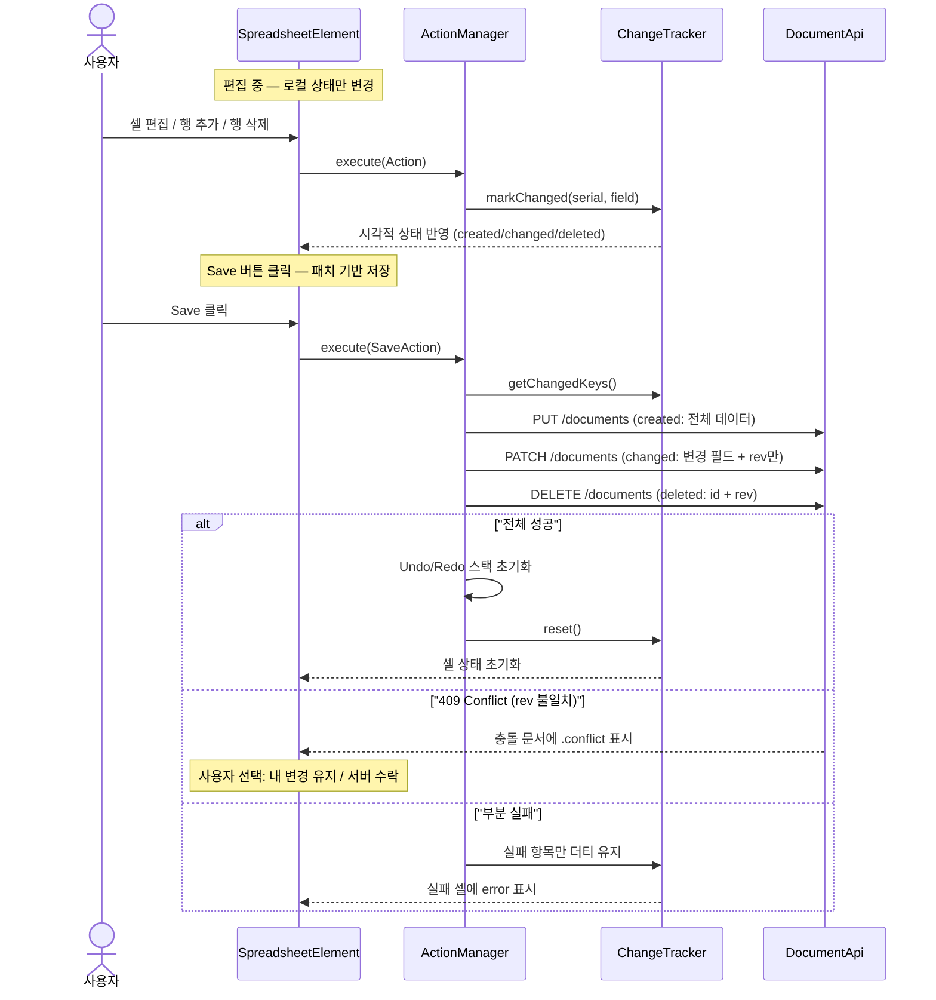
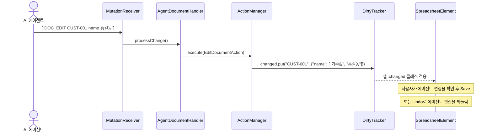
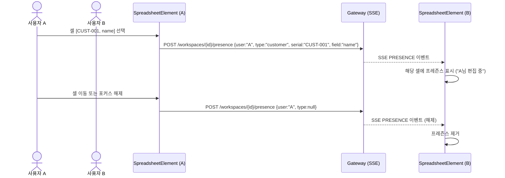
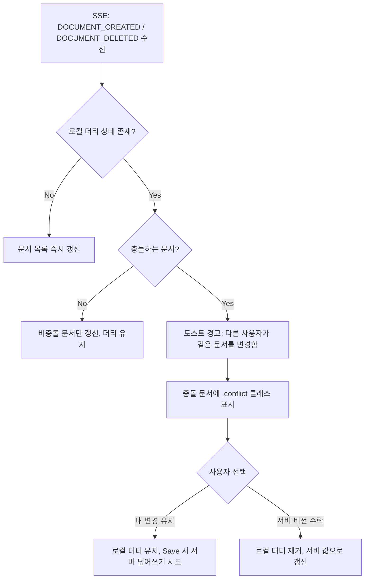
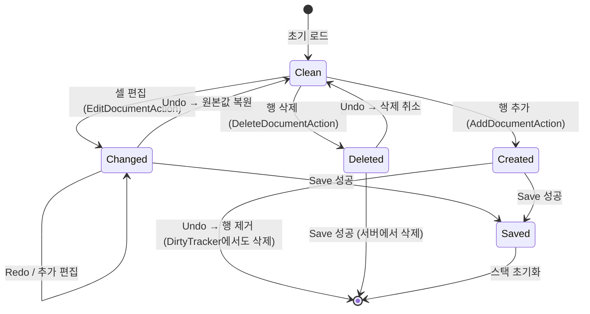

# Document-UI 디자인 명세

## 1. 스프레드시트 비주얼 디자인

Handsontable 6.2.4 (MIT)를 JsInterop으로 래핑하며, MD3 디자인 토큰으로 테마를 통일한다.

### 1.1 테이블 구조

| 영역 | 스타일 |
|------|--------|
| **외곽** | `border-radius: 0.5rem`, 외곽 보더만 `outline` 색상 |
| **내부 셀** | 세로 구분선 제거, 가로 구분선 `outline-variant` |
| **헤더 (th)** | `surface-container` 배경, `headline-small` 타이포, `on-surface` 색상 |
| **셀 (td)** | `surface-container` 배경, `body-medium` 타이포, `on-surface` 색상 |
| **읽기 전용 셀** | `surface-container-low` 배경, `on-surface-variant` 색상 |

### 1.2 인터랙션

| 상태 | 시각적 피드백 |
|------|-------------|
| **행 호버** | `on-surface` 8% 혼합 배경 |
| **홀짝 행 (zebra)** | 짝수 행 `surface-container-low` 배경 |
| **현재 셀 (current)** | `primary` 보더, 셀 배경 `primary` 8% 혼합 |
| **선택 영역 (area)** | `primary` 보더, 셀 배경 `primary` 12% 혼합 |
| **선택된 헤더** | `primary-container` 배경, `on-primary-container` 색상 |
| **커서 코너** | `border-radius: 1rem`, 투명 보더 |
| **드래그 채우기 (fill)** | `tertiary` 보더 |

### 1.3 편집

| 상태 | 시각적 피드백 |
|------|-------------|
| **편집 중 (input)** | `secondary` 2px inset shadow, `surface-bright` 배경 |
| **포커스 (focus-visible)** | `secondary` 2px outline (접근성) |

### 1.4 트랜지션

모든 배경색 전환에 `300ms ease-in-out` 적용. `global.css`의 모션 토큰(`--md-sys-motion-duration-medium2`)과 일치시킨다.

---

## 2. 더티 트래킹 & 원자적 저장

### 2.1 핵심 원칙

- 사용자 편집은 **로컬 상태에만 반영**되며, 서버에 즉시 저장되지 않는다.
- **Save 버튼**을 누르면 생성/수정/삭제 변경점이 **하나의 트랜잭션으로 원자적 저장**된다.
- 저장 전까지 사용자는 변경 내역을 시각적으로 확인하고, Undo/Redo로 되돌릴 수 있다.

### 2.2 셀 상태 분류

편집 중 각 셀/행은 다음 4가지 상태 중 하나를 갖는다:

| 상태 | CSS 클래스 | 시각적 표현 | 설명 |
|------|-----------|------------|------|
| **기본** | (없음) | `surface-container` 배경 | 서버와 동일한 원본 상태 |
| **생성** | `.created` | `tertiary-container` 배경, 좌측 3px `tertiary` 보더 | 로컬에서 새로 추가된 행 |
| **수정** | `.changed` | `tertiary` 1px inset box-shadow | 원본 대비 값이 변경된 셀 |
| **삭제 예정** | `.deleted` | 취소선, 텍스트 75% 투명화 | 삭제 마킹된 행 (Save 시 서버에서 삭제) |

### 2.3 검증 상태

| 상태 | CSS 클래스 | 시각적 표현 | 조건 |
|------|-----------|------------|------|
| **유효** | `.valid` | `primary` 텍스트 색상 | 서버 측 검증 통과 |
| **유효하지 않음** | `.invalid` | `error` 텍스트 + `error` 1px inset box-shadow | 필수값 누락 또는 형식 오류 |

> `.changed` 상태의 셀은 valid/invalid 표시를 억제한다 (저장 전까지는 변경 중임을 우선 표시).
> 단, `.changed.invalid` 조합이 필요한 경우: `error` 1px + `tertiary` 2px 이중 inset shadow.

### 2.4 저장 플로우 (패치 기반)

저장 시 변경된 필드만 서버에 전송한다. 이를 통해 두 사용자가 같은 문서의 서로 다른 속성을 동시에 수정해도 충돌 없이 병합된다.

| 변경 유형 | HTTP 메서드 | 페이로드 | 서버 동작 |
|-----------|-----------|---------|---------|
| created | PUT | 전체 문서 | INSERT |
| changed | PATCH | `{id, rev, data: {변경필드만}}` | `data = data \|\| patch_data`, rev 체크 |
| deleted | DELETE | `{id, rev}` | DELETE, rev 체크 |



### 2.5 더티 추적 자료구조

```
ChangeTracker (ui-components)
├── state: Map<String, ChangeState>  // key(serial) → NOT_CHANGED/CHANGED/DELETED
├── markChanged(key)                 // CHANGED로 마킹
├── markDeleted(key)                 // DELETED로 마킹
├── unmark(key)                      // NOT_CHANGED로 복원 (Undo 시)
├── hasChanges(): boolean
├── getChangedKeys(): Set<String>    // PATCH 대상
├── getDeletedKeys(): Set<String>    // DELETE 대상
└── reset()                          // 저장 성공 후 초기화

DocumentDirtyTracker (document-ui 확장)
├── fieldChanges: Map<String, Map<String, Object>>  // serial → {변경필드: 값}
├── trackFieldChange(serial, field, value)           // 개별 필드 변경 추적
├── getFieldChanges(serial): Map<String, Object>     // PATCH 페이로드 생성용
└── clearFieldChanges(serial)                        // 저장 성공 후 필드 변경 초기화
```

PATCH 요청 시 `fieldChanges`에서 해당 문서의 변경 필드만 추출하여 전송한다.

### 2.6 Save 버튼 UX

- 더티 상태가 없으면 **비활성화** (`disabled`)
- 더티가 있으면 변경 건수 뱃지 표시: `Save (3)`
- 클릭 시 저장 중 **스피너** 표시, 중복 클릭 방지
- 타입 탭 전환 시 미저장 변경이 있으면 **확인 다이얼로그**: "저장하지 않은 변경사항이 있습니다. 계속하시겠습니까?"

---

## 3. 에이전트 연동 시 더티 트래킹

### 3.1 원칙

에이전트가 실행한 편집도 **동일한 Action/DirtyTracker 경로**를 탄다. 에이전트 편집과 사용자 편집은 구분 없이 하나의 더티 상태로 관리된다.

### 3.2 플로우



### 3.3 에이전트 자동 저장

에이전트가 `DOC_SAVE` 명령을 보내면 SaveAction이 실행된다. 이때:
- 사용자가 수동으로 편집한 변경과 에이전트 변경이 **함께 원자적으로 저장**된다.
- 사용자에게 토스트: "에이전트가 저장을 요청했습니다 (N건)"

---

## 4. 프레즌스 (다른 사용자 편집 표시)

### 4.1 개요

같은 워크스페이스에서 다른 사용자가 편집 중인 셀을 실시간으로 표시한다. 커서 위치만 공유하므로 구현이 가벼우며, 동시 편집 충돌을 사전에 예방한다.

### 4.2 동작 방식



### 4.3 시각적 표현

| 요소 | 스타일 |
|------|--------|
| 프레즌스 셀 보더 | 2px solid, 사용자별 고유 색상 (해싱) |
| 사용자 이름 라벨 | 셀 상단 우측, 해당 사용자 색상 배경, 12px, 3초 후 fade-out |
| 프레즌스 배경 | 사용자 색상 5% 혼합 |

### 4.4 사용자 색상 할당

워크스페이스 참여자 목록의 인덱스를 기반으로 MD3 색상 팔레트에서 할당한다:

| 인덱스 | 색상 토큰 |
|--------|----------|
| 0 | `primary` |
| 1 | `secondary` |
| 2 | `tertiary` |
| 3 | `error` |
| 4+ | extended-color 또는 해싱 |

### 4.5 디바운싱 & 타임아웃

- 셀 선택 변경 시 **200ms 디바운스** 후 프레즌스 이벤트 발행 (빠른 셀 이동 시 이벤트 억제)
- 프레즌스 이벤트가 **30초** 동안 갱신되지 않으면 자동 해제 (연결 끊김 대비)

---

## 5. 실시간 협업 시 더티 트래킹

### 5.1 원칙

다른 사용자의 변경은 **SSE 이벤트로 수신**되며, 로컬 더티 상태와 **병합**한다.

### 5.2 충돌 해소 전략



### 5.3 충돌 시각적 표현

| 상태 | CSS 클래스 | 시각적 표현 |
|------|-----------|------------|
| **충돌** | `.conflict` | `secondary-container` 배경, `secondary` 2px 좌측 보더, 경고 아이콘 |

### 5.4 낙관적 잠금

서버 측 `@Version` 기반. Save 시 409 Conflict 응답이면:
1. 충돌 문서를 `.conflict` 표시
2. 최신 서버 데이터를 다시 로드
3. 사용자가 재편집 후 다시 Save

---

## 6. Undo/Redo와 더티 트래킹 통합

### 6.1 원칙

- Undo/Redo는 **Action 스택**으로 관리되며, DirtyTracker와 **동기화**된다.
- Undo로 원본 값과 동일해지면 해당 셀의 더티 플래그가 **자동 해제**된다.

### 6.2 상태 전이



### 6.3 에이전트 편집의 Undo

에이전트가 연속 편집한 경우 (예: DOC_ADD → DOC_EDIT × 3):
- 사용자의 Ctrl+Z는 **Action 단위**로 되돌린다 (에이전트/사용자 구분 없이 시간순).
- 에이전트 편집도 Undo 스택에 쌓이므로 사용자가 원하지 않는 편집을 되돌릴 수 있다.

### 6.4 Save 후 Undo

Save 성공 시 Undo/Redo **스택을 초기화**한다. 저장된 변경은 되돌릴 수 없다.
- 이유: Save는 서버 상태를 변경하므로, 로컬 Undo로 서버 상태와 불일치가 발생하면 데이터 무결성을 보장할 수 없다.

---

## 7. 크로스 모듈 디자인 일관성

### 7.1 현재 불일치 사항

| 항목 | document-ui | type-ui | workspace-ui | dashboard-ui |
|------|------------|---------|-------------|-------------|
| **트랜지션** | `300ms ease-in-out` | `0.1s~0.2s ease` | `300ms ease` | 없음 |
| **모션 토큰** | 미사용 | 미사용 | 미사용 | 미사용 |
| **border-radius** | `8px` (버튼) | `12px` (카드) | shape 토큰 | `12px` |
| **font-size** | 하드코딩 `13px` | 하드코딩 `14px` | 하드코딩 `15px` | typescale 토큰 |
| **호버 배경** | `surface-container-high` | `surface-container-high` | 없음 | 없음 |
| **touch target** | `44px` → `48px` | 없음 | `48px` | 없음 |

### 7.2 통일 기준

`global.css`에 이미 정의된 MD3 토큰을 적극 활용한다:

| 항목 | 통일 기준 | 토큰 |
|------|----------|------|
| **트랜지션 duration** | `var(--md-sys-motion-duration-medium2)` | 300ms |
| **트랜지션 easing** | `var(--md-sys-motion-easing-standard)` | cubic-bezier(0.2, 0, 0, 1) |
| **버튼 radius** | `var(--md-sys-shape-corner-small)` | 8px |
| **카드 radius** | `var(--md-sys-shape-corner-medium)` | 12px |
| **다이얼로그 radius** | `var(--md-sys-shape-corner-extra-large)` | 28px |
| **본문 font-size** | `var(--md-sys-typescale-body-medium-size)` | 0.875rem |
| **라벨 font-size** | `var(--md-sys-typescale-label-large-size)` | 0.75rem |
| **헤더 font-size** | `var(--md-sys-typescale-headline-small-size)` | 1rem |
| **호버 배경** | `color-mix(in srgb, var(--md-sys-color-on-surface) 8%, var(배경색))` | — |
| **touch target** | 최소 `48px` (MD3 가이드라인) | — |

### 7.3 상태 색상 통일 (크로스 모듈)

모든 모듈에서 동일한 의미론적 색상을 사용한다:

| 의미 | 색상 토큰 | 사용처 |
|------|----------|--------|
| **성공/완료** | `primary` | 대시보드 완료 상태, 문서 유효 셀 |
| **경고/진행 중/변경** | `tertiary` | 대시보드 실행 중, 문서 변경 셀, 드래그 채우기 |
| **오류** | `error` | 대시보드 오류, 문서 유효하지 않은 셀 |
| **정보** | `secondary` | 대시보드 정보 뱃지, 문서 편집 포커스 |
| **충돌** | `secondary-container` | 협업 충돌 표시 |

---

## 8. CSS 적용 계획

### 8.1 document-ui.css 변경 목록

기존 스타일에 추가할 항목:

```css
/* 읽기 전용 셀 */
.handsontable td.htDimmed { ... }

/* 홀짝 행 구분 */
.handsontable tbody tr:nth-child(even) td { ... }

/* 행 호버 */
.handsontable tbody tr:hover td { ... }

/* 선택 영역 배경 */
.handsontable td.area { ... }

/* 현재 셀 배경 */
.handsontable td.current.highlight { ... }

/* 포커스 접근성 */
.handsontableInput:focus-visible { ... }

/* 생성된 행 */
.handsontable td.created { ... }

/* 변경+유효하지않음 조합 */
.handsontable td.changed.invalid { ... }

/* 충돌 상태 */
.handsontable td.conflict { ... }
```

### 8.2 크로스 모듈 토큰 마이그레이션

각 모듈의 하드코딩된 값을 MD3 토큰으로 교체한다:

| 모듈 | 변경 대상 | 현재 | 변경 후 |
|------|----------|------|---------|
| document-ui | `.doc-ctrl-btn` border-radius | `8px` | `var(--md-sys-shape-corner-small)` |
| document-ui | `.doc-type-tab` transition | `0.2s` | `var(--md-sys-motion-duration-medium2) var(--md-sys-motion-easing-standard)` |
| type-ui | `.type-box` border-radius | `12px` | `var(--md-sys-shape-corner-medium)` |
| type-ui | `.type-attr-row` transition | `0.1s ease` | `var(--md-sys-motion-duration-short2) var(--md-sys-motion-easing-standard)` |
| dashboard-ui | `.dash-stat-card` border-radius | `12px` | `var(--md-sys-shape-corner-medium)` |
