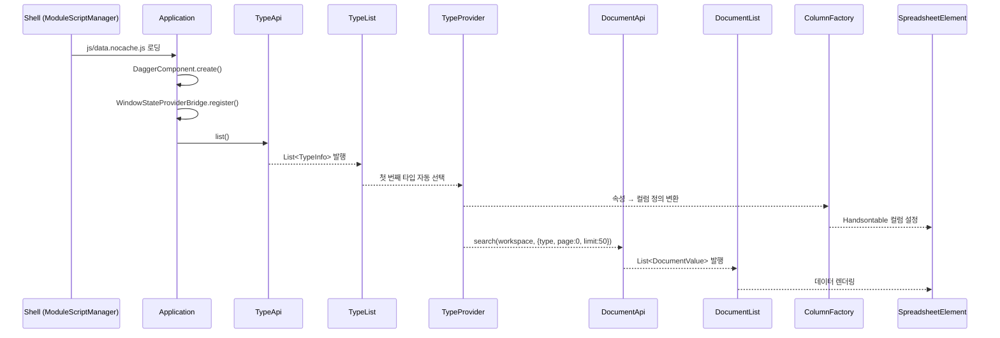
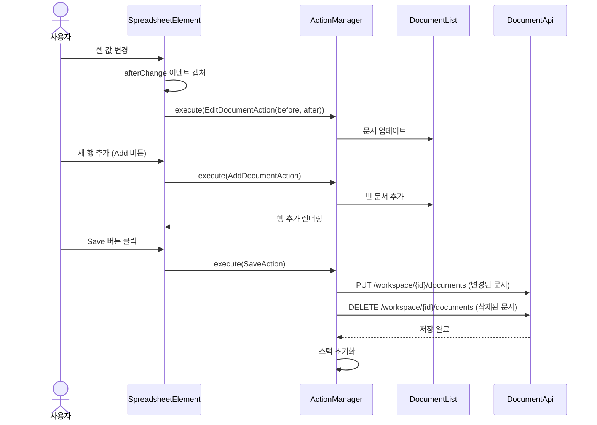
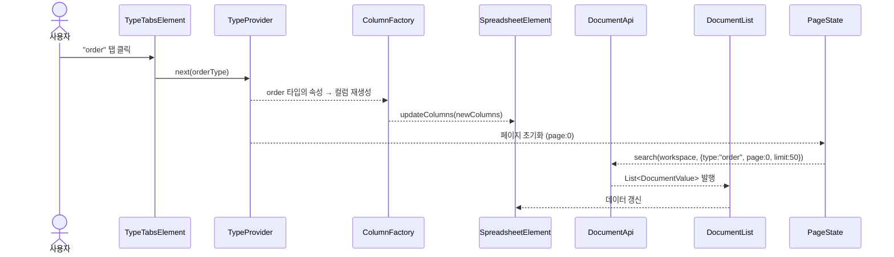
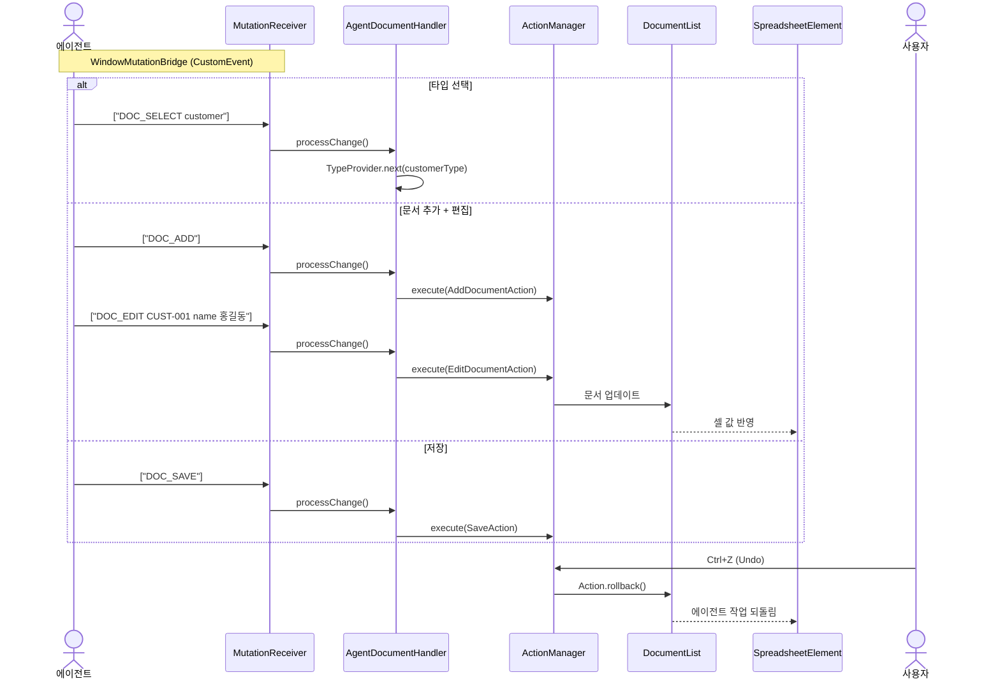
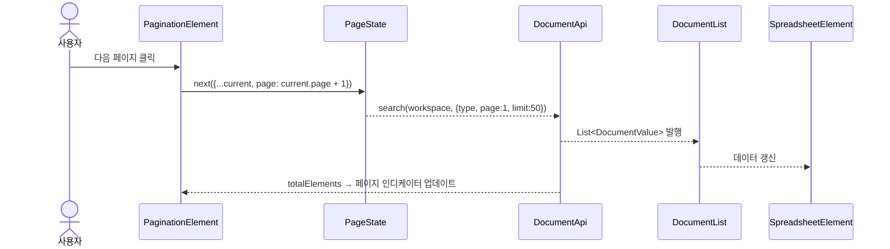
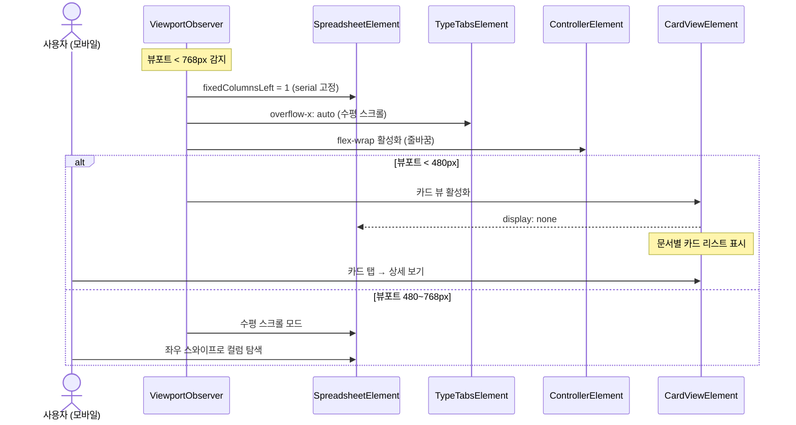

# Document-UI 유스케이스

## 초기 로딩 시퀀스

## 문서 편집 → 저장 시퀀스

## 타입 탭 전환 시퀀스

## 에이전트 문서 조작 시퀀스

## 페이지네이션 시퀀스

---

## UC-D1: 문서 조회

| 항목 | 내용 |
|------|------|
| **액터** | 사용자 |
| **선행조건** | 워크스페이스 선택 완료, Shell이 document-ui 모듈을 로딩 |
| **정상 흐름** | 1. Shell이 `js/data.nocache.js`를 동적 로딩한다. 2. TypeApi로 타입 목록을 가져와 탭으로 표시한다. 3. 첫 번째 타입이 자동 선택되고 `ColumnFactory`가 속성 기반으로 컬럼을 생성한다. 4. DocumentApi로 해당 타입의 문서를 검색하여 스프레드시트에 렌더링한다. |
| **결과** | Handsontable 스프레드시트에 문서가 테이블 형태로 표시된다. |

## UC-D2: 문서 생성

| 항목 | 내용 |
|------|------|
| **액터** | 사용자 |
| **선행조건** | 타입이 선택됨 |
| **정상 흐름** | 1. Add 버튼을 클릭한다. 2. `AddDocumentAction`이 `DocumentList`에 빈 문서를 추가한다. 3. 스프레드시트 하단에 빈 행이 추가된다. 4. 사용자가 셀을 클릭하여 serial, 속성값 등을 입력한다. |
| **대안 흐름** | 에이전트가 `DOC_ADD` 명령으로 실행. |

## UC-D3: 문서 편집

| 항목 | 내용 |
|------|------|
| **액터** | 사용자 |
| **선행조건** | 문서가 스프레드시트에 표시됨 |
| **정상 흐름** | 1. 셀을 클릭하여 값을 수정한다. 2. Handsontable의 `afterChange` 이벤트가 `EditDocumentAction(before, after)`을 생성한다. 3. `ActionManager`에서 실행되어 `DocumentList`가 업데이트된다. 4. 변경된 셀이 시각적으로 표시된다 (배경색 변경). |
| **대안 흐름** | 에이전트가 `DOC_EDIT <serial> <field> <value>` 명령으로 실행. |
| **대안 흐름 (모바일)** | 셀 탭으로 편집 모드 진입. 가상 키보드가 올라올 때 스프레드시트가 자동 스크롤되어 편집 중인 셀이 가시 영역에 유지된다. 뷰포트 < 480px에서는 `CardViewElement`로 전환되어 카드 내에서 필드를 편집한다. |

## UC-D4: 문서 삭제

| 항목 | 내용 |
|------|------|
| **액터** | 사용자 |
| **선행조건** | 1개 이상의 행이 선택됨 |
| **정상 흐름** | 1. 행을 선택하고 Delete 버튼을 클릭한다. 2. `DeleteDocumentAction`이 `DocumentList`에서 문서를 제거한다. 3. 스프레드시트에서 해당 행이 사라진다. |
| **대안 흐름** | 에이전트가 `DOC_DELETE <serial>` 명령으로 실행. |

## UC-D5: 저장

| 항목 | 내용 |
|------|------|
| **액터** | 사용자 |
| **선행조건** | 변경된 문서가 존재 |
| **정상 흐름** | 1. Save 버튼 클릭 → `SaveAction` 실행. 2. 변경된 문서는 `PUT /workspace/{id}/documents`로, 삭제된 문서는 `DELETE`로 전송한다. 3. Undo/Redo 스택이 초기화된다. 4. 셀 배경색이 초기화된다. |
| **대안 흐름** | 에이전트가 `DOC_SAVE` 명령으로 실행. |

## UC-D6: 타입 전환

| 항목 | 내용 |
|------|------|
| **액터** | 사용자 |
| **선행조건** | 타입 탭이 2개 이상 존재 |
| **정상 흐름** | 1. 다른 타입 탭을 클릭한다. 2. `TypeProvider`가 새 타입으로 전환된다. 3. `ColumnFactory`가 새 타입의 속성 기반으로 컬럼을 재생성한다. 4. 페이지가 0으로 초기화되고 새 타입의 문서가 로딩된다. |
| **주의** | 미저장 변경이 있으면 경고 다이얼로그를 표시한다 (미구현 시 주의사항으로 기록). |
| **대안 흐름** | 에이전트가 `DOC_SELECT <type>` 명령으로 실행. |

## UC-D7: Undo/Redo

| 항목 | 내용 |
|------|------|
| **액터** | 사용자 |
| **선행조건** | 실행된 액션이 존재 |
| **정상 흐름** | 1. Ctrl+Z 또는 Undo 버튼 → `ActionManager.undo()`. 최근 액션의 `rollback()` 실행. 2. Ctrl+Shift+Z 또는 Redo 버튼 → `ActionManager.redo()`. 되돌린 액션의 `execute()` 재실행. 3. 스택은 최대 100개. 새 액션 실행 시 redo 스택 초기화. |
| **특이사항** | 에이전트가 실행한 액션도 동일하게 Undo/Redo 가능. |

## UC-D8: 페이지네이션

| 항목 | 내용 |
|------|------|
| **액터** | 사용자 |
| **선행조건** | 문서 수가 페이지 크기를 초과 |
| **정상 흐름** | 1. 페이지네이션 컨트롤에서 이전/다음 버튼을 클릭한다. 2. `PageState`가 새 page 번호로 업데이트된다. 3. DocumentApi로 해당 페이지의 문서를 다시 검색한다. 4. 스프레드시트가 갱신된다. |

## UC-D9: 에이전트에 의한 문서 조작

| 항목 | 내용 |
|------|------|
| **액터** | AI 에이전트 |
| **선행조건** | document-ui 모듈 로딩 완료, MutationReceiver 브릿지 연결 |
| **정상 흐름** | 1. 에이전트가 `DocumentStateProvider.snapshot()`으로 현재 문서 상태를 JSON으로 조회한다. 2. LLM이 DOC_* 명령을 생성한다. 3. `MutationReceiver`를 통해 `AgentDocumentHandler`에 전달된다. 4. 핸들러가 명령을 파싱하여 적절한 Action으로 변환하고 `ActionManager`에서 실행한다. |
| **지원 명령** | DOC_SELECT, DOC_ADD, DOC_EDIT, DOC_DELETE, DOC_SAVE |
| **브릿지** | `agent-bridge` 모듈의 `WindowMutationBridge`가 CustomEvent로 연결. |

## 모바일 레이아웃 전환 시퀀스

## UC-D10: 모바일 반응형 레이아웃

| 항목 | 내용 |
|------|------|
| **액터** | 사용자 (모바일/태블릿 디바이스) |
| **선행조건** | 뷰포트 너비 < 768px |
| **정상 흐름** | 1. `ViewportObserver`가 뷰포트 변경을 감지한다. 2. 스프레드시트에서 serial 컬럼이 고정(`fixedColumnsLeft=1`)되고 나머지 컬럼은 수평 스크롤된다. 3. 타입 탭이 수평 스크롤 가능한 탭 바로 표시된다. 4. 컨트롤러 툴바가 flex-wrap으로 줄바꿈되며, 핵심 버튼(Save, Add)만 1행에 표시된다. 5. 뷰포트 < 480px에서 `CardViewElement`로 전환하여 문서별 카드 뷰를 사용할 수 있다. |

---

## 트레이서빌리티 매트릭스

| UC | 시퀀스 다이어그램 | 주요 클래스 | 테스트 |
|----|---|---|---|
| UC-D1 (조회) | 초기 로딩 | Application, TypeApi, DocumentApi, TypeList, TypeProvider, DocumentList, ColumnFactory, SpreadsheetElement | DocumentTest: 스프레드시트 렌더링, 타입 탭 표시 |
| UC-D2 (생성) | 문서 편집 → 저장 | AddDocumentAction, ActionManager, DocumentList, AddButton | DocumentTest: Add 클릭 → 행 추가 |
| UC-D3 (편집) | 문서 편집 → 저장 | EditDocumentAction, ActionManager, SpreadsheetElement, DocumentList | DocumentTest: 셀 변경 검증 |
| UC-D4 (삭제) | 문서 편집 → 저장 | DeleteDocumentAction, ActionManager, DocumentList, DeleteButton | DocumentTest: 행 삭제 검증 |
| UC-D5 (저장) | 문서 편집 → 저장 (후반) | SaveAction, DocumentApi, ActionManager | DocumentTest: Save 버튼 존재 확인 |
| UC-D6 (타입전환) | 타입 탭 전환 | TypeTabsElement, TypeProvider, ColumnFactory, DocumentApi, PageState | DocumentTest: 탭 전환 → 컬럼 변경 검증 |
| UC-D7 (Undo) | — | ActionManager, UndoButton, RedoButton | DocumentTest: Ctrl+Z/Ctrl+Shift+Z 검증 |
| UC-D8 (페이지) | 페이지네이션 | PaginationElement, PageState, DocumentApi, DocumentList | DocumentTest: 페이지 이동 검증 |
| UC-D9 (에이전트) | 에이전트 문서 조작 | AgentDocumentHandler, DocumentStateProvider, MutationReceiver, WindowMutationBridge | ❌ 미구현 |
| UC-D10 (모바일) | 모바일 레이아웃 전환 | ViewportObserver, SpreadsheetElement(fixedColumnsLeft), CardViewElement, ControllerElement(flex-wrap), TypeTabsElement(overflow-x) | ❌ 미구현 |
