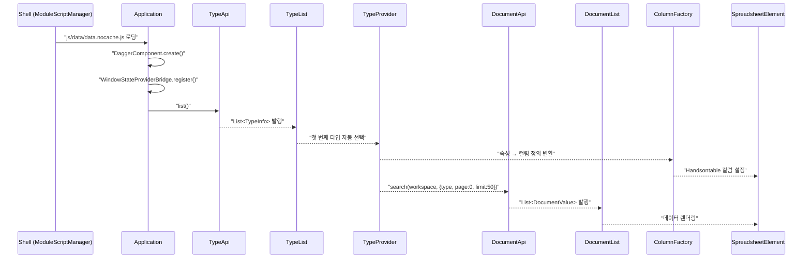
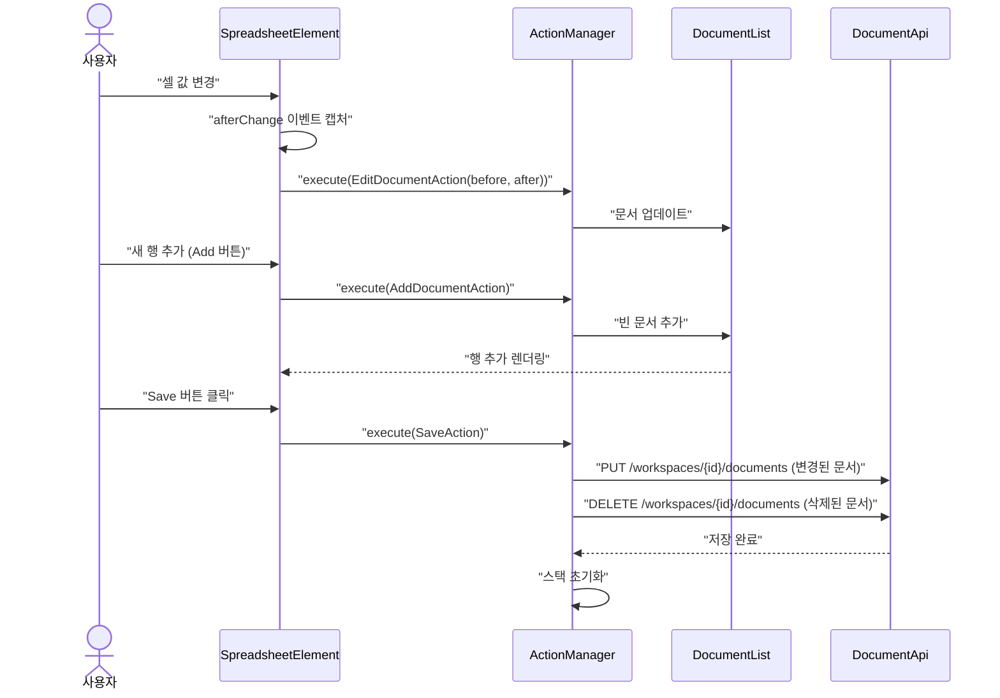
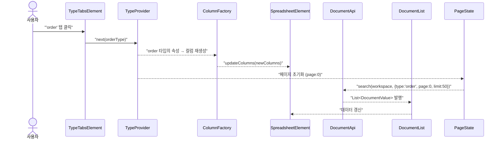
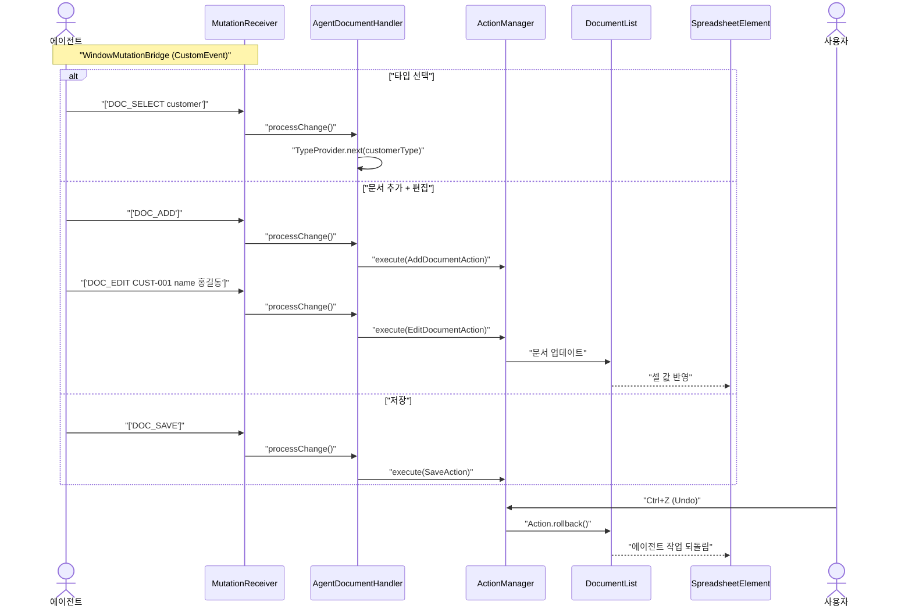
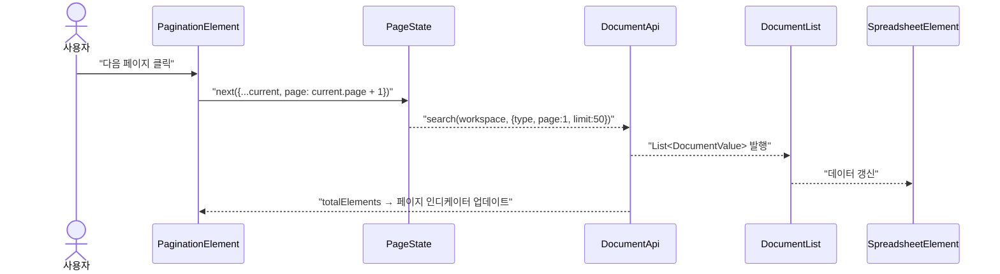
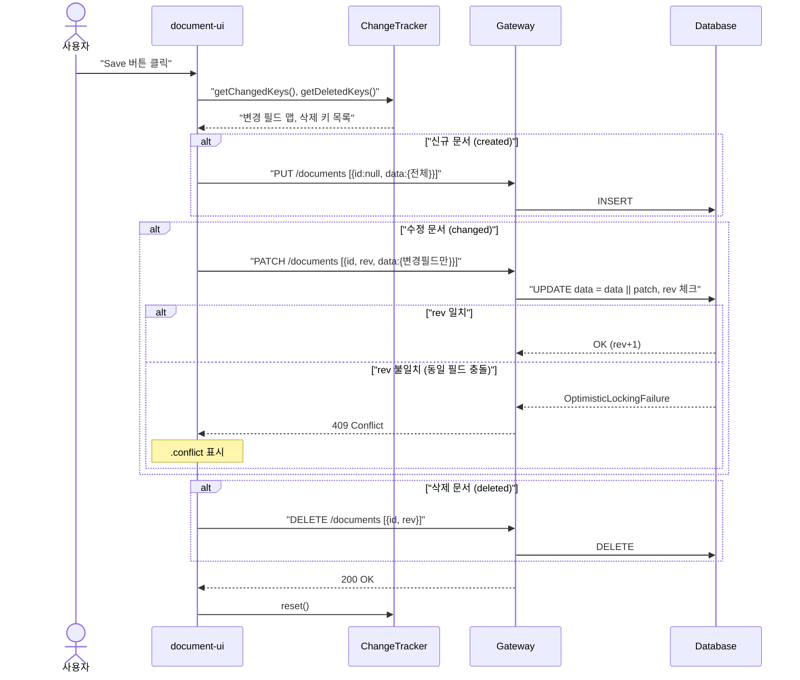
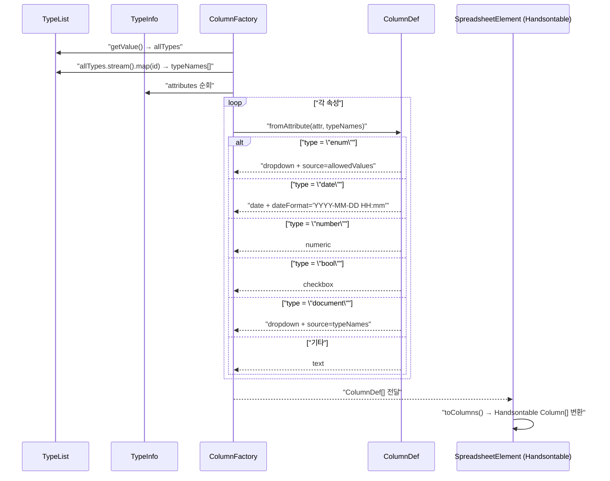
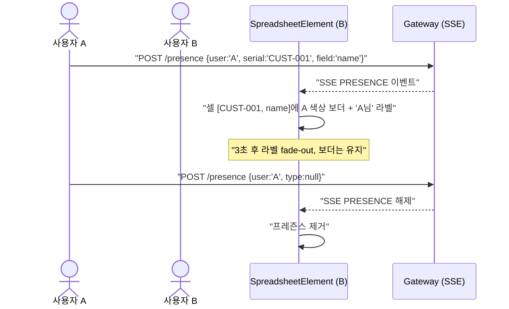

# Document-UI 유스케이스

## 초기 로딩 시퀀스

## 문서 편집 → 저장 시퀀스

## 타입 탭 전환 시퀀스

## 에이전트 문서 조작 시퀀스

## 페이지네이션 시퀀스

---

## UC-D1: 문서 조회

| 항목 | 내용 |
|------|------|
| **액터** | 사용자 |
| **선행조건** | 워크스페이스 선택 완료, Shell이 document-ui 모듈을 로딩 |
| **정상 흐름** | 1. Shell이 `js/data/data.nocache.js`를 동적 로딩한다. 2. TypeApi로 타입 목록을 가져와 탭으로 표시한다. 3. 첫 번째 타입이 자동 선택되고 `ColumnFactory`가 속성 기반으로 컬럼을 생성한다. 4. DocumentApi로 해당 타입의 문서를 검색하여 스프레드시트에 렌더링한다. |
| **결과** | Handsontable 스프레드시트에 문서가 테이블 형태로 표시된다. |

## UC-D2: 문서 생성

| 항목 | 내용 |
|------|------|
| **액터** | 사용자, AI 에이전트 |
| **선행조건** | 타입이 선택됨 |
| **정상 흐름** | 1. Add 버튼을 클릭한다. 2. `AddDocumentAction`이 `DocumentList`에 빈 문서를 추가하고, `DirtyTracker.created`에 등록한다. 3. 스프레드시트 하단에 `.created` 상태의 빈 행이 추가된다 (tertiary-container 배경, 좌측 3px tertiary 보더). 4. 사용자가 셀을 클릭하여 serial, 속성값 등을 입력한다. 5. Save 전까지 로컬에만 존재하며, Undo로 제거 가능하다. |
| **대안 흐름** | 에이전트가 `DOC_ADD` 명령으로 실행 (동일한 DirtyTracker 경로). |

## UC-D3: 문서 편집

| 항목 | 내용 |
|------|------|
| **액터** | 사용자, AI 에이전트 |
| **선행조건** | 문서가 스프레드시트에 표시됨 |
| **정상 흐름** | 1. 셀을 클릭하여 값을 수정한다. 2. Handsontable의 `afterChange` 이벤트가 `EditDocumentAction(before, after)`을 생성한다. 3. `ActionManager`에서 실행되고, `DirtyTracker.changed`에 등록된다. 4. 변경된 셀에 `.changed` 상태가 표시된다 (tertiary 1px inset box-shadow). 5. Undo로 원본값이 복원되면 더티 플래그가 자동 해제된다. |
| **대안 흐름** | 에이전트가 `DOC_EDIT <serial> <field> <value>` 명령으로 실행 (동일한 DirtyTracker 경로). |
| **대안 흐름 (모바일)** | 셀 탭으로 편집 모드 진입. 가상 키보드가 올라올 때 스프레드시트가 자동 스크롤되어 편집 중인 셀이 가시 영역에 유지된다. 뷰포트 < 480px에서는 `CardViewElement`로 전환되어 카드 내에서 필드를 편집한다. |

## UC-D4: 문서 삭제

| 항목 | 내용 |
|------|------|
| **액터** | 사용자, AI 에이전트 |
| **선행조건** | 1개 이상의 행이 선택됨 |
| **정상 흐름** | 1. 행을 선택하고 Delete 버튼을 클릭한다. 2. `DeleteDocumentAction`이 실행되고, `DirtyTracker.deleted`에 등록된다. 3. 행이 `.deleted` 상태로 표시된다 (취소선, 75% 투명화). 즉시 제거되지 않고 Save 전까지 시각적으로 표시된다. 4. Undo로 삭제를 취소할 수 있다. |
| **대안 흐름** | 에이전트가 `DOC_DELETE <serial>` 명령으로 실행 (동일한 DirtyTracker 경로). |

## UC-D5: 저장 (패치 기반 원자적)

| 항목 | 내용 |
|------|------|
| **액터** | 사용자, AI 에이전트 |
| **선행조건** | `ChangeTracker.hasChanges() == true` (Save 버튼 활성화 상태) |
| **정상 흐름** | 1. Save 버튼 클릭 (또는 에이전트 `DOC_SAVE`) → `SaveAction` 실행. 2. **created** 문서: `PUT /documents` (전체 데이터 전송, 새 문서 생성). 3. **changed** 문서: `PATCH /documents` (ChangeTracker가 추적한 변경 필드 + rev만 전송). 서버에서 JSONB 머지로 기존 데이터에 병합. 4. **deleted** 문서: `DELETE /documents`. 5. 전체 성공 시: Undo/Redo 스택 초기화, `ChangeTracker.reset()`, 모든 더티 상태 해제. 6. 부분 실패 시: 실패 항목만 더티 유지, 실패 셀에 `.invalid` 표시, 토스트. |
| **대안 흐름 (충돌)** | 409 Conflict: 같은 문서의 같은 필드를 동시 수정한 경우. `.conflict` 표시 + 사용자 선택. 서로 다른 필드 수정 시에는 JSONB 머지로 충돌 없이 병합됨. |

## UC-D6: 타입 전환

| 항목 | 내용 |
|------|------|
| **액터** | 사용자 |
| **선행조건** | 타입 탭이 2개 이상 존재 |
| **정상 흐름** | 1. 다른 타입 탭을 클릭한다. 2. `TypeProvider`가 새 타입으로 전환된다. 3. `ColumnFactory`가 새 타입의 속성 기반으로 컬럼을 재생성한다. 4. 페이지가 0으로 초기화되고 새 타입의 문서가 로딩된다. |
| **주의** | `DirtyTracker.hasDirty()`이면 확인 다이얼로그를 표시한다: "저장하지 않은 변경사항이 있습니다. 계속하시겠습니까?" |
| **대안 흐름** | 에이전트가 `DOC_SELECT <type>` 명령으로 실행. |

## UC-D7: Undo/Redo

| 항목 | 내용 |
|------|------|
| **액터** | 사용자 |
| **선행조건** | 실행된 액션이 존재 |
| **정상 흐름** | 1. Ctrl+Z 또는 Undo 버튼 → `ActionManager.undo()`. 최근 액션의 `rollback()` 실행. 2. Ctrl+Shift+Z 또는 Redo 버튼 → `ActionManager.redo()`. 되돌린 액션의 `execute()` 재실행. 3. 스택은 최대 100개. 새 액션 실행 시 redo 스택 초기화. 4. Undo로 원본값이 복원되면 `DirtyTracker`에서 해당 셀의 더티 플래그가 자동 해제된다. 5. Save 성공 시 Undo/Redo 스택이 초기화된다 (서버 상태 변경 후 로컬 Undo 불가). |
| **특이사항** | 에이전트가 실행한 액션도 동일한 Undo 스택에 쌓이므로 사용자가 Ctrl+Z로 되돌릴 수 있다. |

## UC-D8: 페이지네이션

| 항목 | 내용 |
|------|------|
| **액터** | 사용자 |
| **선행조건** | 문서 수가 페이지 크기를 초과 |
| **정상 흐름** | 1. 페이지네이션 컨트롤에서 이전/다음 버튼을 클릭한다. 2. `PageState`가 새 page 번호로 업데이트된다. 3. DocumentApi로 해당 페이지의 문서를 다시 검색한다. 4. 스프레드시트가 갱신된다. |
| **경계 처리** | 마지막 페이지에서 Next 버튼 비활성화. API 응답에 totalElements 또는 hasMore 플래그를 포함하여 페이지 인디케이터 업데이트. 결과가 없는 경우 빈 상태 UI 표시. (요구사항 6.4) |

## UC-D9: 에이전트에 의한 문서 조작

| 항목 | 내용 |
|------|------|
| **액터** | AI 에이전트 |
| **선행조건** | document-ui 모듈 로딩 완료, MutationReceiver 브릿지 연결 |
| **정상 흐름** | 1. 에이전트가 `DocumentStateProvider.snapshot()`으로 현재 문서 상태를 JSON으로 조회한다. 2. LLM이 DOC_* 명령을 생성한다. 3. `MutationReceiver`를 통해 `AgentDocumentHandler`에 전달된다. 4. 핸들러가 명령을 파싱하여 적절한 Action으로 변환하고 `ActionManager`에서 실행한다. |
| **지원 명령** | DOC_SELECT, DOC_ADD, DOC_EDIT, DOC_DELETE, DOC_SAVE |
| **브릿지** | `agent-bridge` 모듈의 `WindowMutationBridge`가 CustomEvent로 연결. |

## 모바일 레이아웃 전환 시퀀스

## UC-D10: 모바일 반응형 레이아웃

| 항목 | 내용 |
|------|------|
| **액터** | 사용자 (모바일/태블릿 디바이스) |
| **선행조건** | 뷰포트 너비 < 768px |
| **정상 흐름** | 1. `ViewportObserver`가 뷰포트 변경을 감지한다. 2. 스프레드시트에서 serial 컬럼이 고정(`fixedColumnsLeft=1`)되고 나머지 컬럼은 수평 스크롤된다. 3. 타입 탭이 수평 스크롤 가능한 탭 바로 표시된다. 4. 컨트롤러 툴바가 flex-wrap으로 줄바꿈되며, 핵심 버튼(Save, Add)만 1행에 표시된다. 5. 뷰포트 < 480px에서 `CardViewElement`로 전환하여 문서별 카드 뷰를 사용할 수 있다. |

## UC-D11: RBAC 권한 검증 (계획)

| 항목 | 내용 |
|------|------|
| **액터** | 사용자 |
| **선행조건** | 워크스페이스 선택 완료, document-ui 모듈 로딩 완료 |
| **정상 흐름** | 1. 문서 편집 화면 진입 시 Shell로부터 현재 사용자의 권한 정보를 수신한다. 2. `workspace:document:edit` 권한이 있는 경우 일반 편집 모드로 진입한다. 3. `workspace:document:edit` 권한이 없는 경우 읽기 전용 모드로 전환한다. 4. 읽기 전용 모드에서는 Add, Delete, Save 버튼이 비활성화되고, 셀 편집이 차단된다. 5. 에이전트 명령(DOC_ADD, DOC_EDIT, DOC_DELETE, DOC_SAVE)도 권한이 없으면 무시된다. |
| **대안 흐름** | 권한 정보를 가져올 수 없는 경우 읽기 전용 모드로 기본 전환한다. |
| **요구사항** | 3.3 RBAC (역할 기반 접근 제어) — `{workspace}:type:{type}:document:edit` |

## UC-D12: 이력 조회 (계획)

| 항목 | 내용 |
|------|------|
| **액터** | 사용자 |
| **선행조건** | 문서가 스프레드시트에 표시됨 |
| **정상 흐름** | 1. 사용자가 특정 문서의 이력 조회를 요청한다 (예: 컨텍스트 메뉴 또는 이력 버튼). 2. `DocumentApi`가 `GET /workspaces/{id}/{type}/{serial}?date={datetime}`으로 특정 시점의 문서 버전을 조회한다. 3. date 파라미터가 지정된 시점에 유효한(effectDateTime ≤ date < expireDateTime) 문서 버전이 반환된다. 4. 조회된 과거 버전이 스프레드시트에 표시되거나 별도 다이얼로그로 비교 뷰가 제공된다. |
| **대안 흐름** | 해당 시점에 문서가 존재하지 않으면 404 Not Found가 반환되고, 사용자에게 안내 메시지를 표시한다. |
| **요구사항** | 3.7 이력 조회 — 문서의 변경 이력을 시간 기반으로 추적 |

## UC-D16: 타입 인식 입력 위젯

| 항목 | 내용 |
|------|------|
| **액터** | 사용자 |
| **선행조건** | 타입이 선택되고 스프레드시트에 컬럼이 렌더링됨 |
| **정상 흐름** | 1. `ColumnFactory.create(type, allTypes)`가 `TypeInfo`의 속성 목록을 순회하며 `ColumnDef.fromAttribute(attr, typeNames)`로 속성 타입별 컬럼을 생성한다. `allTypes`는 현재 레이아웃의 전체 타입 목록(`TypeList`)에서 제공된다. 2. **enum** 속성: `dropdown` 타입 컬럼으로 변환. `allowedValues`가 드롭다운 source로 설정되어 사용자가 허용 값 중 하나를 선택한다. 3. **date** 속성: `date` 타입 컬럼으로 변환. `YYYY-MM-DD HH:mm` 포맷의 날짜/시간 선택기가 활성화된다. 4. **number** 속성: `numeric` 타입 컬럼으로 변환. 숫자 입력만 허용되며 소수점/음수 지원. 5. **bool** 속성: `checkbox` 타입 컬럼으로 변환. 체크박스로 true/false를 토글한다. 6. **document** 속성: `dropdown` 타입 컬럼으로 변환. 현재 레이아웃의 전체 타입 이름 목록(`TypeList`에서 추출한 `typeNames`)이 드롭다운 source로 설정되어 참조할 타입을 선택한다. 7. **text/기타** 속성: `text` 타입 컬럼으로 변환. 자유 텍스트 입력. |
| **결과** | 속성 타입에 맞는 전용 입력 위젯이 셀 편집 시 활성화되어 데이터 품질을 보장한다. document 속성은 타입 목록 드롭다운으로 참조 대상을 선택할 수 있다. |

## UC-D13: 실시간 협업

| 항목 | 내용 |
|------|------|
| **액터** | 다른 사용자 (이벤트 발행자) |
| **선행조건** | document-ui 모듈 로딩 완료, `DocumentEventHandler`가 초기화되어 `WorkspaceEventReceiver`를 구독 중 |
| **정상 흐름** | 1. 다른 사용자가 문서를 생성/삭제하면 서버가 Kafka를 통해 DOCUMENT_CREATED 또는 DOCUMENT_DELETED 이벤트를 발행한다. 2. shell-ui의 SSE 연결이 이벤트를 수신하고 `WindowWorkspaceEventBridge.publish()`로 CustomEvent를 디스패치한다. 3. `DocumentEventHandler`가 `WorkspaceEventReceiver.events()`를 통해 이벤트를 수신한다. 4. `DocumentRepository.search()`를 재호출하여 최신 문서 목록을 가져온다. 5. `DocumentList`가 갱신되어 스프레드시트에 반영된다. 6. 토스트 알림: "다른 사용자가 문서를 변경했습니다" |
| **요구사항** | 3.1 실시간 협업 |

## UC-D14: 동시 편집 충돌 방지 (계획)

| 항목 | 내용 |
|------|------|
| **액터** | 사용자 |
| **선행조건** | 같은 문서를 여러 사용자가 동시에 편집 중 |
| **정상 흐름** | 1. 사용자가 문서를 저장할 때 서버 측에서 `@Version` 기반 낙관적 잠금으로 충돌을 감지한다. 2. 충돌이 발생하면 서버가 409 Conflict를 반환한다. 3. 클라이언트가 충돌 알림을 표시하고 최신 데이터를 다시 로드하도록 안내한다. |
| **요구사항** | 3.1 실시간 협업 — 낙관적 잠금 기반 충돌 감지 |

## UC-D15: 프레즌스 (다른 사용자 편집 표시)

| 항목 | 내용 |
|------|------|
| **액터** | 사용자 |
| **선행조건** | 같은 워크스페이스에 2명 이상 동시 접속 |
| **정상 흐름** | 1. 사용자 A가 셀을 선택하면 200ms 디바운스 후 `POST /workspaces/{id}/presence`로 위치를 전송한다. 2. SSE PRESENCE 이벤트가 다른 사용자에게 전달된다. 3. 해당 셀에 사용자별 고유 색상 보더(2px)와 이름 라벨이 표시된다 (3초 후 fade-out). 4. 포커스 해제 시 프레즌스가 해제된다. 5. 30초 갱신 없으면 자동 해제 (연결 끊김 대비). |
| **요구사항** | 3.1 실시간 협업 — 프레즌스 |

---

## UC-D17: 에이전트 + 사용자 동시 문서 편집

| 항목 | 내용 |
|------|------|
| **액터** | 사용자, AI 에이전트 |
| **선행조건** | 사용자가 셀을 편집 중, 에이전트가 DOC_ADD 명령을 실행 |
| **정상 흐름** | 1. 사용자가 스프레드시트에서 셀을 선택하여 편집 중이다. 2. 에이전트가 `WindowMutationBridge`를 통해 DOC_ADD 명령을 실행한다. 3. `AgentDocumentHandler`가 `AddDocumentAction`을 `ActionManager`에서 실행하여 새 행이 추가된다. 4. 사용자의 편집 중인 셀과 스프레드시트가 정상 유지된다. |
| **결과** | 에이전트의 동시 문서 추가가 사용자의 편집 상태를 방해하지 않는다. |

## UC-D18: 다중 사용자 프레즌스 — 같은 문서 다른 필드

| 항목 | 내용 |
|------|------|
| **액터** | 다른 사용자 (복수) |
| **선행조건** | 같은 워크스페이스에 복수 사용자 접속, 같은 문서를 편집 중 |
| **정상 흐름** | 1. 사용자 B가 CUST-001 문서의 name 필드를 편집한다. 2. 사용자 C가 같은 CUST-001 문서의 age 필드를 편집한다. 3. SSE를 통해 각각의 PRESENCE 이벤트가 수신된다. 4. 스프레드시트에서 각 사용자별 프레즌스가 해당 셀에 표시된다. 5. 스프레드시트가 정상적으로 유지된다. |
| **결과** | 같은 문서의 서로 다른 필드에 대한 다중 프레즌스가 동시에 표시된다. |

## UC-D19: DOCUMENT_CREATED 연속 수신 (이벤트 폭주)

| 항목 | 내용 |
|------|------|
| **액터** | 다른 사용자 (이벤트 발행자) |
| **선행조건** | document-ui 모듈 로딩 완료, `DocumentEventHandler`가 `WorkspaceEventReceiver`를 구독 중 |
| **정상 흐름** | 1. 다른 사용자가 빠르게 연속으로 여러 문서를 생성한다 (5건 이상). 2. SSE를 통해 DOCUMENT_CREATED 이벤트가 연속으로 수신된다. 3. `DocumentEventHandler`가 각 이벤트마다 `DocumentRepository.search()`를 재호출한다. 4. 연속 갱신에도 스프레드시트와 컨트롤러가 정상적으로 유지된다. |
| **결과** | 이벤트 폭주 상황에서도 UI가 깨지거나 오류가 발생하지 않는다. |

## UC-D20: 에이전트 편집 + 다른 사용자 삭제 동시 발생

| 항목 | 내용 |
|------|------|
| **액터** | AI 에이전트, 다른 사용자 |
| **선행조건** | 에이전트가 DOC_ADD/DOC_EDIT를 실행하는 중, 다른 사용자가 문서를 삭제 |
| **정상 흐름** | 1. 에이전트가 `WindowMutationBridge`를 통해 DOC_ADD를 실행한다. 2. 거의 동시에 다른 사용자가 문서를 삭제하여 DOCUMENT_DELETED 이벤트가 SSE로 수신된다. 3. `AgentDocumentHandler`와 `DocumentEventHandler`가 각각 독립적으로 처리한다. 4. 스프레드시트가 정상적으로 유지된다. |
| **결과** | 에이전트 조작과 다른 사용자의 이벤트가 동시에 발생해도 UI가 안정적으로 동작한다. |

## UC-D21: 벌크 작업 (다중 선택 일괄 삭제/상태 변경)

| 항목 | 내용 |
|------|------|
| **액터** | 사용자 |
| **선행조건** | 문서 목록 로딩 완료 |
| **정상 흐름** | 1. 체크박스 또는 Shift+클릭으로 문서를 다중 선택한다. 2. 일괄 삭제 또는 일괄 상태 변경을 실행한다. 3. 확인 다이얼로그 후 선택된 문서에 대해 일괄 처리가 수행된다. |
| **요구사항** | 6.10 벌크 작업 |
| **상태** | 구현 완료 (BulkDeleteButton, BulkStatusButton, SelectedRows) |

---

## 트레이서빌리티 매트릭스

| UC | 시퀀스 다이어그램 | 주요 클래스 | 테스트 |
|----|---|---|---|
| UC-D1 (조회) | 초기 로딩 | Application, TypeApi, DocumentApi, TypeList, TypeProvider, DocumentList, ColumnFactory, SpreadsheetElement | DocumentTest: 스프레드시트 렌더링, 타입 탭 표시 |
| UC-D2 (생성) | 문서 편집 → 저장 | AddDocumentAction, ActionManager, DocumentList, AddButton | DocumentTest: Add 클릭 → 행 추가, DocumentUndoRedoTest: Add → .created 클래스 적용, Save 버튼 활성화 |
| UC-D3 (편집) | 문서 편집 → 저장 | EditDocumentAction, ActionManager, SpreadsheetElement, DocumentList | DocumentTest: 셀 변경 검증 |
| UC-D4 (삭제) | 문서 편집 → 저장 | DeleteDocumentAction, ActionManager, DocumentList, DeleteButton | DocumentTest: 행 삭제 검증, DocumentEdgeCaseTest: 행 미선택 Delete → 행 수 불변 |
| UC-D5 (저장) | 문서 편집 → 저장 (후반) | SaveAction, DocumentApi, ActionManager | DocumentTest: Save 버튼 존재 확인, DocumentUndoRedoTest: Undo 후 Save 비활성화 검증 |
| UC-D6 (타입전환) | 타입 탭 전환 | TypeTabsElement, TypeProvider, ColumnFactory, DocumentApi, PageState | DocumentTest: 탭 전환 → 컬럼 변경 검증, DocumentEdgeCaseTest: 빠른 탭 전환 → 스프레드시트/컬럼 유지 |
| UC-D7 (Undo) | — | ActionManager, UndoButton, RedoButton | DocumentTest: Ctrl+Z/Ctrl+Shift+Z 검증, DocumentUndoRedoTest: Add→Undo→Redo 버튼 활성화 전이, Undo→Save 비활성화 |
| UC-D8 (페이지) | 페이지네이션 | PaginationElement, PageState, DocumentApi, DocumentList | DocumentTest: 페이지 이동 검증, DocumentEdgeCaseTest: 첫/마지막 페이지 경계 클릭 → 스프레드시트 유지 |
| UC-D9 (에이전트) | 에이전트 문서 조작 | AgentDocumentHandler, DocumentStateProvider, MutationReceiver, WindowMutationBridge | DocumentCollaborationTest: DOC_ADD → Undo 활성화, DOC_SELECT → 타입 탭 유지 |
| UC-D10 (모바일) | 모바일 레이아웃 전환 | ViewportObserver, SpreadsheetElement(fixedColumnsLeft), CardViewElement, ControllerElement(flex-wrap), TypeTabsElement(overflow-x) | DocumentMobileTest: 모바일 뷰포트 컨트롤러 존재 확인 |
| UC-D11 (RBAC) | — | RbacGuard (ui-components 구현 완료), SpreadsheetElement(readOnly) (UI 연동 미완) | ❌ 미구현 (RbacGuard 유틸리티 구현 완료) |
| UC-D12 (이력조회) | — | DocumentApi(date param), document-query DocumentController.history() (백엔드 구현 완료), HistoryDialog (프론트엔드 미구현) | ❌ 미구현 (백엔드 history API 구현 완료) |
| UC-D13 (실시간협업) | — | DocumentEventHandler, WorkspaceEventReceiver, DocumentRepository, DocumentList, ToastContainer | ✅ 구현 완료 (DocumentCollaborationTest) |
| UC-D14 (충돌방지) | — | @Version 낙관적 잠금 | ✅ 구현 완료 (DocumentCollaborationTest) |
| UC-D15 (프레즌스) | 프레즌스 시퀀스 | PresenceHandler, PresenceRenderer, WorkspaceEventReceiver | ✅ 구현 완료 (DocumentCollaborationTest) |
| UC-D16 (타입 인식 위젯) | 타입 인식 입력 위젯 | ColumnDef, ColumnFactory, TypeList, AttributeInfo, SpreadsheetElement | ✅ 구현 완료 |
| UC-D17 (동시편집) | — | AgentDocumentHandler, AddDocumentAction, ActionManager, SpreadsheetElement, WindowMutationBridge | ✅ 구현 완료 (DocumentCollaborationTest) |
| UC-D18 (다중프레즌스) | — | PresenceHandler, PresenceRenderer, WorkspaceEventReceiver | ✅ 구현 완료 (DocumentCollaborationTest) |
| UC-D19 (이벤트폭주) | — | DocumentEventHandler, WorkspaceEventReceiver, DocumentRepository | ✅ 구현 완료 (DocumentCollaborationTest) |
| UC-D20 (동시조작) | — | AgentDocumentHandler, DocumentEventHandler, WindowMutationBridge, WorkspaceEventReceiver | ✅ 구현 완료 (DocumentCollaborationTest) |
| UC-D21 (벌크작업) | — | BulkDeleteButton, BulkStatusButton, SelectedRows, DeleteDocumentAction, ChangeStatusAction | ✅ 구현 완료 (DocumentBulkActionTest) |
| UC-D22 (빈 상태 UI) | — | SpreadsheetElement (empty overlay) | ✅ 구현 완료 |
| UC-D23 (삭제 확인) | — | ConfirmDialog (document-ui) | ✅ 구현 완료 |
| UC-D24 (성공 피드백) | — | SaveButton, SubmitButton (SUCCESS 토스트) | ✅ 구현 완료 |

### 글로벌 UC 매핑

| 글로벌 UC | document-ui UC | 설명 |
|----------|---------------|------|
| UC-50 (문서 생성) | UC-D2 | Add 버튼 → DirtyTracker.created → Save |
| UC-51 (문서 변경) | UC-D3 | 셀 편집 → DirtyTracker.changed → Save |
| UC-52 (문서 삭제) | UC-D4 | Delete 버튼 → DirtyTracker.deleted → Save |
| UC-53 (문서 조회) | UC-D1 | 타입 선택 → 문서 로딩 |
| UC-54 (문서 검색) | UC-D8 | 페이지네이션 + 필터 |
| UC-55 (이력 조회) | UC-D12 | 계획 |
| UC-58 (프레즌스) | UC-D15, UC-D18 | 셀 선택 → SSE → 프레즌스 표시, 같은 문서 다른 필드 다중 프레즌스 |
| UC-59 (협업 충돌) | UC-D13, UC-D14, UC-D17, UC-D19, UC-D20 | SSE 갱신 + 낙관적 잠금 + 에이전트/사용자 동시 편집 + 이벤트 폭주 |
| UC-51 (문서 변경) | UC-D16 | 속성 타입별 전용 입력 위젯 |
