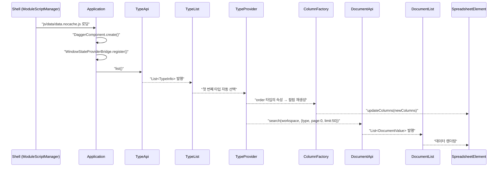
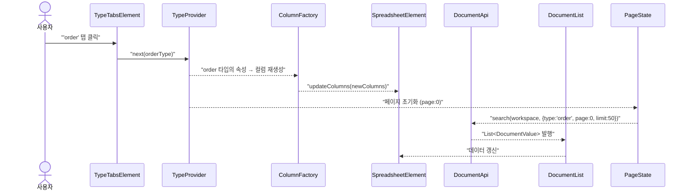
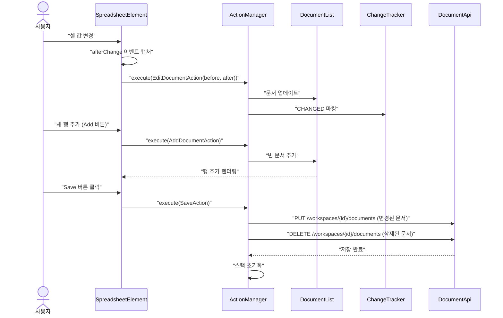
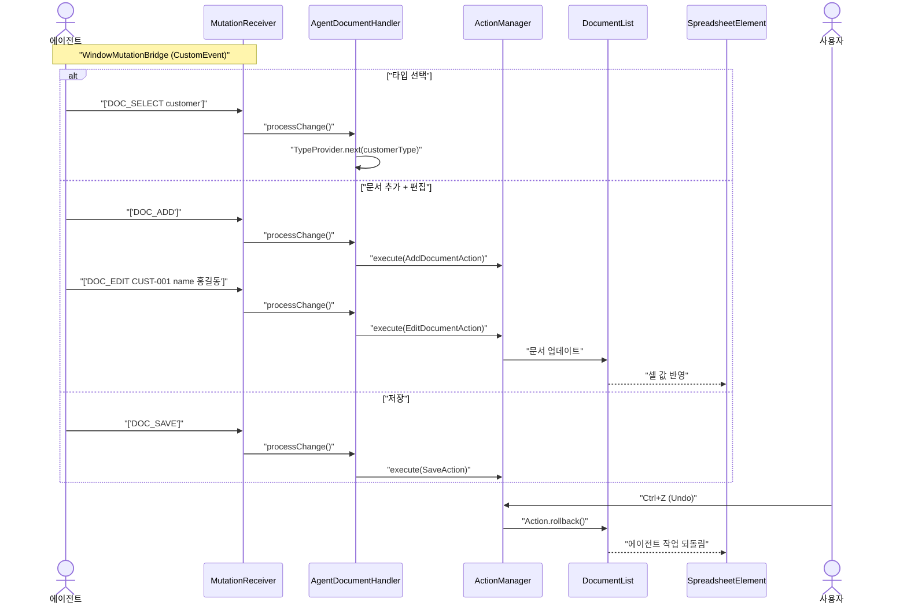
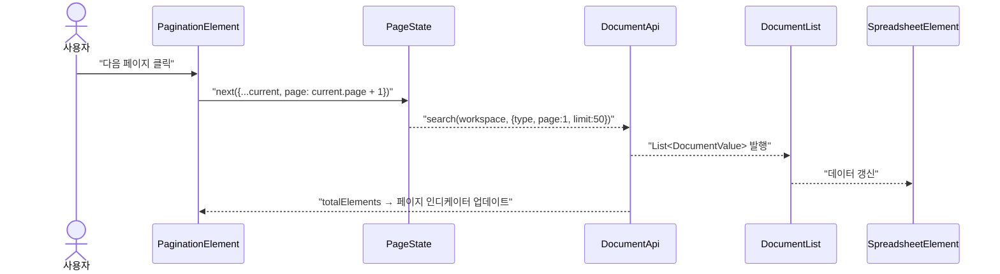

# Document-UI 유스케이스

## 초기 로딩 시퀀스

## 타입 탭 전환 시퀀스

## 문서 편집 → 저장 시퀀스

## 에이전트 문서 조작 시퀀스

## 페이지네이션 시퀀스

---

## UC-D1: 문서 조회

| 항목 | 내용 |
|------|------|
| **액터** | 사용자 |
| **선행조건** | 워크스페이스 선택 완료, Shell이 document-ui 모듈을 로딩 |
| **정상 흐름** | 1. Shell이 `js/data/data.nocache.js`를 동적 로딩한다. 2. TypeApi로 타입 목록을 가져와 탭으로 표시한다. 3. 첫 번째 타입이 자동 선택되고 `ColumnFactory`가 속성 기반으로 컬럼을 생성한다. 4. DocumentApi로 해당 타입의 문서를 검색하여 스프레드시트에 렌더링한다. |
| **결과** | Handsontable 스프레드시트에 문서가 테이블 형태로 표시된다. |

## UC-D2: 문서 생성

| 항목 | 내용 |
|------|------|
| **액터** | 사용자, AI 에이전트 |
| **선행조건** | 문서 목록 로딩 완료 |
| **정상 흐름** | 1. Add 버튼을 클릭한다. 2. `AddDocumentAction`이 실행되어 `DocumentList`에 빈 행이 추가된다. 3. 스프레드시트에 새로운 행이 렌더링된다. |

## UC-D5: 문서 저장

| 항목 | 내용 |
|------|------|
| **액터** | 사용자 |
| **선행조건** | 변경된 문서(dirty)가 존재함 |
| **정상 흐름** | 1. Save 버튼을 클릭한다. 2. `SaveAction`이 실행되어 `ChangeTracker`에서 변경된 문서 목록을 가져온다. 3. `DocumentApi.save()`를 호출하여 서버에 저장한다. 4. 저장 성공 시 `ActionManager` 스택과 `ChangeTracker`가 초기화된다. |

## UC-D9: 에이전트에 의한 문서 조작

| 항목 | 내용 |
|------|------|
| **액터** | AI 에이전트 |
| **선행조건** | document-ui 모듈 로딩 완료, MutationReceiver 연결 |
| **정상 흐름** | 1. 에이전트가 `DOC_ADD` 또는 `DOC_EDIT` 명령을 전송한다. 2. `AgentDocumentHandler`가 명령을 수신하여 `AddDocumentAction` 또는 `EditDocumentAction`을 실행한다. 3. 스프레드시트에 변경 사항이 즉시 반영된다. |

## UC-D13: 실시간 협업 (SSE)

| 항목 | 내용 |
|------|------|
| **액터** | 사용자, AI 에이전트 |
| **선행조건** | 워크스페이스 SSE 연결 상태 |
| **정상 흐름** | 1. 다른 사용자가 문서를 생성하거나 삭제한다. 2. Kafka 이벤트를 통해 `DOCUMENT_CREATED` 또는 `DOCUMENT_DELETED` 메시지가 SSE로 수신된다. 3. `DocumentEventHandler`가 이벤트를 처리하여 `DocumentList`를 갱신한다. 4. 내 스프레드시트 화면이 실시간으로 자동 새로고침된다. |

## UC-D16: 타입 인식 입력 위젯

| 항목 | 내용 |
|------|------|
| **액터** | 사용자 |
| **선행조건** | 타입이 선택되고 스프레드시트에 컬럼이 렌더링됨 |
| **정상 흐름** | 1. `ColumnFactory.create(type, allTypes)`가 `TypeInfo`의 속성 목록을 순회하며 `ColumnDef.fromAttribute(attr, typeNames)`로 속성 타입별 컬럼을 생성한다. 2. **enum** 속성: `dropdown` 타입 컬럼으로 변환. `allowedValues`가 드롭다운 source로 설정되어 사용자가 허용 값 중 하나를 선택한다. 3. **date** 속성: `date` 타입 컬럼으로 변환. `YYYY-MM-DD HH:mm` 포맷의 날짜/시간 선택기가 활성화된다. 4. **number** 속성: `numeric` 타입 컬럼으로 변환. 숫자 입력만 허용되며 소수점/음수 지원. 5. **bool** 속성: `checkbox` 타입 컬럼으로 변환. 체크박스로 true/false를 토글한다. 6. **document** 속성: `dropdown` 타입 컬럼으로 변환. 현재 레이아웃의 전체 타입 이름 목록(`typeNames`)이 드롭다운 source로 설정되어 참조할 타입을 선택한다. 7. **text/기타** 속성: `text` 타입 컬럼으로 변환. 자유 텍스트 입력. |
| **결과** | 속성 타입에 맞는 전용 입력 위젯이 셀 편집 시 활성화되어 데이터 품질을 보장한다. |

## UC-D17: 에이전트 + 사용자 동시 문서 편집

| 항목 | 내용 |
|------|------|
| **액터** | 사용자, AI 에이전트 |
| **선행조건** | 사용자가 셀을 편집 중, 에이전트가 DOC_ADD 명령을 실행 |
| **정상 흐름** | 1. 사용자가 스프레드시트에서 셀을 선택하여 편집 중이다. 2. 에이전트가 `AgentMutation` 브릿지를 통해 DOC_ADD 명령을 실행한다. 3. `AgentDocumentHandler`가 `AddDocumentAction`을 `ActionManager`에서 실행하여 새 행이 추가된다. 4. 사용자의 편집 중인 셀과 스프레드시트가 정상 유지된다. |
| **결과** | 에이전트의 동시 문서 추가가 사용자의 편집 상태를 방해하지 않는다. |

## UC-D21: 벌크 작업 (다중 선택 일괄 삭제/상태 변경)

| 항목 | 내용 |
|------|------|
| **액터** | 사용자 |
| **선행조건** | 문서 목록 로딩 완료 |
| **정상 흐름** | 1. 체크박스 또는 Shift+클릭으로 문서를 다중 선택한다. 2. 일괄 삭제 또는 일괄 상태 변경(DRAFT → PUBLISHED 등)을 실행한다. 3. 확인 다이얼로그 후 선택된 문서에 대해 일괄 처리가 수행된다. |
| **상태** | ✅ 구현 완료 (`BulkDeleteButton`, `BulkStatusButton`, `SelectedRows`) |

---

## 트레이서빌리티 매트릭스

| UC | 시퀀스 다이어그램 | 주요 클래스 | 테스트 |
|----|---|---|---|
| UC-D1 (조회) | 초기 로딩 | Application, TypeApi, DocumentApi, ColumnFactory, SpreadsheetElement | DocumentTest: 초기 로딩 및 탭 생성 검증 |
| UC-D2 (생성) | 문서 편집 → 저장 | AddDocumentAction, ActionManager, DocumentList | DocumentTest: 문서 추가 버튼 클릭 및 행 생성 확인 |
| UC-D5 (저장) | 문서 편집 → 저장 | SaveAction, ChangeTracker, DocumentApi | DocumentTest: 저장 버튼 상태 및 성공 피드백 검증 |
| UC-D9 (에이전트) | 에이전트 문서 조작 | AgentDocumentHandler, DocumentStateProvider, AgentMutation | CollaborationTest: 에이전트 조작 검증 |
| UC-D13 (협업) | — | DocumentEventHandler, WorkspaceEventReceiver, DocumentRepository | CollaborationTest: 실시간 이벤트 수신 검증 |
| UC-D16 (위젯) | 타입 인식 위젯 | ColumnFactory, ColumnDef, SpreadsheetElement | DocumentInputTest: 각 타입별 입력 위젯 활성화 검증 |
| UC-D21 (벌크) | — | BulkDeleteButton, BulkStatusButton, SelectedRows | DocumentTest: 다중 선택 및 벌크 액션 검증 |
