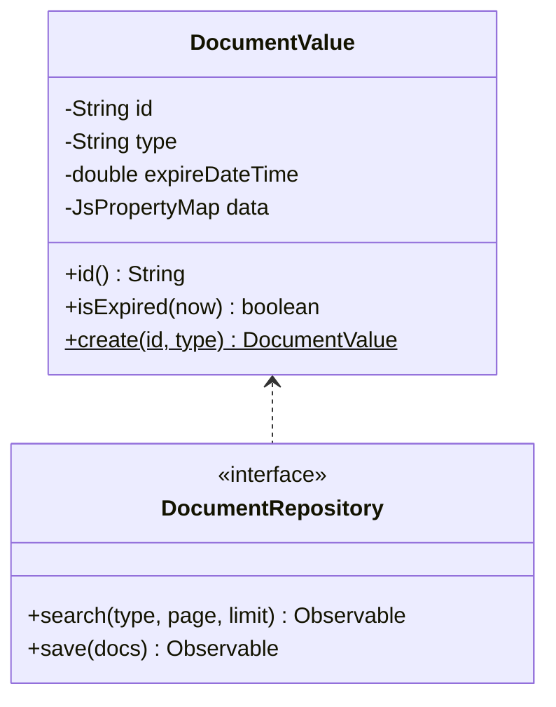

# Document 클래스 다이어그램

## 도메인 모델 (Shared)

```mermaid
classDiagram
    class DocumentValue {
        -String id
        -String type
        -double expireDateTime
        -JsPropertyMap data
        +id() String
        +isExpired(now) boolean
        +create(id, type)$ DocumentValue
    }
    class DocumentRepository {
        <<interface>>
        +search(type, page, limit) Observable
        +save(docs) Observable
    }
    
    DocumentValue <.. DocumentRepository
```
